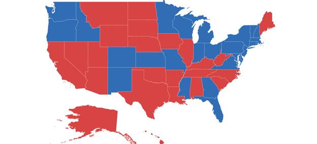

# Color mapping

The color mapping support allows you customize the shape colors based on the underlying value of shapes received from the bound data.

The maps control provides two types of color mapping:

* Equal color mapping
* Range Color mapping

## Equal color mapping

It is used to differentiate the shape’s fill based on its underlying value and color using the [`Value`](https://help.syncfusion.com/cr/xamarin/Syncfusion.SfMaps.XForms.EqualColorMapping.html#Syncfusion_SfMaps_XForms_EqualColorMapping_Value) and [`Color`](https://help.syncfusion.com/cr/xamarin/Syncfusion.SfMaps.XForms.ColorMapping.html#Syncfusion_SfMaps_XForms_ColorMapping_Color) properties.





 <maps:SfMaps x:Name="sfmap"  BackgroundColor="White">
                <maps:SfMaps.Layers>
                    <maps:ShapeFileLayer Uri="usa_state.shp" ShapeIDPath="State"
                                         ShapeIDTableField="STATE_NAME" ItemsSource="{Binding Data}">

                        <maps:ShapeFileLayer.ShapeSettings>
                            <maps:ShapeSetting ShapeValuePath="Candidate" ShapeColorValuePath="Candidate" >
                                <maps:ShapeSetting.ColorMappings>
                                    <maps:EqualColorMapping Color="#D84444" Value = "Romney"/>
                                    <maps:EqualColorMapping Color="#316DB5" Value="Obama"/>
                                </maps:ShapeSetting.ColorMappings>
                            </maps:ShapeSetting>
                        </maps:ShapeFileLayer.ShapeSettings>
                    </maps:ShapeFileLayer>
                </maps:SfMaps.Layers>
            </maps:SfMaps>





SfMaps map = new SfMaps();

            map.BackgroundColor = Color.White;

            ShapeFileLayer layer = new ShapeFileLayer();

            layer.Uri = "usa_state.shp";

            layer.ItemsSource = viewModel.Data;

            layer.ShapeIDTableField = "STATE_NAME";

            layer.ShapeIDPath = "State";

            map.Layers.Add(layer);           

            EqualColorMapping colorMapping = new EqualColorMapping();

            colorMapping.Color = Color.FromHex("#D84444");

            colorMapping.Value = "Romney";

            EqualColorMapping colorMapping1 = new EqualColorMapping();

            colorMapping1.Color = Color.FromHex("#316DB5");

            colorMapping1.Value = "Obama";

            ShapeSetting shapeSetting = new ShapeSetting();

            shapeSetting.ShapeValuePath = "Candidate";

            shapeSetting.ShapeColorValuePath = "Candidate";

            shapeSetting.ColorMappings.Add(colorMapping);

            shapeSetting.ColorMappings.Add(colorMapping1);

            layer.ShapeSettings = shapeSetting;

            this.Content = map;     





## Range color mapping

It is used to differentiate the bubble's fill based on its under-bound value and color ranges.

The [`From`](https://help.syncfusion.com/cr/xamarin/Syncfusion.SfMaps.XForms.RangeColorMapping.html#Syncfusion_SfMaps_XForms_RangeColorMapping_From) and [`To`](https://help.syncfusion.com/cr/xamarin/Syncfusion.SfMaps.XForms.RangeColorMapping.html#Syncfusion_SfMaps_XForms_RangeColorMapping_To) properties are used to define the color range and color for the range that can be specified using the [`Color`](https://help.syncfusion.com/cr/xamarin/Syncfusion.SfMaps.XForms.ColorMapping.html#Syncfusion_SfMaps_XForms_ColorMapping_Color) property.





 <maps:SfMaps x:Name="sfmap"  BackgroundColor="White">
                <maps:SfMaps.Layers>
                    <maps:ShapeFileLayer Uri="usa_state.shp" ShapeIDPath="State"
                                         ShapeIDTableField="STATE_NAME" ItemsSource="{Binding Data}">

                        <maps:ShapeFileLayer.ShapeSettings>
                            <maps:ShapeSetting  ShapeColorValuePath="Electors" >
                                <maps:ShapeSetting.ColorMappings>
                                    <maps:RangeColorMapping From="30" To="70" Color="#397D02"/>
                                    <maps:RangeColorMapping From="15" To="30" Color="#316DB5"/>
                                    <maps:RangeColorMapping From="0" To="15" Color="#D84444"/>
                                </maps:ShapeSetting.ColorMappings>
                            </maps:ShapeSetting>

                        </maps:ShapeFileLayer.ShapeSettings>
                    </maps:ShapeFileLayer>
                </maps:SfMaps.Layers>
            </maps:SfMaps>





 SfMaps map = new SfMaps();

            map.BackgroundColor = Color.White;

            ShapeFileLayer layer = new ShapeFileLayer();

            layer.Uri = "usa_state.shp";

            layer.ItemsSource = viewModel.Data;

            layer.ShapeIDTableField = "STATE_NAME";

            layer.ShapeIDPath = "State";

            map.Layers.Add(layer);

            RangeColorMapping rangeColorMapping = new RangeColorMapping();

            rangeColorMapping.From = 30;

            rangeColorMapping.To = 70;

            rangeColorMapping.Color = Color.FromHex("#397D02");

            RangeColorMapping rangeColorMapping1 = new RangeColorMapping();

            rangeColorMapping1.From = 15;

            rangeColorMapping1.To = 30;

            rangeColorMapping1.Color = Color.FromHex("#316DB5");

            RangeColorMapping rangeColorMapping2 = new RangeColorMapping();

            rangeColorMapping2.From = 0;

            rangeColorMapping2.To = 15;

            rangeColorMapping2.Color = Color.FromHex("#D84444");

            ShapeSetting shapeSetting = new ShapeSetting();

            shapeSetting.ShapeColorValuePath = "Electors";

            shapeSetting.ColorMappings.Add(rangeColorMapping);

            shapeSetting.ColorMappings.Add(rangeColorMapping1);

            shapeSetting.ColorMappings.Add(rangeColorMapping2);

            layer.ShapeSettings = shapeSetting;

            this.Content = map;     





