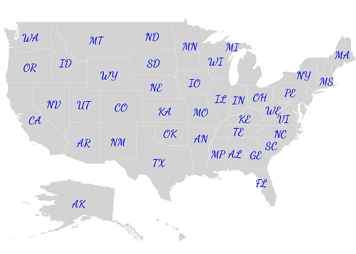

# Data Labels

Data labels are used to display the values of shapes.

## Adding data labels

The [`ShowMapItems`](https://help.syncfusion.com/cr/xamarin/Syncfusion.SfMaps.XForms.ShapeFileLayer.html#Syncfusion_SfMaps_XForms_ShapeFileLayer_ShowMapItems) property, which is a boolean property, displays or hides the data labels in shapes. Set the [`ShapeValuePath`](https://help.syncfusion.com/cr/xamarin/Syncfusion.SfMaps.XForms.ShapeSetting.html#Syncfusion_SfMaps_XForms_ShapeSetting_ShapeValuePath) property to get the data labels bound to each shape.





    <ContentPage.BindingContext>
        <local:USAStateViewModel/>
    </ContentPage.BindingContext>

     <maps:SfMaps x:Name="sfmap" >
        
        <maps:SfMaps.Layers>

            <maps:ShapeFileLayer Uri="usa_state.shp" ShowMapItems="True" ItemsSource="{Binding DataSource}" ShapeIDPath="Name" ShapeIDTableField="STATE_NAME">

                <maps:ShapeFileLayer.ShapeSettings>

                    <maps:ShapeSetting   ShapeValuePath="Type"  ShapeFill="LightGray"/>

                </maps:ShapeFileLayer.ShapeSettings>

            </maps:ShapeFileLayer>
            
        </maps:SfMaps.Layers>
        
    </maps:SfMaps>





            SfMaps map = new SfMaps();

            ShapeFileLayer layer = new ShapeFileLayer();

            layer.Uri = "usa_state.shp";

            layer.ShowMapItems = true;

            layer.ShapeSettings.ShapeFill = Color.LightGray;

            USAStateViewModel usaStateViewModel = new USAStateViewModel();

            layer.ItemsSource = usaStateViewModel.DataSource;

            layer.ShapeIDPath = "Name";

            layer.ShapeIDTableField = "STATE_NAME";

            layer.ShapeSettings.ShapeValuePath = "Type";

            map.Layers.Add(layer);

            this.Content = map;





## Setting contrast color

Based on the background color of the shapes, contrast color will be applied to data labels.





     <maps:SfMaps x:Name="sfmap">

        <maps:SfMaps.Layers>

            <maps:ShapeFileLayer Uri="usa_state.shp" ShowMapItems="True" ItemsSource="{Binding DataSource}" ShapeIDPath="Name" ShapeIDTableField="STATE_NAME">

                <maps:ShapeFileLayer.ShapeSettings>
                    
                    <maps:ShapeSetting  ShapeFill="#A9D9F7" ShapeValuePath="Type" ShapeColorValuePath="index" >
                        
                        <maps:ShapeSetting.ColorMappings>
                        
                            <maps:RangeColorMapping To="25" From="0" Color="#FFD84F"/>
                            
                            <maps:RangeColorMapping To="50" From="25" Color="#316DB5"/>
                         
                        </maps:ShapeSetting.ColorMappings>
                        
                    </maps:ShapeSetting>
                    
                </maps:ShapeFileLayer.ShapeSettings>
                
                <maps:ShapeFileLayer.DataLabelSettings>
                    
                    <maps:DataLabelSetting SmartLabelMode="Trim"/>
                    
                </maps:ShapeFileLayer.DataLabelSettings>

            </maps:ShapeFileLayer>

        </maps:SfMaps.Layers>

    </maps:SfMaps>





             SfMaps map = new SfMaps();

            ShapeFileLayer layer = new ShapeFileLayer();

            layer.Uri = "usa_state.shp";

            layer.ShowMapItems = true;

            layer.ShapeSettings.ShapeFill = Color.DarkBlue;

            USAStateViewModel usaStateViewModel = new USAStateViewModel();

            layer.ItemsSource = usaStateViewModel.DataSource;

            layer.ShapeIDPath = "Name";

            layer.ShapeIDTableField = "STATE_NAME";

            layer.ShapeSettings.ShapeValuePath = "Type";

            layer.ShapeSettings.ShapeColorValuePath = "index";

            ObservableCollection<ColorMapping> colorMapping = new ObservableCollection<ColorMapping>();

            RangeColorMapping rangeColorMapping = new RangeColorMapping();

            rangeColorMapping.From = 0;

            rangeColorMapping.To = 25;

            rangeColorMapping.Color = Color.FromHex("#FFD84F");

            colorMapping.Add(rangeColorMapping);

            RangeColorMapping rangeColorMapping1 = new RangeColorMapping();

            rangeColorMapping1.From = 25;

            rangeColorMapping1.To = 50;

            rangeColorMapping1.Color = Color.FromHex("#316DB5");

            colorMapping.Add(rangeColorMapping1);

            layer.ShapeSettings.ColorMappings = colorMapping;

            DataLabelSetting dataLabelSetting = new DataLabelSetting();

            dataLabelSetting.SmartLabelMode = IntersectAction.Trim;

            layer.DataLabelSettings = dataLabelSetting;

            map.Layers.Add(layer);

            this.Content = map;





## Customizing data labels

Data labels can be customized using the [`DataLabelSetting`](https://help.syncfusion.com/cr/xamarin/Syncfusion.SfMaps.XForms.DataLabelSetting.html) property in shape file layer. The font attribute, color, font size, and font family can be customized using the [`FontAttributes`](https://help.syncfusion.com/cr/xamarin/Syncfusion.SfMaps.XForms.DataLabelSetting.html#Syncfusion_SfMaps_XForms_DataLabelSetting_FontAttributes), [`TextColor`](https://help.syncfusion.com/cr/xamarin/Syncfusion.SfMaps.XForms.DataLabelSetting.html#Syncfusion_SfMaps_XForms_DataLabelSetting_TextColor), [`FontSize`](https://help.syncfusion.com/cr/xamarin/Syncfusion.SfMaps.XForms.DataLabelSetting.html#Syncfusion_SfMaps_XForms_DataLabelSetting_FontSize), and [`FontFamily`](https://help.syncfusion.com/cr/xamarin/Syncfusion.SfMaps.XForms.DataLabelSetting.html#Syncfusion_SfMaps_XForms_DataLabelSetting_FontFamily) properties.





      <maps:SfMaps x:Name="sfmap" >
        
        <maps:SfMaps.Layers>

            <maps:ShapeFileLayer Uri="usa_state.shp" ShowMapItems="True" ItemsSource="{Binding DataSource}" ShapeIDPath="Name" ShapeIDTableField="STATE_NAME">
               
                <maps:ShapeFileLayer.ShapeSettings>

                    <maps:ShapeSetting   ShapeValuePath="Type"  ShapeFill="LightGray"/>

                </maps:ShapeFileLayer.ShapeSettings>

                <maps:ShapeFileLayer.DataLabelSettings>

                    <maps:DataLabelSetting TextColor="Blue" FontAttributes="Bold" FontFamily="cursive" FontSize="12" />

                </maps:ShapeFileLayer.DataLabelSettings>
                
            </maps:ShapeFileLayer>
            
        </maps:SfMaps.Layers>
        
    </maps:SfMaps>





            SfMaps map = new SfMaps();

            ShapeFileLayer layer = new ShapeFileLayer();

            layer.Uri = "usa_state.shp";

            layer.ShowMapItems = true;

            USAStateViewModel usaStateViewModel = new USAStateViewModel();

            layer.ItemsSource = usaStateViewModel.DataSource;

            layer.ShapeIDPath = "Name";

            layer.ShapeIDTableField = "STATE_NAME";

            layer.ShapeSettings.ShapeValuePath = "Type";

            layer.ShapeSettings.ShapeFill = Color.LightGray;

            DataLabelSetting dataLabelSetting = new DataLabelSetting();

            dataLabelSetting.TextColor = Color.Blue;

            dataLabelSetting.FontAttributes = FontAttributes.Bold;

            dataLabelSetting.FontFamily = "cursive";

            dataLabelSetting.FontSize = 12;

            layer.DataLabelSettings = dataLabelSetting;

            map.Layers.Add(layer);

            this.Content = map;





## To smartly align data labels

The [`SmartLabelMode`](https://help.syncfusion.com/cr/xamarin/Syncfusion.SfMaps.XForms.DataLabelSetting.html#Syncfusion_SfMaps_XForms_DataLabelSetting_SmartLabelMode) property aligns the labels smartly within shape boundaries and avoids labels overlapping. Labels can be customized using the `Hide`, `Trim`, and `None` options.





    <maps:SfMaps x:Name="sfmap">
        
        <maps:SfMaps.Layers>

            <maps:ShapeFileLayer Uri="usa_state.shp" ShowMapItems="True" ItemsSource="{Binding Data}" ShapeIDPath="State" ShapeIDTableField="STATE_NAME">
               
                <maps:ShapeFileLayer.ShapeSettings>

                    <maps:ShapeSetting   ShapeValuePath="State" ShapeFill="LightGray" />

                </maps:ShapeFileLayer.ShapeSettings>

                <maps:ShapeFileLayer.DataLabelSettings>

                    <maps:DataLabelSetting SmartLabelMode="Trim"/>

                </maps:ShapeFileLayer.DataLabelSettings>
                
            </maps:ShapeFileLayer>
            
        </maps:SfMaps.Layers>
        
    </maps:SfMaps>





            SfMaps map = new SfMaps();

            ShapeFileLayer layer = new ShapeFileLayer();

            layer.Uri = "usa_state.shp";

            layer.ShowMapItems = true;

            USAStateViewModel usaStateViewModel = new USAStateViewModel();

            layer.ItemsSource = usaStateViewModel.Data;

            layer.ShapeIDPath = "State";

            layer.ShapeIDTableField = "STATE_NAME";

            layer.ShapeSettings.ShapeValuePath = "State";

            layer.ShapeSettings.ShapeFill = Color.LightGray;

            DataLabelSetting dataLabelSetting = new DataLabelSetting();

            dataLabelSetting.SmartLabelMode = IntersectAction.Trim;

            layer.DataLabelSettings = dataLabelSetting;

            map.Layers.Add(layer);

            this.Content = map;





## To avoid overlap in data labels

The [`IntersectionAction`](https://help.syncfusion.com/cr/xamarin/Syncfusion.SfMaps.XForms.DataLabelSetting.html#Syncfusion_SfMaps_XForms_DataLabelSetting_IntersectionAction) property aligns labels that overlap. Labels can be customized using the `Hide`, `Trim`, and `None` options. First, set the [`SmartLabelMode`](https://help.syncfusion.com/cr/xamarin/Syncfusion.SfMaps.XForms.DataLabelSetting.html#Syncfusion_SfMaps_XForms_DataLabelSetting_SmartLabelMode) property to `None`.





    <maps:SfMaps x:Name="sfmap">

        <maps:SfMaps.Layers>

            <maps:ShapeFileLayer Uri="usa_state.shp" ShowMapItems="True" ItemsSource="{Binding Data}" ShapeIDPath="State" ShapeIDTableField="STATE_NAME">

                <maps:ShapeFileLayer.ShapeSettings>

                    <maps:ShapeSetting   ShapeValuePath="State" ShapeFill="LightGray" />

                </maps:ShapeFileLayer.ShapeSettings>

                <maps:ShapeFileLayer.DataLabelSettings>

                    <maps:DataLabelSetting IntersectionAction="Hide" SmartLabelMode="None"/>

                </maps:ShapeFileLayer.DataLabelSettings>

            </maps:ShapeFileLayer>

        </maps:SfMaps.Layers>

    </maps:SfMaps>





           SfMaps map = new SfMaps();

            ShapeFileLayer layer = new ShapeFileLayer();

            layer.Uri = "usa_state.shp";

            layer.ShowMapItems = true;

            USAStateViewModel usaStateViewModel = new USAStateViewModel();

            layer.ItemsSource = usaStateViewModel.Data;

            layer.ShapeIDPath = "State";

            layer.ShapeIDTableField = "STATE_NAME";

            layer.ShapeSettings.ShapeValuePath = "State";

            layer.ShapeSettings.ShapeFill = Color.LightGray;

            DataLabelSetting dataLabelSetting = new DataLabelSetting();

            dataLabelSetting.IntersectionAction = IntersectAction.Hide;

            dataLabelSetting.SmartLabelMode = IntersectAction.None;

            layer.DataLabelSettings = dataLabelSetting;

            map.Layers.Add(layer);

            this.Content = map;





