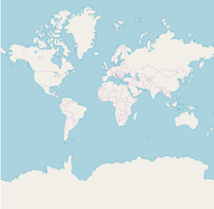
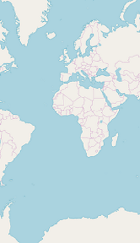
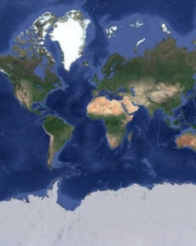
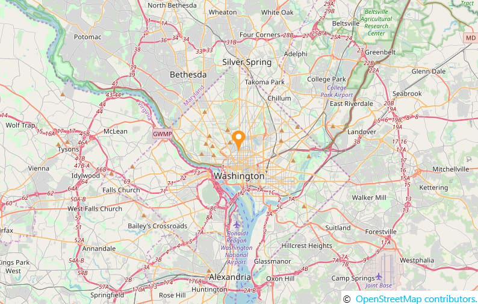
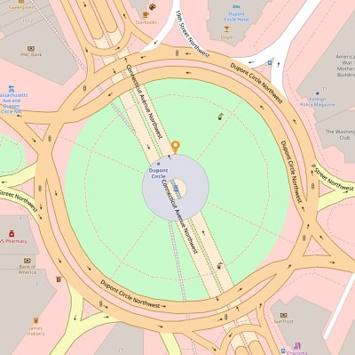

# Map providers support in SfMaps

The maps control supports map providers such as OpenStreetMap and Bing Maps that can be added to an imagery layer in maps.

## OpenStreetMap

The OpenStreetMap (OSM) is a world map; it was built by a community of mappers. It is free to use under an open license. This allows you to view geographical data in a collaborative way from anywhere on the earth. The OSM provides small tile images based on your requests and combines them into a single image to display the map area in the maps control. 

### Adding OSM in maps

The maps control uses `imagery layer` to display the tile images from the OSM service. To use `OSM`, add an imagery layer in maps’ layers collection.





        <maps:SfMaps.Layers>
            <maps:ImageryLayer/>
        </maps:SfMaps.Layers>





        SfMaps maps = new SfMaps();
        ImageryLayer layer = new ImageryLayer();
        maps.Layers.Add(layer);





N> Both the [`ShapeFileLayer`](https://help.syncfusion.com/cr/xamarin/Syncfusion.SfMaps.XForms.ShapeFileLayer.html) and `ImageryLayer` have been derived commonly from MapsLayer.

## Bing Maps

The Bing Maps is a world map owned by Microsoft. As OSM, Bing Maps also provides the map tile images based on your requests and combines them into a single image to display the map area. To use `Bing maps`, set the `LayerType` property of ImageryLayer to “Bing”. Then, set the Bing Maps key, which is obtained from [Bing Maps Key](https://www.microsoft.com/en-us/maps/create-a-bing-maps-key).





    <maps:SfMaps.Layers>
        <maps:ImageryLayer LayerType="Bing" BingMapKey="Your bing map key"/>
    </maps:SfMaps.Layers>





    SfMaps maps = new SfMaps();
    ImageryLayer layer = new ImageryLayer();
    layer.LayerType = LayerType.Bing;
    layer.BingMapKey = "Your bing map key";
    maps.Layers.Add(layer);





N> The `LayerType` property of `ImageryLayer` provides the support to `OSM` and `Bing Maps`. The default value of the `LayerType` property is OSM.

## Set different bing map style

The ImageryLayer provides the support to the following types of Bing Maps:

* `Road`
* `Aerial`
* `AerialWithLabels`

The desired style for the Bing Maps can be set using the `BingMapStyle` property of ImageryLayer. The default value of `BingMapStyle` is "Road".

### Road

The Road view displays the default map view of roads, buildings, and geography. The default value of the `BingMapStyle` property of imagery layer is "Road".

### Aerial

The Aerial view displays the satellite images to highlight the roads and major landmarks for easy identification. The aerial view can be applied to maps by setting the `BingMapStyle` to "Aerial".





        <maps:SfMaps.Layers>
            <maps:ImageryLayer LayerType="Bing" 
                            BingMapStyle="Aerial"
                            BingMapKey=" Your bing map key "/>
        </maps:SfMaps.Layers>





        SfMaps maps = new SfMaps();
        ImageryLayer layer = new ImageryLayer();
        layer.LayerType = LayerType.Bing;
        layer.BingMapStyle = BingMapStyle.Aerial;
        layer.BingMapKey = "Your bing map key ";
        maps.Layers.Add(layer);





### AerialWithLabel

The AerialWithLabel view displays the Aerial map with labels for continent, country, ocean, etc. This view can be applied to maps by setting the `BingMapStyle` to "AerialWithLabel".





        <maps:SfMaps.Layers>
            <maps:ImageryLayer LayerType="Bing" 
                            BingMapStyle="AerialWithLabels"
                            BingMapKey=" Your bing map key "/>
        </maps:SfMaps.Layers>





        SfMaps maps = new SfMaps();
        ImageryLayer layer = new ImageryLayer();
        layer.LayerType = LayerType.Bing;
        layer.BingMapStyle = BingMapStyle.AerialWithLabels;
        layer.BingMapKey = "Your bing map key ";
        maps.Layers.Add(layer);





## Zooming and panning

The maps control provides the interactive zooming and panning supports to OSM and Bing Maps.

Zooming helps you to get a closer look of an area on maps for in-depth analysis. Panning helps you to move a map around to focus the targeted area. You can perform zooming and panning with the pinching gesture in a map area.

## Reset zooming

The ImageryLayer provides the support to reset the maps to the default view when you double tap the imagery layer by setting the `ResetOnDoubleTap` property to true. The default value of this property is true. This behavior can be restricted by setting the `ResetOnDoubleTap` property to false.





        <maps:SfMaps>
        <maps:SfMaps.Layers>
                <maps:ImageryLayer ResetOnDoubleTap="True"/>
            </maps:SfMaps.Layers>
        </maps:SfMaps>





        SfMaps maps = new SfMaps();
        ImageryLayer layer = new ImageryLayer();
        layer.ResetOnDoubleTap = true;
        maps.Layers.Add(layer);





## Set Geo coordinates points(center position)

The `GeoCoordinates`(center) property allows you view the desired area at the center on loading. By default, the `GeoCoordinates` value is (0,0). So, first parameter of the latitude value "0" and second parameter of the longitude value "0" are shown at the center.





        <maps:SfMaps ZoomLevel="2">
                <maps:SfMaps.Layers>
                    <maps:ImageryLayer GeoCoordinates="69.07,-37.08"/>
                </maps:SfMaps.Layers>
            </maps:SfMaps>





  SfMaps maps = new SfMaps();
  maps.ZoomLevel = 2;
  ImageryLayer layer = new ImageryLayer();
  layer.GeoCoordinates = new Point(69.07, -37.08);
  maps.Layers.Add(layer);









        <maps:SfMaps ZoomLevel="2">
            <maps:SfMaps.Layers>
                <maps:ImageryLayer GeoCoordinates="0,0"/>
            </maps:SfMaps.Layers>
        </maps:SfMaps>





  SfMaps maps = new SfMaps();
  maps.ZoomLevel = 2;
  ImageryLayer layer = new ImageryLayer();
  layer.GeoCoordinates = new Point(0,0);
  maps.Layers.Add(layer);





## Set markers in imagery layer

As [`ShapeFileLayer`](https://help.syncfusion.com/cr/xamarin/Syncfusion.SfMaps.XForms.ShapeFileLayer.html), markers also can be added to imagery layer. Markers can be customized using the `MarkerSettings` property in imagery layer.
The detailed explanation of marker and its customization have been provided in Markers section.





        <maps:ImageryLayer  >
            <maps:ImageryLayer.MarkerSettings>
                <maps:MapMarkerSetting IconColor="Red" 
                                    IconSize="13" MarkerIcon="Diamond"/>
            </maps:ImageryLayer.MarkerSettings>
                        <maps:ImageryLayer.Markers>
                            <maps:MapMarker  Label="United States" Latitude="40"
                                            Longitude= "-101"/>
                            <maps:MapMarker Label="Brazil" Latitude="-15.7833" 
                                            Longitude= "-52" />
                            <maps:MapMarker Label="Congo" Latitude="-1.6" 
                                            Longitude= "24.4" />
                            <maps:MapMarker Label="Kazakhstan" Latitude="49.9" 
                                            Longitude= "72.23" />
                            <maps:MapMarker Label="Australia" Latitude="-20.54"
                                            Longitude= "134.10" />
                    </maps:ImageryLayer.Markers>
                </maps:ImageryLayer>





            ImageryLayer layer = new ImageryLayer();
            layer.MarkerSettings = new MapMarkerSetting();
            layer.MarkerSettings.IconColor = Color.Red;
            layer.MarkerSettings.MarkerIcon = MapMarkerIcon.Diamond;
            layer.MarkerSettings.IconSize = 13;
            MapMarker marker1 = new MapMarker();
            marker1.Label = "United States";
            marker1.Latitude = "40";
            marker1.Longitude = "-101";
            layer.Markers.Add(marker1);
            MapMarker marker2 = new MapMarker();
            marker2.Label = "Brazil";
            marker2.Latitude = "-15.7833";
            marker2.Longitude = "-52";
            layer.Markers.Add(marker2);
            MapMarker marker3 = new MapMarker();
            marker3.Label = "Congo";
            marker3.Latitude = "-1.6";
            marker3.Longitude = "24.4";
            layer.Markers.Add(marker3);
            MapMarker marker4 = new MapMarker();
            marker4.Label = "Kazakhstan";
            marker4.Latitude = "49.9";
            marker4.Longitude = "72.23";
            layer.Markers.Add(marker4);
            MapMarker marker5 = new MapMarker();
            marker5.Label = "Australia";
            marker5.Latitude = "-20.54";
            marker5.Longitude = "134.10";
            layer.Markers.Add(marker5);





## Load custom map

You can load the custom map providers map such as Google Maps, TomTom using the [ `RequestTileUri` ](https://help.syncfusion.com/cr/xamarin/Syncfusion.SfMaps.XForms.ImageryLayer.html) event of ImageryLayer. For more details about  [ `RequestTileUri` ](https://help.syncfusion.com/cr/xamarin/Syncfusion.SfMaps.XForms.ImageryLayer.html), refer the [ `Events` ](https://help.syncfusion.com/xamarin/maps/mapsprovider#events) of ImageryLayer.





<maps:SfMaps>
   <maps:SfMaps.Layers>
         <maps:ImageryLayer RequestTileUri="ImageryLayer_RequestTileUri">
          </maps:ImageryLayer>
    </maps:SfMaps.Layers>
</maps:SfMaps>





        SfMaps maps = new SfMaps();
        ImageryLayer layer = new ImageryLayer();
        layer.RequestTileUri += ImageryLayer_RequestTileUri;
        maps.Layers.Add(layer);
        private void ImageryLayer_RequestTileUri(object sender, Syncfusion.SfMaps.XForms.TileUriArgs e)
        {
            var link = "http://mt1.google.com/vt/lyrs=y&x=" + e.X.ToString() + "&y=" + e.Y.ToString() + "&z=" + e.ZoomLevel.ToString();
            e.Uri = link;
        }





See also this [`KB article`](https://www.syncfusion.com/kb/8913/display-google-map-in-xamarin-forms-sfmaps-control) to load the google map.

## Cache a tile images in application memory

The [`CanCacheTiles`](https://help.syncfusion.com/cr/xamarin/Syncfusion.SfMaps.XForms.ImageryLayer.html#Syncfusion_SfMaps_XForms_ImageryLayer_CanCacheTiles) property used to decide whether the tile images should be cached in application memory or not.





       ImageryLayer imageryLayer = new ImageryLayer();

       imageryLayer.CanCacheTiles = true;





## Calculate a zoom level based on map geo-bounds or distance

This feature is used to calculate the initial zoom level automatically in two ways:

* Distance in radius(Meter/KiloMeter/Mile)
* Geo-bounds(Northeast, Southwest)

### Distance in radius 

Calculate the initial zoom level automatically based on the `Radius` and `DistanceType` properties of imagery layer class.

N> `DistanceType` property default value is KiloMeter.





        <ContentPage.Resources>
            <ResourceDictionary>
                <DataTemplate x:Key="markerTemplate">
                    <StackLayout IsClippedToBounds="false" HorizontalOptions="StartAndExpand" VerticalOptions="Center" HeightRequest="35">
                    <Image Source="pin.png" Scale="1" Aspect="AspectFit " HorizontalOptions="StartAndExpand" VerticalOptions="Center"  HeightRequest="35" WidthRequest="25" />
                    </StackLayout>
                </DataTemplate>
            </ResourceDictionary>
        </ContentPage.Resources>

    <maps:SfMaps  x:Name="Map" >
        <maps:SfMaps.Layers >
            <maps:ImageryLayer MarkerSelected="Layer_MarkerSelected" GeoCoordinates = "38.909804, -77.043442" Radius="5" DistanceType="KiloMeter" MarkerTemplate="{StaticResource Key=markerTemplate}">
                <maps:ImageryLayer.Markers>
                    <maps:MapMarker Latitude= "38.909804" Longitude= "-77.043442"/>
                </maps:ImageryLayer.Markers>
            </maps:ImageryLayer>
        </maps:SfMaps.Layers>
    </maps:SfMaps>
	




            SfMaps maps = new SfMaps();
            ImageryLayer layer = new ImageryLayer();
            layer.GeoCoordinates = new Point(38.909804, -77.043442);
            layer.Radius = 5;
            layer.DistanceType = DistanceType.KiloMeter;
            MapMarker marker = new MapMarker();
            marker.Latitude = "38.909804";
            marker.Longitude = "-77.043442";
            layer.MarkerTemplate = this.Resources["markerTemplate"] as DataTemplate;
            layer.Markers.Add(marker);
            maps.Layers.Add(layer);





### Geo-bounds

Calculate the initial zoom level automatically based on the LatLngBounds(Northeast, Southwest) of imagery layer class.





   <ContentPage.Resources>
        <ResourceDictionary>
            <DataTemplate x:Key="markerTemplate">
                <StackLayout IsClippedToBounds="false" HorizontalOptions="StartAndExpand" VerticalOptions="Center" HeightRequest="35">
                    <Image Source="pin.png" Scale="1" Aspect="AspectFit " HorizontalOptions="StartAndExpand" VerticalOptions="Center"  HeightRequest="35" WidthRequest="25" />
                </StackLayout>
            </DataTemplate>
        </ResourceDictionary>
    </ContentPage.Resources>
    
    <maps:SfMaps>
        <maps:SfMaps.Layers>
            <maps:ImageryLayer MarkerTemplate="{StaticResource Key=markerTemplate}">
                <maps:ImageryLayer.Markers>
                    <maps:MapMarker Latitude= "38.909804" Longitude= "-77.043442"/>
                </maps:ImageryLayer.Markers>
                <maps:ImageryLayer.LatLngBounds>
                    <maps:LatLngBounds>
                        <maps:LatLngBounds.Northeast>
                            <maps:Position>
                                <x:Arguments>
                                    <x:Double>38.909804</x:Double>
                                    <x:Double>-77.043442</x:Double>
                                </x:Arguments>
                            </maps:Position>
                        </maps:LatLngBounds.Northeast>
                        <maps:LatLngBounds.Southwest>
                            <maps:Position>
                                <x:Arguments>
                                    <x:Double>38.909804</x:Double>
                                    <x:Double>-77.043442</x:Double>
                                </x:Arguments>
                            </maps:Position>
                        </maps:LatLngBounds.Southwest>
                    </maps:LatLngBounds>
                </maps:ImageryLayer.LatLngBounds>
            </maps:ImageryLayer>
        </maps:SfMaps.Layers>
    </maps:SfMaps>





            SfMaps maps = new SfMaps();
            ImageryLayer layer = new ImageryLayer();
            LatLngBounds bounds = new LatLngBounds();
            bounds.Northeast = new Position(38.909804, -77.043442);
            bounds.Southwest = new Position(38.909804, -77.043442);
            layer.LatLngBounds = bounds;
            MapMarker marker = new MapMarker();
            marker.Latitude = "38.909804";
            marker.Longitude = "-77.043442";
            layer.MarkerTemplate = this.Resources["markerTemplate"] as DataTemplate;
            maps.Layers.Add(layer);





N> When setting LatLngBounds and DistanceRadius at the same time, the priority is `DistanceRadius` and calculate zoom level based radius value.

## Get the map tile layer bounds

You can get imagery layer pixel bounds by using `MapBounds` property while zooming, panning, and changing Geo-Coordinate value in imagery layer.





      <maps:SfMaps >
        <maps:SfMaps.Layers>
            <maps:ImageryLayer x:Name="layer"  GeoCoordinates="30.9709225, -100.2187212" GeoCoordinateChanged="layer_GeoCoordinateChanged">
            </maps:ImageryLayer>
        </maps:SfMaps.Layers>
    </maps:SfMaps>





    public partial class MapBound : ContentPage
    {
        ImageryLayer layer = new ImageryLayer();
        public MapBound()
        {
            InitializeComponent();
            SfMaps maps = new SfMaps();
            layer.GeoCoordinates = new Point(30.9709225, -100.2187212);
            layer.GeoCoordinateChanged += Layer_GeoCoordinateChanged;
            maps.Layers.Add(layer);
            this.Content = maps;
        }
        private void Layer_GeoCoordinateChanged(object sender, GeoCoordinateChangedEventArgs e)
        {
            var pixelBounds = layer.MapBounds;
        }
    }





## Clear a cached tile images from application memory

The [`DeleteTilesFromCache`](https://help.syncfusion.com/cr/xamarin/Syncfusion.SfMaps.XForms.ImageryLayer.html#Syncfusion_SfMaps_XForms_ImageryLayer_DeleteTilesFromCache) method used to clear the cached tile images from  application cache memory.





        <maps:SfMaps>
            <maps:SfMaps.Layers>            
                <maps:ImageryLayer x:Name="imageryLayer" />
            </maps:SfMaps.Layers>
        </maps:SfMaps>





       imageryLayer.DeleteTilesFromCache();





## Events

The [`RequestTileUriArgs`](https://help.syncfusion.com/cr/xamarin/Syncfusion.SfMaps.XForms.TileUriArgs.html) event is triggered whenever new tile required for map(such as zooming, panning and initial time).

The following arguments can be obtained from the  [ `RequestTileUri` ](https://help.syncfusion.com/cr/xamarin/Syncfusion.SfMaps.XForms.ImageryLayer.html) event:

* [`Uri`](https://help.syncfusion.com/cr/xamarin/Syncfusion.SfMaps.XForms.TileUriArgs.html#Syncfusion_SfMaps_XForms_TileUriArgs_Uri) – Provide the option to set the desired Uri to load the custom map.

* [`UriRequestTask`](https://help.syncfusion.com/cr/xamarin/Syncfusion.SfMaps.XForms.TileUriArgs.html#Syncfusion_SfMaps_XForms_TileUriArgs_UriRequestTask) – Used to gets or sets the requested uri task asynchronously to load the custom map.

* [`X`](https://help.syncfusion.com/cr/xamarin/Syncfusion.SfMaps.XForms.TileUriArgs.html#Syncfusion_SfMaps_XForms_TileUriArgs_X) – Used to gets the X Co-ordinate value of the tile image.

* [`Y`](https://help.syncfusion.com/cr/xamarin/Syncfusion.SfMaps.XForms.TileUriArgs.html#Syncfusion_SfMaps_XForms_TileUriArgs_Y) – Used to gets the Y Co-ordinate value of the tile image.

* [`ZoomLevel`](https://help.syncfusion.com/cr/xamarin/Syncfusion.SfMaps.XForms.TileUriArgs.html#Syncfusion_SfMaps_XForms_TileUriArgs_ZoomLevel) – Used to gets the current zoom level value of the tile image. 





<maps:SfMaps>
   <maps:SfMaps.Layers>
         <maps:ImageryLayer RequestTileUri="ImageryLayer_RequestTileUri">
          </maps:ImageryLayer>
    </maps:SfMaps.Layers>
</maps:SfMaps>





private void ImageryLayer_RequestTileUri(object sender, Syncfusion.SfMaps.XForms.TileUriArgs e)
        {
            var link = "http://mt1.google.com/vt/lyrs=y&x=" + e.X.ToString() + "&y=" + e.Y.ToString() + "&z=" + e.ZoomLevel.ToString();
            e.Uri = link;
           
        }





The [`ZoomLevelChanging`](https://help.syncfusion.com/cr/xamarin/Syncfusion.SfMaps.XForms.ZoomLevelChangingEventArgs.html) event triggers when zoom level changed. Following arguments can be get from the ZoomLevelChanging event .

* [`Cancel`](https://help.syncfusion.com/cr/xamarin/Syncfusion.SfMaps.XForms.ZoomLevelChangingEventArgs.html#Syncfusion_SfMaps_XForms_ZoomLevelChangingEventArgs_Cancel) : Used to cancel the zooming.

* [`PreviousLevel`](https://help.syncfusion.com/cr/xamarin/Syncfusion.SfMaps.XForms.ZoomLevelChangingEventArgs.html#Syncfusion_SfMaps_XForms_ZoomLevelChangingEventArgs_PreviousLevel) : Returns the previous level after the zooming.

* [`CurrentLevel`](https://help.syncfusion.com/cr/xamarin/Syncfusion.SfMaps.XForms.ZoomLevelChangingEventArgs.html#Syncfusion_SfMaps_XForms_ZoomLevelChangingEventArgs_CurrentLevel) : Returns the current level to be zoomed.





        <maps:SfMaps>
            <maps:SfMaps.Layers>            
                <maps:ImageryLayer  ZoomLevelChanging="Layer_ZoomLevelChanging" />
            </maps:SfMaps.Layers>
        </maps:SfMaps>





        private void Layer_ZoomLevelChanging(object sender, ZoomLevelChangingEventArgs e)
        {
           if(e.PreviousLevel == 10) // Returns the previous zoom level
           {
               e.Cancel = true; // Cancels the zooming event
               var CurrentLevel = e.CurrentLevel; // Returns the current zoomed level
           }
        }





The [`GeoCoordinateChanged`](https://help.syncfusion.com/cr/xamarin/Syncfusion.SfMaps.XForms.ImageryLayer.html) event is triggered while zooming and panning the maps.

The following arguments can be gotten from the `ImageryLayer_GeoCoordinateChanged` event: 

* [`Center`](https://help.syncfusion.com/cr/xamarin/Syncfusion.SfMaps.XForms.GeoCoordinateChangedEventArgs.html#Syncfusion_SfMaps_XForms_GeoCoordinateChangedEventArgs_Center): Returns the center Geo coordinate point of the visual tiles while zooming and panning.
* [`TopLeft`](https://help.syncfusion.com/cr/xamarin/Syncfusion.SfMaps.XForms.GeoCoordinateChangedEventArgs.html#Syncfusion_SfMaps_XForms_GeoCoordinateChangedEventArgs_TopLeft):  Returns the top-left Geo coordinate point of the visual tiles while zooming and panning.
* [`TopRight`](https://help.syncfusion.com/cr/xamarin/Syncfusion.SfMaps.XForms.GeoCoordinateChangedEventArgs.html#Syncfusion_SfMaps_XForms_GeoCoordinateChangedEventArgs_TopRight): Returns the top-right Geo coordinate point of the visual tiles while zooming and panning.
* [`BottomLeft`](https://help.syncfusion.com/cr/xamarin/Syncfusion.SfMaps.XForms.GeoCoordinateChangedEventArgs.html#Syncfusion_SfMaps_XForms_GeoCoordinateChangedEventArgs_BottomLeft): Returns the bottom-left Geo coordinate point of the visual tiles while zooming and panning.
* [`BottomRight`](https://help.syncfusion.com/cr/xamarin/Syncfusion.SfMaps.XForms.GeoCoordinateChangedEventArgs.html#Syncfusion_SfMaps_XForms_GeoCoordinateChangedEventArgs_BottomRight): Returns the bottom-right Geo coordinate point of the visual tiles while zooming and panning.





<maps:SfMaps >
    <maps:SfMaps.Layers >
        <maps:ImageryLayer GeoCoordinateChanged="ImageryLayer_GeoCoordinateChanged"/>       
    </maps:SfMaps.Layers>
</maps:SfMaps>





private void ImageryLayer_GeoCoordinateChanged(object sender, GeoCoordinateChangedEventArgs e)
{
    var topLeft = e.TopLeft;
    var topRight = e.TopRight;
    var bottomLeft = e.BottomLeft;
    var bottomRight = e.BottomRight;
    var center = e.Center;
}





## See Also

[How to show the current GPS location in Xamarin.Forms SfMaps](https://www.syncfusion.com/kb/11379/how-to-show-the-current-gps-location-in-xamarin-forms-maps-sfmaps)

[How to use Google Maps API to show Google Maps in Xamarin.Forms SfMaps control](https://www.syncfusion.com/kb/8913/how-to-use-google-maps-api-to-show-google-maps-in-xamarin-forms-sfmaps-control)

[How to group the markers based on zoom level in the imagery layer of the SfMaps control](https://www.syncfusion.com/kb/10200/how-to-group-the-markers-based-on-zoom-level-in-the-imagery-layer-of-the-sfmaps-control)

[How to add sub shape file layer for ImageryLayer in Xamarin.Forms SfMaps](https://www.syncfusion.com/kb/10579/how-to-add-sub-shape-file-layer-for-imagerylayer-in-xamarin-forms-sfmaps)