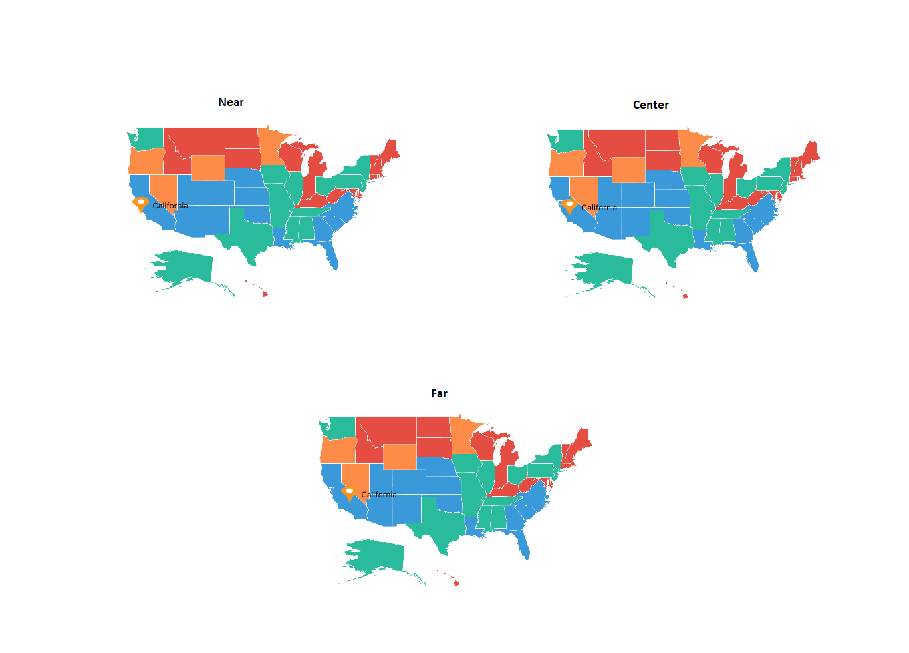
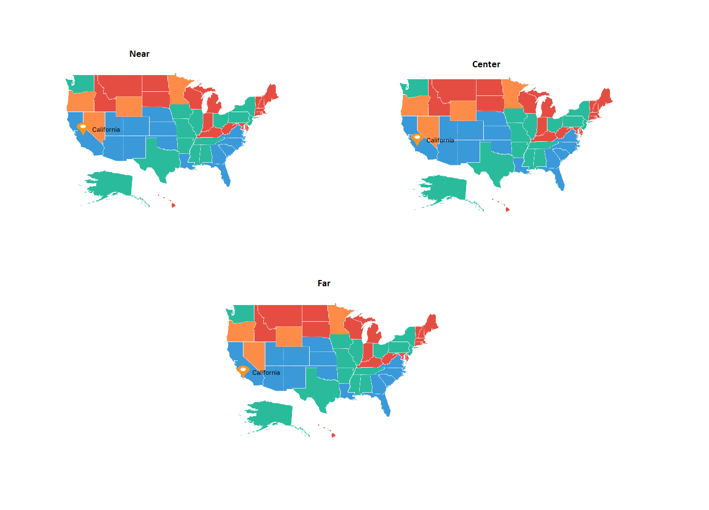
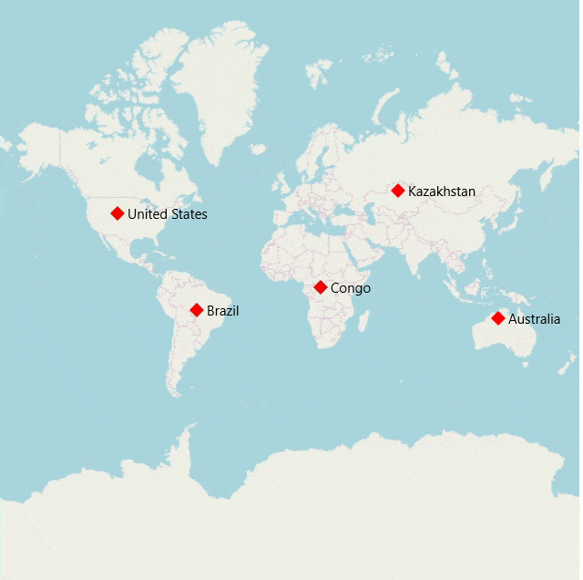

# Markers support in SfMaps control

Markers are used to show some messages on maps.

Markers are set to the maps control using the following ways:

* Adding marker objects
* Defining custom markers

## Adding a marker objects

Any number of markers can be added to the shape file layers using the [`Markers`](https://help.syncfusion.com/cr/xamarin/Syncfusion.SfMaps.XForms.MapLayer.html#Syncfusion_SfMaps_XForms_MapLayer_Markers) property. Each marker object contains the following properties:

[`Label`](https://help.syncfusion.com/cr/xamarin/Syncfusion.SfMaps.XForms.MapMarker.html#Syncfusion_SfMaps_XForms_MapMarker_Label): Displays some messages on maps.

[`Latitude`](https://help.syncfusion.com/cr/xamarin/Syncfusion.SfMaps.XForms.MapMarker.html#Syncfusion_SfMaps_XForms_MapMarker_Latitude): Specifies y-axis position of the marker.

[`Longitude`](https://help.syncfusion.com/cr/xamarin/Syncfusion.SfMaps.XForms.MapMarker.html#Syncfusion_SfMaps_XForms_MapMarker_Longitude): Specifies x-axis position of the marker.





    <maps:SfMaps x:Name="sfmap"  BackgroundColor="White">
                <maps:SfMaps.Layers>
                    <maps:ShapeFileLayer Uri="usa_state.shp">
                        <maps:ShapeFileLayer.Markers>

                            <maps:MapMarker Label = "California" Latitude = "37" Longitude = "-120"/>
                        </maps:ShapeFileLayer.Markers>

                    </maps:ShapeFileLayer>
                </maps:SfMaps.Layers>
            </maps:SfMaps>





 SfMaps map = new SfMaps();

            map.BackgroundColor = Color.White;

            ShapeFileLayer layer = new ShapeFileLayer();

            layer.Uri = "usa_state.shp";

            map.Layers.Add(layer);

            MapMarker marker = new MapMarker();

            marker.Label = "California";

            marker.Latitude = "37";

            marker.Longitude = "-120";

            layer.Markers.Add(marker);

            this.Content = map;





## Customizing markers

Markers can be customized using the [`MarkerSettings`](https://help.syncfusion.com/cr/xamarin/Syncfusion.SfMaps.XForms.MapLayer.html#Syncfusion_SfMaps_XForms_MapLayer_MarkerSettings) property in shape file layer.

### Customizing marker icons

The size and color of marker icons can be customized using the [`IconSize`](https://help.syncfusion.com/cr/xamarin/Syncfusion.SfMaps.XForms.MapMarkerSetting.html#Syncfusion_SfMaps_XForms_MapMarkerSetting_IconSize) and [`IconColor`](https://help.syncfusion.com/cr/xamarin/Syncfusion.SfMaps.XForms.MapMarkerSetting.html#Syncfusion_SfMaps_XForms_MapMarkerSetting_IconColor) properties.

### Icon types

The shape of a marker icons can be customized using the [`MarkerIcon`](https://help.syncfusion.com/cr/xamarin/Syncfusion.SfMaps.XForms.MapMarkerSetting.html#Syncfusion_SfMaps_XForms_MapMarkerSetting_MarkerIcon) property. The maps control supports the following types of marker icons:

* Circle
* Diamond
* Image
* Rectangle
* Square





     <maps:SfMaps x:Name="sfmap">

        <maps:SfMaps.Layers>

            <maps:ShapeFileLayer Uri="usa_state.shp">

                <maps:ShapeFileLayer.Markers>

                    <maps:MapMarker Label = "California" Latitude = "37" Longitude = "-120"/>

                </maps:ShapeFileLayer.Markers>

                <maps:ShapeFileLayer.MarkerSettings>

                    <maps:MapMarkerSetting  MarkerIcon="Square"/>

                </maps:ShapeFileLayer.MarkerSettings>

            </maps:ShapeFileLayer>

        </maps:SfMaps.Layers>

    </maps:SfMaps>





            SfMaps map = new SfMaps();

            ShapeFileLayer layer = new ShapeFileLayer();

            layer.Uri = "usa_state.shp";

            map.Layers.Add(layer);

            MapMarker marker = new MapMarker();

            marker.Label = "California";

            marker.Latitude = "37";

            marker.Longitude = "-120";

            layer.Markers.Add(marker);

            MapMarkerSetting markerSetting = new MapMarkerSetting();

            markerSetting.MarkerIcon = MapMarkerIcon.Square;

            layer.MarkerSettings = markerSetting;

            this.Content = map;





### Setting a contrast color

Based on the background color of the shapes, contrast color will be applied to marker icons.





            <maps:SfMaps x:Name="sfmap"  BackgroundColor="White">
                <maps:SfMaps.Layers >
                    <maps:ShapeFileLayer x:Name="layer" Uri="usa_state.shp" ShapeIDPath="State" ShowMapItems="False"
                                         ShapeIDTableField="STATE_NAME">

                        <maps:ShapeFileLayer.Markers>
                            <maps:MapMarker  Latitude = "37" Longitude = "-120">
                            </maps:MapMarker>
                            <maps:MapMarker  Latitude = "31" Longitude = "-97">
                            </maps:MapMarker>
                            <maps:MapMarker  Latitude = "41" Longitude = "-92">
                            </maps:MapMarker>
                            <maps:MapMarker  Latitude = "38" Longitude = "-98">
                            </maps:MapMarker>
                            <maps:MapMarker  Latitude = "41" Longitude = "-99">
                            </maps:MapMarker>
                        </maps:ShapeFileLayer.Markers>

                        <maps:ShapeFileLayer.ShapeSettings>
                            <maps:ShapeSetting ShapeColorValuePath="Candidate" ShapeValuePath="Candidate">
                                <maps:ShapeSetting.ColorMappings>

                                    <maps:EqualColorMapping Color="#FFD84F" LegendLabel="Romney"
                                                            Value = "Romney"></maps:EqualColorMapping>
                                    <maps:EqualColorMapping Color="#316DB5" LegendLabel="Obama"
                                                            Value="Obama"></maps:EqualColorMapping>
                                </maps:ShapeSetting.ColorMappings>
                            </maps:ShapeSetting>
                        </maps:ShapeFileLayer.ShapeSettings>

                        <maps:ShapeFileLayer.LegendSettings>
                            <maps:MapLegendSetting ShowLegend="True" 
                                                   LegendPosition="30,70">
                                <maps:MapLegendSetting.IconSize>
                                    <Size Width="20" Height="20"></Size>
                                </maps:MapLegendSetting.IconSize>
                            </maps:MapLegendSetting>
                        </maps:ShapeFileLayer.LegendSettings>

                    </maps:ShapeFileLayer>
                </maps:SfMaps.Layers>
            </maps:SfMaps>





       	SfMaps map = new SfMaps();

            ShapeFileLayer layer = new ShapeFileLayer();

		 layer.ItemsSource = viewModel.Data;

            layer.Uri = "usa_state.shp";

            map.Layers.Add(layer);

            MapMarker marker = new MapMarker();

            marker.Label = "California";

            marker.Latitude = "37";

            marker.Longitude = "-120";

            layer.Markers.Add(marker);
             MapLegendSetting legendSetting = new MapLegendSetting();
             legendSetting.ShowLegend = true;
             legendSetting.LegendPosition = new Point(30, 70);
            legendSetting.IconSize = new Size(20, 20);
            layer.LegendSettings = legendSetting;

            MapMarker marker1 = new MapMarker();

            marker1.Label = "California";

            marker1.Latitude = "31";

            marker1.Longitude = "-97";

            layer.Markers.Add(marker1);
       	 MapMarker marker2 = new MapMarker();

            marker2.Label = "California";

            marker2.Latitude = "41";

            marker2.Longitude = "-92";

            layer.Markers.Add(marker2);

       	 MapMarker marker3 = new MapMarker();

            marker3.Label = "California";

            marker3.Latitude = "38";

            marker3.Longitude = "-98";

            layer.Markers.Add(marker3);
       	 MapMarker marker4 = new MapMarker();

            marker4.Label = "California";

            marker4.Latitude = "41";

            marker4.Longitude = "-99";

            layer.Markers.Add(marker4);

       	 EqualColorMapping colorMapping = new EqualColorMapping();
            colorMapping.Color = Color.FromHex("#FFD84F");
            colorMapping.LegendLabel = "Romney";
            colorMapping.Value = "Romney";

            EqualColorMapping colorMapping1 = new EqualColorMapping();
            colorMapping1.Color = Color.FromHex("#316DB5");
            colorMapping1.LegendLabel = "Obama";
            colorMapping1.Value = "Obama";

            ShapeSetting shapeSetting = new ShapeSetting();
            shapeSetting.ShapeValuePath = "Candidate";
            shapeSetting.ShapeColorValuePath = "Candidate";
            shapeSetting.ColorMappings.Add(colorMapping);
            shapeSetting.ColorMappings.Add(colorMapping1);
            layer.ShapeSettings = shapeSetting;
            this.Content = map;





 

### Setting a image marker icon

You can pin an image as marker icon by setting the icon type as `Image`. Set [`ImageSource`](https://help.syncfusion.com/cr/xamarin/Syncfusion.SfMaps.XForms.MapMarkerSetting.html#Syncfusion_SfMaps_XForms_MapMarkerSetting_ImageSource) to get the image from local path.





     <maps:SfMaps x:Name="sfmap">
        
        <maps:SfMaps.Layers>
            
            <maps:ShapeFileLayer Uri="usa_state.shp">
                
                <maps:ShapeFileLayer.Markers>

                    <maps:MapMarker Label = "Texas" Latitude = "31.267153" Longitude = "-97.7430608"/>

                    <maps:MapMarker Label = "California" Latitude = "37" Longitude = "-120"/>

                </maps:ShapeFileLayer.Markers>

                <maps:ShapeFileLayer.MarkerSettings>

                    <maps:MapMarkerSetting  MarkerIcon="Image" ImageSource="pin.png"/>

                </maps:ShapeFileLayer.MarkerSettings>
                
            </maps:ShapeFileLayer>
            
        </maps:SfMaps.Layers>
        
    </maps:SfMaps>





            SfMaps map = new SfMaps();

            ShapeFileLayer layer = new ShapeFileLayer();

            layer.Uri = "usa_state.shp";

            map.Layers.Add(layer);

            MapMarker marker = new MapMarker();

            marker.Label = "Texas";

            marker.Latitude = "31.267153";

            marker.Longitude = "-97.7430608";

            layer.Markers.Add(marker);

            MapMarker marker1 = new MapMarker();

            marker1.Label = "California";

            marker1.Latitude = "37";

            marker1.Longitude = "-120";

            layer.Markers.Add(marker1);

            MapMarkerSetting markerSetting = new MapMarkerSetting();

            markerSetting.MarkerIcon = MapMarkerIcon.Image;

            markerSetting.ImageSource = "pin.png";

            layer.MarkerSettings = markerSetting;

            this.Content = map;





### Customizing labels

The color and size of marker labels can be customized using the [`LabelColor`](https://help.syncfusion.com/cr/xamarin/Syncfusion.SfMaps.XForms.MapMarkerSetting.html#Syncfusion_SfMaps_XForms_MapMarkerSetting_LabelColor) and [`LabelSize`](https://help.syncfusion.com/cr/xamarin/Syncfusion.SfMaps.XForms.MapMarkerSetting.html#Syncfusion_SfMaps_XForms_MapMarkerSetting_LabelSize) properties.

The following code sample explains how to customize a marker.





    <maps:SfMaps x:Name="sfmap"  BackgroundColor="White">
                <maps:SfMaps.Layers>
                    <maps:ShapeFileLayer Uri="usa_state.shp">
                        <maps:ShapeFileLayer.Markers>

                            <maps:MapMarker Label = "California" Latitude = "37" Longitude = "-120"/>
                        </maps:ShapeFileLayer.Markers>

                        <maps:ShapeFileLayer.MarkerSettings>

                            <maps:MapMarkerSetting IconColor="Red" IconSize="25" MarkerIcon="Diamond"
                                            LabelColor="White" LabelSize="20"/>

                        </maps:ShapeFileLayer.MarkerSettings>
                    </maps:ShapeFileLayer>
                </maps:SfMaps.Layers>
            </maps:SfMaps>





SfMaps map = new SfMaps();

            map.BackgroundColor = Color.White;

            ShapeFileLayer layer = new ShapeFileLayer();

            layer.Uri = "usa_state.shp";

            map.Layers.Add(layer);

            MapMarker marker = new MapMarker();

            marker.Label = "California";

            marker.Latitude = "37";

            marker.Longitude = "-120";

            layer.Markers.Add(marker);

            MapMarkerSetting markerSetting = new MapMarkerSetting();

            markerSetting.IconColor = Color.Red;

            markerSetting.IconSize = 25;

            markerSetting.MarkerIcon = MapMarkerIcon.Diamond;

            markerSetting.LabelColor = Color.White;

            markerSetting.LabelSize = 20;

            layer.MarkerSettings = markerSetting;

            this.Content = map;





## Add custom marker

The maps control provides the support for defining the custom markers using the [`MarkerTemplate`](https://help.syncfusion.com/cr/xamarin/Syncfusion.SfMaps.XForms.MapLayer.html#Syncfusion_SfMaps_XForms_MapLayer_MarkerTemplate) property.





<maps:SfMaps x:Name="sfmap"  BackgroundColor="White">

<maps:SfMaps.Layers >

<maps:ShapeFileLayer Uri="world1.shp"  >

<maps:ShapeFileLayer.ShapeSettings>

<maps:ShapeSetting ShapeFill="Gray" />

</maps:ShapeFileLayer.ShapeSettings>

<maps:ShapeFileLayer.Markers>

<local:CustomMarker  Latitude="38.8833" Longitude= "-77.0167"  />

<local:CustomMarker  Latitude="-15.7833" Longitude= "-47.8667"  />

<local:CustomMarker  Latitude="21.0000" Longitude= "78.0000" />

<local:CustomMarker  Latitude="35.0000" Longitude= "103.0000"  />

<local:CustomMarker  Latitude="-6.1750" Longitude= "106.8283"  />

</maps:ShapeFileLayer.Markers>

<maps:ShapeFileLayer.MarkerTemplate>

<DataTemplate >

<StackLayout    Padding="-12,-12,0,0" IsClippedToBounds="false" HorizontalOptions="StartAndExpand" VerticalOptions="Center" HeightRequest="60" WidthRequest="60"  >

<Image Source="{Binding ImageName}" Scale="1" Aspect="AspectFit " HorizontalOptions="StartAndExpand" VerticalOptions="Center"  HeightRequest="15" WidthRequest="23"   />

</StackLayout>

</DataTemplate>

</maps:ShapeFileLayer.MarkerTemplate>

</maps:ShapeFileLayer>

</maps:SfMaps.Layers>

</maps:SfMaps>





 SfMaps map = new SfMaps();
            map.BackgroundColor = Color.White;
            ShapeFileLayer layer = new ShapeFileLayer();
            layer.Uri = "world1.shp";
            ShapeSetting shapeSetting = new ShapeSetting();
            shapeSetting.ShapeFill = Color.Gray;
            layer.ShapeSettings = shapeSetting;
            map.Layers.Add(layer);

            CustomMarker marker1 = new CustomMarker();           
            marker1.Latitude = "38.8833";
            marker1.Longitude = "-77.0167";            

            CustomMarker marker2 = new CustomMarker();           
            marker2.Latitude = "-15.7833";
            marker2.Longitude = "-47.866";           

            CustomMarker marker3 = new CustomMarker();           
            marker3.Latitude = "21.0000";
            marker3.Longitude = "78.0000";            

            CustomMarker marker4 = new CustomMarker();           
            marker4.Latitude = "35.0000";
            marker4.Longitude = "103.0000";           

            CustomMarker marker5 = new CustomMarker();            
            marker5.Latitude = "-6.1750";
            marker5.Longitude = "106.8283";          

            layer.Markers.Add(marker1);
            layer.Markers.Add(marker2);
            layer.Markers.Add(marker3);
            layer.Markers.Add(marker4);
            layer.Markers.Add(marker5);          
          

            DataTemplate dataTemplate = new DataTemplate(() =>
            {
                StackLayout stackLayout = new StackLayout();
                stackLayout.Padding = new Thickness(-12, -12, 0, 0);
                stackLayout.IsClippedToBounds = false;
                stackLayout.HorizontalOptions = LayoutOptions.StartAndExpand;
                stackLayout.VerticalOptions = LayoutOptions.Center;
                stackLayout.HeightRequest = 60;
                stackLayout.WidthRequest = 60;

                Image image = new Image();
                image.Source = marker1.ImageName;
                image.Scale = 1;
                image.Aspect = Aspect.AspectFit;
                image.HorizontalOptions = LayoutOptions.StartAndExpand;
                image.VerticalOptions = LayoutOptions.Center;
                image.HeightRequest = 15;
                image.WidthRequest = 23;
                stackLayout.Children.Add(image);

                return stackLayout;
            });

            layer.MarkerTemplate = dataTemplate;

            grid.Children.Add(map);





The following code sample explains how to define a custom marker with image support.





public class CustomMarker : MapMarker

{

public ImageSource ImageName { get; set; }

public CustomMarker()

{

ImageName = ImageSource.FromResource("MapsSample.pin.png");

}

}





## Marker Alignment

You can align the maps marker horizontally and vertically using the [`HorizontalAlignment`](https://help.syncfusion.com/cr/xamarin/Syncfusion.SfMaps.XForms.MapMarkerSetting.html#Syncfusion_SfMaps_XForms_MapMarkerSetting_HorizontalAlignmentProperty) and [`VerticalAlignment`](https://help.syncfusion.com/cr/xamarin/Syncfusion.SfMaps.XForms.MapMarkerSetting.html#Syncfusion_SfMaps_XForms_MapMarkerSetting_VerticalAlignmentProperty) properties. 

### Setting a horizontal alignment

The HorizontalAlignment property is used to position the marker icon in x-axis. The marker icon can be positioned using the following ways in x-axis:

* Near: Specifies the near position of the marker icon for the given latitude and longitude values in x-axis position. 
* Center: Specifies the center position of the marker icon for the given latitude and longitude values in x-axis position.
* Far: Specifies the far position of the marker icon for the given latitude and longitude values in x-axis position.





<maps:SfMaps Grid.Row="0" x:Name="Map" EnableZooming="False" EnablePanning="False">
    <maps:SfMaps.Layers >
        <maps:ShapeFileLayer Uri="usa_state.shp" ShapeIDPath="Name" ShapeIDTableField="STATE_NAME" 
                                    ItemsSource="{Binding DataSource}">
            ....
        <maps:ShapeFileLayer.MarkerSettings>
        <maps:MapMarkerSetting x:Name="markerSetting" MarkerIcon="Image" ImageSource="pin.png" HorizontalAlignment="Center" IconSize="25"/>
        </maps:ShapeFileLayer.MarkerSettings>
            ....
        </maps:ShapeFileLayer>
    </maps:SfMaps.Layers>
</maps:SfMaps>





SfMaps map = new SfMaps();
ShapeFileLayer layer = new ShapeFileLayer();
CustomMarker customMarker = new CustomMarker();

layer.ItemsSource = customMarker.DataSource;
layer.Uri = "usa_state.shp";
layer.ShapeIDPath = "Name";
layer.ShapeIDTableField = "STATE_NAME";
map.Layers.Add(layer);

....

MapMarkerSetting mapMarkerSetting = new MapMarkerSetting();
mapMarkerSetting.MarkerIcon = MapMarkerIcon.Image;
mapMarkerSetting.ImageSource = "pin.png";
mapMarkerSetting.IconSize = 25;
mapMarkerSetting.HorizontalAlignment = MarkerAlignment.Center;
layer.MarkerSettings = mapMarkerSetting;

....

this.Content = map;





### Setting a vertical alignment

The VerticalAlignment property is used to position the marker icon in y-axis. The marker icon can be positioned using the following ways in y-axis:

* Near: Specifies the near position of the marker icon for the given latitude and longitude values in y-axis position.
* Center: Specifies the center position of the marker icon for the given latitude and longitude values in y-axis position.
* Far: Specifies the far position of the marker icon for the given latitude and longitude values in y-axis position.





<maps:SfMaps Grid.Row="0" x:Name="Map" EnableZooming="False" EnablePanning="False">
    <maps:SfMaps.Layers >
        <maps:ShapeFileLayer Uri="usa_state.shp" ShapeIDPath="Name" ShapeIDTableField="STATE_NAME" 
                                    ItemsSource="{Binding DataSource}">
            ....
        <maps:ShapeFileLayer.MarkerSettings>
        <maps:MapMarkerSetting x:Name="markerSetting" MarkerIcon="Image" ImageSource="pin.png" VerticalAlignment="Center" IconSize="25"/>
        </maps:ShapeFileLayer.MarkerSettings>
            ....
        </maps:ShapeFileLayer>
    </maps:SfMaps.Layers>
</maps:SfMaps>





SfMaps map = new SfMaps();
ShapeFileLayer layer = new ShapeFileLayer();
CustomMarker customMarker = new CustomMarker();

layer.ItemsSource = customMarker.DataSource;
layer.Uri = "usa_state.shp";
layer.ShapeIDPath = "Name";
layer.ShapeIDTableField = "STATE_NAME";
map.Layers.Add(layer);

....

MapMarkerSetting mapMarkerSetting = new MapMarkerSetting();
mapMarkerSetting.MarkerIcon = MapMarkerIcon.Image;
mapMarkerSetting.ImageSource = "pin.png";
mapMarkerSetting.IconSize = 25;
mapMarkerSetting.VerticalAlignment = MarkerAlignment.Center;
layer.MarkerSettings = mapMarkerSetting;

....

this.Content = map;





N> The default marker icon position for VerticalAlignment and HorizontalAlignment is Center.

## Reset the old custom view marker

If you add any view for marker using `CustomView` property from `MarkerSelected` event, then the corresponding view will be applied to the selected marker. Custom view will be added continuously for all the selected marker, but do not have option to reset the old one. Now, you can achieve this using the `ResetOldSelectedView` property. If the Boolean set as true, then it will be removed the old view of marker and load the initially rendered marker.




       <ContentPage.Resources>
        <ResourceDictionary>
            <DataTemplate x:Key="selectedMarker">
                <StackLayout >
                    <Image Source="pin.png" Scale="1" Aspect="AspectFit "  
                           HorizontalOptions="StartAndExpand" VerticalOptions="Center"   
                           HeightRequest="15" WidthRequest="23"   />
                </StackLayout>
            </DataTemplate>
        </ResourceDictionary>
    </ContentPage.Resources>
    <maps:SfMaps x:Name="Map" >
        <maps:SfMaps.Layers >
            <maps:ImageryLayer MarkerSelected="Layer_MarkerSelected" ResetOldSelectedView="True">
                <maps:ImageryLayer.MarkerSettings>
                    <maps:MapMarkerSetting IconColor="Red" IconSize="13" MarkerIcon="Diamond"/>
                </maps:ImageryLayer.MarkerSettings>
                <maps:ImageryLayer.Markers>
                    <maps:MapMarker  Label="United States" 
                                   Latitude="40" Longitude= "-101"/>
                    <maps:MapMarker Label="Brazil"
                                    Latitude="-15.7833" Longitude= "-52" />
                    <maps:MapMarker Label="Congo" 
                                    Latitude="-1.6" Longitude= "24.4" />
                    <maps:MapMarker Label="Kazakhstan"
                                    Latitude="49.9" Longitude= "72.23" />
                    <maps:MapMarker Label="Australia" 
                                    Latitude="-20.54" Longitude= "134.10" />
                </maps:ImageryLayer.Markers>
            </maps:ImageryLayer>
        </maps:SfMaps.Layers>
    </maps:SfMaps>
	




        private void Layer_MarkerSelected(object sender, MarkerSelectedEventArgs e)
        {
            e.CustomView = this.Resources["selectedMarker"] as DataTemplate;
        }





N> You can use [`MarkerItemsSource`](https://help.syncfusion.com/cr/xamarin/Syncfusion.SfMaps.XForms.MapLayer.html#Syncfusion_SfMaps_XForms_MapLayer_MarkerItemsSource) property when using the custom map markers that are inherited from [`MapMarker`](https://help.syncfusion.com/cr/xamarin/Syncfusion.SfMaps.XForms.MapMarker.html) and can only be used to assign markers in code behind. We have recommended using [`Markers`](https://help.syncfusion.com/cr/xamarin/Syncfusion.SfMaps.XForms.MapLayer.html#Syncfusion_SfMaps_XForms_MapLayer_Markers) property for the layer to add markers from XAML page.

## Events

The [`MarkerSelected`](https://help.syncfusion.com/cr/xamarin/Syncfusion.SfMaps.XForms.MapLayer.html#Syncfusion_SfMaps_XForms_MapLayer_MarkerSelected) event is fired when a marker is selected. The `CustomView` and [`MapMarker`](https://help.syncfusion.com/cr/xamarin/Syncfusion.SfMaps.XForms.MapMarker.html) will be passed to [`MarkerSelectedEventArgs`](https://help.syncfusion.com/cr/xamarin/Syncfusion.SfMaps.XForms.MarkerSelectedEventArgs.html).

The [`MarkerSelected`](https://help.syncfusion.com/cr/xamarin/Syncfusion.SfMaps.XForms.MapLayer.html#Syncfusion_SfMaps_XForms_MapLayer_MarkerSelected) event has the following arguments.

* [`MapMarker`](https://help.syncfusion.com/cr/xamarin/Syncfusion.SfMaps.XForms.MarkerSelectedEventArgs.html#Syncfusion_SfMaps_XForms_MarkerSelectedEventArgs_MapMarker) : Gets the selected marker.
* [`CustomView`](https://help.syncfusion.com/cr/xamarin/Syncfusion.SfMaps.XForms.MarkerSelectedEventArgs.html#Syncfusion_SfMaps_XForms_MarkerSelectedEventArgs_CustomView) : If you set any view for the `CustomView` property of MarkerSelectedEventArgs, then the corresponding view will be applied to the selected marker.
* [`CanBringToTop`](https://help.syncfusion.com/cr/xamarin/Syncfusion.SfMaps.XForms.MarkerSelectedEventArgs.html#Syncfusion_SfMaps_XForms_MarkerSelectedEventArgs_CanBringToTop) : When set to true the selected marker will be on the top of all other markers.




      <ContentPage.Resources>
        <ResourceDictionary>
            <DataTemplate x:Key="selectedMarker">
                <StackLayout >
                    <Image Source="pin.png" Scale="1" Aspect="AspectFit "  
                           HorizontalOptions="StartAndExpand" VerticalOptions="Center"   
                           HeightRequest="15" WidthRequest="23"   />
                 </StackLayout>
            </DataTemplate>
        </ResourceDictionary>
    </ContentPage.Resources>

    <maps:SfMaps x:Name="Map" >
        <maps:SfMaps.Layers >
            <maps:ImageryLayer MarkerSelected="Layer_MarkerSelected" >
                <maps:ImageryLayer.MarkerSettings>
                    <maps:MapMarkerSetting IconColor="Red" 
                                 IconSize="13" MarkerIcon="Diamond"/>
                </maps:ImageryLayer.MarkerSettings>
                <maps:ImageryLayer.Markers>
                    <maps:MapMarker  Label="United States" 
                                   Latitude="40" Longitude= "-101"/>
                    <maps:MapMarker Label="Brazil"
                                    Latitude="-15.7833" Longitude= "-52" />
                    <maps:MapMarker Label="Congo" 
                                    Latitude="-1.6" Longitude= "24.4" />
                    <maps:MapMarker Label="Kazakhstan"
                                    Latitude="49.9" Longitude= "72.23" />
                    <maps:MapMarker Label="Australia" 
                                    Latitude="-20.54" Longitude= "134.10" />
                </maps:ImageryLayer.Markers>
            </maps:ImageryLayer>
        </maps:SfMaps.Layers>
     </maps:SfMaps>





private void Layer_MarkerSelected(object sender, MarkerSelectedEventArgs e)
        {
            e.CustomView = this.Resources["selectedMarker"] as DataTemplate;
        }





## See also

[How to add different style marker pins to SfMaps](https://www.syncfusion.com/kb/11372/how-to-add-different-style-marker-pins-to-xamarin-forms-maps-sfmaps)

[How to add SfMap markers dynamically to the tapped location](https://www.syncfusion.com/kb/10550/how-to-add-map-markers-dynamically-to-the-tapped-location)

[How to group the markers based on zoom level in the imagery layer of the SfMaps control](https://www.syncfusion.com/kb/10200/how-to-group-the-markers-based-on-zoom-level-in-the-imagery-layer-of-the-sfmaps-control)

[How to show the bubble markers in the specific latitude and longitude in SfMaps](https://www.syncfusion.com/kb/11910/how-to-show-the-bubble-markers-in-the-specific-latitude-and-longitude-in-xamarin-forms-map)