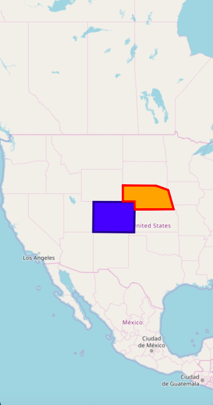
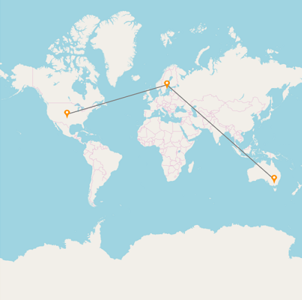
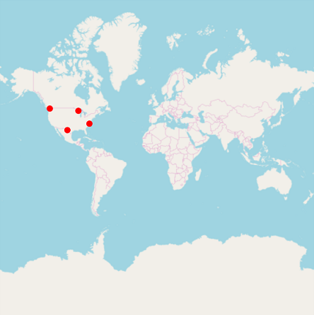
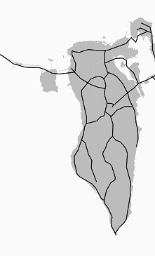
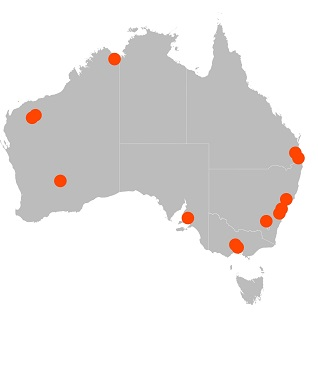

# Shape Types in Xamarin Maps (SfMaps)

This feature provide supports to draw a polygon, polyline and point icon on the map. We can provide input as the Geo points to draw shapes in two different ways. 

    1.Add shapes using point collection
    2.Add shapes using shape file
	

## Add shapes using point collection

We can provide input as the Geo point collection in sample to draw a shape. We can add more number of shapes using [`Sublayer`](https://help.syncfusion.com/xamarin/maps/sublayer) support of Maps. There are three type of shapes available in shape file layer and it can be changed by using [`ShapeType`](https://help.syncfusion.com/cr/xamarin/Syncfusion.SfMaps.XForms.ShapeFileLayer.html#Syncfusion_SfMaps_XForms_ShapeFileLayer_ShapeType) property.

    1.Polyline
    2.Polygon
    3.Point icon
    
### Polygon

Polygon is a two-dimensional surface stored as a sequence of points defining its exterior bounding ring and 0 or more interior rings. Polygons are always simple. Mostly the polygon shape type defines a group of land, water bodies, and other features that have a spatial extent.




      <maps:SfMaps x:Name="maps" ZoomLevel="4">
        <maps:SfMaps.Layers>
            <maps:ImageryLayer GeoCoordinates="30.9709225,-100.2187212" >
                <maps:ImageryLayer.Sublayers>
                    <maps:ShapeFileLayer x:Name="sublayer1" ShapeType="Polygon" Points="{Binding SubLayer1}" >
                        <maps:ShapeFileLayer.ShapeSettings>
                            <maps:ShapeSetting ShapeFill="Blue" ShapeStroke="DarkBlue" 
                                               ShapeStrokeThickness="4" />
                        </maps:ShapeFileLayer.ShapeSettings>
                    </maps:ShapeFileLayer>
                    <maps:ShapeFileLayer x:Name="subLayer2" ShapeType="Polygon" Points="{Binding SubLayer2}">
                        <maps:ShapeFileLayer.ShapeSettings>
                            <maps:ShapeSetting ShapeFill="Orange" ShapeStroke="Red"
                                               ShapeStrokeThickness="4" />
                        </maps:ShapeFileLayer.ShapeSettings>
                    </maps:ShapeFileLayer>
                </maps:ImageryLayer.Sublayers>
            </maps:ImageryLayer>
        </maps:SfMaps.Layers>
    </maps:SfMaps>





    public partial class MainPage : ContentPage
    {
        ViewModel obj = new ViewModel();
        public MainPage()
        {
            InitializeComponent();
            this.BindingContext = obj;
            SfMaps maps = new SfMaps();
            maps.ZoomLevel = 4;
            ImageryLayer layer = new ImageryLayer();
            layer.GeoCoordinates = new Point(30.9709225, -100.2187212);
            ShapeFileLayer subLayer1 = new ShapeFileLayer();
            subLayer1.ShapeType = ShapeType.Polygon;
            subLayer1.Points = obj.SubLayer1;
            layer.Sublayers.Add(subLayer1);
            ShapeFileLayer subLayer2 = new ShapeFileLayer();
            subLayer2.ShapeType = ShapeType.Polygon;
            subLayer1.Points = obj.SubLayer2;
            layer.Sublayers.Add(subLayer2);
            ShapeSetting subLayerSetting1 = new ShapeSetting();
            subLayerSetting1.ShapeStrokeThickness = 4;
            subLayerSetting1.ShapeFill = Color.Blue;
            subLayerSetting1.ShapeStroke = Color.DarkBlue;
            subLayer1.ShapeSettings = subLayerSetting1;
            ShapeSetting subLayerSetting2 = new ShapeSetting();
            subLayerSetting2.ShapeStrokeThickness = 4;
            subLayerSetting2.ShapeFill = Color.Orange;
            subLayerSetting2.ShapeStroke = Color.Red;
            subLayer2.ShapeSettings = subLayerSetting2;
            subLayer1.Points = obj.SubLayer1;
            subLayer2.Points = obj.SubLayer2;
            maps.Layers.Add(layer);
            this.Content = maps;
        }
    }

    public class ViewModel
    {
         public ObservableCollection<Point> SubLayer1
        {
            get;set;
        }

        public ObservableCollection<Point> SubLayer2
        {
            get; set;
        }
        public ViewModel()
        {

            SubLayer1 = new ObservableCollection<Point>()
            {
                new Point(37.042972,-109.085003),
                new Point(40.992567,-109.021030),
                new Point(40.968420,-102.048065),
                new Point(36.991893,-102.144024),
                new Point(37.042972,-109.085003)
            };
            SubLayer2 = new ObservableCollection<Point>()
            {
              new Point(41.04621681452063, -104.0625),
              new Point(41.04621681452063, -102.0849609375),
              new Point(40.01078714046552, -102.041015625),
              new Point(40.04443758460856, -95.44921875),
              new Point(42.48830197960227, -96.3720703125),
              new Point(43.03677585761058, -98.4375),
              new Point(43.068887774169625, -104.0625),
              new Point(41.04621681452063, -104.0625),
            };
        }
    }




### Polyline

The polyline is a shape that has a dimension of 1. It is called a simple line if it does not intersect itself. The polylines are often used to define linear features such as roads, rivers, and power lines. 




            <maps:SfMaps x:Name="Maps" >
                <maps:SfMaps.Layers>
                    <maps:ImageryLayer  x:Name="layer">
                        <maps:ImageryLayer.Sublayers>
                            <maps:ShapeFileLayer x:Name="subLayer" ShapeType="Polyline">
                                <maps:ShapeFileLayer.Points>
                                   <Point>
                                        <Point.X>39.6737</Point.X>
                                        <Point.Y>-100.5</Point.Y>
                                    </Point>
                                    <Point>
                                        <Point.X>61.35</Point.X>
                                        <Point.Y>18.131</Point.Y>
                                    </Point>
                                    <Point>
                                        <Point.X>-32.259</Point.X>
                                        <Point.Y>145.4214</Point.Y>
                                    </Point>
                                    </maps:ShapeFileLayer.Points>
                                        <maps:ShapeFileLayer.ShapeSettings>
                                            <maps:ShapeSetting x:Name="settings" ShapeStrokeThickness="3" />
                                        </maps:ShapeFileLayer.ShapeSettings>
                                    <maps:ShapeFileLayer.Markers>
                                        <local:ViewModel Latitude="39.6737" Longitude= "-100.5" />
                                        <local:ViewModel Latitude="61.35" Longitude= "18.131"  />
                                        <local:ViewModel Latitude="-32.259" Longitude= "145.4214" />
                                    </maps:ShapeFileLayer.Markers>
                                    <maps:ShapeFileLayer.MarkerTemplate>
                                        <DataTemplate >
                                            <Image Source="{Binding ImageName}" Aspect="AspectFit " HorizontalOptions="StartAndExpand" VerticalOptions="Center"  HeightRequest="30" WidthRequest="30"   />
                                        </DataTemplate>
                                    </maps:ShapeFileLayer.MarkerTemplate>
                                </maps:ShapeFileLayer>
                            </maps:ImageryLayer.Sublayers>
                    </maps:ImageryLayer>
                </maps:SfMaps.Layers>
            </maps:SfMaps>





    public partial class MyPage : ContentPage
    {
        ViewModel obj = new ViewModel();
        public MyPage()
        {
            InitializeComponent();
            this.BindingContext = obj;
            SfMaps maps = new SfMaps();
            ImageryLayer layer = new ImageryLayer();
            ShapeFileLayer subLayer = new ShapeFileLayer();
            MapMarker marker = new MapMarker();
            marker.Latitude = "39.6737";
            marker.Longitude = "-100.5";
            subLayer.Markers.Add(marker);
            MapMarker marker1 = new MapMarker();
            marker1.Latitude = "61.35";
            marker1.Longitude = "18.131";
            subLayer.Markers.Add(marker1);
            MapMarker marker2 = new MapMarker();
            marker2.Latitude = "-32.259";
            marker2.Longitude = "145.4214";
            subLayer.Markers.Add(marker2);
            subLayer.Points.Add(new Point(39.6737,-100.5));
            subLayer.Points.Add(new Point(61.35, 18.131));
            subLayer.Points.Add(new Point(-32.259, 145.4214));
            DataTemplate dataTemplate = new DataTemplate(() =>
            {
            Image image = new Image();
            image.Source = obj.ImageName;
            image.Scale = 1;
            image.Aspect = Aspect.AspectFit;
            image.HorizontalOptions = LayoutOptions.StartAndExpand;
            image.VerticalOptions = LayoutOptions.Center;
            image.HeightRequest = 30;
            image.WidthRequest = 30;
            return image;
            });
            subLayer.MarkerTemplate = dataTemplate;
            subLayer.ShapeType = ShapeType.Polyline;
            ShapeSetting subLayerSetting = new ShapeSetting();
            subLayerSetting.ShapeStrokeThickness = 3;
            subLayer.ShapeSettings = subLayerSetting;
            layer.Sublayers.Add(subLayer);
            maps.Layers.Add(layer);
            this.Content = maps;
        }
    }
    public class ViewModel:MapMarker
    {
        public ImageSource ImageName { get; set; }
        public ViewModel()
        {
            ImageName = ImageSource.FromResource("MapSample.pin.png");
        }
    }




### Point icon

A point icon is shape with a dimension of 0 that occupies a single location in coordinate space. A point icon has a single x, y coordinate value. The point icons are often used to define features such as oil wells, landmarks, and elevations.




            <maps:SfMaps x:Name="Maps" >
                <maps:SfMaps.Layers>
                    <maps:ImageryLayer  x:Name="layer">
                        <maps:ImageryLayer.Sublayers>
                             <maps:ShapeFileLayer x:Name="subLayer" MapPointIconSize="10" ShapeType="PointIcon">
                                  <maps:ShapeFileLayer.Points>
                                       <Point>
                                            <Point.X>48.95</Point.X>
                                            <Point.Y>-122.68</Point.Y>
                                        </Point>
                                        <Point>
                                            <Point.X>30.197</Point.X>
                                            <Point.Y>-102.6564</Point.Y>
                                        </Point>
                                        <Point>
                                            <Point.X>36.3305</Point.X>
                                            <Point.Y>-77.5437</Point.Y>
                                        </Point>
                                        <Point>
                                            <Point.X>47.2331</Point.X>
                                            <Point.Y>-90.140212</Point.Y>
                                        </Point>
                                    </maps:ShapeFileLayer.Points>
                                    <maps:ShapeFileLayer.ShapeSettings>
                                            <maps:ShapeSetting ShapeFill="Red" ShapeStroke="Red"/>    
                                    </maps:ShapeFileLayer.ShapeSettings>
                                </maps:ShapeFileLayer>
                            </maps:ImageryLayer.Sublayers>
                       </maps:ImageryLayer>
                </maps:SfMaps.Layers>
            </maps:SfMaps>





    public partial class MyPage : ContentPage
    {
        ViewModel obj = new ViewModel();
        public MyPage()
        {
            InitializeComponent();
            this.BindingContext = obj;
            SfMaps maps = new SfMaps();
            ImageryLayer layer = new ImageryLayer();
            ShapeFileLayer subLayer = new ShapeFileLayer();
            subLayer.Points.Add(new Point(48.95,-122.68));
            subLayer.Points.Add(new Point(30.197, -102.6564));
            subLayer.Points.Add(new Point(36.3305, -77.5437));
            subLayer.Points.Add(new Point(47.2331, -90.140212));
            subLayer.MapPointIconSize = 10;
            subLayer.ShapeType = ShapeType.PointIcon;
            ShapeSetting subLayerSetting = new ShapeSetting();
            subLayerSetting.ShapeFill = Color.Red;
            subLayerSetting.ShapeStroke = Color.Red;
            subLayer.ShapeSettings = subLayerSetting;
            layer.Sublayers.Add(subLayer);
            maps.Layers.Add(layer);
            this.Content = maps;
       }
    }




### Customization of points

The size, shape, and position of the map points can be customized using the [`MapPointIconSize`](https://help.syncfusion.com/cr/xamarin/Syncfusion.SfMaps.XForms.ShapeFileLayer.html#Syncfusion_SfMaps_XForms_ShapeFileLayer_MapPointIconSize) , [`MapPointIcon`](https://help.syncfusion.com/cr/xamarin/Syncfusion.SfMaps.XForms.ShapeFileLayer.html#Syncfusion_SfMaps_XForms_ShapeFileLayer_MapPointIcon) , [`MapPointHorizontalAlignment`](https://help.syncfusion.com/cr/xamarin/Syncfusion.SfMaps.XForms.ShapeFileLayer.html#Syncfusion_SfMaps_XForms_ShapeFileLayer_MapPointHorizontalAlignment) and [`MapPointVerticalAlignment`](https://help.syncfusion.com/cr/xamarin/Syncfusion.SfMaps.XForms.ShapeFileLayer.html#Syncfusion_SfMaps_XForms_ShapeFileLayer_MapPointVerticalAlignment) properties of shape file layer.

## Add shapes using shape file

[`SfMaps`](https://help.syncfusion.com/xamarin/sfmaps/getting-started) allows to provide various shape types in [`ShapeFileLayer`](https://help.syncfusion.com/xamarin/sfmaps/layers#shape-file-layer) such as Polygon, Polyline, and Points. Shape point collection and shape type should be add in shape file itself.

### Polygon

### Polyline

The shape file layer with the polyline shape type is used as [`sublayer`](https://help.syncfusion.com/xamarin/sfmaps/sublayer#adding-sublayers-in-shapefilelayer).

The following code example demonstrates the sublayer with polyline shape type. The roads (sublayer) of Bahrain (base layer) is displayed using the shape file layer of maps.





<maps:SfMaps>

<maps:SfMaps.Layers>

<maps:ShapeFileLayer Uri="Bahrain.shp">

<maps:ShapeFileLayer.ShapeSettings>

<maps:ShapeSetting  ShapeFill="#bcbcbc"/>
               
</maps:ShapeFileLayer.ShapeSettings>
                
<maps:ShapeFileLayer.Sublayers>

<maps:ShapeFileLayer Uri="roads.shp">

<maps:ShapeFileLayer.ShapeSettings>

<maps:ShapeSetting  ShapeFill="Black"  ShapeStrokeThickness="2"/>

</maps:ShapeFileLayer.ShapeSettings>

</maps:ShapeFileLayer>

</maps:ShapeFileLayer.Sublayers>

</maps:ShapeFileLayer>

</maps:SfMaps.Layers>

</maps:SfMaps>





SfMaps maps = new SfMaps();

ShapeFileLayer layer = new ShapeFileLayer();

layer.Uri = "Bahrain.shp";

ShapeSetting layerSetting = new ShapeSetting();

layerSetting.ShapeFill = Color.FromHex("#bcbcbc");

layer.ShapeSettings = layerSetting;

ShapeFileLayer subLayer = new ShapeFileLayer();

subLayer.Uri = "roads.shp";

ShapeSetting subLayerSetting = new ShapeSetting();
 
subLayerSetting.ShapeFill = Color.Black;

subLayerSetting.ShapeStrokeThickness = 2;

subLayer.ShapeSettings = subLayerSetting;

layer.Sublayers.Add(subLayer);

maps.Layers.Add(layer);

this.Content = maps;





### Points

The following code example demonstrates the [`sublayer`](https://help.syncfusion.com/xamarin/sfmaps/sublayer#adding-sublayers-in-shapefilelayer) with the points shape type. The places (sublayer) of Australia (base layer) is displayed using the shape file layer of maps.





<maps:SfMaps>

<maps:SfMaps.Layers>

<maps:ShapeFileLayer Uri="australia.shp">

<maps:ShapeFileLayer.ShapeSettings>

<maps:ShapeSetting  ShapeFill="#bcbcbc"/>

</maps:ShapeFileLayer.ShapeSettings>

<maps:ShapeFileLayer.Sublayers>

<maps:ShapeFileLayer Uri="points.shp">

<maps:ShapeFileLayer.ShapeSettings>

<maps:ShapeSetting  ShapeFill="Black" />

</maps:ShapeFileLayer.ShapeSettings>

</maps:ShapeFileLayer>

</maps:ShapeFileLayer.Sublayers>

</maps:ShapeFileLayer>

</maps:SfMaps.Layers>

</maps:SfMaps>





SfMaps maps = new SfMaps();

ShapeFileLayer layer = new ShapeFileLayer();
           
layer.Uri = "australia.shp";

ShapeSetting layerSetting = new ShapeSetting();
            
layerSetting.ShapeFill = Color.FromHex("#bcbcbc");

layer.ShapeSettings = layerSetting;

ShapeFileLayer subLayer = new ShapeFileLayer();
            
subLayer.Uri = "points.shp";

ShapeSetting subLayerSetting = new ShapeSetting();

subLayerSetting.ShapeFill = Color.Black;

subLayer.ShapeSettings = subLayerSetting;

layer.Sublayers.Add(subLayer);

maps.Layers.Add(layer);

this.Content = maps;





### Customization of Points

The size, shape, and position of the map points can be customized using the [`MapPointIconSize`](https://help.syncfusion.com/cr/xamarin/Syncfusion.SfMaps.XForms.ShapeFileLayer.html#Syncfusion_SfMaps_XForms_ShapeFileLayer_MapPointIconSize) , [`MapPointIcon`](https://help.syncfusion.com/cr/xamarin/Syncfusion.SfMaps.XForms.ShapeFileLayer.html#Syncfusion_SfMaps_XForms_ShapeFileLayer_MapPointIcon) , [`MapPointHorizontalAlignment`](https://help.syncfusion.com/cr/xamarin/Syncfusion.SfMaps.XForms.ShapeFileLayer.html#Syncfusion_SfMaps_XForms_ShapeFileLayer_MapPointHorizontalAlignment) and [`MapPointVerticalAlignment`](https://help.syncfusion.com/cr/xamarin/Syncfusion.SfMaps.XForms.ShapeFileLayer.html#Syncfusion_SfMaps_XForms_ShapeFileLayer_MapPointVerticalAlignment) properties of shape file layer.

### Map point icon

The shape of the map point is customized using the [`MapPointIcon`](https://help.syncfusion.com/cr/xamarin/Syncfusion.SfMaps.XForms.ShapeFileLayer.html#Syncfusion_SfMaps_XForms_ShapeFileLayer_MapPointIcon)  property of ShapeFileLayer. SfMap supports the following map point icon types:

*	Circle,
*	Rectangle,
*	Square,
*	Diamond,
*	Star





<maps:SfMaps BackgroundColor="White">

<maps:SfMaps.Layers>

<maps:ShapeFileLayer Uri="australia.shp">

<maps:ShapeFileLayer.ShapeSettings>

<maps:ShapeSetting  ShapeFill="#bcbcbc"/>

</maps:ShapeFileLayer.ShapeSettings>

<maps:ShapeFileLayer.Sublayers>

<maps:ShapeFileLayer Uri="points.shp" MapPointIcon="Circle" MapPointIconSize="10">
                        
<maps:ShapeFileLayer.ShapeSettings>
                        
<maps:ShapeSetting  ShapeFill="Green" />

</maps:ShapeFileLayer.ShapeSettings>

</maps:ShapeFileLayer>

</maps:ShapeFileLayer.Sublayers>

</maps:ShapeFileLayer>

</maps:SfMaps.Layers>

</maps:SfMaps>





SfMaps maps = new SfMaps();

ShapeFileLayer layer = new ShapeFileLayer();

layer.Uri = "australia.shp";

ShapeSetting layerSetting = new ShapeSetting();
            
layerSetting.ShapeFill = Color.FromHex("#bcbcbc");

layer.ShapeSettings = layerSetting;

ShapeFileLayer subLayer = new ShapeFileLayer();

subLayer.Uri = "points.shp";

subLayer.MapPointIcon = MapPointIcon.Circle;

subLayer.MapPointIconSize = 10;

ShapeSetting subLayerSetting = new ShapeSetting();

subLayerSetting.ShapeFill = Color.Green;

subLayer.ShapeSettings = subLayerSetting;

layer.Sublayers.Add(subLayer);

maps.Layers.Add(layer);





### Map point position

The position of the map points can be customized using the [`MapPointHorizontalAlignment`](https://help.syncfusion.com/cr/xamarin/Syncfusion.SfMaps.XForms.ShapeFileLayer.html#Syncfusion_SfMaps_XForms_ShapeFileLayer_MapPointHorizontalAlignment)  and [`MapPointVerticalAlignment`] (https://help.syncfusion.com/cr/xamarin/Syncfusion.SfMaps.XForms.ShapeFileLayer.html#Syncfusion_SfMaps_XForms_ShapeFileLayer_MapPointVerticalAlignment) properties of shape file layer. These properties allow to vary the position to Near, Far, and Center by considering the provided latitude, longitude, and the map point icon size.





<maps:SfMaps BackgroundColor="White">

<maps:SfMaps.Layers>

<maps:ShapeFileLayer Uri="australia.shp">

<maps:ShapeFileLayer.ShapeSettings>

<maps:ShapeSetting  ShapeFill="#bcbcbc"/>

</maps:ShapeFileLayer.ShapeSettings>

<maps:ShapeFileLayer.Sublayers>

<maps:ShapeFileLayer Uri="points.shp" MapPointIcon="Circle" MapPointIconSize="10"
                                         
                MapPointHorizontalAlignment="Near" MapPointVerticalAlignment="Near">

<maps:ShapeFileLayer.ShapeSettings>

<maps:ShapeSetting  ShapeFill="Brown" />

</maps:ShapeFileLayer.ShapeSettings>

</maps:ShapeFileLayer>

</maps:ShapeFileLayer.Sublayers>

</maps:ShapeFileLayer>

</maps:SfMaps.Layers>

</maps:SfMaps>





SfMaps maps = new SfMaps();

ShapeFileLayer layer = new ShapeFileLayer();
            
layer.Uri = "australia.shp";

ShapeSetting layerSetting = new ShapeSetting();
            
layerSetting.ShapeFill = Color.FromHex("#bcbcbc");
            
layer.ShapeSettings = layerSetting;

ShapeFileLayer subLayer = new ShapeFileLayer();
            
subLayer.Uri = "points.shp";
            
subLayer.MapPointIcon = MapPointIcon.Circle;
            
subLayer.MapPointIconSize = 10;
            
subLayer.MapPointHorizontalAlignment = MarkerAlignment.Near;

subLayer.MapPointHorizontalAlignment = MarkerAlignment.Near;

ShapeSetting subLayerSetting = new ShapeSetting();

subLayerSetting.ShapeFill = Color.Green;

subLayer.ShapeSettings = subLayerSetting;

layer.Sublayers.Add(subLayer);

maps.Layers.Add(layer);





### Map point size

The size of the map points can be customized using the [`MapPointIconSize`](https://help.syncfusion.com/cr/xamarin/Syncfusion.SfMaps.XForms.ShapeFileLayer.html#Syncfusion_SfMaps_XForms_ShapeFileLayer_MapPointIconSize) property of  ShapeFileLayer.





<maps:SfMaps BackgroundColor="White">
        
<maps:SfMaps.Layers>
            
<maps:ShapeFileLayer Uri="australia.shp">
                
<maps:ShapeFileLayer.ShapeSettings>
                   
<maps:ShapeSetting  ShapeFill="#bcbcbc"/>
                
</maps:ShapeFileLayer.ShapeSettings>
                
<maps:ShapeFileLayer.Sublayers>
                    
<maps:ShapeFileLayer Uri="points.shp"  MapPointIconSize="15">
                        
<maps:ShapeFileLayer.ShapeSettings>
                            
<maps:ShapeSetting  ShapeFill="OrangeRed" />
                        
</maps:ShapeFileLayer.ShapeSettings>
                    
</maps:ShapeFileLayer>
                
</maps:ShapeFileLayer.Sublayers>
            
</maps:ShapeFileLayer>
        
</maps:SfMaps.Layers>
    
</maps:SfMaps>





SfMaps maps = new SfMaps();

ShapeFileLayer layer = new ShapeFileLayer();
            
layer.Uri = "australia.shp";

ShapeSetting layerSetting = new ShapeSetting();
            
layerSetting.ShapeFill = Color.FromHex("#bcbcbc");
            
layer.ShapeSettings = layerSetting;

ShapeFileLayer subLayer = new ShapeFileLayer();
            
subLayer.Uri = "points.shp";
            
subLayer.MapPointIcon = MapPointIcon.Circle;
            
subLayer.MapPointIconSize = 15;
            
ShapeSetting subLayerSetting = new ShapeSetting();

subLayerSetting.ShapeFill = Color. OrangeRed;

subLayer.ShapeSettings = subLayerSetting;

layer.Sublayers.Add(subLayer);
            
maps.Layers.Add(layer);





## See also

[How to add Polygon shape in SfMaps](https://www.syncfusion.com/kb/11783/how-to-add-ploygon-shape-in-xamarin-forms-maps-sfmaps)

[How to draw a line (route) between two terminals in SfMaps](https://www.syncfusion.com/kb/10619/how-to-draw-a-line-route-between-two-terminals-in-sfmaps)
