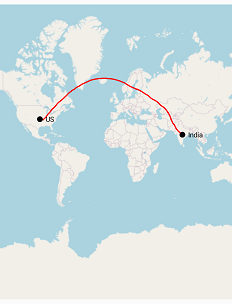

# User interaction features in SfMaps control

Options such as zooming, panning, and selection enable effective interaction on map elements.

## Selection

Each shape in a map can be selected or deselected when interacting with shapes. Map shapes can be selected using the following ways:

* Single selection
* Multiple selection

The selected map shapes are differentiated by their fill. The [`SelectedShapeColor`](https://help.syncfusion.com/cr/xamarin/Syncfusion.SfMaps.XForms.ShapeSetting.html#Syncfusion_SfMaps_XForms_ShapeSetting_SelectedShapeColor) property of [`ShapeSettings`](https://help.syncfusion.com/cr/xamarin/Syncfusion.SfMaps.XForms.ShapeFileLayer.html#Syncfusion_SfMaps_XForms_ShapeFileLayer_ShapeSettings) gets or sets the selected shape color. The [`SelectedShapeStroke`](https://help.syncfusion.com/cr/xamarin/Syncfusion.SfMaps.XForms.ShapeSetting.html#Syncfusion_SfMaps_XForms_ShapeSetting_SelectedShapeStroke) property is used to customize the selected shape border.

### Single selection

Single selection allows you select only one shape at a time. You can select a shape by tapping it. By default, the single selection is enabled when the [`EnableSelection`](https://help.syncfusion.com/cr/xamarin/Syncfusion.SfMaps.XForms.ShapeFileLayer.html#Syncfusion_SfMaps_XForms_ShapeFileLayer_EnableSelection) property is set to true. You can also enable the single selection by  setting the [`SelectionMode`](https://help.syncfusion.com/cr/xamarin/Syncfusion.SfMaps.XForms.ShapeFileLayer.html#Syncfusion_SfMaps_XForms_ShapeFileLayer_SelectionMode) property of ShapeFileLayer to “Single”. When selecting or tapping the rest of the area, the selected shape will be deselected.




<maps:SfMaps x:Name="sfmap"    BackgroundColor="White" >

<maps:SfMaps.Layers >

<maps:ShapeFileLayer Uri="usa_state.shp" EnableSelection="True" 

SelectionMode="Single"  >

<maps:ShapeFileLayer.ShapeSettings>

<maps:ShapeSetting SelectedShapeColor="Green" SelectedShapeStroke="Black" SelectedShapeStrokeThickness="1" />

</maps:ShapeFileLayer.ShapeSettings>

</maps:ShapeFileLayer>

</maps:SfMaps.Layers>

</maps:SfMaps>





SfMaps map = new SfMaps();

map.BackgroundColor = Color.White;

ShapeFileLayer layer = new ShapeFileLayer();

layer.EnableSelection = true;

layer.SelectionMode = SelectionMode.Single;

ShapeSetting shapeSetting = new ShapeSetting();

shapeSetting.SelectedShapeColor = Color.Green;

shapeSetting.SelectedShapeStroke = Color.Black;

shapeSetting.SelectedShapeStrokeThickness = 1;      

layer.ShapeSettings = shapeSetting;

map.Layers.Add(layer);

this.Content = map;





### Multiple selection

Multiple selection allows you select multiple shapes at a time. You can select many shapes by tapping them. To enable this feature, set the [`SelectionMode`](https://help.syncfusion.com/cr/xamarin/Syncfusion.SfMaps.XForms.ShapeFileLayer.html#Syncfusion_SfMaps_XForms_ShapeFileLayer_SelectionMode) property to “Multiple” along with the [`EnableSelection`](https://help.syncfusion.com/cr/xamarin/Syncfusion.SfMaps.XForms.ShapeFileLayer.html#Syncfusion_SfMaps_XForms_ShapeFileLayer_EnableSelection) property. 

I> Shapes cannot be selected when the [`EnableSelection`](https://help.syncfusion.com/cr/xamarin/Syncfusion.SfMaps.XForms.ShapeFileLayer.html#Syncfusion_SfMaps_XForms_ShapeFileLayer_EnableSelection) property is set to false.





<maps:SfMaps x:Name="sfmap"    BackgroundColor="White" >

<maps:SfMaps.Layers >

<maps:ShapeFileLayer Uri="usa_state.shp" EnableSelection="True" 

SelectionMode="Multiple"  >

<maps:ShapeFileLayer.ShapeSettings>

<maps:ShapeSetting SelectedShapeColor="Green" SelectedShapeStroke="Black" SelectedShapeStrokeThickness="1" />

</maps:ShapeFileLayer.ShapeSettings>

</maps:ShapeFileLayer>

</maps:SfMaps.Layers>

</maps:SfMaps>





SfMaps map = new SfMaps();

map.BackgroundColor = Color.White;

ShapeFileLayer layer = new ShapeFileLayer();

layer.Uri = "usa_state.shp";

layer.EnableSelection = true;

layer.SelectionMode = SelectionMode.Multiple;

ShapeSetting shapeSetting = new ShapeSetting();

shapeSetting.SelectedShapeColor = Color.Green;

shapeSetting.SelectedShapeStroke = Color.Black;

shapeSetting.SelectedShapeStrokeThickness = 1;

layer.ShapeSettings = shapeSetting;

map.Layers.Add(layer);

this.Content = map;





### Selected items

The `SelectedItems` property allows you select the shapes without tapping or touching them.

To select a shape and deselect it from the same collection without tapping or touching, just add the shape that is to be selected to the selected items collection.

The following code sample demonstrates how to select and deselect a shape.





var model = GetDataSource();

ShapeFileLayer layer=new ShapeFileLayer();

layer.ItemsSource=model;

SelectedItemButton.Clicked += (sender, e) =>

{

layer.SelectedItems.Add(model[4]);

};

RemoveItemButton.Clicked += (sender, e) =>

{

layer.SelectedItems.Remove(model[4]);

};





## Zooming

The zooming feature enables you zoom in and zoom out the maps to show the in-depth information. The following properties are used to zoom in and zoom out maps:

[`EnableZooming`](https://help.syncfusion.com/cr/xamarin/Syncfusion.SfMaps.XForms.SfMaps.html#Syncfusion_SfMaps_XForms_SfMaps_EnableZooming): Controls whether to perform zooming or not.

[`MinZoom`](https://help.syncfusion.com/cr/xamarin/Syncfusion.SfMaps.XForms.SfMaps.html#Syncfusion_SfMaps_XForms_SfMaps_MinZoom): Sets the minimum level of zooming.

[`MaxZoom`](https://help.syncfusion.com/cr/xamarin/Syncfusion.SfMaps.XForms.SfMaps.html#Syncfusion_SfMaps_XForms_SfMaps_MaxZoom): Sets the maximum level of zooming.

[`ZoomLevel`](https://help.syncfusion.com/cr/xamarin/Syncfusion.SfMaps.XForms.SfMaps.html#Syncfusion_SfMaps_XForms_SfMaps_ZoomLevel): Sets zooming level to shapes.





 <maps:SfMaps EnableZooming="True" MinZoom="1" 
                       MaxZoom="10"  ZoomLevel="2"/>




SfMaps map = new SfMaps(); 
map.EnableZooming = true;
map.MinZoom = 1;
map.MaxZoom = 10;
map.ZoomLevel = 2;





## Panning

Panning feature allows you move the visible area of the maps when it is zoomed in. To enable panning, set the [`EnablePanning`](https://help.syncfusion.com/cr/xamarin/Syncfusion.SfMaps.XForms.SfMaps.html#Syncfusion_SfMaps_XForms_SfMaps_EnablePanning) property to true.





 <maps:SfMaps x:Name="sfmap"  EnablePanning="True" EnableZooming="True" MinZoom="1" 
                       MaxZoom="10"   BackgroundColor="White" />




 SfMaps map = new SfMaps();
 map.EnablePanning = true;
            map.EnableZooming = true;
            map.MinZoom = 1;
            map.MaxZoom = 10;





## Events

### Tapped event

Called when tapped on the maps. [`Tapped`](https://help.syncfusion.com/cr/xamarin/Syncfusion.SfMaps.XForms.SfMaps.html#Syncfusion_SfMaps_XForms_SfMaps_Tapped) event has the following argument.

* `Position` : Gets the screen point (x, y) coordinates of maps on tapping. The following code sample adds the marker at the tapped location.





       <maps:SfMaps Tapped="SfMaps_Tapped" >
                <maps:SfMaps.Layers>
                    <maps:ImageryLayer x:Name="layer"/>
                </maps:SfMaps.Layers>
            </maps:SfMaps>





        private void SfMaps_Tapped(object sender, Syncfusion.SfMaps.XForms.MapTappedEventArgs e)
        {
            var screenPoint = e.Position;
            var geoPoint = layer.GetLatLonFromPoint(screenPoint);
            MapMarker marker = new MapMarker();
            marker.Latitude = geoPoint.Y.ToString();
            marker.Longitude = geoPoint.X.ToString();
            layer.Markers.Add(marker);
        }





### Panning event

Called while performing panning in the maps. [`Panning`](https://help.syncfusion.com/cr/xamarin/Syncfusion.SfMaps.XForms.SfMaps.html#Syncfusion_SfMaps_XForms_SfMaps_Panning) event has the following arguments.

* `Position` : Gets the screen point (x, y) coordinates of maps on panning.
* `Started` : Gets the boolean value whether the control started panning action or not.  
* `Completed` : Gets the boolean value whether the control has completed panning action or not.

N> If both [`Started`](https://help.syncfusion.com/cr/xamarin/Syncfusion.SfMaps.XForms.MapPanUpdatedEventArgs.html#Syncfusion_SfMaps_XForms_MapPanUpdatedEventArgs_Started) and [`Completed`](https://help.syncfusion.com/cr/xamarin/Syncfusion.SfMaps.XForms.MapPanUpdatedEventArgs.html#Syncfusion_SfMaps_XForms_MapPanUpdatedEventArgs_Completed) are in false state, it indicates that the panning is in progress state.

By the following code sample, you can add a sample flight route by dragging on the map.

Using this pan event, you can add a sublayer to draw the polyline.





     <maps:SfMaps EnablePanning="False" Panning="SfMaps_Panning" >
                <maps:SfMaps.Layers>
                    <maps:ImageryLayer x:Name="layer">
                        <maps:ImageryLayer.Markers>
                            <maps:MapMarker Label="US" Latitude="37.0902" Longitude="-95.7129"></maps:MapMarker>
                            <maps:MapMarker Label="India" Latitude="20.5937" Longitude="78.9629"></maps:MapMarker>
                        </maps:ImageryLayer.Markers>
                    </maps:ImageryLayer>
                </maps:SfMaps.Layers>
            </maps:SfMaps>





       private int layerCount = -1;

       private void SfMaps_Panning(object sender, MapPanUpdatedEventArgs e)
        {
            var maps = (sender as SfMaps);
            if (maps.EnablePanning) return;
            var screenPoint = e.Position;
            var geoPoint = layer.GetLatLonFromPoint(screenPoint);

            if (e.Started)
            {
                layerCount++;
                ShapeFileLayer fileLayer = new ShapeFileLayer();
                fileLayer.ShapeType = ShapeType.Polyline;
                fileLayer.ShapeSettings = new ShapeSetting()
                {
                    ShapeFill = Xamarin.Forms.Color.Red,
                    ShapeStrokeThickness = 2
                };

                layer.Sublayers.Add(fileLayer);
            }
            if (!e.Started && !e.Completed)
            {
                layer.Sublayers[layerCount].Points.Add(new Point(geoPoint.Y, geoPoint.X));
            }
        }





