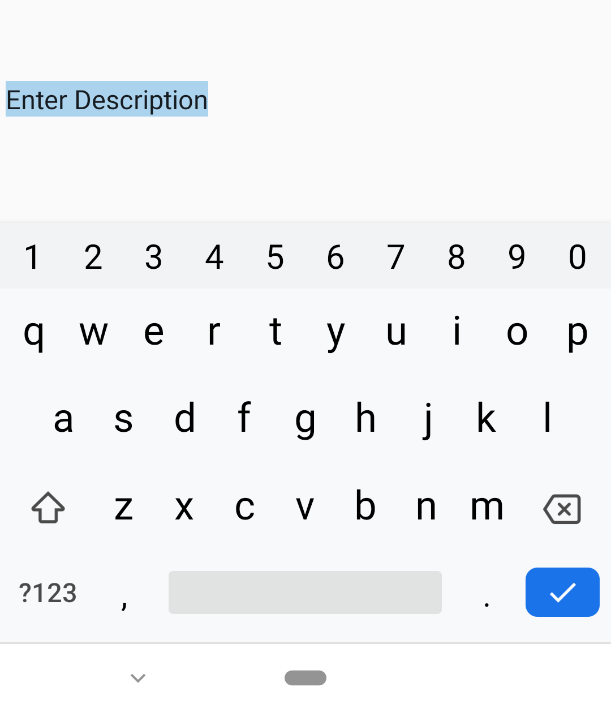
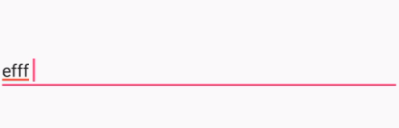
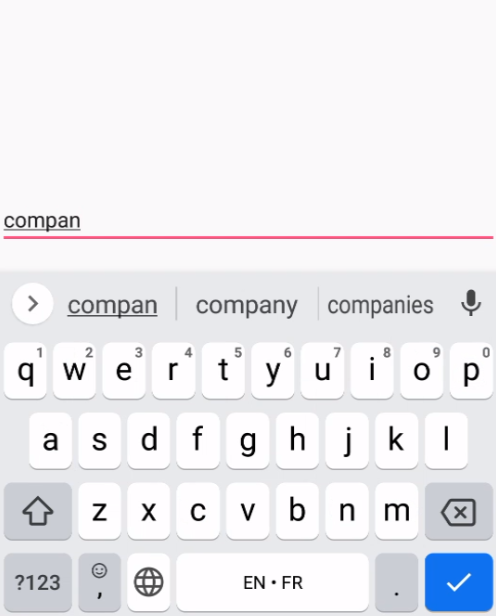

# Basic Features in Xamarin Masked Entry (SfMaskedEdit)

## Setting Value

The `SfMaskedEdit` control allows you to set a display value using the [`Value`](https://help.syncfusion.com/cr/xamarin/Syncfusion.XForms.MaskedEdit.SfMaskedEdit.html#Syncfusion_XForms_MaskedEdit_SfMaskedEdit_Value) property:



<syncmaskededit:SfMaskedEdit x:Name="maskedEdit" Mask="00/00/0000" Value="14/11/2014"/>


SfMaskedEdit maskedEdit = new SfMaskedEdit();
maskedEdit.Mask = "00/00/0000";
maskedEdit.Value =@"14/11/2014";



## Setting Prompt Character

The prompt character is the default character used to indicate the absence of input in the mask, set to '_' by default. You can customize it using the [`PromptChar`](https://help.syncfusion.com/cr/xamarin/Syncfusion.XForms.MaskedEdit.SfMaskedEdit.html#Syncfusion_XForms_MaskedEdit_SfMaskedEdit_PromptChar) property.



< syncmaskededit:SfMaskedEdit x:Name="maskedEdit" Mask="000000" MaskType="Text" PromptChar="*"/>


SfMaskedEdit maskedEdit = new SfMaskedEdit();
maskedEdit.Mask = "00/00/0000";
maskedEdit.PromptChar = '*';



## Setting Watermark

The watermark provides prompts or instructions when it is not focused, and no valid characters are entered. Customize its appearance using the properties below:
- [`Watermark`](https://help.syncfusion.com/cr/xamarin/Syncfusion.XForms.MaskedEdit.SfMaskedEdit.html#Syncfusion_XForms_MaskedEdit_SfMaskedEdit_Watermark): Sets the watermark text.
- [`WatermarkColor`](https://help.syncfusion.com/cr/xamarin/Syncfusion.XForms.MaskedEdit.SfMaskedEdit.html#Syncfusion_XForms_MaskedEdit_SfMaskedEdit_WatermarkColor): Sets the text color for the watermark.
- [`WatermarkFontFamily`](https://help.syncfusion.com/cr/xamarin/Syncfusion.XForms.MaskedEdit.SfMaskedEdit.html#Syncfusion_XForms_MaskedEdit_SfMaskedEdit_WatermarkFontFamily): Sets the font used in the watermark.
- [`WatermarkFontAttributes`](https://help.syncfusion.com/cr/xamarin/Syncfusion.XForms.MaskedEdit.SfMaskedEdit.html#Syncfusion_XForms_MaskedEdit_SfMaskedEdit_WatermarkFontAttributes): Sets font attributes (e.g., bold, italic).
- [`WatermarkFontSize`](https://help.syncfusion.com/cr/xamarin/Syncfusion.XForms.MaskedEdit.SfMaskedEdit.html#Syncfusion_XForms_MaskedEdit_SfMaskedEdit_WatermarkFontSize): Sets the font size for the watermark.



<syncmaskededit:SfMaskedEdit x:Name="maskedEdit" Mask="00/00/0000" Watermark="Type here" WatermarkColor="LightGray" WatermarkFontFamily="Arial" WatermarkFontAttributes="Bold" WatermarkFontSize="20"/>


SfMaskedEdit maskedEdit = new SfMaskedEdit();
maskedEdit.Mask = "00/00/0000";
maskedEdit.Watermark = "Type here";
maskedEdit.WatermarkColor = Color.LightGray;
maskedEdit.WatermarkFontFamily = "Arial";
maskedEdit.WatermarkFontAttributes = FontAttributes.Bold;
maskedEdit.WatermarkFontSize = 20;



## Customize the Return Key

The return key's appearance on the soft keyboard, displayed when `SfMaskedEdit` has focus, can be customized by setting the [`ReturnType`](https://help.syncfusion.com/cr/xamarin/Syncfusion.XForms.MaskedEdit.SfMaskedEdit.html#Syncfusion_XForms_MaskedEdit_SfMaskedEdit_ReturnType) property. Options include `Default`, `Done`, `Go`, `Next`, `Search`, and `Send`.




<syncfusion:SfMaskedEdit x:Name="maskedEdit"  Mask="\w+@\w+\.\w+" MaskType="RegEx"  ReturnType="Search" />




SfMaskedEdit maskedEdit = new SfMaskedEdit();

maskedEdit.ReturnType = ReturnType.Search;

maskededit.Mask = @"\w+@\w+\.\w+";

maskededit.MaskType = Syncfusion.XForms.MaskedEdit.MaskType.RegEx;




> **Note:** The default value of the `ReturnType` property is `Default`.

## Return Command and Return Command Parameter

The [`ReturnCommand`](https://help.syncfusion.com/cr/xamarin/Syncfusion.XForms.MaskedEdit.SfMaskedEdit.html#Syncfusion_XForms_MaskedEdit_SfMaskedEdit_ReturnCommand) is triggered by pressing the return key. You can also pass a parameter through the [`ReturnCommandParameter`](https://help.syncfusion.com/cr/xamarin/Syncfusion.XForms.MaskedEdit.SfMaskedEdit.html#Syncfusion_XForms_MaskedEdit_SfMaskedEdit_ReturnCommandParameter) property.



<syncfusion:SfMaskedEdit x:Name="maskedEdit" ReturnCommand="{Binding UpdateCommand}" ReturnCommandParameter="Parameter" />




    public class ViewModel 
    {
        private ICommand commandUpdater;
        public ICommand UpdateCommand
        {
            get
            {
                if (commandUpdater == null)
                    commandUpdater = new Updater();
                return commandUpdater;
            }
            set
            {
                commandUpdater = value;
            }
        }
    }

    class Updater : ICommand
    {
        public event EventHandler CanExecuteChanged;
        #region ICommand Members
        public bool CanExecute(object parameter)
        {
            return true;
        }
        public void Execute(object parameter)
        {

        }
        #endregion
    }
	




## Clear Button Visibility

The property of [`ClearButtonVisibility`](https://help.syncfusion.com/cr/xamarin/Syncfusion.XForms.MaskedEdit.SfMaskedEdit.html#Syncfusion_XForms_MaskedEdit_SfMaskedEdit_ClearButtonVisibility) can be used to control whether a `SfMaskedEdit` displays a clear button allowing the user to clear the MaskedText. This property should be set to an enumeration member of [`ClearButtonVisibilityMode`](https://help.syncfusion.com/cr/xamarin/Syncfusion.XForms.Editors.ClearButtonVisibilityMode.html).

* `Never` - indicate control will never display a clear button and that the platform default is used.
* `WhileEditing` - indicates that the clear button will be displayed in the SfMaskedEdit, while it has focus and text.

N> This feature is supported from Android version 5.0 (API level 21 or higher) and is not supported in the UWP platform as it already has framework level supports.





<syncfusion:SfMaskedEdit x:Name="maskedEdit"  Mask="\w+@\w+\.\w+" MaskType="RegEx" ClearButtonVisibility="WhileEditing" />





SfMaskedEdit maskedEdit = new SfMaskedEdit();

maskededit.ClearButtonVisibility = ClearButtonVisibilityMode.WhileEditing;

maskededit.Mask = @"\w+@\w+\.\w+";

maskededit.MaskType = MaskType.RegEx;





> **Note:** This feature is supported from Android version 5.0 (API level 21 or higher). It is not supported on the UWP platform due to existing framework-level support.
## Cursor Position

Manage the cursor position within the entry using the [`CursorPosition`](https://help.syncfusion.com/cr/xamarin/Syncfusion.XForms.MaskedEdit.SfMaskedEdit.html#Syncfusion_XForms_MaskedEdit_SfMaskedEdit_CursorPosition) property.

## Select Text on Focus

Control the selection of masked edit [`Value`](https://help.syncfusion.com/cr/xamarin/Syncfusion.XForms.MaskedEdit.SfMaskedEdit.html#Syncfusion_XForms_MaskedEdit_SfMaskedEdit_Value) upon focus using the [`SelectAllOnFocus`](https://help.syncfusion.com/cr/xamarin/Syncfusion.XForms.MaskedEdit.SfMaskedEdit.html#Syncfusion_XForms_MaskedEdit_SfMaskedEdit_SelectAllOnFocus) property.





 <edit:SfMaskedEdit x:Name="maskedEdit" Value="Enter Description"  SelectAllOnFocus="True"/>





            SfMaskedEdit maskedEdit = new SfMaskedEdit();
            maskedEdit.Value = "Enter Description";
            maskedEdit.SelectAllOnFocus = true;
            this.Content = maskedEdit;





## Restrict Editing

Restrict dynamic editing using the [`IsReadOnly`](https://help.syncfusion.com/cr/xamarin/Syncfusion.XForms.MaskedEdit.SfMaskedEdit.html#Syncfusion_XForms_MaskedEdit_SfMaskedEdit_IsReadOnly) property. Change control text programmatically via the bindable [`Value`](https://help.syncfusion.com/cr/xamarin/Syncfusion.XForms.MaskedEdit.SfMaskedEdit.html#Syncfusion_XForms_MaskedEdit_SfMaskedEdit_Value) property.

## Spell Check

The `IsSpellCheckEnabled` property can be used to control whether spell checking is enabled or not when the user enters text and the misspellings are indicated in the red line. By default, the property is set to true.

N> This feature is supported when [`Mask`](https://help.syncfusion.com/cr/xamarin/Syncfusion.XForms.MaskedEdit.SfMaskedEdit.html#Syncfusion_XForms_MaskedEdit_SfMaskedEdit_Mask) is not set to the [`SfMaskedEdit`](https://help.syncfusion.com/cr/xamarin/Syncfusion.XForms.MaskedEdit.SfMaskedEdit.html) control.





 <syncmaskededit:SfMaskedEdit IsSpellCheckEnabled="True"/>





            SfMaskedEdit maskedEdit = new SfMaskedEdit();
            maskedEdit.IsSpellCheckEnabled = true;
            this.Content = maskedEdit;





## Text prediction

The `IsTextPredictionEnabled` property can be used to control whether text prediction in the soft keyboard and automatic text correction are enabled or not when the user enters text. By default, the property is set to true.

N> This feature is supported when [`Mask`](https://help.syncfusion.com/cr/xamarin/Syncfusion.XForms.MaskedEdit.SfMaskedEdit.html#Syncfusion_XForms_MaskedEdit_SfMaskedEdit_Mask) is not set to the [`SfMaskedEdit`](https://help.syncfusion.com/cr/xamarin/Syncfusion.XForms.MaskedEdit.SfMaskedEdit.html)





 <syncmaskededit:SfMaskedEdit IsTextPredictionEnabled="True"/>





            SfMaskedEdit maskedEdit = new SfMaskedEdit();
            maskedEdit.IsTextPredictionEnabled = true;
            this.Content = maskedEdit;





