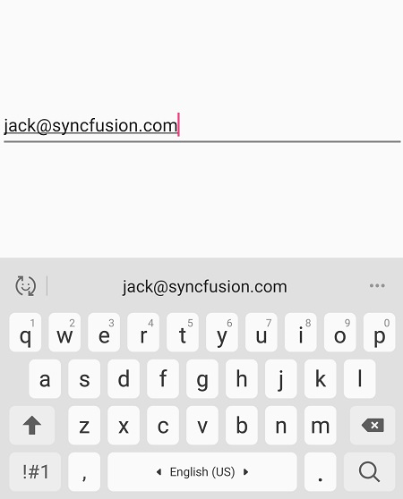

# Basic features in SfMaskedEdit control

## Setting value

The SfMaskedEdit control displays the value that can be set using the [`Value`](https://help.syncfusion.com/cr/xamarin/Syncfusion.XForms.MaskedEdit.SfMaskedEdit.html#Syncfusion_XForms_MaskedEdit_SfMaskedEdit_Value) property:



<syncmaskededit:SfMaskedEdit x:Name="maskedEdit" Mask="00/00/0000" Value="14/11/2014"/>


SfMaskedEdit maskedEdit = new SfMaskedEdit();
maskedEdit.Mask = "00/00/0000";
maskedEdit.Value =@"14/11/2014";



## Setting prompt character

Displays prompt character for the absence of your input in Mask and its default value is ‘_’. You can set the custom prompt character using [`PromptChar`](https://help.syncfusion.com/cr/xamarin/Syncfusion.XForms.MaskedEdit.SfMaskedEdit.html#Syncfusion_XForms_MaskedEdit_SfMaskedEdit_PromptChar) property.



< syncmaskededit:SfMaskedEdit x:Name="maskedEdit" Mask="000000" MaskType="Text" PromptChar="*"/>


SfMaskedEdit maskedEdit = new SfMaskedEdit();
maskedEdit.Mask = "00/00/0000";
maskedEdit.PromptChar = '*';



## Setting watermark

The watermark will prompt you with instructions or important information when it is not on focus and any valid characters are not entered. The [`Watermark`](https://help.syncfusion.com/cr/xamarin/Syncfusion.XForms.MaskedEdit.SfMaskedEdit.html#Syncfusion_XForms_MaskedEdit_SfMaskedEdit_Watermark) property of [`SfMaskedEdit`](https://help.syncfusion.com/cr/xamarin/Syncfusion.XForms.MaskedEdit.SfMaskedEdit.html) is used to set the watermark text for the control.

The following properties are used to customize its appearance:

* [`WatermarkColor`](https://help.syncfusion.com/cr/xamarin/Syncfusion.XForms.MaskedEdit.SfMaskedEdit.html#Syncfusion_XForms_MaskedEdit_SfMaskedEdit_WatermarkColor): Sets text color for the watermark.
* [`WatermarkFontFamily`](https://help.syncfusion.com/cr/xamarin/Syncfusion.XForms.MaskedEdit.SfMaskedEdit.html#Syncfusion_XForms_MaskedEdit_SfMaskedEdit_WatermarkFontFamily): Represents the font to be used in the watermark.
* [`WatermarkFontAttributes`](https://help.syncfusion.com/cr/xamarin/Syncfusion.XForms.MaskedEdit.SfMaskedEdit.html#Syncfusion_XForms_MaskedEdit_SfMaskedEdit_WatermarkFontAttributes): Sets font attributes(bold/italic/none) for the watermark.
* [`WatermarkFontSize`](https://help.syncfusion.com/cr/xamarin/Syncfusion.XForms.MaskedEdit.SfMaskedEdit.html#Syncfusion_XForms_MaskedEdit_SfMaskedEdit_WatermarkFontSize): Sets font size for the watermark.



<syncmaskededit:SfMaskedEdit x:Name="maskedEdit" Mask="00/00/0000" Watermark="Type here" WatermarkColor="LightGray" WatermarkFontFamily="Arial" WatermarkFontAttributes="Bold" WatermarkFontSize="20"/>


SfMaskedEdit maskedEdit = new SfMaskedEdit();
maskedEdit.Mask = "00/00/0000";
maskedEdit.Watermark = "Type here";
maskedEdit.WatermarkColor = Color.LightGray;
maskedEdit.WatermarkFontFamily = "Arial";
maskedEdit.WatermarkFontAttributes = FontAttributes.Bold;
maskedEdit.WatermarkFontSize = 20;



## Customize the return key

The appearance of the return key on the soft keyboard, which is displayed when `SfMaskedEdit` has focus, can be customized by setting the [`ReturnType`](https://help.syncfusion.com/cr/xamarin/Syncfusion.XForms.MaskedEdit.SfMaskedEdit.html#Syncfusion_XForms_MaskedEdit_SfMaskedEdit_ReturnType) property to a value of the ReturnType enumeration.

* `Default` – indicates that no specific return key is required and that the platform default is used.
* `Done` – indicates the return key "Done."
* `Go` – indicates the return key "Go".
* `Next` – indicates the return key "Next".
* `Search` – indicates the return key "Search".
* `Send` – indicates the return key "Send".




<syncfusion:SfMaskedEdit x:Name="maskedEdit"  Mask="\w+@\w+\.\w+" MaskType="RegEx"  ReturnType="Search" />




SfMaskedEdit maskedEdit = new SfMaskedEdit();

maskedEdit.ReturnType = ReturnType.Search;

maskededit.Mask = @"\w+@\w+\.\w+";

maskededit.MaskType = Syncfusion.XForms.MaskedEdit.MaskType.RegEx;




N> The default value of the ReturnType property is Default.

## Return command and return command parameter

[`ReturnCommand`](https://help.syncfusion.com/cr/xamarin/Syncfusion.XForms.MaskedEdit.SfMaskedEdit.html#Syncfusion_XForms_MaskedEdit_SfMaskedEdit_ReturnCommand) is triggered by pressing the return key. Additionally, You can pass the parameter through the  [`ReturnCommandParameter`](https://help.syncfusion.com/cr/xamarin/Syncfusion.XForms.MaskedEdit.SfMaskedEdit.html#Syncfusion_XForms_MaskedEdit_SfMaskedEdit_ReturnCommandParameter) property to the ICommand. 



<syncfusion:SfMaskedEdit x:Name="maskedEdit" ReturnCommand="{Binding UpdateCommand}" ReturnCommandParameter="Parameter" />




    public class ViewModel 
    {
        private ICommand commandUpdater;
        public ICommand UpdateCommand
        {
            get
            {
                if (commandUpdater == null)
                    commandUpdater = new Updater();
                return commandUpdater;
            }
            set
            {
                commandUpdater = value;
            }
        }
    }

    class Updater : ICommand
    {
        public event EventHandler CanExecuteChanged;
        #region ICommand Members
        public bool CanExecute(object parameter)
        {
            return true;
        }
        public void Execute(object parameter)
        {

        }
        #endregion
    }
	




## Clear button visibility

The property of [`ClearButtonVisibility`](https://help.syncfusion.com/cr/xamarin/Syncfusion.XForms.MaskedEdit.SfMaskedEdit.html#Syncfusion_XForms_MaskedEdit_SfMaskedEdit_ClearButtonVisibility) can be used to control whether a `SfMaskedEdit` displays a clear button allowing the user to clear the MaskedText. This property should be set to an enumeration member of [`ClearButtonVisibilityMode`](https://help.syncfusion.com/cr/xamarin/Syncfusion.XForms.Editors.ClearButtonVisibilityMode.html).

* `Never` - indicate control will never display a clear button and that the platform default is used.
* `WhileEditing` - indicates that the clear button will be displayed in the SfMaskedEdit, while it has focus and text.

N> This feature is supported from Android version 5.0 (API level 21 or higher) and is not supported in the UWP platform as it already has framework level supports.





<syncfusion:SfMaskedEdit x:Name="maskedEdit"  Mask="\w+@\w+\.\w+" MaskType="RegEx" ClearButtonVisibility="WhileEditing" />





SfMaskedEdit maskedEdit = new SfMaskedEdit();

maskededit.ClearButtonVisibility = ClearButtonVisibilityMode.WhileEditing;

maskededit.Mask = @"\w+@\w+\.\w+";

maskededit.MaskType = MaskType.RegEx;





## Cursor position

Cursor position in the entry can either be obtained or updated using [`CursorPosition`](https://help.syncfusion.com/cr/xamarin/Syncfusion.XForms.MaskedEdit.SfMaskedEdit.html#Syncfusion_XForms_MaskedEdit_SfMaskedEdit_CursorPosition) property in masked edit.

