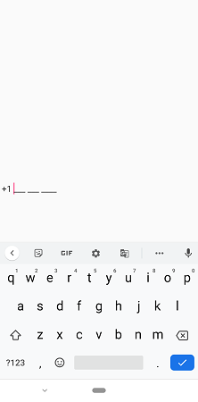

# Events in SfMaskedEdit
The SfMaskedEdit exposes the following events:

* [`ValueChanged`](https://help.syncfusion.com/cr/xamarin/Syncfusion.XForms.MaskedEdit.SfMaskedEdit.html): Occurs when the value of [`Value`](https://help.syncfusion.com/cr/xamarin/Syncfusion.XForms.MaskedEdit.SfMaskedEdit.html#Syncfusion_XForms_MaskedEdit_SfMaskedEdit_Value) property is changed.
* [`MaskInputRejected`](https://help.syncfusion.com/cr/xamarin/Syncfusion.XForms.MaskedEdit.SfMaskedEdit.html): Occurs when a character is rejected by the input mask.

## ValueChanged event

Occurs when the value of the [`Value`](https://help.syncfusion.com/cr/xamarin/Syncfusion.XForms.MaskedEdit.SfMaskedEdit.html#Syncfusion_XForms_MaskedEdit_SfMaskedEdit_Value) property is changed by either entering the valid input character or setting the value to the `Value` property through XAML or C# code. The event arguments are of type [`ValueChangedEventArgs`](https://help.syncfusion.com/cr/xamarin/Syncfusion.XForms.MaskedEdit.ValueChangedEventArgs.html) and expose the following property:

* [`Value`](https://help.syncfusion.com/cr/xamarin/Syncfusion.XForms.MaskedEdit.ValueChangedEventArgs.html#Syncfusion_XForms_MaskedEdit_ValueChangedEventArgs_Value): The read only property contains the updated value of the [`Value`](https://help.syncfusion.com/cr/xamarin/Syncfusion.XForms.MaskedEdit.SfMaskedEdit.html#Syncfusion_XForms_MaskedEdit_SfMaskedEdit_Value) property of SfMaskedEdit.

> Your valid input character is updated to `Value` property based on the `ValidationMode` property.
> Refer to this [link](validation.html#validation-mode) to know more about the `ValidationMode` property of `SfMaskedEdit` control.



<syncmaskededit:SfMaskedEdit x:Name="maskedEdit" MaskType="Text" Mask="00/00/0000" Watermark="dd/MM/YYYY" ValidationMode="LostFocus" ValueChanged="MaskedEdit_OnValueChanged" />

private void MaskedEdit_OnValueChanged(object sender, Syncfusion.XForms.MaskedEdit.ValueChangedEventArgs e)
{
    string date= e.Value.ToString();
    
    if (!string.IsNullOrEmpty(date))
    {
        try
        {
            DateTime datetime = DateTime.ParseExact(date,CultureInfo.CurrentCulture.DateTimeFormat.ShortDatePattern, CultureInfo.InvariantCulture);
        }
        catch (Exception exception)
        {
            DisplayAlert("Error", "Invalid Date format", "Ok");
        }
    }
}


SfMaskedEdit maskedEdit = new SfMaskedEdit();
maskedEdit.MaskType = MaskType.Text;
maskedEdit.Mask = "00/00/0000";
maskedEdit.Watermark = "dd/MM/YYYY";
maskedEdit.ValidationMode = InputValidationMode.LostFocus;
maskedEdit.ValueChanged += MaskedEdit_OnValueChanged;

private void MaskedEdit_OnValueChanged(object sender, Syncfusion.XForms.MaskedEdit.ValueChangedEventArgs e)
{
    string date= e.Value.ToString();
    
    if (!string.IsNullOrEmpty(date))
    {
        try
        {
            DateTime datetime = DateTime.ParseExact(date,CultureInfo.CurrentCulture.DateTimeFormat.ShortDatePattern, CultureInfo.InvariantCulture);
        }
        catch (Exception exception)
        {
            DisplayAlert("Error", "Invalid Date format", "Ok");
        }
    }
}



## MaskInputRejected event

Occurs when your input or assigned character does not match the corresponding format element of the input mask. The event arguments are type of [`MaskInputRejectedEventArgs`](https://help.syncfusion.com/cr/xamarin/Syncfusion.XForms.MaskedEdit.MaskInputRejectedEventArgs.html) and expose the following properties:

* [`Position`](https://help.syncfusion.com/cr/xamarin/Syncfusion.XForms.MaskedEdit.MaskInputRejectedEventArgs.html#Syncfusion_XForms_MaskedEdit_MaskInputRejectedEventArgs_Position): The position in the mask corresponding to the invalid input character.
* [`RejectionHint`](https://help.syncfusion.com/cr/xamarin/Syncfusion.XForms.MaskedEdit.MaskInputRejectedEventArgs.html#Syncfusion_XForms_MaskedEdit_MaskInputRejectedEventArgs_RejectionHint): The enumerated value that describes why the input character was rejected.

[`MaskInputRejected`](https://help.syncfusion.com/cr/xamarin/Syncfusion.XForms.MaskedEdit.MaskInputRejectedEventArgs.html) event is raised in the following situations:

* An input character does not match the corresponding format element. For example, if you enter an alphabetic character when a digit is required. This is probably the most common reason why this event is raised.
* When you try to input extraneous characters beyond the end of the mask.
* A paste operation inserts a character that does not match with its associated format element. 



<syncmaskededit:SfMaskedEdit x:Name="maskedEdit" MaskType="Text" Mask="00/00/0000" Watermark="dd/MM/YYYY" ValidationMode="LostFocus" MaskInputRejected="MaskedEdit_OnMaskInputRejected"/>

private void MaskedEdit_OnMaskInputRejected(object sender, MaskInputRejectedEventArgs e)
{
    if(e.RejectionHint!= MaskedTextResultHint.UnavailableEditPosition)
        DisplayAlert("Error", "Please enter valid input", "Ok");
}



SfMaskedEdit maskedEdit = new SfMaskedEdit();
maskedEdit.MaskType = MaskType.Text;
maskedEdit.Mask = "00/00/0000";
maskedEdit.Watermark = "dd/MM/YYYY";
maskedEdit.ValidationMode = InputValidationMode.LostFocus;
maskedEdit.MaskInputRejected += MaskedEdit_OnMaskInputRejected;

private void MaskedEdit_OnMaskInputRejected(object sender, MaskInputRejectedEventArgs e)
{
    if(e.RejectionHint!= MaskedTextResultHint.UnavailableEditPosition)
        DisplayAlert("Error", "Please enter valid input", "Ok");
}




## Cursor position changing event

Called whenever the cursor position gets changed on the entry.

[`CursorPositionChanging`](https://help.syncfusion.com/cr/xamarin/Syncfusion.XForms.MaskedEdit.SfMaskedEdit.html#Syncfusion_XForms_MaskedEdit_SfMaskedEdit_CursorPositionChanging) event has the following arguments.

[`NewValue`](https://help.syncfusion.com/cr/xamarin/Syncfusion.XForms.MaskedEdit.CursorPositionChangingEventArgs.html#Syncfusion_XForms_MaskedEdit_CursorPositionChangingEventArgs_NewValue) : Gets the current cursor index.
[`OldValue`](https://help.syncfusion.com/cr/xamarin/Syncfusion.XForms.MaskedEdit.CursorPositionChangingEventArgs.html#Syncfusion_XForms_MaskedEdit_CursorPositionChangingEventArgs_OldValue) : Gets the previous cursor index.
[`Cancel`](https://help.syncfusion.com/cr/xamarin/Syncfusion.XForms.MaskedEdit.CursorPositionChangingEventArgs.html#Syncfusion_XForms_MaskedEdit_CursorPositionChangingEventArgs_Cancel) : Gets or sets a value indicating whether to restrict the cursor movement.




         <edit:SfMaskedEdit x:Name="maskedEdit" Mask="+1 000 000 0000"  
                  CursorPositionChanging="maskedEdit_CursorPositionChanging"/>




        SfMaskedEdit maskedEdit = new SfMaskedEdit();
        maskedEdit.Mask = "+1 000 000 0000";
        maskedEdit.CursorPositionChanging += maskedEdit_CursorPositionChanging;
        this.Content = maskedEdit;

        private void maskedEdit_CursorPositionChanging(object sender, Syncfusion.XForms.MaskedEdit.CursorPositionChangingEventArgs e)
        {
            if (e.NewValue <= 2)
                e.Cancel = true;
        }




