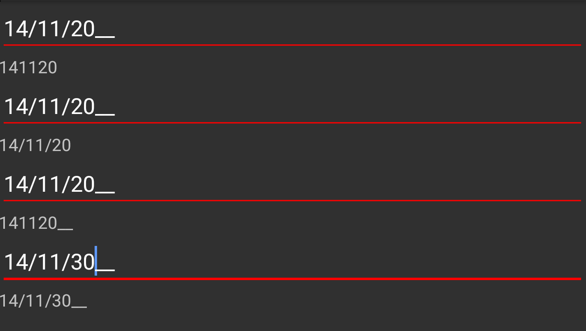

# Formatting Value in SfImageEditor

SfMaskedEdit allows you to format the characters in the [`Value`](https://help.syncfusion.com/cr/xamarin/Syncfusion.XForms.MaskedEdit.SfMaskedEdit.html#Syncfusion_XForms_MaskedEdit_SfMaskedEdit_Value) property in a mask scenario (when the Mask property is set). By default, the Value property holds your input characters, prompt characters and the literals defined in the mask. You can modify this and allow the `Value` property to hold the characters without prompt and literals by setting the [`ValueMaskFormat`](https://help.syncfusion.com/cr/xamarin/Syncfusion.XForms.MaskedEdit.SfMaskedEdit.html#Syncfusion_XForms_MaskedEdit_SfMaskedEdit_ValueMaskFormat) property of the control. The `Value` in the `SfMaskedEdit` is formatted by any one of the following formatting enum values:

* ExcludePromptAndLiterals
* IncludePrompt
* IncludeLiterals
* IncludePromptAndLiterals

## ExcludePromptAndLiterals

Value contains only the typed characters, the prompt characters and literals are excluded.

## IncludePrompt

Value contains the typed characters and prompt characters, literals are excluded.

## IncludeLiterals

Value contains the typed characters and literals, prompt characters are excluded.

## IncludePromptAndLiterals

Value contains typed characters, prompt characters, and literals.



<syncmaskededit:SfMaskedEdit x:Name="maskedEdit1" MaskType="Text" Mask="00/00/0000" ValueMaskFormat="ExcludePromptAndLiterals"/>

<Label BindingContext="{x:Reference maskedEdit1}" Text="{Binding Value}" />

<syncmaskededit:SfMaskedEdit x:Name="maskedEdit2" MaskType="Text" Mask="00/00/0000" ValueMaskFormat="IncludeLiterals"/>

<Label BindingContext="{x:Reference maskedEdit2}" Text="{Binding Value}" />

<syncmaskededit:SfMaskedEdit x:Name="maskedEdit3" MaskType="Text" Mask="00/00/0000" ValueMaskFormat="IncludePrompt"/>

<Label BindingContext="{x:Reference maskedEdit3}" Text="{Binding Value}" />

<syncmaskededit:SfMaskedEdit x:Name="maskedEdit4" MaskType="Text" Mask="00/00/0000" ValueMaskFormat="IncludePromptAndLiterals"/>

<Label BindingContext="{x:Reference maskedEdit4}" Text="{Binding Value}" />


Label label1;
Label label2;
Label label3;
Label label4;
SfMaskedEdit maskedEdit1;
SfMaskedEdit maskedEdit2;
SfMaskedEdit maskedEdit3;
SfMaskedEdit maskedEdit4;

StackLayout stackLayout = new StackLayout();
maskedEdit1 = new SfMaskedEdit();
maskedEdit1.MaskType = MaskType.Text;
maskedEdit1.Mask = "00/00/0000";
maskedEdit1.ValueMaskFormat = MaskFormat.ExcludePromptAndLiterals;
maskedEdit1.ValueChanged += MaskedEdit1_ValueChanged;
label1 = new Label();
stackLayout.Children.Add(maskedEdit1);
stackLayout.Children.Add(label1);

maskedEdit2 = new SfMaskedEdit();
maskedEdit2.MaskType = MaskType.Text;
maskedEdit2.Mask = "00/00/0000";
maskedEdit1.ValueMaskFormat = MaskFormat.IncludeLiterals;
maskedEdit2.ValueChanged += MaskedEdit2_ValueChanged;
label2 = new Label();
stackLayout.Children.Add(maskedEdit2);
stackLayout.Children.Add(label2);

maskedEdit3 = new SfMaskedEdit();
maskedEdit3.MaskType = MaskType.Text;
maskedEdit3.Mask = "00/00/0000";
maskedEdit3.ValueMaskFormat = MaskFormat.IncludePrompt;
maskedEdit3.ValueChanged += MaskedEdit3_ValueChanged;
label3 = new Label();
stackLayout.Children.Add(maskedEdit3);
stackLayout.Children.Add(label3);

maskedEdit4 = new SfMaskedEdit();
maskedEdit4.MaskType = MaskType.Text;
maskedEdit4.Mask = "00/00/0000";
maskedEdit4.ValueMaskFormat = MaskFormat.IncludePromptAndLiterals;
maskedEdit4.ValueChanged += MaskedEdit4_ValueChanged;
label4 = new Label();
stackLayout.Children.Add(maskedEdit4);
stackLayout.Children.Add(label4);

private void MaskedEdit1_ValueChanged(object sender, Syncfusion.XForms.MaskedEdit.ValueChangedEventArgs e)
{
    label1.Text = e.Value as string;
}

private void MaskedEdit2_ValueChanged(object sender, Syncfusion.XForms.MaskedEdit.ValueChangedEventArgs e)
{
    label2.Text = e.Value as string;
}

private void MaskedEdit3_ValueChanged(object sender, Syncfusion.XForms.MaskedEdit.ValueChangedEventArgs e)
{
    label3.Text = e.Value as string;
}

private void MaskedEdit4_ValueChanged(object sender, Syncfusion.XForms.MaskedEdit.ValueChangedEventArgs e)
{
    label4.Text = e.Value as string;
}



Refer this [link](events.html#valuechanged-event) to know more about the `ValueChanged` event of SfMaskedEdit control.

