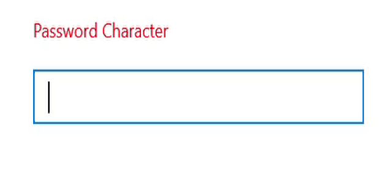

# Show password character

The SfMaskedEdit control supports to work as a password text box when setting a character to the [`PasswordChar`](https://help.syncfusion.com/cr/xamarin/Syncfusion.XForms.MaskedEdit.SfMaskedEdit.html#Syncfusion_XForms_MaskedEdit_SfMaskedEdit_PasswordChar) property.



<syncfusion:SfMaskedEdit x:Name="maskedEdit" Mask="\w+" MaskType="RegEx" PasswordChar="*"  />


SfMaskedEdit maskedEdit = new SfMaskedEdit();
maskedEdit.Mask = @"\w+";
maskedEdit.MaskType = MaskType.RegEx;
maskedEdit.PasswordChar = '*';



## Password Delay

When providing password character, you can show the typed character with some delay using the [`EnablePasswordDelay`](https://help.syncfusion.com/cr/xamarin/Syncfusion.XForms.MaskedEdit.SfMaskedEdit.html#Syncfusion_XForms_MaskedEdit_SfMaskedEdit_EnablePasswordDelay) property. When enabling the EnablePasswordDelay property, the typed character will be displayed for a few seconds before it is converted to the password character.  



<syncfusion:SfMaskedEdit x:Name="maskedEdit" Mask="\w+" MaskType="RegEx" PasswordChar="*" EnablePasswordDelay="True" />


SfMaskedEdit maskedEdit = new SfMaskedEdit();
maskedEdit.Mask = @"\w+";
maskedEdit.MaskType = MaskType.RegEx;
maskedEdit.PasswordChar = '*';
maskedEdit.EnablePasswordDelay = true;



N> The default value of the EnablePasswordDelay property is false.

## Password Delay Duration

When “PasswordDelay” is enabled, you can handle the duration of the displaying typed character using the [`PasswordDelayDuration`](https://help.syncfusion.com/cr/xamarin/Syncfusion.XForms.MaskedEdit.SfMaskedEdit.html#Syncfusion_XForms_MaskedEdit_SfMaskedEdit_PasswordDelayDuration) property.   



<syncfusion:SfMaskedEdit x:Name="maskedEdit" Mask="\w+" MaskType="RegEx" PasswordChar="*" EnablePasswordDelay="True" PasswordDelayDuration="2" />


SfMaskedEdit maskedEdit = new SfMaskedEdit();
maskedEdit.Mask = @"\w+";
maskedEdit.MaskType = MaskType.RegEx;
maskedEdit.PasswordChar = '*';
maskedEdit.EnablePasswordDelay = true;
maskedEdit.PasswordDelayDuration = 2;

