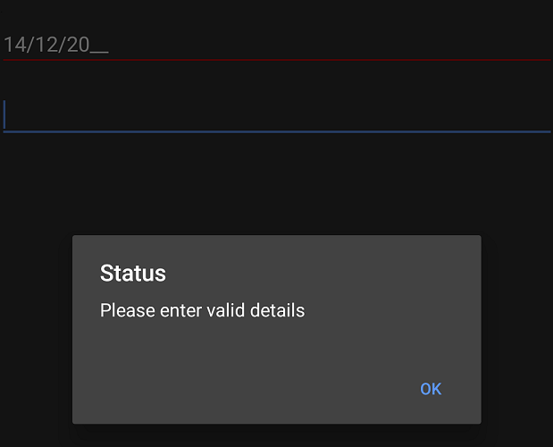

# Validation in Xamarin Masked Entry (SfMaskedEdit)

## Validation Mode

Input validation is determined by the [`ValidationMode`](https://help.syncfusion.com/cr/xamarin/Syncfusion.XForms.MaskedEdit.SfMaskedEdit.html#Syncfusion_XForms_MaskedEdit_SfMaskedEdit_ValidationMode) property. The enumeration values available for this property are:

- **KeyPress**
- **LostFocus**

The default value for validation mode is `LostFocus`.



<syncmaskededit:SfMaskedEdit x:Name="maskedEdit" MaskType="Text" Mask="00/00/0000" ValidationMode="KeyPress"/>


SfMaskedEdit maskedEdit = new SfMaskedEdit();
maskedEdit.MaskType = MaskType.Text;
maskedEdit.Mask = "00/00/0000";
maskedEdit.ValidationMode = InputValidationMode.KeyPress;



With `ValidationMode` set to `LostFocus`, validation occurs when the control loses focus. When set to `KeyPress`, validation is triggered with each key press.

## HasError

The `HasError` property is a read-only attribute used to verify if validation has succeeded. It returns `true` if validation succeeds; otherwise, it returns `false`. The following example demonstrates how to use the [`HasError`](https://help.syncfusion.com/cr/xamarin/Syncfusion.XForms.MaskedEdit.SfMaskedEdit.html#Syncfusion_XForms_MaskedEdit_SfMaskedEdit_HasError) property.



SfMaskedEdit maskedEdit = new SfMaskedEdit();
maskedEdit.MaskType = MaskType.Text;
maskedEdit.Mask = "00/00/0000";
maskedEdit.ValidationMode = InputValidationMode.LostFocus;
maskedEdit.ValueChanged += MaskedEdit_ValueChanged;

private void MaskedEdit_ValueChanged(object sender, Syncfusion.XForms.MaskedEdit.ValueChangedEventArgs e)
{
    SfMaskedEdit maskedEdit = sender as SfMaskedEdit;
    if(maskedEdit.HasError)
    {
        DisplayAlert("Alert", "Please enter valid details", "OK");
    }
}



Refer to this [link](events.html#valuechanged-event) for more information about the `ValueChanged` event of the `SfMaskedEdit` control.

