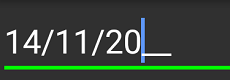

# Visual Customization

The appearance of [`SfMaskedEdit`](https://help.syncfusion.com/cr/xamarin/Syncfusion.XForms.MaskedEdit.SfMaskedEdit.html) can be customized using the following properties:

## BorderColor

Sets the custom [`BorderColor`](https://help.syncfusion.com/cr/xamarin/Syncfusion.XForms.MaskedEdit.SfMaskedEdit.html#Syncfusion_XForms_MaskedEdit_SfMaskedEdit_BorderColor) to SfMaskedEdit.



<syncmaskededit:SfMaskedEdit x:Name="maskedEdit" MaskType="Text" Mask="00/00/0000" BorderColor="Green"/>


SfMaskedEdit maskedEdit = new SfMaskedEdit();
maskedEdit.MaskType = MaskType.Text;
maskedEdit.Mask = "00/00/0000";
maskedEdit.BorderColor = Color.Green;



## ErrorBorderColor

Sets the custom [`ErrorBorderColor`](https://help.syncfusion.com/cr/xamarin/Syncfusion.XForms.MaskedEdit.SfMaskedEdit.html#Syncfusion_XForms_MaskedEdit_SfMaskedEdit_ErrorBorderColor) to SfMaskedEdit. Error border color indicates the color to be used when the validation fails for your input with respect to the mask used. 

> Validation triggers based on `ValidationMode` property.
> Refer this [link](validation.html#validation-mode) to know more about the `ValidationMode` property of SfMaskedEdit control.



<syncmaskededit:SfMaskedEdit x:Name="maskedEdit" MaskType="Text" Mask="00/00/0000" BorderColor="Green" ErrorBorderColor="Yellow"/>


SfMaskedEdit maskedEdit = new SfMaskedEdit();
maskedEdit.MaskType = MaskType.Text;
maskedEdit.Mask = "00/00/0000";
maskedEdit.ErrorBorderColor = Color.Yellow;



 
## Setting Appearance of Text

You can customize the display text appearance of SfMaskedEdit control using the following properties:

* [`TextColor`](https://help.syncfusion.com/cr/xamarin/Syncfusion.XForms.MaskedEdit.SfMaskedEdit.html#Syncfusion_XForms_MaskedEdit_SfMaskedEdit_TextColor): Changes the color of the text.
* [`HorizontalTextAlignment`](https://help.syncfusion.com/cr/xamarin/Syncfusion.XForms.MaskedEdit.SfMaskedEdit.html#Syncfusion_XForms_MaskedEdit_SfMaskedEdit_HorizontalTextAlignment): Changes the horizontal alignment of the text.
* [`FontFamily`](https://help.syncfusion.com/cr/xamarin/Syncfusion.XForms.MaskedEdit.SfMaskedEdit.html#Syncfusion_XForms_MaskedEdit_SfMaskedEdit_FontFamily): Changes the font family of the text.
* [`FontAttributes`](https://help.syncfusion.com/cr/xamarin/Syncfusion.XForms.MaskedEdit.SfMaskedEdit.html#Syncfusion_XForms_MaskedEdit_SfMaskedEdit_FontAttributes): Sets font attributes(bold/italic/none) of the text.
* [`FontSize`](https://help.syncfusion.com/cr/xamarin/Syncfusion.XForms.MaskedEdit.SfMaskedEdit.html#Syncfusion_XForms_MaskedEdit_SfMaskedEdit_FontSize): Sets font size of the text.



<syncmaskededit:SfMaskedEdit x:Name="maskedEdit" MaskType="Text" Mask="00/00/0000" TextColor="Brown" HorizontalTextAlignment="Center" FontFamily="Arial" FontAttributes="Bold" FontSize="20"/>


SfMaskedEdit maskedEdit = new SfMaskedEdit();
maskedEdit.MaskType = MaskType.Text;
maskedEdit.Mask = "00/00/0000";
maskedEdit.TextColor = Color.Brown;
maskedEdit.HorizontalTextAlignment = TextAlignment.Center;
maskedEdit.FontFamily = "Arial";
maskedEdit.FontAttributes = FontAttributes.Bold;
maskedEdit.FontSize = 20;



