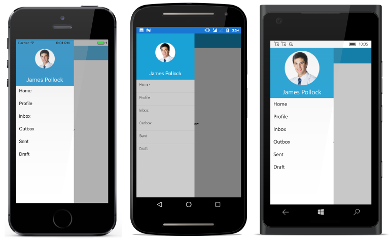

# Getting Started with Xamarin Navigation Drawer (SfNavigationDrawer)

This section outlines the steps required to create a navigation drawer with a content area and data-filled drawer. It covers the essential features you need to know to get started with the NavigationDrawer.

## Assembly Deployment

After installing [Essential Studio® for Xamarin](https://www.syncfusion.com/downloads/xamarin), you can find all the required assemblies in the installation folders: `{Syncfusion Essential Studio Installed location}\Essential Studio\{Version#}\Xamarin\lib`.

E.g.: C:\Program Files (x86) \Syncfusion\Essential Studio\19.1.0.54\Xamarin\lib

> Note: Assemblies can be found in the unzipped package location (Documents/Syncfusion/{Version#}/Xamarin/lib) on Mac.

## Adding SfNavigationDrawer Reference

You can add the [`SfNavigationDrawer`](https://help.syncfusion.com/cr/xamarin/Syncfusion.SfNavigationDrawer.XForms.SfNavigationDrawer.html) reference using one of the following methods:

**Method 1: Adding SfNavigationDrawer Reference from NuGet.org**

Syncfusion Xamarin components are available on [nuget.org](https://www.nuget.org/). To add [`SfNavigationDrawer`](https://help.syncfusion.com/cr/xamarin/Syncfusion.SfNavigationDrawer.XForms.SfNavigationDrawer.html) to your project, open the NuGet Package Manager in Visual Studio, search for [Syncfusion.Xamarin.SfNavigationDrawer](https://www.nuget.org/packages/Syncfusion.Xamarin.SfNavigationDrawer), and then install it.

> Note: Install the same version of the SfNavigationDrawer NuGet in all projects.

**Method 2: Adding SfNavigationDrawer Reference from Toolbox**

Syncfusion also provides a Xamarin Toolbox. Using this toolbox, you can drag the [`SfNavigationDrawer`](https://help.syncfusion.com/cr/xamarin/Syncfusion.SfNavigationDrawer.XForms.SfNavigationDrawer.html) control to the XAML page. It will automatically install the required NuGet packages and add the namespace to the page. To install Syncfusion Xamarin Toolbox, refer to [Toolbox](https://help.syncfusion.com/xamarin/utility#toolbox).

**Method 3: Adding SfNavigationDrawer Assemblies Manually from the Installed Location**

If you prefer to manually reference the assemblies instead of referencing from NuGet, add the following assemblies in respective projects.

Location: {Installed location}/{version}/Xamarin/lib

<table>
<tr>
<td>PCL</td>
<td>Syncfusion.SfNavigationDrawer.XForms.dll Syncfusion.Core.XForms.dll Syncfusion.Licensing.dll </td>
</tr>
<tr>
<td>Android</td>
<td>Syncfusion.SfNavigationDrawer.Android.dll Syncfusion.SfNavigationDrawer.XForms.Android.dll Syncfusion.SfNavigationDrawer.XForms.dll Syncfusion.Core.XForms.dll Syncfusion.Core.XForms.Android.dll Syncfusion.Licensing.dll </td>
</tr>
<tr>
<td>iOS</td>
<td>Syncfusion.SfNavigationDrawer.iOS.dll Syncfusion.SfNavigationDrawer.XForms.iOS.dll Syncfusion.SfNavigationDrawer.XForms.dll Syncfusion.Core.XForms.dll Syncfusion.Core.XForms.iOS.dll Syncfusion.Licensing.dll </td>
</tr>
<tr>
<td>UWP</td>
<td>Syncfusion.SfNavigationDrawer.UWP.dll Syncfusion.SfNavigationDrawer.XForms.UWP.dll Syncfusion.SfNavigationDrawer.XForms.dll Syncfusion.Core.XForms.dll Syncfusion.Core.XForms.UWP.dll Syncfusion.Licensing.dll </td>
</tr>
</table>

> Important: Starting with v16.2.0.x, if you reference Syncfusion assemblies from the trial setup or from the NuGet feed, you also need to include a license key in your projects. Please refer to [Syncfusion license key](https://help.syncfusion.com/common/essential-studio/licensing/overview) to learn about registering the Syncfusion license key in your Xamarin application for using our components.

> Note: After adding the reference, an additional step is required for iOS and UWP projects. If you are adding the references from the toolbox, this step is not needed.

### Additional Step for iOS

Currently, an additional step is required for iOS projects. You need to create an instance of the NavigationDrawer custom renderer as shown below.

Create an instance of `SfNavigationDrawerRenderer` in the `FinishedLaunching` overridden method of the `AppDelegate` class in the iOS project:





public override bool FinishedLaunching(UIApplication app, NSDictionary options) 

{ 

new Syncfusion.SfNavigationDrawer.XForms.iOS.SfNavigationDrawerRenderer(); 

global::Xamarin.Forms.Forms.Init(); LoadApplication(new App()); 

return base.FinishedLaunching(app, options); 

}





### Additional Step for UWP

This step is required only if the application is deployed in Release mode with the .NET native tool chain enabled and is intended to resolve the known Framework issue “Custom controls not rendering in Release mode” on the UWP platform. Initializing the [`SfNavigationDrawer`](https://help.syncfusion.com/cr/xamarin/Syncfusion.SfNavigationDrawer.XForms.SfNavigationDrawer.html) assembly in the `OnLaunched` overridden method of the `App` class in the UWP project is the suggested workaround. The code example is shown below:





protected override void OnLaunched(LaunchActivatedEventArgs e)

{ 

#if DEBUG 

if (System.Diagnostics.Debugger.IsAttached)

{ 

this.DebugSettings.EnableFrameRateCounter = true; 

} 

#endif 

Frame rootFrame = Window.Current.Content as Frame; 

if (rootFrame == null)

{ 

rootFrame = new Frame(); 

rootFrame.NavigationFailed += OnNavigationFailed; List<System.Reflection.Assembly> assembliesToInclude = new List<System.Reflection.Assembly>(); 

// Add all the renderer assemblies your app uses 

assembliesToInclude.Add(typeof(Syncfusion.SfNavigationDrawer.XForms.UWP.SfNavigationDrawerRenderer).GetTypeInfo().Assembly); 

// Replace the Xamarin.Forms.Forms.Init(e);

Xamarin.Forms.Forms.Init(e, assembliesToInclude); 

if (e.PreviousExecutionState == ApplicationExecutionState.Terminated) 

{ 

//TODO: Load state from previously suspended application

} 

// Place the frame in the current Window

Window.Current.Content = rootFrame; 

} 

if (rootFrame.Content == null) 

{

// When the navigation stack isn't restored navigate to the first page, 
// configuring the new page by passing required information as a navigation 
// parameter rootFrame.Navigate(typeof(MainPage), e.Arguments);

} 

// Ensure the current window is active 

Window.Current.Activate();

}





## Initialize SfNavigationDrawer

Import the [`SfNavigationDrawer`](https://help.syncfusion.com/cr/xamarin/Syncfusion.SfNavigationDrawer.XForms.SfNavigationDrawer.html) namespace in the respective page as shown below:





	<xmlns:navigationdrawer="clr-namespace:Syncfusion.SfNavigationDrawer.XForms;assembly=Syncfusion.SfNavigationDrawer.XForms"/>
	




	using Syncfusion.SfNavigationDrawer.XForms;





Then initialize an empty navigation drawer as shown below:

	


<?xml version="1.0" encoding="utf-8"?>
<ContentPage xmlns="http://xamarin.com/schemas/2014/forms" 
             xmlns:x="http://schemas.microsoft.com/winfx/2009/xaml" 
             xmlns:local="clr-namespace:NaviSample" 
             xmlns:navigationdrawer="clr-namespace:Syncfusion.SfNavigationDrawer.XForms;assembly=Syncfusion.SfNavigationDrawer.XForms"
             x:Class="NaviSample.MainPage">
   <navigationdrawer:SfNavigationDrawer x:Name="navigationDrawer">
        <navigationdrawer:SfNavigationDrawer.ContentView>
            <Grid/>
        </navigationdrawer:SfNavigationDrawer.ContentView>
    </navigationdrawer:SfNavigationDrawer>
</ContentPage>
	

 

using Syncfusion.SfNavigationDrawer.XForms;
using Xamarin.Forms;

namespace NaviSample
{
    public partial class MainPage : ContentPage
    {
        public MainPage()
        {
            InitializeComponent();
            SfNavigationDrawer navigationDrawer = new SfNavigationDrawer();
            Grid grid = new Grid();
            navigationDrawer.ContentView = grid;
            this.Content = navigationDrawer;
        }
    }
}





> Note: It is mandatory to set the [`ContentView`](https://help.syncfusion.com/cr/xamarin/Syncfusion.SfNavigationDrawer.XForms.SfNavigationDrawer.html#Syncfusion_SfNavigationDrawer_XForms_SfNavigationDrawer_ContentView) for [`SfNavigationDrawer`](https://help.syncfusion.com/cr/xamarin/Syncfusion.SfNavigationDrawer.XForms.SfNavigationDrawer.html) upon initialization.

## Adjust Drawer Size

The default position of the navigation pane is on the left, so let's change the drawer width to 200.

	


<?xml version="1.0" encoding="utf-8"?>
<ContentPage xmlns="http://xamarin.com/schemas/2014/forms" 
             xmlns:x="http://schemas.microsoft.com/winfx/2009/xaml" 
             xmlns:local="clr-namespace:NaviSample" 
             xmlns:navigationdrawer="clr-namespace:Syncfusion.SfNavigationDrawer.XForms;assembly=Syncfusion.SfNavigationDrawer.XForms"
             x:Class="NaviSample.MainPage">
   <navigationdrawer:SfNavigationDrawer x:Name="navigationDrawer"
                                        DrawerWidth="200">
        <navigationdrawer:SfNavigationDrawer.ContentView>
            <Grid/>
        </navigationdrawer:SfNavigationDrawer.ContentView>
    </navigationdrawer:SfNavigationDrawer>
</ContentPage>
	

 

using Syncfusion.SfNavigationDrawer.XForms;
using Xamarin.Forms;

namespace NaviSample
{
    public partial class MainPage : ContentPage
    {
        public MainPage()
        {
            InitializeComponent();
            SfNavigationDrawer navigationDrawer = new SfNavigationDrawer()
            {
                DrawerWidth = 200
            };

            Grid grid = new Grid();
            navigationDrawer.ContentView = grid;
            this.Content = navigationDrawer;
        }
    }
}





> Note: To change the side of the navigation pane, use the [`Position`](https://help.syncfusion.com/cr/xamarin/Syncfusion.SfNavigationDrawer.XForms.SfNavigationDrawer.html#Syncfusion_SfNavigationDrawer_XForms_SfNavigationDrawer_Position) property. To adjust the drawer height in the Top and Bottom positions, use the [`DrawerHeight`](https://help.syncfusion.com/cr/xamarin/Syncfusion.SfNavigationDrawer.XForms.SfNavigationDrawer.html#Syncfusion_SfNavigationDrawer_XForms_SfNavigationDrawer_DrawerWidth) property.

## Add Hamburger Menu for Toggling Drawer

Create a button and set the required image to the [`Image`](https://help.syncfusion.com/cr/xamarin/Syncfusion.XForms.Buttons.SfButton.html#Syncfusion_XForms_Buttons_SfButton_Image) property of the button. Subscribe to the Clicked event of the button and invoke the `ToggleDrawer()` method in it to toggle the drawer. Set this button as the [`ContentView`](https://help.syncfusion.com/cr/xamarin/Syncfusion.SfNavigationDrawer.XForms.SfNavigationDrawer.html#Syncfusion_SfNavigationDrawer_XForms_SfNavigationDrawer_ContentView) property of `SfNavigationDrawer`. Align the layout of [`ContentView`](https://help.syncfusion.com/cr/xamarin/Syncfusion.SfNavigationDrawer.XForms.SfNavigationDrawer.html#Syncfusion_SfNavigationDrawer_XForms_SfNavigationDrawer_ContentView) properly to get the hamburger icon at the top left as shown in the following code:

	



<?xml version="1.0" encoding="utf-8"?>
<ContentPage xmlns="http://xamarin.com/schemas/2014/forms" 
             xmlns:x="http://schemas.microsoft.com/winfx/2009/xaml" 
             xmlns:local="clr-namespace:NaviSample" 
             xmlns:navigationdrawer="clr-namespace:Syncfusion.SfNavigationDrawer.XForms;assembly=Syncfusion.SfNavigationDrawer.XForms"
             x:Class="NaviSample.MainPage">
    <navigationdrawer:SfNavigationDrawer x:Name="navigationDrawer" 
                                         DrawerWidth ="200">
        <navigationdrawer:SfNavigationDrawer.ContentView>
            <Grid x:Name="mainContentView" 
                  BackgroundColor="White">
                <Grid.RowDefinitions>
                    <RowDefinition Height="auto"/>
                    <RowDefinition/>
                </Grid.RowDefinitions>
                <StackLayout BackgroundColor="#1aa1d6" 
                               Orientation="Horizontal">
                    <Button x:Name="hamburgerButton" 
                            HeightRequest="50" 
                            WidthRequest="50" 
                            HorizontalOptions="Start" 
                            FontSize="20" 
                            BackgroundColor="#1aa1d6" 
                            Clicked="hamburgerButton_Clicked"/>
                    <Label x:Name="headerLabel" 
                           HeightRequest="50" 
                           HorizontalTextAlignment="Center" 
                           VerticalTextAlignment="Center" 
                           Text="Home" FontSize="16" 
                           TextColor="White" 
                           BackgroundColor="#1aa1d6"/>
                </StackLayout>
                <Label Grid.Row="1" 
                      x:Name="contentLabel" 
                      VerticalOptions="Center" 
                      HorizontalOptions="Center" 
                      Text="Content View" 
                      FontSize="14" 
                      TextColor="Black"/>
            </Grid>
        </navigationdrawer:SfNavigationDrawer.ContentView>
    </navigationdrawer:SfNavigationDrawer>
</ContentPage>
	

	
 

using System;
using Syncfusion.SfNavigationDrawer.XForms;
using Xamarin.Forms;

namespace NaviSample
{
    public partial class MainPage : ContentPage
    {
        public MainPage()
        {
            InitializeComponent();
            hamburgerButton.Image = (FileImageSource)ImageSource.FromFile("hamburger_icon.png");
        }
        void hamburgerButton_Clicked(object sender, EventArgs e)
        {
            navigationDrawer.ToggleDrawer();
        }
    }
}
    




> Note: Add the required images to the drawable folder of the Android project, the Assets folder of the iOS project, and add them directly to the UWP project.

## Set ListView as Drawer Content

Create a ListView with five items and set it as [`DrawerContentView`](https://help.syncfusion.com/cr/xamarin/Syncfusion.SfNavigationDrawer.XForms.SfNavigationDrawer.html#Syncfusion_SfNavigationDrawer_XForms_SfNavigationDrawer_DrawerContentView). 

	



<?xml version="1.0" encoding="utf-8"?>
<ContentPage xmlns="http://xamarin.com/schemas/2014/forms" 
             xmlns:x="http://schemas.microsoft.com/winfx/2009/xaml" 
             xmlns:local="clr-namespace:NaviSample" 
             xmlns:navigationdrawer="clr-namespace:Syncfusion.SfNavigationDrawer.XForms;assembly=Syncfusion.SfNavigationDrawer.XForms"
             x:Class="NaviSample.MainPage">
    <navigationdrawer:SfNavigationDrawer x:Name="navigationDrawer" 
                                         DrawerWidth ="200" 
                                         DrawerHeaderHeight="160">
        <navigationdrawer:SfNavigationDrawer.ContentView>
            <Grid x:Name="mainContentView" 
                  BackgroundColor="White">
                <Grid.RowDefinitions>
                <RowDefinition Height="auto"/>
                <RowDefinition/>
                </Grid.RowDefinitions>
                <StackLayout BackgroundColor="#1aa1d6" 
                             Orientation="Horizontal">
                    <Button x:Name="hamburgerButton" 
                            HeightRequest="50" 
                            WidthRequest="50" 
                            HorizontalOptions="Start" 
                            FontSize="20" 
                            BackgroundColor="#1aa1d6" 
                            Clicked="hamburgerButton_Clicked"/>
                    <Label x:Name="headerLabel" 
                           HeightRequest="50" 
                           HorizontalTextAlignment="Center" 
                           VerticalTextAlignment="Center" 
                           Text="Home" 
                           FontSize="16" 
                           TextColor="White" 
                           BackgroundColor="#1aa1d6"/>
                </StackLayout>
                <Label Grid.Row="1" 
                       x:Name="contentLabel" 
                       VerticalOptions="Center" 
                       HorizontalOptions="Center" 
                       Text="Content View" 
                       FontSize="14" 
                       TextColor="Black"/>
            </Grid>
        </navigationdrawer:SfNavigationDrawer.ContentView>
        <navigationdrawer:SfNavigationDrawer.DrawerHeaderView>
            <Grid BackgroundColor="#1aa1d6">
                <Grid.RowDefinitions>
                    <RowDefinition Height="120"/>
                    <RowDefinition Height="40"/>
                </Grid.RowDefinitions>
                <Image Source="user.png" 
                       HeightRequest="110" 
                       Margin="0,10,0,0" 
                       BackgroundColor="#1aa1d6" 
                       VerticalOptions="Center" 
                       HorizontalOptions="Center"/>
                <Label Text="James Pollock" 
                       Grid.Row="1" 
                       HorizontalTextAlignment="Center" 
                       HorizontalOptions="Center" 
                       FontSize="20" 
                       TextColor="White"/>
            </Grid>
        </navigationdrawer:SfNavigationDrawer.DrawerHeaderView>
        <navigationdrawer:SfNavigationDrawer.DrawerContentView>
            <ListView x:Name="listView" 
                      ItemSelected="listView_ItemSelected">
                <ListView.ItemTemplate>
                    <DataTemplate>
                        <ViewCell>
                            <StackLayout HeightRequest="40">
                                <Label Margin="10,7,0,0" 
                                       Text="{Binding}" 
                                       FontSize="16"/>
                            </StackLayout>
                        </ViewCell>
                    </DataTemplate>
                </ListView.ItemTemplate>
            </ListView>
        </navigationdrawer:SfNavigationDrawer.DrawerContentView>
    </navigationdrawer:SfNavigationDrawer>
</ContentPage>

  	

	


using System;
using System.Collections.Generic;
using Syncfusion.SfNavigationDrawer.XForms;
using Xamarin.Forms;

namespace NaviSample
{
    public partial class MainPage : ContentPage
    {
        public MainPage()
        {
            InitializeComponent();
            hamburgerButton.Image = (FileImageSource)ImageSource.FromFile("hamburger_icon.png");
            List<string> list = new List<string>();
            list.Add("Home");
            list.Add("Profile");
            list.Add("Inbox");
            list.Add("Out box");
            list.Add("Sent");
            list.Add("Draft");
            listView.ItemsSource = list;
        }

        void hamburgerButton_Clicked(object sender, EventArgs e)
        {
            navigationDrawer.ToggleDrawer();
        }

        private void listView_ItemSelected(object sender, SelectedItemChangedEventArgs e)
        {
            // Your codes here
            navigationDrawer.ToggleDrawer();
        }
    }
}





We have created knowledge base document by creating SfNavigationDrawer sample fully in code behind. Please refer the same in this [link.](https://support.syncfusion.com/kb/article/7087/how-to-create-sfnavigationdrawer-sample-in-code-behind)

You can find the Getting Started Sample from this [link.](https://github.com/SyncfusionExamples/xamarin-forms-sfnavigationdrawer)