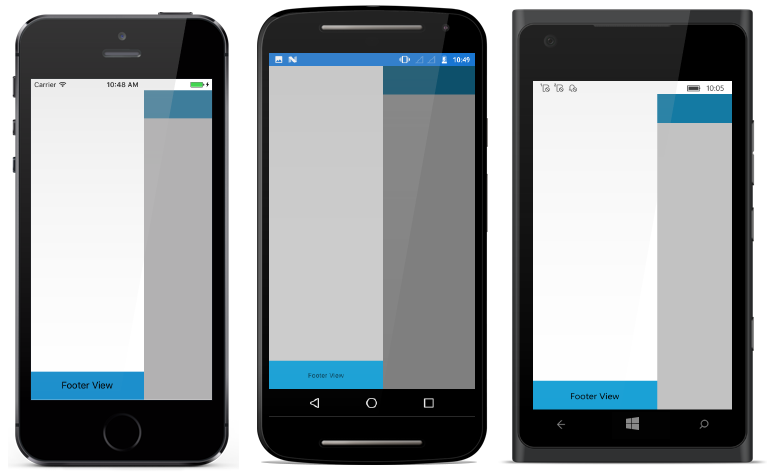

# Side Pane Content

The drawer pane content is viewable only if drawer is in open state. Its content can be set as

*	Header Content

*	Drawer Content

*	Footer Content

N> Header and Footer content are optional but Drawer content is mandatory to allocate space for the drawer.
		
## Header Content

As the name suggests it is displayed at the top of drawer. `DrawerHeaderView` property is used to set the header content of drawer. 





<?xml version="1.0" encoding="utf-8"?>
<ContentPage xmlns="http://xamarin.com/schemas/2014/forms" 
             xmlns:x="http://schemas.microsoft.com/winfx/2009/xaml" 
             xmlns:local="clr-namespace:NaviSample" 
             xmlns:navigationdrawer="clr-namespace:Syncfusion.SfNavigationDrawer.XForms;assembly=Syncfusion.SfNavigationDrawer.XForms"
             x:Class="NaviSample.MainPage">
<navigationdrawer:SfNavigationDrawer x:Name="navigationDrawer">
        <navigationdrawer:SfNavigationDrawer.ContentView>
            <StackLayout>
                <Grid BackgroundColor="#1aa1d6" 
                      HeightRequest="50" 
                      VerticalOptions="Start">
                    <Button x:Name="hamburgerButton" 
                            HeightRequest="50" 
                            WidthRequest="50" 
                            HorizontalOptions="Start" 
                            FontSize="20" 
                            BackgroundColor="#1aa1d6" 
                            Clicked="hamburgerButton_Clicked"/>
                </Grid>
            </StackLayout>
        </navigationdrawer:SfNavigationDrawer.ContentView>
        <navigationdrawer:SfNavigationDrawer.DrawerHeaderView>
            <Grid BackgroundColor="#1aa1d6">
               <StackLayout VerticalOptions="Center" 
                            HorizontalOptions="Center">
                <Label Text="Header View"/>
               </StackLayout>
            </Grid> 
        </navigationdrawer:SfNavigationDrawer.DrawerHeaderView>
    </navigationdrawer:SfNavigationDrawer>
</ContentPage>





using System;
using Syncfusion.SfNavigationDrawer.XForms;
using Xamarin.Forms;

namespace NaviSample
{
    public partial class MainPage : ContentPage
    {
        public MainPage()
        {
            InitializeComponent();
            navigationDrawer.DrawerWidth = 200;
            hamburgerButton.Image = (FileImageSource)ImageSource.FromFile("hamburger_icon.png");
        }

        void hamburgerButton_Clicked(object sender, EventArgs e)
        {
            navigationDrawer.ToggleDrawer();
        }
    }
}
  




## Header Height

Height of the drawer header content can be adjusted using `DrawerHeaderHeight` property.

N> DrawerHeaderView will be disabled by setting DrawerHeaderHeight to zero 




    
<?xml version="1.0" encoding="utf-8"?>
<ContentPage xmlns="http://xamarin.com/schemas/2014/forms" 
             xmlns:x="http://schemas.microsoft.com/winfx/2009/xaml" 
             xmlns:local="clr-namespace:NaviSample" 
             xmlns:navigationdrawer="clr-namespace:Syncfusion.SfNavigationDrawer.XForms;assembly=Syncfusion.SfNavigationDrawer.XForms"
             x:Class="NaviSample.MainPage">
 <navigationdrawer:SfNavigationDrawer x:Name="navigationDrawer" 
                                      DrawerHeaderHeight="50">
        <navigationdrawer:SfNavigationDrawer.ContentView>
            <StackLayout>
                <Grid BackgroundColor="#1aa1d6" 
                      HeightRequest="50" 
                      VerticalOptions="Start">
                    <Button x:Name="hamburgerButton" 
                            HeightRequest="50" 
                            WidthRequest="50" 
                            HorizontalOptions="Start" 
                            FontSize="20" 
                            BackgroundColor="#1aa1d6" 
                            Clicked="hamburgerButton_Clicked"/>
                </Grid>
            </StackLayout>
        </navigationdrawer:SfNavigationDrawer.ContentView>
        <navigationdrawer:SfNavigationDrawer.DrawerHeaderView>
            <Grid BackgroundColor="#1aa1d6" >
                    <StackLayout VerticalOptions="Center" 
                                 HorizontalOptions="Center">
                <Label Text="Header View"/>
                       </StackLayout>
            </Grid> 
        </navigationdrawer:SfNavigationDrawer.DrawerHeaderView>
    </navigationdrawer:SfNavigationDrawer>
</ContentPage>





using System;
using Syncfusion.SfNavigationDrawer.XForms;
using Xamarin.Forms;

namespace NaviSample
{
    public partial class MainPage : ContentPage
    {
        public MainPage()
        {
            InitializeComponent();
            navigationDrawer.DrawerHeaderHeight = 50;
            hamburgerButton.Image = (FileImageSource)ImageSource.FromFile("hamburger_icon.png");
        }

        void hamburgerButton_Clicked(object sender, EventArgs e)
        {
            navigationDrawer.ToggleDrawer();
        }
    }
}





## Footer Content

As the name suggests it is displayed at the bottom of drawer. `DrawerFooterView` property is used to set the footer content of drawer. 





<?xml version="1.0" encoding="utf-8"?>
<ContentPage xmlns="http://xamarin.com/schemas/2014/forms" 
             xmlns:x="http://schemas.microsoft.com/winfx/2009/xaml" 
             xmlns:local="clr-namespace:NaviSample" 
             xmlns:navigationdrawer="clr-namespace:Syncfusion.SfNavigationDrawer.XForms;assembly=Syncfusion.SfNavigationDrawer.XForms"
             x:Class="NaviSample.MainPage">
    <navigationdrawer:SfNavigationDrawer x:Name="navigationDrawer">
        <navigationdrawer:SfNavigationDrawer.ContentView>
            <StackLayout>
                <Grid BackgroundColor="#1aa1d6" 
                      HeightRequest="50" 
                      VerticalOptions="Start">
                    <Button x:Name="hamburgerButton" 
                            HeightRequest="50" 
                            WidthRequest="50" 
                            HorizontalOptions="Start" 
                            FontSize="20" 
                            BackgroundColor="#1aa1d6" 
                            Clicked="hamburgerButton_Clicked"/>
                </Grid>
            </StackLayout>
        </navigationdrawer:SfNavigationDrawer.ContentView>
        <navigationdrawer:SfNavigationDrawer.DrawerFooterView>
           <Grid BackgroundColor="#1aa1d6" >
            <StackLayout VerticalOptions="Center" 
                         HorizontalOptions="Center">
                <Label Text="Footer View"/>
            </StackLayout>
           </Grid> 
        </navigationdrawer:SfNavigationDrawer.DrawerFooterView>
    </navigationdrawer:SfNavigationDrawer>
</ContentPage>





using System;
using Syncfusion.SfNavigationDrawer.XForms;
using Xamarin.Forms;

namespace NaviSample
{
    public partial class MainPage : ContentPage
    {
        public MainPage()
        {
            InitializeComponent();
            navigationDrawer.DrawerFooterHeight = 50;
            hamburgerButton.Image = (FileImageSource)ImageSource.FromFile("hamburger_icon.png");
        }

        void hamburgerButton_Clicked(object sender, EventArgs e)
        {
            navigationDrawer.ToggleDrawer();
        }
    }
}





## Footer Height

Height of the drawer footer content can be adjusted using `DrawerFooterHeight` property.

N> DrawerFooterView will be disabled by setting DrawerFooterHeight to zero 



 

<?xml version="1.0" encoding="utf-8"?>
<ContentPage xmlns="http://xamarin.com/schemas/2014/forms" 
             xmlns:x="http://schemas.microsoft.com/winfx/2009/xaml" 
             xmlns:local="clr-namespace:NaviSample" 
             xmlns:navigationdrawer="clr-namespace:Syncfusion.SfNavigationDrawer.XForms;assembly=Syncfusion.SfNavigationDrawer.XForms"
             x:Class="NaviSample.MainPage">
<navigationdrawer:SfNavigationDrawer x:Name="navigationDrawer" 
                                     DrawerFooterHeight="50">
        <navigationdrawer:SfNavigationDrawer.ContentView>
            <StackLayout>
                <Grid BackgroundColor="#1aa1d6" 
                      HeightRequest="50" 
                      VerticalOptions="Start">
                    <Button x:Name="hamburgerButton" 
                            HeightRequest="50" 
                            WidthRequest="50" 
                            HorizontalOptions="Start" 
                            FontSize="20" 
                            BackgroundColor="#1aa1d6" 
                            Clicked="hamburgerButton_Clicked"/>
                </Grid>
            </StackLayout>
        </navigationdrawer:SfNavigationDrawer.ContentView>
        <navigationdrawer:SfNavigationDrawer.DrawerFooterView>
            <Grid BackgroundColor="#1aa1d6" >
            <StackLayout VerticalOptions="Center" 
                         HorizontalOptions="Center">
                <Label Text="Footer View"/>
            </StackLayout>
             </Grid> 
        </navigationdrawer:SfNavigationDrawer.DrawerFooterView>
    </navigationdrawer:SfNavigationDrawer>
</ContentPage>
	



        
using System;
using Syncfusion.SfNavigationDrawer.XForms;
using Xamarin.Forms;

namespace NaviSample
{
    public partial class MainPage : ContentPage
    {
        public MainPage()
        {
            InitializeComponent();
            navigationDrawer.DrawerFooterHeight = 50;
            hamburgerButton.Image = (FileImageSource)ImageSource.FromFile("hamburger_icon.png");
        }

        void hamburgerButton_Clicked(object sender, EventArgs e)
        {
            navigationDrawer.ToggleDrawer();
        }
    }
}
  




## Main Content

Drawer main content is displayed in between header and footer content. It can be set using `DrawerContentView` property. Content view occupies the remaining space left by header and footer content.



 

<?xml version="1.0" encoding="utf-8"?>
<ContentPage xmlns="http://xamarin.com/schemas/2014/forms" 
             xmlns:x="http://schemas.microsoft.com/winfx/2009/xaml" 
             xmlns:local="clr-namespace:NaviSample" 
             xmlns:navigationdrawer="clr-namespace:Syncfusion.SfNavigationDrawer.XForms;assembly=Syncfusion.SfNavigationDrawer.XForms"
             x:Class="NaviSample.MainPage">
 <navigationdrawer:SfNavigationDrawer x:Name="navigationDrawer">
        <navigationdrawer:SfNavigationDrawer.ContentView>
            <StackLayout>
                <Grid BackgroundColor="#1aa1d6" 
                      HeightRequest="50" 
                      VerticalOptions="Start">
                    <Button x:Name="hamburgerButton" 
                            HeightRequest="50" 
                            WidthRequest="50" 
                            HorizontalOptions="Start" 
                            FontSize="20" 
                            BackgroundColor="#1aa1d6" 
                            Clicked="hamburgerButton_Clicked"/>
                </Grid>
            </StackLayout>
        </navigationdrawer:SfNavigationDrawer.ContentView>
        <navigationdrawer:SfNavigationDrawer.DrawerContentView>
            <Grid BackgroundColor="#1aa1d6">
                <Label Text="Content View" 
                       VerticalOptions="Center" 
                       HorizontalOptions="Center"/>
            </Grid>
        </navigationdrawer:SfNavigationDrawer.DrawerContentView>
    </navigationdrawer:SfNavigationDrawer>
</ContentPage>
	



        
using System;
using Syncfusion.SfNavigationDrawer.XForms;
using Xamarin.Forms;

namespace NaviSample
{
    public partial class MainPage : ContentPage
    {
        public MainPage()
        {
            InitializeComponent();
            hamburgerButton.Image = (FileImageSource)ImageSource.FromFile("hamburger_icon.png");
        }

        void hamburgerButton_Clicked(object sender, EventArgs e)
        {
            navigationDrawer.ToggleDrawer();
        }
    }
}
  




