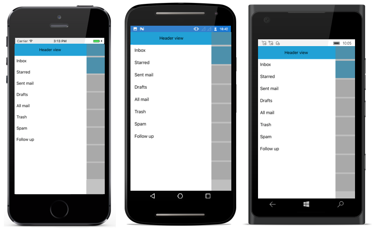

# Toggle Animations

The drawer toggling animation can be changed using Transition property and it can be set to three different values. They are

* SlideOnTop

* Push

* Reveal

N> The default animation is SlideOnTop.

## SlideOnTop

The navigation pane overlays the main content area when opened. It can be set as shown below:





<?xml version="1.0" encoding="utf-8"?>
<ContentPage xmlns="http://xamarin.com/schemas/2014/forms" 
             xmlns:x="http://schemas.microsoft.com/winfx/2009/xaml" 
             xmlns:local="clr-namespace:NaviSample" 
             xmlns:navigationdrawer="clr-namespace:Syncfusion.SfNavigationDrawer.XForms;assembly=Syncfusion.SfNavigationDrawer.XForms"
             x:Class="NaviSample.MainPage">
    <navigationdrawer:SfNavigationDrawer x:Name="navigationDrawer" 
                                         Transition="SlideOnTop" 
                                         DrawerHeaderHeight="50">
        <navigationdrawer:SfNavigationDrawer.ContentView>
            <StackLayout>
                <Grid HeightRequest="50" 
                      VerticalOptions="Start" 
                      BackgroundColor="#1aa1d6">
                    <Button x:Name="hamburgerButton" 
                            HeightRequest="50" 
                            WidthRequest="50" 
                            HorizontalOptions="Start" 
                            FontSize="20" 
                            BackgroundColor="#1aa1d6" 
                            Clicked="hamburgerButton_Clicked"/>
                </Grid>
            </StackLayout>
        </navigationdrawer:SfNavigationDrawer.ContentView>
        <navigationdrawer:SfNavigationDrawer.DrawerHeaderView>
            <Grid BackgroundColor="#1aa1d6" 
                  VerticalOptions="Center" 
                  HorizontalOptions="Center">
                <Label Text="Header view" 
                       FontSize="16" 
                       VerticalOptions="Center" 
                       HorizontalOptions="Center"/>
            </Grid>
        </navigationdrawer:SfNavigationDrawer.DrawerHeaderView>
    </navigationdrawer:SfNavigationDrawer>
</ContentPage>
	
	
	
 

using System;
using Syncfusion.SfNavigationDrawer.XForms;
using Xamarin.Forms;

namespace NaviSample
{
    public partial class MainPage : ContentPage
    {
        public MainPage()
        {
            InitializeComponent();
            navigationDrawer.DrawerHeight = 200; 
            navigationDrawer.Transition = Syncfusion.SfNavigationDrawer.XForms.Transition.SlideOnTop;
            hamburgerButton.Image = (FileImageSource)ImageSource.FromFile("hamburger_icon.png");

        }

        void hamburgerButton_Clicked(object sender, EventArgs e)
        {
            navigationDrawer.ToggleDrawer();
        }
    }
}





## Push

The navigation pane is hidden. It pushes the main content area in opposite side up to drawer width when opened. It can be set as shown below:

	



<?xml version="1.0" encoding="utf-8"?>
<ContentPage xmlns="http://xamarin.com/schemas/2014/forms" 
             xmlns:x="http://schemas.microsoft.com/winfx/2009/xaml" 
             xmlns:local="clr-namespace:NaviSample" 
             xmlns:navigationdrawer="clr-namespace:Syncfusion.SfNavigationDrawer.XForms;assembly=Syncfusion.SfNavigationDrawer.XForms"
             x:Class="NaviSample.MainPage">
    <navigationdrawer:SfNavigationDrawer x:Name="navigationDrawer" 
                                         Transition="Push" 
                                         DrawerHeaderHeight="50">
        <navigationdrawer:SfNavigationDrawer.ContentView>
            <StackLayout>
                <Grid HeightRequest="50" 
                      VerticalOptions="Start" 
                      BackgroundColor="#1aa1d6">
                    <Button x:Name="hamburgerButton" 
                            HeightRequest="50" 
                            WidthRequest="50" 
                            HorizontalOptions="Start" 
                            FontSize="20" 
                            BackgroundColor="#1aa1d6" 
                            Clicked="hamburgerButton_Clicked"/>
                </Grid>
            </StackLayout>
        </navigationdrawer:SfNavigationDrawer.ContentView>
        <navigationdrawer:SfNavigationDrawer.DrawerHeaderView>
            <Grid BackgroundColor="#1aa1d6" 
                  VerticalOptions="Center" 
                  HorizontalOptions="Center">
                <Label Text="Header view" 
                       FontSize="16" 
                       VerticalOptions="Center" 
                       HorizontalOptions="Center"/>
            </Grid>
        </navigationdrawer:SfNavigationDrawer.DrawerHeaderView>
    </navigationdrawer:SfNavigationDrawer>
</ContentPage>


	
 

using System;
using Syncfusion.SfNavigationDrawer.XForms;
using Xamarin.Forms;

namespace NaviSample
{
    public partial class MainPage : ContentPage
    {
        public MainPage()
        {
            InitializeComponent();
            navigationDrawer.DrawerHeight = 200;
            navigationDrawer.Transition = Syncfusion.SfNavigationDrawer.XForms.Transition.Push;
            hamburgerButton.Image = (FileImageSource)ImageSource.FromFile("hamburger_icon.png");

        }

        void hamburgerButton_Clicked(object sender, EventArgs e)
        {
            navigationDrawer.ToggleDrawer();
        }
    }
}





## Reveal

The navigation pane is hidden behind the main content. Main content moves away in opposite side up to drawer width to show the drawer content. It can be set as shown below:





<?xml version="1.0" encoding="utf-8"?>
<ContentPage xmlns="http://xamarin.com/schemas/2014/forms" 
             xmlns:x="http://schemas.microsoft.com/winfx/2009/xaml" 
             xmlns:local="clr-namespace:NaviSample" 
             xmlns:navigationdrawer="clr-namespace:Syncfusion.SfNavigationDrawer.XForms;assembly=Syncfusion.SfNavigationDrawer.XForms"
             x:Class="NaviSample.MainPage">
    <navigationdrawer:SfNavigationDrawer x:Name="navigationDrawer" 
                                         Transition="Reveal" 
                                         DrawerHeaderHeight="50">
        <navigationdrawer:SfNavigationDrawer.ContentView>
            <StackLayout>
                <Grid HeightRequest="50" 
                      VerticalOptions="Start" 
                      BackgroundColor="#1aa1d6">
                    <Button x:Name="hamburgerButton" 
                            HeightRequest="50" 
                            WidthRequest="50" 
                            HorizontalOptions="Start" 
                            FontSize="20" 
                            BackgroundColor="#1aa1d6" 
                            Clicked="hamburgerButton_Clicked"/>
                </Grid>
            </StackLayout>
        </navigationdrawer:SfNavigationDrawer.ContentView>
        <navigationdrawer:SfNavigationDrawer.DrawerHeaderView>
            <Grid BackgroundColor="#1aa1d6" 
                  VerticalOptions="Center" 
                  HorizontalOptions="Center">
                <Label Text="Header view" 
                       FontSize="16" 
                       VerticalOptions="Center" 
                       HorizontalOptions="Center"/>
            </Grid>
        </navigationdrawer:SfNavigationDrawer.DrawerHeaderView>
    </navigationdrawer:SfNavigationDrawer>
</ContentPage>
	
	
	
 

using System;
using Syncfusion.SfNavigationDrawer.XForms;
using Xamarin.Forms;

namespace NaviSample
{
    public partial class MainPage : ContentPage
    {
        public MainPage()
        {
            InitializeComponent();
            navigationDrawer.DrawerHeight = 200;
            navigationDrawer.Transition = Syncfusion.SfNavigationDrawer.XForms.Transition.Reveal;
            hamburgerButton.Image = (FileImageSource)ImageSource.FromFile("hamburger_icon.png");

        }

        void hamburgerButton_Clicked(object sender, EventArgs e)
        {
            navigationDrawer.ToggleDrawer();
        }
    }
}





