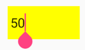

# Colors in Xamarin Numeric Entry (SfNumericTextBox)

You can customize [`SfNumericTextBox`](https://help.syncfusion.com/cr/xamarin/Syncfusion.SfNumericTextBox.XForms.SfNumericTextBox.html) control's background, text and border colors via the following bindable properties:

* [`TextColor`](https://help.syncfusion.com/cr/xamarin/Syncfusion.SfNumericTextBox.XForms.SfNumericTextBox.html#Syncfusion_SfNumericTextBox_XForms_SfNumericTextBox_TextColor) - Sets the color of the NumericTextBox's value.

* `BackgroundColor` - Sets the background color of NumericTextBox's frame.

* [`BorderColor`](https://help.syncfusion.com/cr/xamarin/Syncfusion.SfNumericTextBox.XForms.SfNumericTextBox.html#Syncfusion_SfNumericTextBox_XForms_SfNumericTextBox_BorderColor) - Sets the border color of NumericTextBox.

* [`WatermarkColor`](https://help.syncfusion.com/cr/xamarin/Syncfusion.SfNumericTextBox.XForms.SfNumericTextBox.html#Syncfusion_SfNumericTextBox_XForms_SfNumericTextBox_WatermarkColor) - Sets the color of NumericTextBox's watermark text.

## Text color support in SfNumericTextBox

To set the [`TextColor`](https://help.syncfusion.com/cr/xamarin/Syncfusion.SfNumericTextBox.XForms.SfNumericTextBox.html#Syncfusion_SfNumericTextBox_XForms_SfNumericTextBox_TextColor) color in XAML as well as in C#.





	<syncfusion:SfNumericTextBox Value="123" TextColor="Green" />
	




SfNumericTextBox numericTextBox=new SfNumericTextBox();
numericTextBox.TextColor = Color.Green;
numericTextBox.Value = 123;
this.Content = numericTextBox;





## Background color support in SfNumericTextBox

To set the BackgroundColor color in XAML as well as in C#:





	<syncfusion:SfNumericTextBox Value="123" BackgroundColor="Maroon" TextColor="White"/>
	




SfNumericTextBox numericTextBox=new SfNumericTextBox();
numericTextBox.BackgroundColor = Color.Maroon;
numericTextBox.TextColor = Color.White;
numericTextBox.Value = 123;
this.Content = numericTextBox;





## Border color support in SfNumericTextBox

To set the [`BorderColor`](https://help.syncfusion.com/cr/xamarin/Syncfusion.SfNumericTextBox.XForms.SfNumericTextBox.html#Syncfusion_SfNumericTextBox_XForms_SfNumericTextBox_BorderColor) color in XAML as well as in C#:





	<syncfusion:SfNumericTextBox Value="123" BorderColor="Red" />
	




SfNumericTextBox numericTextBox=new SfNumericTextBox();
numericTextBox.BorderColor = Color.Red;
numericTextBox.Value = 123;
this.Content = numericTextBox;





## Watermark color support in SfNumericTextBox

To set the [`WatermarkColor`](https://help.syncfusion.com/cr/xamarin/Syncfusion.SfNumericTextBox.XForms.SfNumericTextBox.html#Syncfusion_SfNumericTextBox_XForms_SfNumericTextBox_WatermarkColor) color in XAML as well as in C#:





	<syncfusion:SfNumericTextBox AllowNull="true" WatermarkColor="Blue" Watermark="Enter value"/>
	




SfNumericTextBox numericTextBox=new SfNumericTextBox();
numericTextBox.AllowNull=true;
numericTextBox.WatermarkColor = Color.Blue;
numericTextBox.Watermark = "Enter value"
this.Content = numericTextBox;





## Restrict editing

You can restrict the dynamic editing of the numeric entry using the [`IsReadOnly`](https://help.syncfusion.com/cr/xamarin/Syncfusion.SfNumericTextBox.XForms.SfNumericTextBox.html#Syncfusion_SfNumericTextBox_XForms_SfNumericTextBox_IsReadOnly) property. But you can change the control text programmatically by using the bindable  [`Value`](https://help.syncfusion.com/cr/xamarin/Syncfusion.SfNumericTextBox.XForms.SfNumericTextBox.html#Syncfusion_SfNumericTextBox_XForms_SfNumericTextBox_Value) property of the numeric entry.
	
## Visual states

The [SfNumericTextBox](https://help.syncfusion.com/cr/xamarin/Syncfusion.SfNumericTextBox.XForms.html) has been customized based on the [VisualStates](https://docs.microsoft.com/en-us/xamarin/xamarin-forms/user-interface/visual-state-manager). 

The [SfNumericTextBox](https://help.syncfusion.com/cr/xamarin/Syncfusion.SfNumericTextBox.XForms.html) control has the following three basic visual states:

* Normal
* Focused
* Disabled

N> The focused visual state is only available in Android and iOS platforms.





    <StackLayout HorizontalOptions="Center" VerticalOptions="Center">
        <numeric:SfNumericTextBox  WidthRequest="100" Value="50">

        <VisualStateManager.VisualStateGroups>
            <VisualStateGroup x:Name="CommonStates">
                <VisualState x:Name="Normal">
                    <VisualState.Setters>
                        <Setter Property="BackgroundColor" Value="White" />
                    </VisualState.Setters>
                </VisualState>
                <VisualState x:Name="Disabled">
                    <VisualState.Setters>
                        <Setter Property="BackgroundColor" Value="DarkGray" />
                    </VisualState.Setters>
                </VisualState>
                <VisualState x:Name="Focused">
                    <VisualState.Setters>
                        <Setter Property="BackgroundColor" Value="Yellow" />
                    </VisualState.Setters>
                </VisualState>
            </VisualStateGroup>
        </VisualStateManager.VisualStateGroups>
	</numeric:SfNumericTextBox>
  </StackLayout>





            StackLayout stackLayout = new StackLayout
            {
                HorizontalOptions = LayoutOptions.Center,
                VerticalOptions = LayoutOptions.Center
            };
            SfNumericTextBox numericTextBox = new SfNumericTextBox
            {
                Value = 50,
                WidthRequest = 100
            };

            VisualStateGroupList visualStateGroupList = new VisualStateGroupList();

            VisualStateGroup commonStateGroup = new VisualStateGroup();
            VisualState normalState = new VisualState
            {
                Name = "Normal"
            };
            normalState.Setters.Add(new Setter { Property = SfNumericTextBox.BackgroundColorProperty, Value = Color.White });

            VisualState disabledState = new VisualState
            {
                Name = "Disabled"
            };
            disabledState.Setters.Add(new Setter { Property = SfNumericTextBox.BackgroundColorProperty, Value = Color.DarkGray });

            VisualState fousedState = new VisualState
            {
                Name = "Focused"
            };
            fousedState.Setters.Add(new Setter { Property = SfNumericTextBox.BackgroundColorProperty, Value = Color.Yellow });

            commonStateGroup.States.Add(normalState);
            commonStateGroup.States.Add(disabledState);
            commonStateGroup.States.Add(fousedState);
            visualStateGroupList.Add(commonStateGroup);
            VisualStateManager.SetVisualStateGroups(numericTextBox, visualStateGroupList);

            stackLayout.Children.Add(numericTextBox);
            this.Content = stackLayout;
			




**Normal visual state**

**Disabled visual state**

**Focused visual state**

## See also

[How to customize the border of SfNumericTextBox](https://support.syncfusion.com/kb/article/6848/how-to-custom-the-border-of-numerictextbox)

[How to customize the color appearance of SfNumericTextBox](https://www.syncfusion.com/kb/7586/how-to-customize-the-color-appearance-of-numeric-controls-in-xamarin-forms)
