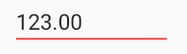

# Colors in Xamarin Numeric Entry (SfNumericTextBox)

SfNumericTextBox can be set to use a custom background,text and border colors via the following bindable properties:

* `TextColor` - sets the color of the NumericTextBox's value.

* `BackgroundColor` - sets the background color of NumericTextBox's frame.

* `BorderColor` - sets the border custom color of NumericTextBox

* `WatermarkColor` - sets the watermark custom color of NumericTextBox's watermark Text.

### TextColor

To set the TextColor color in XAML as well as in C#:





	<syncfusion:SfNumericTextBox x:Name="numericTextBox" Value="123" TextColor="Green" />
	




SfNumericTextBox numericTextBox=new SfNumericTextBox();
numericTextBox.TextColor = Color.Green;
numericTextBox.Value = 123;
this.Content = numericTextBox;





### BackgroundColor

To set the BackgroundColor color in XAML as well as in C#:





	<syncfusion:SfNumericTextBox x:Name="numericTextBox" Value="123" BackgroundColor="Maroon" TextColor="White"/>
	




SfNumericTextBox numericTextBox=new SfNumericTextBox();
numericTextBox.BackgroundColor = Color.Maroon;
numericTextBox.TextColor = Color.White;
numericTextBox.Value = 123;
this.Content = numericTextBox;





### BorderColor

To set the BorderColor color in XAML as well as in C#:





	<syncfusion:SfNumericTextBox x:Name="numericTextBox" Value="123" BorderColor="Red" />
	




SfNumericTextBox numericTextBox=new SfNumericTextBox();
numericTextBox.BorderColor = Color.Red;
numericTextBox.Value = 123;
this.Content = numericTextBox;





### WatermarkColor

To set the WatermarkColor color in XAML as well as in C#:





	<syncfusion:SfNumericTextBox  x:Name="numericTextBox" AllowNull="true" WatermarkColor="Blue" Watermark="Enter a Number"/>
	




SfNumericTextBox numericTextBox=new SfNumericTextBox();
numericTextBox.AllowNull=true;
numericTextBox.WatermarkColor = Color.Blue;
numericTextBox.Watermark = "Enter a Number"
this.Content = numericTextBox;





## See also

[How to customize the border of SfNumericTextBox](https://www.syncfusion.com/kb/7587/how-to-custom-the-border-of-numerictextbox)

[How to customize the color appearance of SfNumericTextBox](syncfusion.com/kb/7586/how-to-customize-the-color-appearance-of-numeric-controls-in-xamarin-forms)
