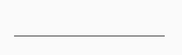
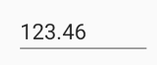
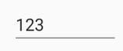
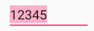

# Customization in Xamarin Numeric Entry (SfNumericTextBox)

## Assign nullable value in SfNumericTextBox

The null values can be set in [`SfNumericTextBox`](https://help.syncfusion.com/cr/xamarin/Syncfusion.SfNumericTextBox.XForms.SfNumericTextBox.html) [`Value`](https://help.syncfusion.com/cr/xamarin/Syncfusion.SfNumericTextBox.XForms.SfNumericTextBox.html#Syncfusion_SfNumericTextBox_XForms_SfNumericTextBox_Value) property, by setting [`AllowNull`](https://help.syncfusion.com/cr/xamarin/Syncfusion.SfNumericTextBox.XForms.SfNumericTextBox.html#Syncfusion_SfNumericTextBox_XForms_SfNumericTextBox_AllowNull) property value to true.

N> By default, the property value is false.





	<syncfusion:SfNumericTextBox AllowNull="true" />
	




SfNumericTextBox numericTextBox = new SfNumericTextBox();
numericTextBox.AllowNull=true;
this.Content = numericTextBox;





## Set hint text in SfNumericTextBox

The [`WaterMark`](https://help.syncfusion.com/cr/xamarin/Syncfusion.SfNumericTextBox.XForms.SfNumericTextBox.html#Syncfusion_SfNumericTextBox_XForms_SfNumericTextBox_Watermark) property can be used to provide a hint that helps the user to get started with their input. The watermark text is visible when value is empty or null.





	<syncfusion:SfNumericTextBox  AllowNull = "true"  Watermark="Enter value" />
	




SfNumericTextBox  numericTextBox=new SfNumericTextBox();
numericTextBox.Watermark = "Enter value";
numericTextBox.AllowNull = true;
this.Content=numericTextBox;
	




For customizing the color of [`SfNumericTextBox`](https://help.syncfusion.com/cr/xamarin/Syncfusion.SfNumericTextBox.XForms.SfNumericTextBox.html) [`WaterMark`](https://help.syncfusion.com/cr/xamarin/Syncfusion.SfNumericTextBox.XForms.SfNumericTextBox.html#Syncfusion_SfNumericTextBox_XForms_SfNumericTextBox_Watermark) [refer](https://help.syncfusion.com/xamarin/sfnumerictextbox/colors)

## Parsing the value in SfNumericTextBox

Value of the [`SfNumericTextBox`](https://help.syncfusion.com/cr/xamarin/Syncfusion.SfNumericTextBox.XForms.SfNumericTextBox.html) gets parsed based on [`ParserMode`](https://help.syncfusion.com/cr/xamarin/Syncfusion.SfNumericTextBox.XForms.SfNumericTextBox.html#Syncfusion_SfNumericTextBox_XForms_SfNumericTextBox_ParserMode) property. ParsingMode is of type Parsers which is enum of [`Double`](https://help.syncfusion.com/cr/xamarin/Syncfusion.SfNumericTextBox.XForms.Parsers.html#Syncfusion_SfNumericTextBox_XForms_Parsers_Double) and [`Decimal`](https://help.syncfusion.com/cr/xamarin/Syncfusion.SfNumericTextBox.XForms.Parsers.html#Syncfusion_SfNumericTextBox_XForms_Parsers_Decimal). Hence we have option to display the value in double or decimal. 

Following code shows the Double parsing mode which can be set through ParserMode property.





	<syncfusion:SfNumericTextBox Value="123.45" ParserMode="Double" />
	




SfNumericTextBox numericTextBox=new SfNumericTextBox();
numericTextBox.ParserMode=Parsers.Double;
numericTextBox.Value = 123.45;
this.Content = numericTextBox;
	




N>The default value for [`ParserMode`](https://help.syncfusion.com/cr/xamarin/Syncfusion.SfNumericTextBox.XForms.SfNumericTextBox.html#Syncfusion_SfNumericTextBox_XForms_SfNumericTextBox_ParserMode) is [`Decimal`](https://help.syncfusion.com/cr/xamarin/Syncfusion.SfNumericTextBox.XForms.Parsers.html#Syncfusion_SfNumericTextBox_XForms_Parsers_Decimal).

## Range support in SfNumericTextBox

Restrict the values within a specific range by setting the [`Maximum`](https://help.syncfusion.com/cr/xamarin/Syncfusion.SfNumericTextBox.XForms.SfNumericTextBox.html#Syncfusion_SfNumericTextBox_XForms_SfNumericTextBox_Maximum) and [`Minimum`](https://help.syncfusion.com/cr/xamarin/Syncfusion.SfNumericTextBox.XForms.SfNumericTextBox.html#Syncfusion_SfNumericTextBox_XForms_SfNumericTextBox_Minimum) property values.





	   <syncfusion:SfNumericTextBox Maximum="1000" Minimum="50" Value="10"/>
	

	

	
        SfNumericTextBox numericTextBox = new SfNumericTextBox();
        numericTextBox.Minimum = 50;
        numericTextBox.Maximum = 1000;
        numericTextBox.Value = 10;
        this.Content = numericTextBox;
			




N> Default Value of  [`Maximum`](https://help.syncfusion.com/cr/xamarin/Syncfusion.SfNumericTextBox.XForms.SfNumericTextBox.html#Syncfusion_SfNumericTextBox_XForms_SfNumericTextBox_Maximum) and [`Minimum`](https://help.syncfusion.com/cr/xamarin/Syncfusion.SfNumericTextBox.XForms.SfNumericTextBox.html#Syncfusion_SfNumericTextBox_XForms_SfNumericTextBox_Minimum) is "null".

## Set maximum number of decimal digits in SfNumericTextBox

The maximum number of digits to be displayed after the decimal point can be specified by using [`MaximumNumberDecimalDigits`](https://help.syncfusion.com/cr/xamarin/Syncfusion.SfNumericTextBox.XForms.SfNumericTextBox.html#Syncfusion_SfNumericTextBox_XForms_SfNumericTextBox_MaximumNumberDecimalDigits) property. 

N> The [[`MaximumNumberDecimalDigits`]([`MaximumNumberDecimalDigits`](https://help.syncfusion.com/cr/xamarin/Syncfusion.SfNumericTextBox.XForms.SfNumericTextBox.html#Syncfusion_SfNumericTextBox_XForms_SfNumericTextBox_MaximumNumberDecimalDigits)) property can be provided with positive value only.





	<syncfusion:SfNumericTextBox Value="123.459" MaximumNumberDecimalDigits="2" />
	




SfNumericTextBox numericTextBox=new SfNumericTextBox();
numericTextBox.Value = 123.459;
numericTextBox.MaximumNumberDecimalDigits=2;
this.Content = numericTextBox;
  




## Remove Default Decimal Digits in SfNumericTextBox

Based on the [`MaximumNumberDecimalDigits`](https://help.syncfusion.com/cr/xamarin/Syncfusion.SfNumericTextBox.XForms.SfNumericTextBox.html#Syncfusion_SfNumericTextBox_XForms_SfNumericTextBox_MaximumNumberDecimalDigits) property, the default number of decimal digits is displayed. By disabling the [`AllowDefaultDecimalDigits`](https://help.syncfusion.com/cr/xamarin/Syncfusion.SfNumericTextBox.XForms.SfNumericTextBox.html#Syncfusion_SfNumericTextBox_XForms_SfNumericTextBox_AllowDefaultDecimalDigits) Boolean property, those default digits can be removed from the numeric entry view.





	<syncfusion:SfNumericTextBox x:Name="numericTextBox" Value="123" AllowDefaultDecimalDigits="False" MaximumNumberDecimalDigits="2" />
	




            SfNumericTextBox numericTextBox = new SfNumericTextBox();
            numericTextBox.Value = 123;
            numericTextBox.MaximumNumberDecimalDigits = 2;
            numericTextBox.AllowDefaultDecimalDigits = false;
            this.Content = numericTextBox;
  




## Selection support in SfNumericTextBox

[`SelectAllOnFocus`](https://help.syncfusion.com/cr/xamarin/Syncfusion.SfNumericTextBox.XForms.SfNumericTextBox.html#Syncfusion_SfNumericTextBox_XForms_SfNumericTextBox_SelectAllOnFocus) the property is used to specify whether the text should be selected when the control gets focus.





       <numeric:SfNumericTextBox SelectAllOnFocus="True" Value="12345"/>
	



 
SfNumericTextBox numericTextBox=new SfNumericTextBox();
numericTextBox.Value=12345;
numericTextBox.SelectAllOnFocus = true;
this.Content = numericTextBox;





## See also

[How to set the MaximumDecimalDigits in SfNumericTextBox](https://www.syncfusion.com/kb/7593/how-to-set-the-maximumdecimaldigits-in-numerictextbox)

[How to have null values in SfNumericTextBox](https://www.syncfusion.com/kb/7594/how-to-have-null-values-in-numerictextbox)

[How to provide null value to SfNumericTextBox](https://www.syncfusion.com/kb/7061/how-to-provide-null-value-to-numerictextbox)

[How to change the SfNumericTextBox style using its visual states]( https://www.syncfusion.com/kb/11785/how-to-change-the-xamarin-forms-numeric-textbox-style-using-its-visual-states)

[How to define and apply a common style for SfNumericTextBox]( https://www.syncfusion.com/kb/11670/how-to-define-and-apply-a-common-style-for-sfnumerictextbox-in-xamarin-forms)

