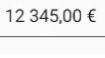

# Localization in Xamarin Numeric Entry (SfNumericTextBox)

The SfNumericTextBox value can be localized to any specific culture. It can be specified by setting the `Culture` property with `System.Globalization.CultureInfo` object instance.




 
SfNumericTextBox numericTextBox=new SfNumericTextBox();
numericTextBox.Value=123.45;
numericTextBox.Culture = new System.Globalization.CultureInfo("fr-FR");
this.Content = numericTextBox;





## Change Localization of Return key text

The SfNumericTextBox provides the Localization support for the Return Key in soft keypad of iOS. We have provided the knowledge base document for the same. Please refer the Knowledge Base document from this [link.](https://www.syncfusion.com/kb/8075/how-to-localize-the-return-buttons-text-in-sfnumerictextbox-in-xforms-ios)

## See also

[How to change the culture of SfNumericTextBox](https://www.syncfusion.com/kb/7589/how-to-change-the-culture-of-numerictextbox)

[How to get the localized return key on the iOS keyboard in Xamarin.Forms numeric controls](https://www.syncfusion.com/kb/11630/how-to-get-the-localized-return-key-on-the-ios-keyboard-in-xamarin-forms-numeric-controls)

