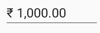
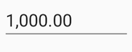
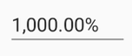
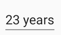
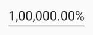

# Number Formatting in Xamarin Numeric Entry (SfNumericTextBox)

The Values of the SfNumericTextBox can be configured to display different formats like currency format, percent format etc. 

## Format String

The `FormatString` property determines the format specifier by which the display text has to be formatted. 

N> The control displays the formatted text on lost focus. Default Value of `FormatString` is "n".

### Display Currency Notation

`c` - Displays the value with currency notation.
	
	



	<syncfusion:SfNumericTextBox x:Name="numericTextBox" Value="1000" FormatString="c" />
	

	


SfNumericTextBox numericTextBox=new SfNumericTextBox();
numericTextBox.FormatString="c";
numericTextBox.Value=1000;
this.content=numericTextBox;




	

### Display Number Notation

`n` – Displays the value in number format.





	<syncfusion:SfNumericTextBox x:Name="numericTextBox" Value="1000" FormatString="n" />
	

	

	
SfNumericTextBox numericTextBox=new SfNumericTextBox();
numericTextBox.FormatString="n";
numericTextBox.Value=1000;
this.content=numericTextBox;
	 




### Display Percentage Notation

`p` – Displays the value in percentage.
	
	



	<syncfusion:SfNumericTextBox x:Name="numericTextBox" Value="1000" FormatString="p" />
	

	


SfNumericTextBox numericTextBox=new SfNumericTextBox();
numericTextBox.FormatString="p";
numericTextBox.Value=1000;
this.content=numericTextBox;
	 



	

N> Instead of using above `FormatString` types, we can provide any symbol or value as string in `FormatString` property which will be appended with the value in SfNumericTextBox. 

By passing any string , we can get the same as appended with the value of NumericTextBox

	



	<syncfusion:SfNumericTextBox x:Name="numericTextBox" Value="1000" FormatString="years" />
	

	


SfNumericTextBox numericTextBox=new SfNumericTextBox();
numericTextBox.FormatString="years";
numericTextBox.Value=23;
this.content=numericTextBox;
	 




## Compute to Percentage

When the NumericTextBox is in percentage format, the value can be displayed in two ways as follows

* `Value`: Displays the actual value with percentage symbol.





	<syncfusion:SfNumericTextBox x:Name="numericTextBox" FormatString="p" Value="1000"  PercentDisplayMode="Value" />
	




SfNumericTextBox numericTextBox=new SfNumericTextBox();
numericTextBox.PercentDisplayMode=PercentDisplayMode.Value;
numericTextBox.FormatString="p";
numericTextBox.Value=1000;
this.content=numericTextBox;





* `Compute`: Displays the computed value with percentage symbol.





	<syncfusion:SfNumericTextBox x:Name="numericTextBox" FormatString="p" Value="1000"  PercentDisplayMode="Compute" />
	




SfNumericTextBox numericTextBox=new SfNumericTextBox();
numericTextBox.PercentDisplayMode=PercentDisplayMode.Compute;
numericTextBox.FormatString="p";
numericTextBox.Value=1000;
this.content=numericTextBox;





## Set EnableGroupSeparator 

`EnableGroupSeparator` property is used to get rid of the comma in the Value of SfNumericTextBox.




 
SfNumericTextBox numericTextBox=new SfNumericTextBox();
numericTextBox.Value=12345;
numericTextBox.EnableGroupSeparator = true;
this.Content = numericTextBox;





## See also

[How to truncate the trailing zero's in SfNumericTextBox]( https://www.syncfusion.com/kb/11749/how-to-truncate-the-trailing-zeros-in-xamarin-forms-numeric-control-sfnumerictextbox)

[How to set customized currency symbol in SfNumericTextBox](https://www.syncfusion.com/kb/10445/how-to-set-customized-currency-symbol-in-xamarin-forms-numeric-controls)

[How to display the value with currency symbol in SfNumericTextBox](https://www.syncfusion.com/kb/10443/how-to-display-the-value-with-currency-symbol-in-xamarin-forms-numeric-controls)

