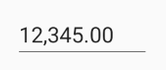
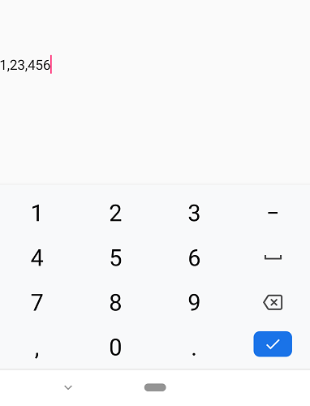

# Number Formatting in Xamarin Numeric Entry (SfNumericTextBox)

The values of the [`SfNumericTextBox`](https://help.syncfusion.com/cr/xamarin/Syncfusion.SfNumericTextBox.XForms.SfNumericTextBox.html) can be configured to display different formats like currency format, percent format etc. 

## Format string in SfNumericTextBox

The [`FormatString`](https://help.syncfusion.com/cr/xamarin/Syncfusion.SfNumericTextBox.XForms.SfNumericTextBox.html#Syncfusion_SfNumericTextBox_XForms_SfNumericTextBox_FormatString) property determines the format specifier by which the display text has to be formatted. 

N> The control displays the formatted text on lost focus. Default Value of [`FormatString`](https://help.syncfusion.com/cr/xamarin/Syncfusion.SfNumericTextBox.XForms.SfNumericTextBox.html#Syncfusion_SfNumericTextBox_XForms_SfNumericTextBox_FormatString) is "n".

### Display currency notation in SfNumericTextBox

`c` - Displays the value with currency notation.
	
	



	<syncfusion:SfNumericTextBox Value="1000" FormatString="c" />
	

	


SfNumericTextBox numericTextBox=new SfNumericTextBox();
numericTextBox.FormatString="c";
numericTextBox.Value=1000;
this.Content=numericTextBox;




	

### Display number notation in SfNumericTextBox

`n` – Displays the value in number format.





	<syncfusion:SfNumericTextBox Value="1000" FormatString="n" />
	

	

	
SfNumericTextBox numericTextBox=new SfNumericTextBox();
numericTextBox.FormatString="n";
numericTextBox.Value=1000;
this.Content=numericTextBox;
	 




### Display percentage notation in SfNumericTextBox

`p` – Displays the value in percentage.
	
	



	<syncfusion:SfNumericTextBox  Value="1000" FormatString="p" />
	

	


SfNumericTextBox numericTextBox=new SfNumericTextBox();
numericTextBox.FormatString="p";
numericTextBox.Value=1000;
this.Content=numericTextBox;
	 



	

N> Instead of using above [`FormatString`](https://help.syncfusion.com/cr/xamarin/Syncfusion.SfNumericTextBox.XForms.SfNumericTextBox.html#Syncfusion_SfNumericTextBox_XForms_SfNumericTextBox_FormatString) types, we can provide any symbol or value as string in FormatString property which will be appended with the value in [`SfNumericTextBox`](https://help.syncfusion.com/cr/xamarin/Syncfusion.SfNumericTextBox.XForms.SfNumericTextBox.html). 

By passing any string , we can get the same as appended with the value of [`SfNumericTextBox`](https://help.syncfusion.com/cr/xamarin/Syncfusion.SfNumericTextBox.XForms.SfNumericTextBox.html).

	



	<syncfusion:SfNumericTextBox Value="23" FormatString="years" MaximumNumberDecimalDigits="0"/>
	

	


SfNumericTextBox numericTextBox = new SfNumericTextBox();
numericTextBox.FormatString = "years";
numericTextBox.MaximumNumberDecimalDigits = 0;
numericTextBox.Value = 23;
this.Content = numericTextBox;
	 




## Compute to percentage in SfNumericTextBox

When the [`SfNumericTextBox`](https://help.syncfusion.com/cr/xamarin/Syncfusion.SfNumericTextBox.XForms.SfNumericTextBox.html) is in percentage format, the value can be displayed in two ways as follows

* [`Value`](https://help.syncfusion.com/cr/xamarin/Syncfusion.SfNumericTextBox.XForms.PercentDisplayMode.html#Syncfusion_SfNumericTextBox_XForms_PercentDisplayMode_Value): Displays the actual value with percentage symbol.





	<syncfusion:SfNumericTextBox FormatString="p" Value="1000"  PercentDisplayMode="Value" />
	




SfNumericTextBox numericTextBox=new SfNumericTextBox();
numericTextBox.PercentDisplayMode=PercentDisplayMode.Value;
numericTextBox.FormatString="p";
numericTextBox.Value=1000;
this.content=numericTextBox;





* [`Compute`](https://help.syncfusion.com/cr/xamarin/Syncfusion.SfNumericTextBox.XForms.PercentDisplayMode.html#Syncfusion_SfNumericTextBox_XForms_PercentDisplayMode_Compute): Displays the computed value with percentage symbol.





	<syncfusion:SfNumericTextBox FormatString="p" Value="1000"  PercentDisplayMode="Compute" />
	




SfNumericTextBox numericTextBox=new SfNumericTextBox();
numericTextBox.PercentDisplayMode=PercentDisplayMode.Compute;
numericTextBox.FormatString="p";
numericTextBox.Value=1000;
this.Content=numericTextBox;





## Enable group separator in SfNumericTextBox 

[`EnableGroupSeparator`](https://help.syncfusion.com/cr/xamarin/Syncfusion.SfNumericTextBox.XForms.SfNumericTextBox.html#Syncfusion_SfNumericTextBox_XForms_SfNumericTextBox_EnableGroupSeparator) property is used to get rid of the comma in the value of [`SfNumericTextBox`](https://help.syncfusion.com/cr/xamarin/Syncfusion.SfNumericTextBox.XForms.SfNumericTextBox.html).





	<syncfusion:SfNumericTextBox Value="12345" EnableGroupSeparator="True" />
	



 
SfNumericTextBox numericTextBox=new SfNumericTextBox();
numericTextBox.Value=12345;
numericTextBox.EnableGroupSeparator = true;
this.Content = numericTextBox;





## Group separator modes in SfNumericTextBox

[`GroupSeparatorMode`](https://help.syncfusion.com/cr/xamarin/Syncfusion.SfNumericTextBox.XForms.SfNumericTextBox.html#Syncfusion_SfNumericTextBox_XForms_SfNumericTextBox_GroupSeparatorMode) provides 2 states to display the group separator. 

When the mode is set as [`Always`](https://help.syncfusion.com/cr/xamarin/Syncfusion.SfNumericTextBox.XForms.GroupSeparatorMode.html#Syncfusion_SfNumericTextBox_XForms_GroupSeparatorMode_Always), it will display separator while typing itself on the other hand when the mode is set as [`LostFocus`](https://help.syncfusion.com/cr/xamarin/Syncfusion.SfNumericTextBox.XForms.GroupSeparatorMode.html#Syncfusion_SfNumericTextBox_XForms_GroupSeparatorMode_LostFocus) it will enable the separator when the control lost its focus.

N> [`EnableGroupSeparator`](https://help.syncfusion.com/cr/xamarin/Syncfusion.SfNumericTextBox.XForms.SfNumericTextBox.html#Syncfusion_SfNumericTextBox_XForms_SfNumericTextBox_EnableGroupSeparator) property must be enabled to use the [`GroupSeparatorMode`](https://help.syncfusion.com/cr/xamarin/Syncfusion.SfNumericTextBox.XForms.SfNumericTextBox.html#Syncfusion_SfNumericTextBox_XForms_SfNumericTextBox_GroupSeparatorMode).




 
   <numeric:SfNumericTextBox Value="123456" FormatString="n" GroupSeparatorMode="Always" EnableGroupSeparator="True"/>





      SfNumericTextBox numericTextBox = new SfNumericTextBox();
            numericTextBox.Value = 123456;
            numericTextBox.FormatString = "n";
            numericTextBox.GroupSeparatorMode = GroupSeparatorMode.Always;
            numericTextBox.EnableGroupSeparator = true;
            this.Content = numericTextBox;





## See also

[How to truncate the trailing zero's in SfNumericTextBox]( https://www.syncfusion.com/kb/11749/how-to-truncate-the-trailing-zeros-in-xamarin-forms-numeric-control-sfnumerictextbox)

[How to set customized currency symbol in SfNumericTextBox](https://www.syncfusion.com/kb/10445/how-to-set-customized-currency-symbol-in-xamarin-forms-numeric-controls)

[How to display the value with currency symbol in SfNumericTextBox](https://www.syncfusion.com/kb/10443/how-to-display-the-value-with-currency-symbol-in-xamarin-forms-numeric-controls)

