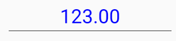

# Xamarin Numeric Entry (SfNumericTextBox) Overview

The Essential Xamarin.Forms NumericTextBox is an advanced version of the Entry control that restricts input to numeric values.

Also provides, a gesture friendly UI culture and can be configured to display different formats like currency format, scientific format etc.

## Key Features

* `FormatString` - Input string can be formatted by using the format strings.

* `Culture` - Number format can be localized to any specific culture.

* `AllowNull` - Allows the user to set null value.

* `ParserMode` - Value gets parsed based on parser mode.

