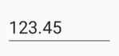

# Parsing the Value

Value of the SfNumericTextBox gets parsed based on `ParserMode` property. ParsingMode is of type Parsers which is enum of Double and Decimal. Hence we have option to display the value in double or decimal. 

Following code shows the `Double` parsing mode which can be set through `ParserMode` property.





	<syncfusion:SfNumericTextBox x:Name="numericTextBox" Value="123.45" ParserMode="Double" />
	




SfNumericTextBox numericTextBox=new SfNumericTextBox();
numericTextBox.ParserMode=Parsers.Double;
numericTextBox.Value = 123.45;
this.Content = numericTextBox;
	




N>The default Value for `ParserMode` is Decimal.

