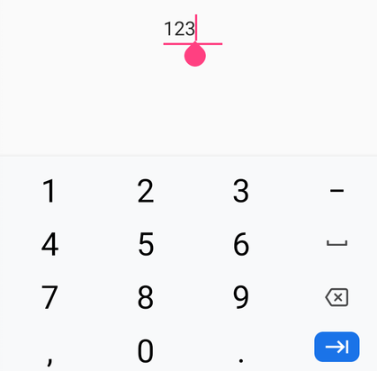

# Return Type in Xamarin Numeric Entry (SfNumericTextBox)

You can specify the return key type of the [`SfNumericTextBox`](https://help.syncfusion.com/cr/xamarin/Syncfusion.SfNumericTextBox.XForms.SfNumericTextBox.html) by using the [`ReturnType`](https://help.syncfusion.com/cr/xamarin/Syncfusion.SfNumericTextBox.XForms.SfNumericTextBox.html#Syncfusion_SfNumericTextBox_XForms_SfNumericTextBox_ReturnType) property of type [Xamarin.Forms ReturnType](https://learn.microsoft.com/en-us/dotnet/api/xamarin.forms.entry.returntype?view=xamarin-forms).





<syncfusion:SfNumericTextBox ReturnType= "Next" Value="123" />
	




SfNumericTextBox numericTextBox = new SfNumericTextBox();
numericTextBox.ReturnType = ReturnType.Next;
numericTextBox.Value = 123;





N> Default value of ReturnType is `Default`.

## Return Command

The [`ReturnCommand`](https://help.syncfusion.com/cr/xamarin/Syncfusion.SfNumericTextBox.XForms.SfNumericTextBox.html#Syncfusion_SfNumericTextBox_XForms_SfNumericTextBox_ReturnCommand) property allows you to define an [`ICommand`](https://learn.microsoft.com/en-us/dotnet/api/system.windows.input.icommand?view=netframework-4.8) implementation that executes an action when the user presses the return button.

## Return Command Parameter

The [`ReturnCommandParameter`](https://help.syncfusion.com/cr/xamarin/Syncfusion.SfNumericTextBox.XForms.SfNumericTextBox.html#Syncfusion_SfNumericTextBox_XForms_SfNumericTextBox_ReturnCommandParameter) property is used to set the parameter that is passed to the [`ReturnCommand`](https://help.syncfusion.com/cr/xamarin/Syncfusion.SfNumericTextBox.XForms.SfNumericTextBox.html#Syncfusion_SfNumericTextBox_XForms_SfNumericTextBox_ReturnCommand).





  <ContentPage.BindingContext>
    <local:ViewModel />
 </ContentPage.BindingContext>

	<syncfusion:SfNumericTextBox x:Name="NumericTextBox"
                             ReturnType="Next"
                             Value="123"
                             ReturnCommand="{Binding CommandProperty}"
                             ReturnCommandParameter="{x:Reference NumericTextBox}"/>
                             	




  public class ViewModel : INotifyPropertyChanged
    {
        public event PropertyChangedEventHandler PropertyChanged = delegate { };
        public ICommand CommandProperty { protected set; get; }
        public ViewModel()
        {
            CommandProperty = new Command(ReturnButtonClicked);
        }
        
        private void ReturnButtonClicked(object obj)
        {
            var numericTextBox = obj as SfNumericTextBox;
        }
    }





## See Also

[How to get the localized return key on the iOS keyboard in SfNumericTextBox](https://support.syncfusion.com/kb/article/10234/how-to-get-the-localized-return-key-on-the-ios-keyboard-in-xamarin-forms-numeric-controls)
