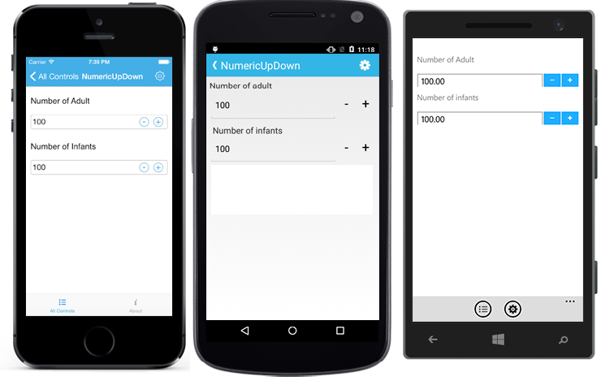
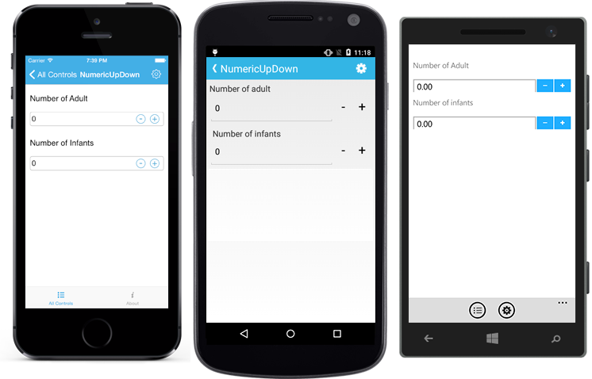

# Auto Reverse in Xamarin NumericUpDown (SfNumericUpDown)

While incrementing, the control will start from Minimum value once it reaches the Maximum value and vice-versa.

N> By default the property value is false.





SfNumericUpDown numericUpDown=new SfNumericUpDown();
numericUpDown.AutoReverse = true;





	<numeric:SfNumericUpDown x:Name="numericUpDown" AutoReverse="true"/>
	




## Continuous Spinning Between Ranges

User can restrict the Values between a specific range by setting `Maximum` and `Minimum` property value.

N> By default, the value of minimum property is Double.MinValue and the value of maximum property is Double.MaxValue.
In iOS, if typed value is less than minimum value, the minimum value will be validated.





	<numeric:SfNumericUpDown x:Name="numericUpDown" Minimum="10" Maximum="100"/>
	




SfNumericUpDown numericUpDown=new SfNumericUpDown();
numericUpDown.Minimum = 0;
numericUpDown.Maximum = 100;
this.Content = numericUpDown;





## Set Increment

Frequency in which values gets incremented can be decided using `StepValue` property.

N> By default the property value is 1.





	<numeric:SfNumericUpDown x:Name="numericUpDown" StepValue="6"/>
	




SfNumericUpDown numericUpDown=new SfNumericUpDown();
numericUpDown.StepValue = 6;
this.Content = numericUpDown;





## Set IsEditable

This property is used to decide whether users need to perform edit operation in input field.

N> By default, the value of IsEditable property is true.




	<numeric:SfNumericUpDown Value="123"  IsEditable="True"/>
	




SfNumericUpDown numericUpDown=new SfNumericUpDown();
numericUpDown.IsEditable = true;





## See also

[How to restrict the values of SfNumericUpDown within certain range](https://www.syncfusion.com/kb/7687/how-to-restrict-the-values-of-sfnumericupdown-within-certain-range)

[How to set AutoReverse property in SfNumericUpDown](https://www.syncfusion.com/kb/7686/how-to-set-autoreverse-property-in-sfnumericupdown)