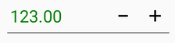
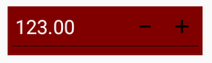
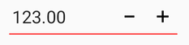
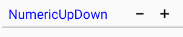

# Colors in Xamarin NumericUpDown (SfNumericUpDown)

[`SfNumericUpDown`](https://help.syncfusion.com/cr/xamarin/Syncfusion.SfNumericUpDown.XForms.SfNumericUpDown.html) is used to set custom background, text, and border colors through the following bindable properties:

* [`TextColor`](https://help.syncfusion.com/cr/xamarin/Syncfusion.SfNumericUpDown.XForms.SfNumericUpDown.html#Syncfusion_SfNumericUpDown_XForms_SfNumericUpDown_TextColor) - Sets the color of NumericUpDown's value

* `BackgroundColor` - Sets the background color of NumericUpDown.

* [`BorderColor`](https://help.syncfusion.com/cr/xamarin/Syncfusion.SfNumericUpDown.XForms.SfNumericUpDown.html#Syncfusion_SfNumericUpDown_XForms_SfNumericUpDown_BorderColor) - Sets the border custom color of NumericUpDown

* [`WatermarkColor`](https://help.syncfusion.com/cr/xamarin/Syncfusion.SfNumericUpDown.XForms.SfNumericUpDown.html#Syncfusion_SfNumericUpDown_XForms_SfNumericUpDown_WatermarkColor) - Sets the watermark custom color of NumericUpDown's watermark Text.

## Text color support in SfNumericUpDown

The following code sample demonstrates how to set the text color in XAML and in C#:





	<numeric:SfNumericUpDown Value="123" TextColor="Green" />
	




SfNumericUpDown NumericUpDown = new SfNumericUpDown();
NumericUpDown.TextColor = Color.Green;
NumericUpDown.Value = 123;
this.Content = NumericUpDown;





## Background color support in SfNumericUpDown

The following code sample demonstrates how to set the background color in XAML and in C#:





	<numeric:SfNumericUpDown Value="123" BackgroundColor="Maroon" TextColor="White"/>
	




SfNumericUpDown NumericUpDown = new SfNumericUpDown();
NumericUpDown.BackgroundColor = Color.Maroon;
NumericUpDown.TextColor = Color.White;
NumericUpDown.Value = 123;
this.Content = NumericUpDown;





## Border color support in SfNumericUpDown

The following code sample demonstrates how to set the border color color in XAML and in C#:





	<numeric:SfNumericUpDown Value="123" BorderColor="Red" />
	




SfNumericUpDown NumericUpDown=new SfNumericUpDown();
NumericUpDown.BorderColor = Color.Red;
NumericUpDown.Value = 123;
this.Content = NumericUpDown;





## Watermark color support in SfNumericUpDown

The following code sample demonstrates how to set the watermark color in XAML and in C#:





	<numeric:SfNumericUpDown AllowNull="true" Watermark="NumericUpDown" WatermarkColor="Blue" />
	




SfNumericUpDown NumericUpDown = new SfNumericUpDown();
NumericUpDown.WatermarkColor = Color.Blue;
NumericUpDown.Watermark = "NumericUpDown";
NumericUpDown.AllowNull = true;
this.Content = NumericUpDown;





## See also

[How to customize the color appearance of SfNumericUpDown](https://www.syncfusion.com/kb/11610/how-to-customize-the-color-appearance-of-numeric-controls-in-xamarin-forms)
