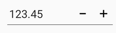
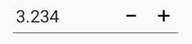
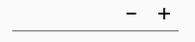
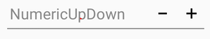
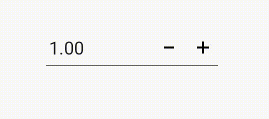
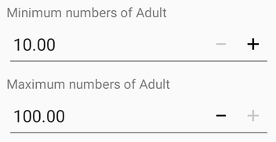
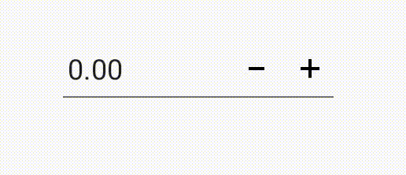
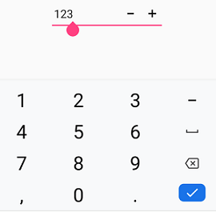
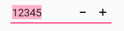

# Customization in Xamarin NumericUpDown (SfNumericUpDown)

## Parsing the value in SfNumericUpDown

The value of [`SfNumericUpDown`](https://help.syncfusion.com/cr/xamarin/Syncfusion.SfNumericUpDown.XForms.SfNumericUpDown.html) is parsed based on the [`ParsingMode`](https://help.syncfusion.com/cr/xamarin/Syncfusion.SfNumericUpDown.XForms.SfNumericUpDown.html#Syncfusion_SfNumericUpDown_XForms_SfNumericUpDown_ParsingMode) property. The parsing mode is an enum property with values of [`Double`](https://help.syncfusion.com/cr/xamarin/Syncfusion.SfNumericUpDown.XForms.ParsingMode.html#Syncfusion_SfNumericUpDown_XForms_ParsingMode_Double) and [`Decimal`](https://help.syncfusion.com/cr/xamarin/Syncfusion.SfNumericUpDown.XForms.ParsingMode.html#Syncfusion_SfNumericUpDown_XForms_ParsingMode_Decimal). You have options to update the value in double or decimal.

The following code demonstrates the decimal parsing mode, which can be set using the [`ParsingMode`](https://help.syncfusion.com/cr/xamarin/Syncfusion.SfNumericUpDown.XForms.SfNumericUpDown.html#Syncfusion_SfNumericUpDown_XForms_SfNumericUpDown_ParsingMode) property.





	<numeric:SfNumericUpDown Value="123.45" ParsingMode="Decimal" />
	




SfNumericUpDown NumericUpDown=new SfNumericUpDown();
NumericUpDown.ParsingMode=ParsingMode.Decimal;
NumericUpDown.Value = 123.45;
this.Content = NumericUpDown;
	




N> The default value of ParsingMode is Double.

## Set maximum number of decimal digits in SfNumericUpDown

The maximum number of digits to be displayed after the decimal point can be specified by using [`MaximumDecimalDigits `](https://help.syncfusion.com/cr/xamarin/Syncfusion.SfNumericUpDown.XForms.SfNumericUpDown.html#Syncfusion_SfNumericUpDown_XForms_SfNumericUpDown_MaximumDecimalDigits) property. 

N> The [`MaximumDecimalDigits`](https://help.syncfusion.com/cr/xamarin/Syncfusion.SfNumericUpDown.XForms.SfNumericUpDown.html#Syncfusion_SfNumericUpDown_XForms_SfNumericUpDown_MaximumDecimalDigits) property is provided with positive value only. By default, the value of this property is 2.





<numeric:SfNumericUpDown Value="3.234" MaximumDecimalDigits ="3"/>
		




SfNumericUpDown NumericUpDown = new SfNumericUpDown();
NumericUpDown.Value = 3.234;
NumericUpDown.MaximumDecimalDigits = 3;
this.Content = NumericUpDown;





## Assign nullable value in SfNumericUpDown

The null values can be set in [`SfNumericUpDown`](https://help.syncfusion.com/cr/xamarin/Syncfusion.SfNumericUpDown.XForms.SfNumericUpDown.html) [`Value`](https://help.syncfusion.com/cr/xamarin/Syncfusion.SfNumericUpDown.XForms.SfNumericUpDown.html#Syncfusion_SfNumericUpDown_XForms_SfNumericUpDown_Value) property, by setting [`AllowNull`](https://help.syncfusion.com/cr/xamarin/Syncfusion.SfNumericUpDown.XForms.SfNumericUpDown.html#Syncfusion_SfNumericUpDown_XForms_SfNumericUpDown_AllowNull) property value to true.

N> By default, the property value is false.





	<numeric:SfNumericUpDown  AllowNull="true"/>
	




SfNumericUpDown NumericUpDown = new SfNumericUpDown();
NumericUpDown.AllowNull = true;
this.Content = NumericUpDown;





## Set hint text in SfNumericUpDown

The [`WaterMark`](https://help.syncfusion.com/cr/xamarin/Syncfusion.SfNumericUpDown.XForms.SfNumericUpDown.html#Syncfusion_SfNumericUpDown_XForms_SfNumericUpDown_Watermark) property can be used to provide a hint that helps the user to get started with their input. The watermark text is visible when value is empty or null.





<numeric:SfNumericUpDown AllowNull="True" Watermark="NumericUpDown"/>	





SfNumericUpDown NumericUpDown = new SfNumericUpDown();
NumericUpDown.AllowNull = true;
NumericUpDown.Watermark = "NumericUpDown";
this.Content = NumericUpDown;
	




## Auto reverse in SfNumericUpDown

When incrementing, the control will begin at the [`Minimum`](https://help.syncfusion.com/cr/xamarin/Syncfusion.SfNumericUpDown.XForms.SfNumericUpDown.html#Syncfusion_SfNumericUpDown_XForms_SfNumericUpDown_Minimum) value and progress to the [`Maximum`](https://help.syncfusion.com/cr/xamarin/Syncfusion.SfNumericUpDown.XForms.SfNumericUpDown.html#Syncfusion_SfNumericUpDown_XForms_SfNumericUpDown_Maximum) value, and vice-versa.

N> By default the property value is false.





<numeric:SfNumericUpDown AutoReverse="true" Minimum="0" Maximum="20"/>
		




SfNumericUpDown NumericUpDown = new SfNumericUpDown();
NumericUpDown.AutoReverse = true;
NumericUpDown.Minimum =0;
NumericUpDown.Maximum = 20;
this.Content = NumericUpDown;





## Continuous spinning between ranges

Users can restrict the values to a specific range by setting the [`Maximum`](https://help.syncfusion.com/cr/xamarin/Syncfusion.SfNumericUpDown.XForms.SfNumericUpDown.html#Syncfusion_SfNumericUpDown_XForms_SfNumericUpDown_Maximum) and [`Minimum`](https://help.syncfusion.com/cr/xamarin/Syncfusion.SfNumericUpDown.XForms.SfNumericUpDown.html#Syncfusion_SfNumericUpDown_XForms_SfNumericUpDown_Minimum) property values.

N> By default, the value of minimum property is Double.MinValue and the value of maximum property is Double.MaxValue.
In iOS, if typed value is less than minimum value, the minimum value will be validated.





<StackLayout HorizontalOptions="Center" VerticalOptions="Center">
    <Label Text="Minimum numbers of Adult"/>
    <updown:SfNumericUpDown  Minimum="10" Maximum="100"/>
    
    <Label Text="Maximum numbers of Adult" />
    <updown:SfNumericUpDown Value="100" Minimum="10" Maximum="100"/>
</StackLayout>
	




StackLayout stack = new StackLayout();
Label label1 = new Label();
label1.Text = "Minimum numbers of Adult";
SfNumericUpDown updown1 = new SfNumericUpDown();
updown1.Minimum = 10;
updown1.Maximum = 100;

Label label2 = new Label();
label2.Text = "Minimum numbers of Adult";
SfNumericUpDown updown2 = new SfNumericUpDown();
updown2.Minimum = 10;
updown2.Maximum = 100;
updown2.Value = 100;

stack.Children.Add(label1);
stack.Children.Add(updown1);
stack.Children.Add(label2);
stack.Children.Add(updown2);
this.Content = stack;





## Step value support in SfNumericUpDown

The frequency with which values gets incremented and decremented can be decided using the [`StepValue`](https://help.syncfusion.com/cr/xamarin/Syncfusion.SfNumericUpDown.XForms.SfNumericUpDown.html#Syncfusion_SfNumericUpDown_XForms_SfNumericUpDown_StepValue) property.

N> By default the property value is 1.





	<numeric:SfNumericUpDown StepValue="6"/>
	




SfNumericUpDown numericUpDown=new SfNumericUpDown();
numericUpDown.StepValue = 6;
this.Content = numericUpDown;





## Set edit option in SfNumericUpDown

The [`IsEditable`](https://help.syncfusion.com/cr/xamarin/Syncfusion.SfNumericUpDown.XForms.SfNumericUpDown.html#Syncfusion_SfNumericUpDown_XForms_SfNumericUpDown_IsEditable) property is used to decide whether users need to perform edit operations in the input field.

N> By default, the value of [`IsEditable`](https://help.syncfusion.com/cr/xamarin/Syncfusion.SfNumericUpDown.XForms.SfNumericUpDown.html#Syncfusion_SfNumericUpDown_XForms_SfNumericUpDown_IsEditable) property is true.





	<numeric:SfNumericUpDown Value="123"  IsEditable="True"/>
	




SfNumericUpDown numericUpDown=new SfNumericUpDown();
numericUpDown.IsEditable = true;
this.Content = numericUpDown;





## Selection support in SfNumericUpDown

The [`SelectAllOnFocus`](https://help.syncfusion.com/cr/xamarin/Syncfusion.SfNumericUpDown.XForms.SfNumericUpDown.html#Syncfusion_SfNumericUpDown_XForms_SfNumericUpDown_SelectAllOnFocus) property is used to specify whether the text should be selected or not when the control gets the focus.





       <numeric:SfNumericUpDown SelectAllOnFocus="True" Value="12345"/>
	



 
SfNumericUpDown NumericUpDown=new SfNumericUpDown();
NumericUpDown.Value=12345;
NumericUpDown.SelectAllOnFocus = true;
this.Content = NumericUpDown;





## See also

[How to restrict the values of SfNumericUpDown within certain range](https://www.syncfusion.com/kb/7687/how-to-restrict-the-values-of-sfnumericupdown-within-certain-range)

[How to set AutoReverse property in SfNumericUpDown](https://www.syncfusion.com/kb/7686/how-to-set-autoreverse-property-in-sfnumericupdown)
