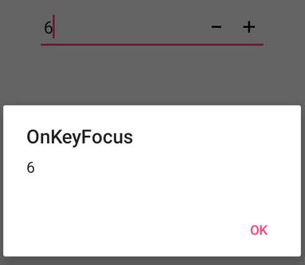
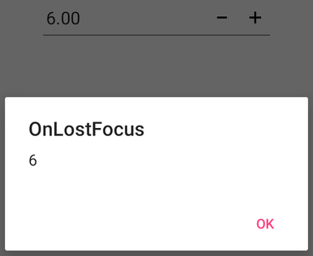

# Events in Xamarin NumericUpDown (SfNumericUpDown)

## Value Changed Event in SfNumericUpDown
 
You can perform operations whenever the value of [`SfNumericUpDown`](https://help.syncfusion.com/cr/xamarin/Syncfusion.SfNumericUpDown.XForms.SfNumericUpDown.html) changes, using the [`ValueChanged`](https://help.syncfusion.com/cr/xamarin/Syncfusion.SfNumericUpDown.XForms.SfNumericUpDown.html#Syncfusion_SfNumericUpDown_XForms_SfNumericUpDown_ValueChanged) event. This event returns the updated value in the control.

For example, you can restrict the NumericUpDown value from exceeding three digits using the following code:





        <syncfusion:SfNumericUpDown x:Name="NumericUpDown" ValueChangeMode="OnKeyFocus" ValueChanged="Handle_ValueChanged" Value="123"  />
    




SfNumericUpDown NumericUpDown=new SfNumericUpDown();
NumericUpDown.Value = 123;
NumericUpDown.ValueChangeMode = ValueChangeMode.OnKeyFocus;
NumericUpDown.ValueChanged += Handle_ValueChanged;
this.Content=NumericUpDown;

string updateValue = "";
void Handle_ValueChanged(object sender, Syncfusion.SfNumericUpDown.XForms.ValueEventArgs e)
{
    if (e.Value != null && e.Value.ToString().Length <= 3)
    {
        updateValue = e.Value.ToString();
    }
    else
    {
       NumericUpDown.Value = updateValue.ToString();
    }
}





### Interactivity: ValueChangeMode

The [`ValueChangeMode`](https://help.syncfusion.com/cr/xamarin/Syncfusion.SfNumericUpDown.XForms.SfNumericUpDown.html#Syncfusion_SfNumericUpDown_XForms_SfNumericUpDown_ValueChangeMode) property specifies when a value should be updated: either on keypress or when focus is lost. When `ValueChangeMode` is set to [`OnKeyFocus`](https://help.syncfusion.com/cr/xamarin/Syncfusion.SfNumericUpDown.XForms.ValueChangeMode.html#Syncfusion_SfNumericUpDown_XForms_ValueChangeMode_OnKeyFocus), the value updates with each keypress. When set to [`OnLostFocus`](https://help.syncfusion.com/cr/xamarin/Syncfusion.SfNumericUpDown.XForms.ValueChangeMode.html#Syncfusion_SfNumericUpDown_XForms_ValueChangeMode_OnLostFocus), the value updates when the control loses focus or moves to the next control.

1. [`OnKeyFocus`](https://help.syncfusion.com/cr/xamarin/Syncfusion.SfNumericUpDown.XForms.ValueChangeMode.html#Syncfusion_SfNumericUpDown_XForms_ValueChangeMode_OnKeyFocus)
2. [`OnLostFocus`](https://help.syncfusion.com/cr/xamarin/Syncfusion.SfNumericUpDown.XForms.ValueChangeMode.html#Syncfusion_SfNumericUpDown_XForms_ValueChangeMode_OnLostFocus)

#### OnKeyFocus





  <syncfusion:SfNumericUpDown ValueChanged="SfNumericUpDown_ValueChanged" ValueChangeMode="OnKeyFocus"/>
	




SfNumericUpDown NumericUpDown = new SfNumericUpDown();
NumericUpDown.ValueChanged += SfNumericUpDown_ValueChanged;
NumericUpDown.ValueChangeMode = ValueChangeMode.OnKeyFocus;
this.Content = NumericUpDown;

private void SfNumericUpDown_ValueChanged(object sender, ValueEventArgs e)
{
    DisplayAlert("OnKeyFocus", e.Value.ToString(), "OK");
}





#### OnLostFocus





  <syncfusion:SfNumericUpDown ValueChanged="SfNumericUpDown_ValueChanged" ValueChangeMode="OnLostFocus"/>
	




SfNumericUpDown NumericUpDown = new SfNumericUpDown();
NumericUpDown.ValueChanged += SfNumericUpDown_ValueChanged;
NumericUpDown.ValueChangeMode = ValueChangeMode.OnLostFocus;
this.Content = NumericUpDown;

private void SfNumericUpDown_ValueChanged(object sender, ValueEventArgs e)
{
    DisplayAlert("OnLostFocus", e.Value.ToString(), "OK");
}





## Completed Event in SfNumericUpDown
 
The [`Completed`](https://help.syncfusion.com/cr/xamarin/Syncfusion.SfNumericUpDown.XForms.SfNumericUpDown.html#Syncfusion_SfNumericUpDown_XForms_SfNumericUpDown_Completed) event occurs when users finalize the text in the `SfNumericUpDown` by pressing the return key (enter, ok) on the keyboard.





    <syncfusion:SfNumericUpDown Completed="Handle_Completed”/>
    




SfNumericUpDown NumericUpDown=new SfNumericUpDown();
NumericUpDown.Completed += Handle_Completed;
this.Content=NumericUpDown;

void Handle_Completed(object sender, System.EventArgs e)
{
  System.Diagnostics.Debug.WriteLine("Completed");     
}





## Focus Changed Event in SfNumericUpDown

The [`FocusChanged`](https://help.syncfusion.com/cr/xamarin/Syncfusion.SfNumericUpDown.XForms.SfNumericUpDown.html#Syncfusion_SfNumericUpDown_XForms_SfNumericUpDown_FocusChanged) event triggers when the control gains or loses focus.





 <syncfusion:SfNumericUpDown FocusChanged="SfNumericUpDown_FocusChanged"/>
		




SfNumericUpDown NumericUpDown = new SfNumericUpDown();
NumericUpDown.FocusChanged += SfNumericUpDown_FocusChanged;
this.Content = NumericUpDown;

void SfNumericUpDown_FocusChanged(object sender, Syncfusion.SfNumericUpDown.XForms.FocusEventArgs e)
{
    System.Diagnostics.Debug.WriteLine("FocusChanged");
}




