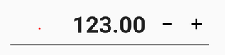

# Font Settings in Xamarin NumericUpDown (SfNumericUpDown)

You can customize the font style of [`SfNumericUpDown`](https://help.syncfusion.com/cr/xamarin/Syncfusion.SfNumericUpDown.XForms.SfNumericUpDown.html) using the following font-related properties that display the value's text:

* [`FontSize`](https://help.syncfusion.com/cr/xamarin/Syncfusion.SfNumericUpDown.XForms.SfNumericUpDown.html#Syncfusion_SfNumericUpDown_XForms_SfNumericUpDown_FontSize)  : Sets the font size for NumericUpDown’s text. 

* [`FontAttributes`](https://help.syncfusion.com/cr/xamarin/Syncfusion.SfNumericUpDown.XForms.SfNumericUpDown.html#Syncfusion_SfNumericUpDown_XForms_SfNumericUpDown_FontAttribute) : Sets the style of NumericUpDown’s text. You can add below types of styles to it.

    1. Bold: Sets the style of NumericUpDown’s text to bold.
    2. Italic: Sets the style of NumericUpDown’s text to italic.
	3. None: Keeps the style of NumericUpDown’s text as same. It will not modify the style.

N> The default value of this property is None.

* [`FontFamily`](https://help.syncfusion.com/cr/xamarin/Syncfusion.SfNumericUpDown.XForms.SfNumericUpDown.html#Syncfusion_SfNumericUpDown_XForms_SfNumericUpDown_FontFamily) : Customizes the font family of the NumericUpDown’s text.

* [`TextAlignment`](https://help.syncfusion.com/cr/xamarin/Syncfusion.SfNumericUpDown.XForms.SfNumericUpDown.html#Syncfusion_SfNumericUpDown_XForms_SfNumericUpDown_TextAlignment) : Customize the NumericUpDown’s text alignment position. You can align the text in Start, End and Center position.

N> The default value of this property is [`Start`].





	<numeric:SfNumericUpDown FontSize="27"  FontAttribute="Bold" Value="123" TextAlignment="End" />
	




SfNumericUpDown NumericUpDown=new SfNumericUpDown();
NumericUpDown.FontSize = 27;
NumericUpDown.Value = 123;
NumericUpDown.TextAlignment=TextAlignment.End;
NumericUpDown.FontAttribute = FontAttributes.Bold;
this.Content = NumericUpDown;





## See also

[How to customize the text in the SfNumericUpDown](https://www.syncfusion.com/kb/7672/how-to-customise-the-text-present-in-the-sfnumericupdown)
