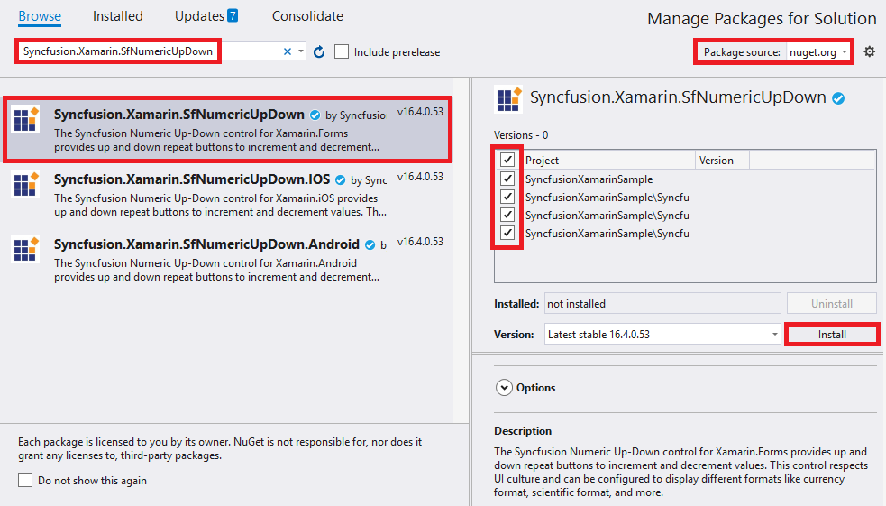

# Getting Started with Xamarin NumericUpDown (SfNumericUpDown)

This section provides overview for working with Essential SfNumericUpDown for Xamarin.Forms. You can walk through the entire process of creating a SfNumericUpDown.

## Adding SfNumericUpDown reference

You can add SfNumericUpDown reference using one of the following methods:

**Method 1: Adding SfNumericUpDown reference from nuget.org**

Syncfusion Xamarin components are available in [nuget.org](https://www.nuget.org/). To add SfNumericUpDown to your project, open the NuGet package manager in Visual Studio, search for [Syncfusion.Xamarin.SfNumericUpDown](https://www.nuget.org/packages/Syncfusion.Xamarin.SfNumericUpDown), and then install it.

N> Install the same version of SfNumericUpDown NuGet in all the projects.

**Method 2: Adding SfNumericUpDown reference from toolbox**

Syncfusion also provides Xamarin Toolbox. Using this toolbox, you can drag the SfNumericUpDown control to the XAML page. It will automatically install the required NuGet packages and add the namespace to the page. To install Syncfusion Xamarin Toolbox, refer to [Toolbox](https://help.syncfusion.com/xamarin/utility#toolbox).

**Method 3: Adding SfNumericUpDown assemblies manually from the installed location**

If you prefer to manually reference the assemblies instead referencing from NuGet, add the following assemblies in respective projects.

Location: {Installed location}/{version}/Xamarin/lib

<table>
<tr>
<td>PCL</td>
<td>Syncfusion.SfNumericUpDown.XForms.dll Syncfusion.Core.XForms.dll Syncfusion.Licensing.dll </td>
</tr>
<tr>
<td>Android</td>
<td>Syncfusion.SfNumericUpDown.XForms.Android.dll Syncfusion.SfNumericUpDown.XForms.dll Syncfusion.Core.XForms.dll Syncfusion.Core.XForms.Android.dll Syncfusion.Licensing.dll </td>
</tr>
<tr>
<td>iOS</td>
<td>Syncfusion.SfNumericUpDown.XForms.iOS.dll Syncfusion.SfNumericUpDown.XForms.dll Syncfusion.Core.XForms.dll Syncfusion.Core.XForms.iOS.dll Syncfusion.Licensing.dll </td>
</tr>
<tr>
<td>UWP</td>
<td>Syncfusion.SfInput.UWP.dll Syncfusion.SfShared.UWP.dll Syncfusion.SfNumericUpDown.XForms.UWP.dll Syncfusion.SfNumericUpDown.XForms.dll Syncfusion.Core.XForms.dll Syncfusion.Core.XForms.UWP.dll Syncfusion.Licensing.dll </td>
</tr>
</table>

N> To know more about obtaining our components, refer to these links for [Mac](https://help.syncfusion.com/xamarin/introduction/download-and-installation/mac/) and [Windows](https://help.syncfusion.com/xamarin/introduction/download-and-installation/windows/).

I> Starting with v16.2.0.x, if you reference Syncfusion assemblies from the trial setup or from the NuGet feed, you also have to include a license key in your projects. Please refer to [Syncfusion license key](https://help.syncfusion.com/common/essential-studio/licensing/license-key/) to know about registering Syncfusion license key in your Xamarin application to use our components.

## Launching the SfNumericUpDown on each platform

To use SfNumericUpDown inside an application, each platform application must initialize the SfNumericUpDown renderer. This initialization step varies from platform to platform and is discussed in the following sections.

N> If you are adding the references from toolbox, below steps are not needed.

### Android and  UWP

The Android and UWP launches the SfNumericUpDown without any initialization and is enough to only initialize the Xamarin.Forms Framework to launch the application.

### iOS

To launch SfNumericUpDown in iOS, need to create an instance of SfNumericUpDownRenderer in FinishedLaunching overridden method of AppDelegate class in iOS Project as shown below.





public override bool FinishedLaunching(UIApplication app, NSDictionary options)
{
	global::Xamarin.Forms.Forms.Init();

	SfNumericUpDownRenderer.Init();

	LoadApplication(new App());

	return base.FinishedLaunching(app, options);
   
}	





### ReleaseMode issue in UWP platform

There is a known Framework issue in UWP platform. The custom controls will not render when deployed the application in `Release Mode`.

The above problem can be resolved by initializing the SfNumericUpDown assemblies in `App.xaml.cs` in UWP project as like in below code snippet.



// In App.xaml.cs

protected override void OnLaunched(LaunchActivatedEventArgs e)
{
…

	rootFrame.NavigationFailed += OnNavigationFailed;
		
	// you'll need to add `using System.Reflection;`
	List<Assembly> assembliesToInclude = new List<Assembly>();

	//Now, add all the assemblies your app uses
	assembliesToInclude.Add(typeof(SfNumericUpDownRenderer).GetTypeInfo().Assembly);

	// replaces Xamarin.Forms.Forms.Init(e);        
	Xamarin.Forms.Forms.Init(e, assembliesToInclude);
		
…     
}


## Create a Simple SfNumericUpDown

The SfNumericUpDown control configured entirely in C# code or by using XAML markup. The following steps explains how to create a SfNumericUpDown and configure its elements.

* Adding namespace for the added assemblies. 





	<xmlns:numeric="clr-namespace:Syncfusion.SfNumericUpDown.XForms;assembly=Syncfusion.SfNumericUpDown.XForms"/>
	




	using Syncfusion.SfNumericUpDown.XForms;





* Now add the SfNumericUpDown control with a required optimal name by using the included namespace.





	<numeric:SfNumericUpDown x:Name="numericUpDown"/>
	




SfNumericUpDown numericUpDown=new SfNumericUpDown();
this.Content = numericUpDown;





## Set Value

The SfNumericUpDown control display value can be set using `Value` property. 





	<numeric:SfNumericUpDown x:Name="numericUpDown" Value="5"/>
	




SfNumericUpDown numericUpDown=new SfNumericUpDown();
numericUpDown.Value= 5;
this.Content = numericUpDown;





## See also

[How to change border width of SfNumericUpDown by using custom renderer](https://www.syncfusion.com/kb/7633/how-to-change-borderwidth-of-numericupdown-by-using-custom-renderer)

[How to get the dynamic theme change effect in SfNumericUpDown inside the SfTextInputLayout](https://www.syncfusion.com/kb/11909/how-to-get-the-dynamic-theme-change-effect-in-numeric-control-inside-the-xamarin-forms-text)

[How to create a border less SfNumericUpDown](https://www.syncfusion.com/kb/11873/how-to-create-a-borderless-xamarin-forms-numeric-control-sfnumericupdown)

[How to hide the increment or decrement button in SfNumericUpDown](https://www.syncfusion.com/kb/11647/how-to-hide-the-increment-or-decrement-button-in-xamarin-forms-numeric-control)

[How to resolve the issue with decimal point and minus key on Samsung devices in SfNumericUpDown](https://www.syncfusion.com/kb/10435/how-to-resolve-the-issue-with-decimal-point-and-minus-key-on-samsung-devices-in)
