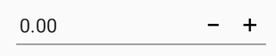
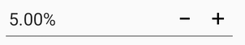
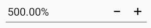

# Number Formatting in Xamarin NumericUpDown (SfNumericUpDown)

The Values of the SfNumericUpDown can be configured to display different formats like currency format, percent format etc. 

## Format String

The `FormatString` property determines the format specifier by which the display text has to be formatted. 

N> The control displays the formatted text on lost focus. Default Value of `FormatString` is "n". 

### Display Currency Notation

`c` - Displays the value with currency notation.


	


SfNumericUpDown numericUpDown=new SfNumericUpDown();
numericUpDown.FormatString="c";
	 




	<numeric:SfNumericUpDown x:Name="numericUpDown" FormatString="c"/>
	




### Display Percentage Notation

`p` – Displays the value in percentage.
	
	
	


SfNumericUpDown numericUpDown=new SfNumericUpDown();
numericUpDown.FormatString="p";
	 




	<numeric:SfNumericUpDown x:Name="numericUpDown" FormatString="p"/>
	




### Display Number Notation

`n` – Displays the value in number format.
	
	



	<numeric:SfNumericUpDown x:Name="numericUpDown" FormatString="n"/>
	



	
SfNumericUpDown numericUpDown=new SfNumericUpDown();
numericUpDown.FormatString="n";
	 




N> Instead of using above `FormatString` types, we can provide any symbol or value as string in `FormatString` property which will be appended with the value in SfNumericUpDown.

## Compute to Percentage

When the control is in percentage format, the value can be displayed in two ways as follows

* `Value`: Displays the actual value with percentage symbol.





	<numeric:SfNumericUpDown x:Name="numericUpDown" Value="5" FormatString="p" PercentDisplayMode="Value"/>
	




SfNumericUpDown numericUpDown=new SfNumericUpDown();
numericUpDown.Value = 5;
numericUpDown.FormatString="p";
numericUpDown.PercentDisplayMode=PercentDisplayMode.Value;





* `Compute`: Displays the value computed by 100 with percentage symbol.





	<numeric:SfNumericUpDown x:Name="numericUpDown" Value="5" FormatString="p" PercentDisplayMode="Compute"/>
	




SfNumericUpDown numericUpDown=new SfNumericUpDown();
numericUpDown.Value = "5";
numericUpDown.FormatString="p";
numericUpDown.PercentDisplayMode=PercentDisplayMode.Compute;





N> The control displays the percent value on lost focus. 

## Set EnableGroupSeparator 

The `EnableGroupSeparator` property is used to get rid of the comma in the Value of SfNumericUpDown.





	   <numeric:SfNumericUpDown x:Name="NumericUpDown" Value="12345" EnableGroupSeparator="True"/>
	



 
SfNumericUpDown NumericUpDown=new SfNumericUpDown();
NumericUpDown.Value=12345;
NumericUpDown.EnableGroupSeparator = true;
this.Content = NumericUpDown;





## See also

[How to provide string formats support in SfNumericUpDown](https://www.syncfusion.com/kb/7690/does-sfnumericupdown-supports-other-formats)