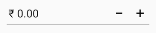
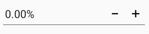
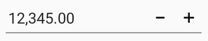

# Number Formatting in Xamarin NumericUpDown (SfNumericUpDown)

The values of the [`SfNumericUpDown`](https://help.syncfusion.com/cr/xamarin/Syncfusion.SfNumericUpDown.XForms.SfNumericUpDown.html) can be configured to display different formats like currency format, percent format etc. 

## Format string support in SfNumericUpDown

The [`FormatString`](https://help.syncfusion.com/cr/xamarin/Syncfusion.SfNumericUpDown.XForms.SfNumericUpDown.html#Syncfusion_SfNumericUpDown_XForms_SfNumericUpDown_FormatString) property determines the format specifier by which the display text has to be formatted. 

N> The control displays the formatted text on lost focus. Default Value of [`FormatString`](https://help.syncfusion.com/cr/xamarin/Syncfusion.SfNumericUpDown.XForms.SfNumericUpDown.html#Syncfusion_SfNumericUpDown_XForms_SfNumericUpDown_FormatString) is "n". 

### Display currency notation

`c` - Displays the value with currency notation.


	


	<numeric:SfNumericUpDown FormatString="c"/>
	




SfNumericUpDown numericUpDown=new SfNumericUpDown();
numericUpDown.FormatString="c";
	 




### Display percentage notation

`p` – Displays the value in percentage.
	
	



	<numeric:SfNumericUpDown  FormatString="p"/>
	

	


SfNumericUpDown numericUpDown=new SfNumericUpDown();
numericUpDown.FormatString="p";
	 




### Display number notation

`n` – Displays the value in number format.
	
	



	<numeric:SfNumericUpDown  FormatString="n"/>
	



	
SfNumericUpDown numericUpDown=new SfNumericUpDown();
numericUpDown.FormatString="n";
	 




N> Instead of using above [`FormatString`](https://help.syncfusion.com/cr/xamarin/Syncfusion.SfNumericUpDown.XForms.SfNumericUpDown.html#Syncfusion_SfNumericUpDown_XForms_SfNumericUpDown_FormatString) types, we can provide any symbol or value as string in [`FormatString`](https://help.syncfusion.com/cr/xamarin/Syncfusion.SfNumericUpDown.XForms.SfNumericUpDown.html#Syncfusion_SfNumericUpDown_XForms_SfNumericUpDown_FormatString) property which will be appended with the value in [`SfNumericUpDown`](https://help.syncfusion.com/cr/xamarin/Syncfusion.SfNumericUpDown.XForms.SfNumericUpDown.html).

## Compute to percentage

When the control is in percentage format, the value can be displayed in two ways as follows

* [`Value`](https://help.syncfusion.com/cr/xamarin/Syncfusion.SfNumericUpDown.XForms.SfNumericUpDown.html#Syncfusion_SfNumericUpDown_XForms_SfNumericUpDown_Value) : Displays the actual value with percentage symbol.





	<numeric:SfNumericUpDown  Value="5" FormatString="p" PercentDisplayMode="Value"/>
	




SfNumericUpDown numericUpDown=new SfNumericUpDown();
numericUpDown.Value = 5;
numericUpDown.FormatString="p";
numericUpDown.PercentDisplayMode=PercentDisplayMode.Value;





* [`Compute`](https://help.syncfusion.com/cr/xamarin/Syncfusion.SfNumericUpDown.XForms.PercentDisplayMode.html#Syncfusion_SfNumericUpDown_XForms_PercentDisplayMode_Compute) : Displays the value computed by 100 with percentage symbol.





	<numeric:SfNumericUpDown Value="5" FormatString="p" PercentDisplayMode="Compute"/>
	




SfNumericUpDown numericUpDown=new SfNumericUpDown();
numericUpDown.Value = "5";
numericUpDown.FormatString="p";
numericUpDown.PercentDisplayMode=PercentDisplayMode.Compute;





N> The control displays the percent value on lost focus. 

## Set enable group separator 

The [`EnableGroupSeparator`](https://help.syncfusion.com/cr/xamarin/Syncfusion.SfNumericUpDown.XForms.SfNumericUpDown.html#Syncfusion_SfNumericUpDown_XForms_SfNumericUpDown_EnableGroupSeparator) property is used to get rid of the comma in the Value of [`SfNumericUpDown`](https://help.syncfusion.com/cr/xamarin/Syncfusion.SfNumericUpDown.XForms.SfNumericUpDown.html).





	   <numeric:SfNumericUpDown  Value="12345" EnableGroupSeparator="True"/>
	



 
SfNumericUpDown NumericUpDown=new SfNumericUpDown();
NumericUpDown.Value=12345;
NumericUpDown.EnableGroupSeparator = true;
this.Content = NumericUpDown;





## See also

[How to provide string formats support in SfNumericUpDown](https://www.syncfusion.com/kb/7690/does-sfnumericupdown-supports-other-formats)