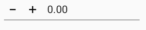
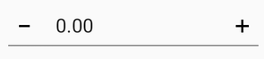

# Spin Button Alignment

Spin button position in the `SfNumericUpDown` control can be changed relative to the TextBox based on `SpinButtonAlignment` property. 

There are three built-in modes:

### Right

Spin buttons will get aligned to the right side of the control.





	numericUpDown.SpinButtonAlignment = SpinButtonAlignment.Right;





	<numeric:SfNumericUpDown x:Name="numericUpDown" SpinButtonAlignment="Right"/>
	




### Left

Spin buttons will get aligned to the left side of the control.





	<numeric:SfNumericUpDown x:Name="numericUpDown" SpinButtonAlignment="Left"/>
	




	numericUpDown.SpinButtonAlignment = SpinButtonAlignment.Left;





### Both

Spin buttons will get aligned to the both side of the control.





	<numeric:SfNumericUpDown x:Name="numericUpDown" SpinButtonAlignment="Both"/>
	




	numericUpDown.SpinButtonAlignment = SpinButtonAlignment.Both;





N> By default the property value is Right.

## UpDownButtonSetting customization

You can set the UpDownButton of `SfNumericUpDown` control by using any of the following ways:

1. View
2. Image
3. FontIconText

N> For image and Font icon, you need to add the respective image and TTF file.
		For Android: Add the image at Resource/Drawable/{Image} and .ttf file at Asserts/{.ttf}.
		For iOS: Add the image and .ttf file to Resource/{Image/.ttf} and to use FontIcons, add respective FontFamily name in info.plist file under Fonts provided by application category.
		For UWP: Add the image and .ttf file directly to the project.

### By using the View





<updown:SfNumericUpDown x:Name="upDown" SpinButtonAlignment="Both" TextAlignment="Center">
<updown:SfNumericUpDown.IncrementButtonSettings>
<updown:UpDownButtonSettings ButtonHeight="45" ButtonWidth="45">
<updown:UpDownButtonSettings.ButtonView>
<Grid HeightRequest="40" WidthRequest="40">
<Image Source="up.png" Aspect="AspectFit" />
</Grid>
</updown:UpDownButtonSettings.ButtonView>
</updown:UpDownButtonSettings>
</updown:SfNumericUpDown.IncrementButtonSettings>
<updown:SfNumericUpDown.DecrementButtonSettings>
<updown:UpDownButtonSettings ButtonHeight="45" ButtonWidth="45">
<updown:UpDownButtonSettings.ButtonView>
<Grid HeightRequest="40" WidthRequest="40">
<Image Source="down.png" Aspect="AspectFit" />
</Grid>
</updown:UpDownButtonSettings.ButtonView>
</updown:UpDownButtonSettings>
</updown:SfNumericUpDown.DecrementButtonSettings>
</updown:SfNumericUpDown>





 public partial class MainPage : ContentPage
    {
        SfNumericUpDown upDown;
        Grid incrementGrid, decrementGrid;
        UpDownButtonSettings incSettings, decrementSettings;
        Image incrementImage, decrementImage;
        public MainPage()
        {
            InitializeComponent();
            incrementGrid = new Grid
            {
                HeightRequest = 40,
                WidthRequest = 40,
                BackgroundColor = Color.Blue
            };
            incSettings = new UpDownButtonSettings
            {
                ButtonView = incrementGrid,
                ButtonHeight = 45,
                ButtonWidth = 45
            };
            incrementImage = new Image
            {
                HorizontalOptions = LayoutOptions.Center,
                VerticalOptions = LayoutOptions.Center,
                Source = (FileImageSource)ImageSource.FromFile("up.png"),
                Aspect = Aspect.AspectFit
            };
            decrementSettings = new UpDownButtonSettings
            {
                ButtonView = decrementGrid,
                ButtonHeight = 45,
                ButtonWidth = 45
            };
            decrementGrid = new Grid
            {
                HeightRequest = 40,
                WidthRequest = 40,
                BackgroundColor = Color.Red

            };
            decrementImage = new Image
            {
                Source = (FileImageSource)ImageSource.FromFile("down.png"),
                Aspect = Aspect.AspectFit,
                HorizontalOptions = LayoutOptions.Center,
                VerticalOptions = LayoutOptions.Center
            };
            upDown = new SfNumericUpDown
            {
                SpinButtonAlignment = SpinButtonAlignment.Left,
                IncrementButtonSettings = incSettings,
                DecrementButtonSettings = decrementSettings
            };
            incrementGrid.Children.Add(incrementImage);
            decrementGrid.Children.Add(decrementImage);
            this.Content = upDown;
        }
        
    }





### By using the Image with ButtonHeight and ButtonWidth





<updown:SfNumericUpDown x:Name="upDown" SpinButtonAlignment="Both" TextAlignment="Center">
<updown:SfNumericUpDown.IncrementButtonSettings>
<updown:UpDownButtonSettings ButtonImage="up" ButtonHeight="35" ButtonWidth="35" />
</updown:SfNumericUpDown.IncrementButtonSettings>
<updown:SfNumericUpDown.DecrementButtonSettings>
<updown:UpDownButtonSettings ButtonImage="down" ButtonHeight="35" ButtonWidth="35" />
</updown:SfNumericUpDown.DecrementButtonSettings>
</updown:SfNumericUpDown> 

	




public partial class MainPage : ContentPage
    {
        SfNumericUpDown upDown;
        Grid incrementGrid, decrementGrid;
        UpDownButtonSettings incSettings, decrementSettings;
        Image incrementImage, decrementImage;
        public MainPage()
        {
            InitializeComponent();
           
            incSettings = new UpDownButtonSettings
            {
                ButtonImage = "up",
                ButtonHeight = 45,
                ButtonWidth = 45
            };
            decrementSettings = new UpDownButtonSettings
            {
                ButtonImage = "down",
                ButtonHeight = 45,
                ButtonWidth = 45
            };
            upDown = new SfNumericUpDown
            {
                SpinButtonAlignment = SpinButtonAlignment.Both,
                IncrementButtonSettings = incSettings,
                DecrementButtonSettings = decrementSettings
            }; 
            this.Content = upDown;
        }
        
    }





### By using the FontIconText





<updown:SfNumericUpDown x:Name="upDown" SpinButtonAlignment="Both" TextAlignment="Center">
<updown:SfNumericUpDown.IncrementButtonSettings>
<updown:UpDownButtonSettings ButtonFontIcon="&#xe701;" ButtonHeight="35" ButtonWidth="35">
<updown:UpDownButtonSettings.ButtonFontFamily>
<OnPlatform
                x:TypeArguments="x:String">
                <On
                    Platform="Android"
                    Value="numeric.ttf">
                </On>
                <On
                    Platform="iOS"
                    Value="numeric">
                </On>
            </OnPlatform>
</updown:UpDownButtonSettings.ButtonFontFamily>
</updown:UpDownButtonSettings>
</updown:SfNumericUpDown.IncrementButtonSettings>
<updown:SfNumericUpDown.DecrementButtonSettings>
<updown:UpDownButtonSettings ButtonFontIcon="&#xe700;" ButtonHeight="35" ButtonWidth="35" >
<updown:UpDownButtonSettings.ButtonFontFamily>
<OnPlatform
                x:TypeArguments="x:String">
                <On
                    Platform="Android"
                    Value="numeric.ttf">
                </On>
                <On
                    Platform="iOS"
                    Value="numeric">
                </On>
            </OnPlatform>
</updown:UpDownButtonSettings.ButtonFontFamily>
</updown:UpDownButtonSettings>
</updown:SfNumericUpDown.DecrementButtonSettings>
</updown:SfNumericUpDown> 





SfNumericUpDown upDown = new SfNumericUpDown();
upDown.SpinButtonAlignment = SpinButtonAlignment.Both;
UpDownButtonSettings incSettings = new UpDownButtonSettings();
incSettings.ButtonFontIcon = "\xe701";
    if (Device.OS == TargetPlatform.Android)
{
    incSettings.ButtonFontFamily = "numeric.ttf";
    decrementSettings.ButtonFontFamily = "numeric.ttf";
}

else
{
    incSettings.ButtonFontFamily = "numeric";
    decrementSettings.ButtonFontFamily = "numeric";
}
upDown.IncrementButtonSettings = incSettings;
UpDownButtonSettings decrementSettings = new UpDownButtonSettings();
decrementSettings.ButtonFontIcon = "\xe700";
decrementSettings.ButtonWidth = 45;
upDown.DecrementButtonSettings = decrementSettings;
this.Content = upDown;





## Additional customization properties of UpDownButtonSettings

### BackgroundColor

This property is used to change the background color of the increment and decrement buttons.





<updown:SfNumericUpDown >
    <updown:SfNumericUpDown.IncrementButtonSettings>
    <updown:UpDownButtonSettings BackgroundColor="Red"/>
    </updown:SfNumericUpDown.IncrementButtonSettings>
    <updown:SfNumericUpDown.DecrementButtonSettings>
    <updown:UpDownButtonSettings BackgroundColor="Green"/>
    </updown:SfNumericUpDown.DecrementButtonSettings>
</updown:SfNumericUpDown>





 SfNumericUpDown numericUpDown = new SfNumericUpDown();
 UpDownButtonSettings incrementButtonSettings = new UpDownButtonSettings();
 UpDownButtonSettings decrementButtonSettings = new UpDownButtonSettings();
 numericUpDown.IncrementButtonSettings = incrementButtonSettings;
 numericUpDown.DecrementButtonSettings = decrementButtonSettings;
 incrementButtonSettings.BackgroundColor = Color.Red;
 decrementButtonSettings.BackgroundColor = Color.Green;





### HighlightedBackgroundColor

This property is used to change the background color of the increment or decrement button.





 <updown:SfNumericUpDown >
  <updown:SfNumericUpDown.IncrementButtonSettings>
  <updown:UpDownButtonSettings HighlightedBackgroundColor="Red"/>
  </updown:SfNumericUpDown.IncrementButtonSettings>
  <updown:SfNumericUpDown.DecrementButtonSettings>
  <updown:UpDownButtonSettings HighlightedBackgroundColor="Green"/>
  </updown:SfNumericUpDown.DecrementButtonSettings>
 </updown:SfNumericUpDown>





 SfNumericUpDown numericUpDown = new SfNumericUpDown();
 UpDownButtonSettings incrementButtonSettings = new UpDownButtonSettings();
 UpDownButtonSettings decrementButtonSettings = new UpDownButtonSettings();
 numericUpDown.IncrementButtonSettings = incrementButtonSettings;
 numericUpDown.DecrementButtonSettings = decrementButtonSettings;
 incrementButtonSettings.HighlightedBackgroundColor = Color.Red;
 decrementButtonSettings.HighlightedBackgroundColor = Color.Green;





### ButtonFontColor

This property is used to change the text color of the increment and decrement buttons.





 <updown:SfNumericUpDown >
    <updown:SfNumericUpDown.IncrementButtonSettings>
    <updown:UpDownButtonSettings ButtonFontColor="Red"/>
    </updown:SfNumericUpDown.IncrementButtonSettings>
    <updown:SfNumericUpDown.DecrementButtonSettings>
    <updown:UpDownButtonSettings ButtonFontColor="Green"/>
    </updown:SfNumericUpDown.DecrementButtonSettings>
</updown:SfNumericUpDown>





 SfNumericUpDown numericUpDown = new SfNumericUpDown();
 UpDownButtonSettings incrementButtonSettings = new UpDownButtonSettings();
 UpDownButtonSettings decrementButtonSettings = new UpDownButtonSettings();
 numericUpDown.IncrementButtonSettings = incrementButtonSettings;
 numericUpDown.DecrementButtonSettings = decrementButtonSettings;
 incrementButtonSettings.ButtonFontColor = Color.Red;
 decrementButtonSettings.ButtonFontColor = Color.Green;





### HighlightedButtonFontColor

This property is used to change the text color of the button by clicking the increment or decrement button.





<updown:SfNumericUpDown >
    <updown:SfNumericUpDown.IncrementButtonSettings>
    <updown:UpDownButtonSettings HighlightedButtonFontColor="Red"/>
    </updown:SfNumericUpDown.IncrementButtonSettings>
    <updown:SfNumericUpDown.DecrementButtonSettings>
    <updown:UpDownButtonSettings HighlightedButtonFontColor="Green"/>
    </updown:SfNumericUpDown.DecrementButtonSettings>
</updown:SfNumericUpDown>





 SfNumericUpDown numericUpDown = new SfNumericUpDown();
 UpDownButtonSettings incrementButtonSettings = new UpDownButtonSettings();
 UpDownButtonSettings decrementButtonSettings = new UpDownButtonSettings();
 numericUpDown.IncrementButtonSettings = incrementButtonSettings;
 numericUpDown.DecrementButtonSettings = decrementButtonSettings;
 incrementButtonSettings.HighlightedButtonFontColor = Color.Red;
 decrementButtonSettings.HighlightedButtonFontColor = Color.Green;





## Spin validation

You can customize number increment and decrement mode in spin button interaction in two ways:

 * Default
 * Tapped

### Default

When [`SpinValidation`](https://help.syncfusion.com/cr/xamarin/Syncfusion.SfNumericUpDown.XForms.SfNumericUpDown.html#Syncfusion_SfNumericUpDown_XForms_SfNumericUpDown_SpinValidation) property is set as `Default`, the `NumericUpDown` value gets updated on long press till the increment or decrement button gets disabled.





SfNumericUpDown numericUpDown=new SfNumericUpDown();
numericUpDown.SpinValidation = SpinValidation.Default;





<numeric:SfNumericUpDown x:Name="numericUpDown" SpinValidation="Default" />
	




## Tapped

When [`SpinValidation`](https://help.syncfusion.com/cr/xamarin/Syncfusion.SfNumericUpDown.XForms.SfNumericUpDown.html#Syncfusion_SfNumericUpDown_XForms_SfNumericUpDown_SpinValidation) property is set as `Tapped`, the `NumericUpDown` value gets updated on the increment or decrement button tap action.





SfNumericUpDown numericUpDown=new SfNumericUpDown();
numericUpDown.SpinValidation = SpinValidation.Tapped;





<numeric:SfNumericUpDown x:Name="numericUpDown" SpinValidation="Tapped" />
	




## See also

[How to change the Spinner button position in SfNumericUpDown](https://www.syncfusion.com/kb/7669/how-to-change-the-spinner-button-position)

[How to hide the increment or decrement button in SfNumericUpDown](https://www.syncfusion.com/kb/11647/how-to-hide-the-increment-or-decrement-button-in-xamarin-forms-numeric-control)

[How to customize the spin button of the SfNumericUpDown](https://www.syncfusion.com/kb/10156/how-to-customise-the-spin-button-of-the-numericupdown)

