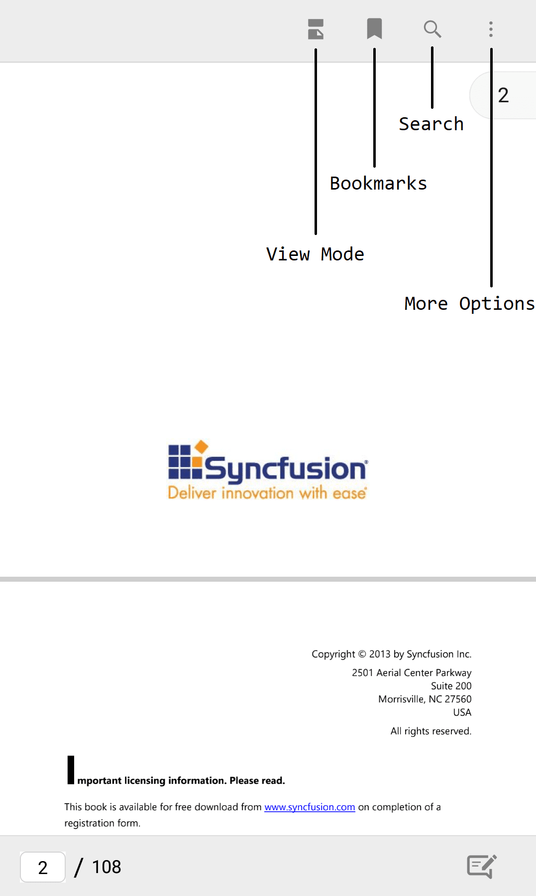
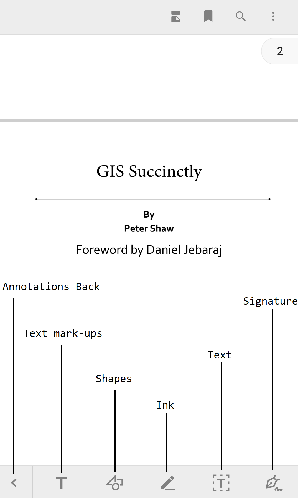
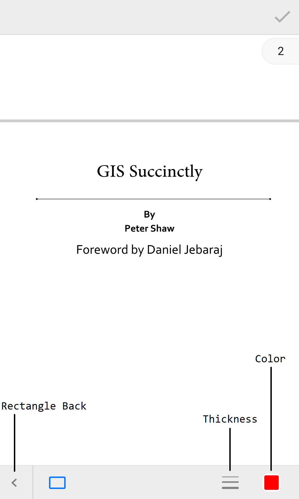
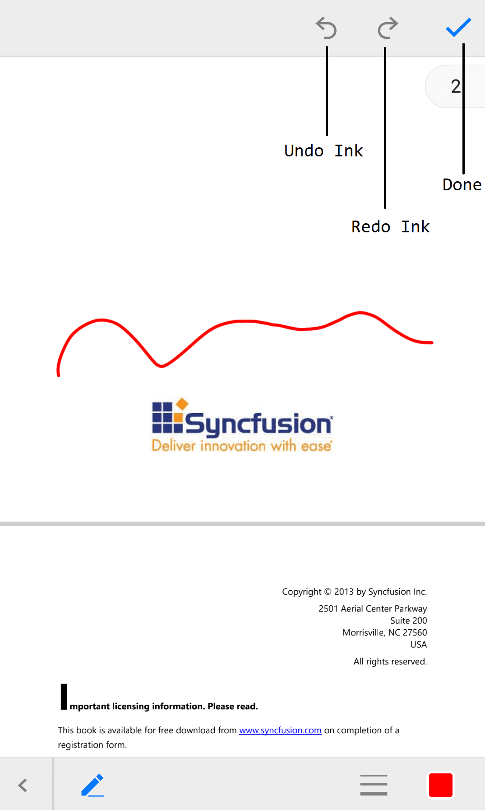

# AutomationId API in Pdf Viewer(SfPdfViewer)

The SfPdfViewer control has built-in `AutomationId` for inner elements. The `AutomationId` API allows the automation framework to find and interact with the inner elements of the SfPdfViewer control. The following screenshots illustrate the AutomationIds of SfPdfViewer's inner elements. 

**Top toolbar**

**Bottom toolbar**

**Search toolbar**

**Annotation toolbar**

**Text markup annotation toolbar**

**Highlight annotation toolbar**

**Underline annotation toolbar**

**Strikethrough annotation toolbar**

**Shape annotation toolbar**

**Rectangle annotation toolbar**

**Ellipse annotation toolbar**

**Line annotation toolbar**

**Arrow annotation toolbar**

**Ink annotation toolbar**

**Free text annotation toolbar**

**Thickness selection toolbar**

**Color selection toolbar**

**Ink Annotation - Undo, Redo toolbar**

**Signature pad**

**View mode toolbar**

**More options toolbar**

