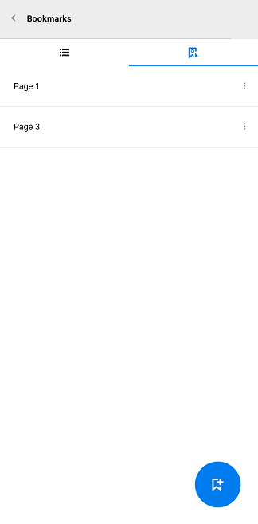
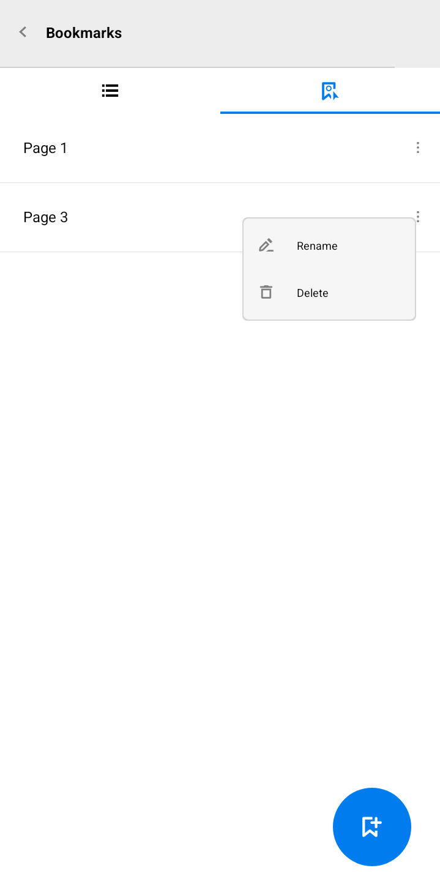

# Bookmark Navigation in Xamarin Pdf Viewer (SfPdfViewer)

[Xamarin PDF Viewer](https://www.syncfusion.com/xamarin-ui-controls/xamarin-pdf-viewer) allows users to view the bookmarks present in the loaded PDF document and navigate to the destination saved in the bookmarks. 

## Enabling and disabling bookmark feature

You can enable and disable the bookmark button from the built-in toolbar using the `BookmarkNavigationEnabled` property available in PDF viewer.

<table>

<tr>
<th>Property</th>
<th>Action</th>
</tr>

<tr>
<td>BookmarkNavigationEnabled</td>
<td>Gets or sets the value that enable and disable the bookmark feature in PDF viewer. By default, this property is set to true.</td>
</tr>

</table>

This property removes the bookmark button from the built-in toolbar and disable the bookmark feature, when it is set to false and vice versa.




<pdfviewer:SfPdfViewer x:Name="pdfViewerControl" BookmarkNavigationEnabled="False"/>               







//Bookmark feature is disabled
pdfViewerControl. BookmarkNavigationEnabled = false;             




## Expand and collapse the bookmark pane from built-in toolbar

The bookmark pane is expanded and collapsed by clicking the bookmark button from the built-in toolbar.

## Expand and collapse the bookmark pane programmatically

The bookmark pane is expanded and collapsed programmatically by using the `BookmarkPaneVisible` bindable property available in PDF viewer.

<table>

<tr>
<th>Property</th>
<th>Action</th>
</tr>

<tr>
<td>BookmarkPaneVisible</td>
<td>Gets or sets the value to expand and collapse the bookmark pane in PDF viewer. Setting this property to true expands the pane and vice versa. By default, this property is set to true.</td>
</tr>

</table>




<pdfviewer:SfPdfViewer x:Name="pdfViewerControl" BookmarkPaneVisible="False"/>     







//Bookmark pane will be collapsed, if it is expanded
pdfViewerControl.BookmarkPaneVisible = true;




## Getting the bookmarks from the PDF

The bookmarks existing in the PDF document can be obtained from the `Bookmarks` property. The `Bookmarks` collection is not supposed to be modified by adding new bookmarks or removing existing bookmarks. Changes made on the `Bookmarks` collection will not be reflected in the bookmark pane and in the PDF document.  




List<PdfBookmark> bookmarks = pdfViewer.Bookmarks;




## Programmatically navigate to a bookmark destination

You can navigate to a desired bookmark destination using the `GotoBookmark(PdfBookmark)` method. The target/destination bookmark should be provided as the argument to this method. Refer to the following code sample.




//Loads the PDF document in PdfLoadedDocument
PdfLoadedDocument loadedDocument = new PdfLoadedDocument(documentStream);

//Retrieves the bookmark collection from the loaded PDF document
PdfBookmarkBase bookmark = loadedDocument.Bookmarks;

//Navigate to the specified bookmark destination offset
pdfViewerControl.GoToBookmark(bookmark[0]);




## Track the occurrence of the bookmark navigation

You can track the bookmark navigation operation using the `BookmarkNavigationOccurred` event. The argument of this event will provide the instance of the bookmark, destination page number, and vertical offset. Refer to the following code example.




pdfViewerControl.BookmarkNavigationOccurred += PdfViewerControl_BookmarkNavigationOccurred;

private void PdfViewerControl_BookmarkNavigationOccurred(object sender, Syncfusion.SfPdfViewer.XForms.BookmarkNavigationOccurredEventArgs e)
{
      //Retrieves the current bookmark
      PdfBookmark bookmark = e.Bookmark;

      //Gets the vertical offset of the bookmark
      double destinationOffset = e.Offset;

      //Gets the current page number in which the bookmark destination resides
      int pageNumber = e.PageNumber;

}




## Custom bookmarks

PDF viewer allows you to bookmark the current page dynamically. To bookmark a page, navigate to the page and bookmark it. These custom bookmarks can be saved with the document, but they will be only visible in the Syncfusion PDF viewer. They will not be visible in other 3rd party PDF viewer applications.

The custom bookmarks can be obtained using the `CustomBookmarks` property. 




ObservableCollection<CustomBookmark> bookmarks = pdfViewer.CustomBookmarks;




### Add custom bookmarks using the bookmark pane
                        
Custom bookmarks can be added using the floating button in the bookmark pane.

### Add custom bookmarks programmatically
You can add a new custom bookmark by creating a `CustomBookmark` instance and adding to the `CustomBookmarks` collection.
  



//initializes new custom bookmark with name and page number
CustomBookmark customBookmark = new CustomBookmark("Custom Bookmark 1", 1);
       
//Adds a new custom bookmark
pdfViewerControl.CustomBookmarks.Add(customBookmark);




### Navigating to custom bookmarks

You can navigate to the desired custom bookmark destination using the `GoToBookmark` method. 




//Get the ith bookmark from the collection.
CustomBookmark customBookmark = pdfViewerControl.CustomBookmarks[i];

//Navigate to the bookmark
pdfViewerControl.GoToBookmark(customBookmark);




### Rename custom bookmarks using the bookmark context menu
Tap the context menu button on the custom bookmark to be edited and choose "Rename" and enter the desired name. 

 
### Rename custom bookmarks programmatically
Custom bookmarks can be renamed using the `Name` property.
   



//Rename the custom bookmark at the ith index.
pdfViewerControl.CustomBookmarks[i].Name = "New custom bookmark name";




### Remove custom bookmarks using the bookmark context menu
Tap the context menu button on the custom bookmark to be removed and tap “Delete”.

### Remove custom bookmarks programmatically
Custom bookmarks can be removed from the `CustomBookmarks` collection. Refer to the below code snippet.




//Removes the custom bookmark at the ith index.
pdfViewerControl.CustomBookmarks.RemoveAt(i);




N>You can also explore our [Xamarin.Forms PDF Viewer example](https://github.com/syncfusion/xamarin-demos/tree/master/Forms/PdfViewer) to knows the functionalities of each feature.
