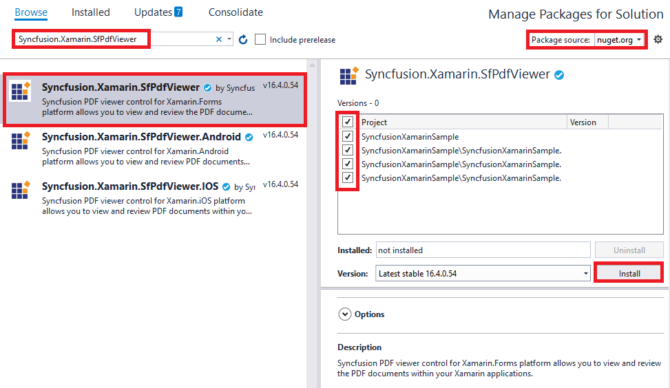

# Getting Started with Xamarin Pdf Viewer (SfPdfViewer)

This section demonstrates how to create an application that displays a PDF file using [Xamarin Pdf Viewer](https://www.syncfusion.com/xamarin-ui-controls/xamarin-pdf-viewer) (SfPdfViewer) control.
 
## Assembly deployment

After installing [Essential Studio for Xamarin](https://www.syncfusion.com/downloads/xamarin), you can find all the required assemblies in the installation folders, {Syncfusion Essential Studio Installed location} \Essential Studio\\{Version #}\Xamarin\lib.

E.g.: C:\Program Files (x86) \Syncfusion\Essential Studio\19.1.0.54\Xamarin\lib

N> Assemblies can be found in unzipped package location(Documents/Syncfusion/{Version #}/Xamarin/lib) in Mac.

## Adding SfPdfViewer reference

You can add [SfPdfViewer](https://help.syncfusion.com/cr/xamarin/Syncfusion.SfPdfViewer.XForms.SfPdfViewer.html) reference using one of the following methods:

**Method 1: Adding SfPdfViewer reference from nuget.org**

Syncfusion Xamarin components are available in [nuget.org](https://www.nuget.org/). To add SfPdfViewer to your project, open the [NuGet package](https://help.syncfusion.com/xamarin/visual-studio-integration/nuget-packages) manager in Visual Studio, search for [Syncfusion.Xamarin.SfPdfViewer](https://www.nuget.org/packages/Syncfusion.Xamarin.SfPdfViewer), and then install it.

N> Install the same version of SfPdfViewer NuGet in all the projects.

**Method 2: Adding SfPdfViewer reference from toolbox**

Syncfusion also provides Xamarin Toolbox. Using this toolbox, you can drag the SfPdfViewer control to the XAML page. It will automatically install the required NuGet packages and add the namespace to the page. To install Syncfusion Xamarin Toolbox, refer to [Toolbox](https://help.syncfusion.com/xamarin/utility#toolbox).

**Method 3: Adding SfPdfViewer assemblies manually from the installed location**

If you prefer to manually reference the assemblies instead referencing from NuGet, add the following assemblies in respective projects.

Location: {Installed location}/{version}/Xamarin/lib

<table>
<tr>
<td>PCL</td>
<td>Syncfusion.Compression.Portable.dll Syncfusion.Pdf.Portable.dll Syncfusion.SfPdfViewer.XForms.dll Syncfusion.SfBusyIndicator.XForms.dll Syncfusion.SfRangeSlider.XForms.dll Syncfusion.Core.XForms.dll Syncfusion.Licensing.dll Syncfusion.SfProgressBar.XForms.dll Syncfusion.SfTabView.XForms.dll </td>
</tr>
<tr>
<td>Android</td>
<td>Syncfusion.Compression.Portable.dll Syncfusion.Pdf.Portable.dll Syncfusion.SfPdfViewer.XForms.dll Syncfusion.SfPdfViewer.XForms.Android.dll Syncfusion.SfBusyIndicator.XForms.dll Syncfusion.SfBusyIndicator.XForms.Android.dll Syncfusion.SfBusyIndicator.Android.dll Syncfusion.SfRangeSlider.XForms.dll  Syncfusion.SfRangeSlider.XForms.Android.dll Syncfusion.Core.XForms.dll Syncfusion.Core.XForms.Android.dll Syncfusion.Licensing.dll Syncfusion.SfProgressBar.XForms.dll Syncfusion.SfProgressBar.XForms.Android.dll Syncfusion.SfTabView.XForms.dll Syncfusion.SfTabView.XForms.Android.dll </td>
</tr>
<tr>
<td>iOS</td>
<td>Syncfusion.Compression.Portable.dll Syncfusion.Pdf.Portable.dll Syncfusion.SfPdfViewer.XForms.dll Syncfusion.SfPdfViewer.XForms.iOS.dll Syncfusion.SfBusyIndicator.XForms.dll Syncfusion.SfBusyIndicator.XForms.iOS.dll Syncfusion.SfBusyIndicator.iOS.dll Syncfusion.SfRangeSlider.XForms.dll Syncfusion.SfRangeSlider.XForms.iOS.dll Syncfusion.Core.XForms.dll Syncfusion.Core.XForms.iOS.dll Syncfusion.Licensing.dll Syncfusion.SfProgressBar.XForms.dll Syncfusion.SfProgressBar.XForms.iOS.dll Syncfusion.SfTabView.XForms.dll Syncfusion.SfTabView.XForms.iOS.dll </td>
</tr>
<tr>
<td>UWP</td>
<td>Syncfusion.Compression.Portable.dll Syncfusion.Pdf.Portable.dll Syncfusion.SfPdfViewer.XForms.dll Syncfusion.SfPdfViewer.XForms.UWP.dll Syncfusion.SfRangeSlider.XForms.dll Syncfusion.SfRangeSlider.XForms.UWP.dll Syncfusion.SfShared.UWP.dll Syncfusion.SfInput.UWP.dll Syncfusion.Core.XForms.dll Syncfusion.Core.XForms.UWP.dll Syncfusion.Licensing.dll Syncfusion.SfProgressBar.XForms.dll Syncfusion.SfProgressBar.XForms.UWP.dll Syncfusion.SfTabView.XForms.dll Syncfusion.SfTabView.XForms.UWP.dll </td>
</tr>
</table>

N> To know more about obtaining our components, refer to these links for [Mac](https://help.syncfusion.com/xamarin/introduction/download-and-installation/mac/) and [Windows](https://help.syncfusion.com/xamarin/introduction/download-and-installation/windows/).

I> Starting with v16.2.0.x, if you reference Syncfusion assemblies from the trial setup or from the NuGet feed, you also have to include a license key in your projects. Please refer to [Syncfusion license key](https://help.syncfusion.com/common/essential-studio/licensing/license-key/) to know about registering Syncfusion license key in your Xamarin application to use our components.

## Creating a simple PDF Viewer application

Create a new cross platform application for Xamarin.Forms.Portable in the Visual Studio with the project name "GettingStarted" and refer the above mentioned assemblies to the respective projects.

N> If you are adding the references from toolbox, this step is not needed.

An additional step is required to render the SfPdfViewer control in `iOS` project. You need to call the `Syncfusion.SfPdfViewer.XForms.iOS.SfPdfDocumentViewRenderer.Init()`, `Syncfusion.SfRangeSlider.XForms.iOS.SfRangeSliderRenderer.Init()` and `Syncfusion.XForms.iOS.TabView.SfTabViewRenderer.Init()` methods in the `FinishedLaunching` overridden method of the `AppDelegate` class after the Xamarin.Forms Framework has been initialized and before the `LoadApplication` is called, as demonstrated in the following code example.




public override bool FinishedLaunching(UIApplication app, NSDictionary options)
{
    global::Xamarin.Forms.Forms.Init();
    Syncfusion.SfPdfViewer.XForms.iOS.SfPdfDocumentViewRenderer.Init();
    Syncfusion.SfRangeSlider.XForms.iOS.SfRangeSliderRenderer.Init();
    Syncfusion.XForms.iOS.TabView.SfTabViewRenderer.Init();
    LoadApplication(new App());
    return base.FinishedLaunching(app, options);
}




## Resolving issue when deploying an application in ReleaseMode in the UWP platform

There is a known Framework issue in the UWP platform when an application using custom control is deployed in `Release Mode`, it will not be rendered.

This can be resolved by initializing the SfPdfViewer related assemblies in `App.xaml.cs` in the UWP project. Refer to the following code snippet.




protected override void OnLaunched(LaunchActivatedEventArgs e)
{
     …
     rootFrame.NavigationFailed += OnNavigationFailed;

     //Add the assemblies `using System.Reflection;`
     List<Assembly> assembliesToInclude = new List<Assembly>();

     //Now, add all the assemblies that your app uses
     assembliesToInclude.Add(typeof(SfPdfDocumentViewRenderer).GetTypeInfo().Assembly);

     assembliesToInclude.Add(typeof(SfRangeSliderRenderer).GetTypeInfo().Assembly);

     //Replaces Xamarin.Forms.Forms.Init(e);
     Xamarin.Forms.Forms.Init(e, assembliesToInclude);
     …
}




## Loading a PDF using MVVM binding

File handling with Xamarin.Forms can be done using embedded resources or writing against the native filesystem APIs. Please find more details in the below link:

https://developer.xamarin.com/guides/xamarin-forms/application-fundamentals/files/ 

Add a folder in the portable project with the name "Assets" and add the PDF document you need to display in the PDF viewer, here a PDF file named "GIS Succinctly.pdf" was used. In the properties of the PDF document set the build action property to be "Embedded Resource".

Add a folder in the portable project with the name "ViewModel and include a class file with a name "PdfViewerViewModel" inside it. Add below code snippet in the "PdfViewerViewModel" class. Ensure to maintain the namespace as "GettingStarted". 




using System.IO;
using System.Reflection;
using System.ComponentModel;

namespace GettingStarted
{
    class PdfViewerViewModel : INotifyPropertyChanged
    {
        private Stream m_pdfDocumentStream;

        /// 

        /// An event to detect the change in the value of a property.
        /// 

        public event PropertyChangedEventHandler PropertyChanged;

        /// 

        /// The PDF document stream that is loaded into the instance of the PDF viewer. 
        /// 

        public Stream PdfDocumentStream
        {
            get
            {
                return m_pdfDocumentStream;
            }
            set
            {
                m_pdfDocumentStream = value;
                NotifyPropertyChanged("PdfDocumentStream");
            }
        }

        /// 

        /// Constructor of the view model class
        /// 

        public PdfViewerViewModel()
        {
            //Accessing the PDF document that is added as embedded resource as stream.
            m_pdfDocumentStream = typeof(App).GetTypeInfo().Assembly.GetManifestResourceStream("GettingStarted.Assets.GIS Succinctly.pdf");
        }

        private void NotifyPropertyChanged(string propertyName)
        {
            if (PropertyChanged != null)
            {
                PropertyChanged(this, new PropertyChangedEventArgs(propertyName));
            }
        }  
    }
}




Add the following XAML code in the MainPage.xaml in the portable project.

* Includes the necessary namespace where the control class resides
* Set BindingContext of ContentPage to PdfViewerViewModel
* Includes PDF Viewer into the page
* Binds InputFileStream property of PDF Viewer control to PdfDocumentStream property of PdfViewerViewModel




<ContentPage xmlns="http://xamarin.com/schemas/2014/forms"
             xmlns:x="http://schemas.microsoft.com/winfx/2009/xaml"
             xmlns:local="clr-namespace:GettingStarted"
             x:Class="GettingStarted.MainPage"
             xmlns:syncfusion="clr-namespace:Syncfusion.SfPdfViewer.XForms;assembly=Syncfusion.SfPdfViewer.XForms"
             >
    <ContentPage.BindingContext>
        <local:PdfViewerViewModel></local:PdfViewerViewModel>
    </ContentPage.BindingContext>
    <Grid x:Name="pdfViewGrid">
        <syncfusion:SfPdfViewer x:Name="pdfViewerControl" InputFileStream="{Binding PdfDocumentStream}"/>
    </Grid> 
</ContentPage>




The sample that illustrates loading a PDF in MVVM binding can be downloaded from the link below. 

<http://www.syncfusion.com/downloads/support/directtrac/general/ze/GettingStarted-2072455774> 

On executing the above sample, you will get the output as shown in the following image.

## Loading a PDF in code-behind/programmatically

In code-behind a PDF can be loaded to PdfViewer just by using the [LoadDocument](https://help.syncfusion.com/cr/xamarin/Syncfusion.SfPdfViewer.XForms.SfPdfViewer.html#Syncfusion_SfPdfViewer_XForms_SfPdfViewer_LoadDocument_System_IO_Stream_) method without the need of the "PdfViewerViewModel" class described in the previous section.  Use the following code snippet in the code-behind of the XAML page. 




namespace GettingStarted
{
    public partial class MainPage : ContentPage
    {
        Stream fileStream; 
        public MainPage()
        {
            InitializeComponent();
        }

        protected override void OnAppearing()
        {
            base.OnAppearing();
            fileStream = typeof(App).GetTypeInfo().Assembly.GetManifestResourceStream("GettingStarted.Assets.GIS Succinctly.pdf");
			//Load the PDF
            pdfViewerControl.LoadDocument(fileStream);
        }
    }
}




In the XAML code described in the previous section, remove the binding of InputFileStream property of SfPdfViewer and the BindingContext of the page. 




<ContentPage xmlns="http://xamarin.com/schemas/2014/forms"
             xmlns:x="http://schemas.microsoft.com/winfx/2009/xaml"
             xmlns:local="clr-namespace:GettingStarted"
             x:Class="GettingStarted.MainPage"
             xmlns:syncfusion="clr-namespace:Syncfusion.SfPdfViewer.XForms;assembly=Syncfusion.SfPdfViewer.XForms"
             >
    <Grid x:Name="pdfViewGrid">
        <syncfusion:SfPdfViewer x:Name="pdfViewerControl" />
    </Grid> 
</ContentPage>




The sample which illustrates loading a PDF in code-behind using LoadDocument method can be downloaded from the link below.

<http://www.syncfusion.com/downloads/support/directtrac/general/ze/GettingStarted-81946798> 

## Loading a PDF from an URL

PDF documents can be loaded from a given URL into the PdfViewer by downloading the PDF and then loading the stream of the downloaded file into the PdfViewer. In the following code sample, the `HttpClient.GetAsync( )` method sends a GET request to the specified Uri as an asynchronous operation and the `HttpContent.ReadAsStreamAsync( )` method will serialize the HTTP content and returns a stream that represents the content as an asynchronous operation. Finally, the obtained stream is passed to the `LoadDocument( )` method of SfPdfViewer.




HttpClient httpClient = new HttpClient();
HttpResponseMessage response = await httpClient.GetAsync("https://www.syncfusion.com/downloads/support/directtrac/general/pd/GIS_Succinctly1774404643.pdf");
Stream pdfStream = await response.Content.ReadAsStreamAsync();
pdfViewerControl.LoadDocument(pdfStream);




The sample that illustrates loading a PDF from an URL can be downloaded from the link below,
 
<https://www.syncfusion.com/downloads/support/directtrac/general/ze/LoadPDFFromURL-1204672622.zip> 

N> An Internet connection is necessary to get the stream from an URL. Please ensure that the device has a proper internet connection before running the sample application.

## Loading a PDF asynchronously

[Xamarin PDF Viewer](https://www.syncfusion.com/xamarin-ui-controls/xamarin-pdf-viewer) allows you to load the PDF document from the specified stream asynchronously using the `LoadDocumentAsync` method. You can also cancel the asynchronous PDF loading when it is in progress.




pdfViewerControl.LoadDocumentAsync(documentStream, cancellationTokenSource);




In the above code sample, `documentStream` is a stream that contains the data of the PDF document and the `cancellationTokenSource` enables you to cancel the asynchronous PDF loading.

### Cancel the asynchronous PDF Loading

You can raise cancel request when the asynchronous load is in progress.




private void cancelButton_Clicked(object sender, EventArgs e)
{
     cancellationTokenSource.Cancel();
}




In the above code sample, the `cancellationTokenSource` instance is the same as the one given as the argument when loading the PDF asynchronously. 

N>Calling the above method will not have any effect once the PDF has completely loaded. It will stop the loading process only when it is in progress. 

### Detect the cancellation of the PDF load

The cancellation of the PDF load operation can be detected by registering an event handler on the Token property of the `CancellationTokenSource` instance. 




EventArgs e = new EventArgs();
cancellationTokenSource.Token.Register(() => LoadDocumentAsyncCancelled(this, e));

private void LoadDocumentAsyncCancelled(object sender, EventArgs e)
{
    // handle the cancellation event
}




## Unloading PDF document from the Viewer

The SfPdfViewer control allows you to unload the PDF document from the viewer, when the PDF document is not in use anymore. This releases the PDF document and all its associated resources of the application.

You need to call the Unload method of SfPdfViewer control as in the below code snippet to achieve the same.




//Unloads the PDF document from the PDF viewer, freeing all the accessed resources.
pdfViewerControl.Unload();




## Saving a PDF document

The `SaveDocument` method returns the PDF document along with the changes made (annotations addition and modification) as a stream, which can be saved as a file. 




//Save the PDF document
Stream pdfDocumentStream = pdfViewerControl.SaveDocument();




Please refer [here](https://www.syncfusion.com/kb/9031/how-to-save-loaded-pdf-document-in-application-level) for saving the PDF document as a file in the application level from the obtained stream.

N> The `SaveDocument` method does not save the existing stamp annotations in the PDF document. Instead, use the `SaveDocumentAsync` method to save them.

## Saving a PDF document asynchronously

The PDF Viewer also allows you to save and return the PDF document with the changes as a stream asynchronously using the `SaveDocumentAsync` method. 




//Save the PDF document asynchronously 
Task<Stream> pdfDocumentStream = pdfViewerControl.SaveDocumentAsync();




## How to dispose the managed resources of SfPdfViewer

The [`SfPdfViewer`](https://help.syncfusion.com/cr/xamarin/Syncfusion.SfPdfViewer.XForms.SfPdfViewer.html) control allows you to dispose the managed resources which are associated with the viewer. You need to call the [`Dispose`](https://help.syncfusion.com/cr/xamarin/Syncfusion.SfPdfViewer.XForms.SfPdfViewer.html#Syncfusion_SfPdfViewer_XForms_SfPdfViewer_Dispose) method of the [`SfPdfViewer`](https://help.syncfusion.com/cr/xamarin/Syncfusion.SfPdfViewer.XForms.SfPdfViewer.html) control as shown in the following code sample to achieve the same.




//Disposes all the managed resources of SfPdfViewer
pdfViewer.Dispose();




## How to clear the undo and redo stack

The [`SfPdfViewer`](https://help.syncfusion.com/cr/xamarin/Syncfusion.SfPdfViewer.XForms.SfPdfViewer.html) control allows you to clear the undo and redo stacks that contain the changes that are made to the annotations in the PDF document, by calling the `ClearUndoRedoStack` API. When this method is called, the `CanUndo` and `CanRedo` properties will be set to `false`.




//To clear the undo and redo stack 
pdfViewer.ClearUndoRedoStack();




## How to get & set the current page number?

PDF viewer has a BindableProperty “PageNumber” using which the current page number can be retrieved and it can be set. 




<Entry Keyboard="Numeric" FontSize="18" x:Name="pageNumberEntry" HorizontalTextAlignment="Center" VerticalOptions="Center" Text="{Binding PageNumber, Source={x:Reference Name=pdfViewerControl}}"/>




On binding the Entry control to PageNumber property of the PDF viewer instance, the number of the current page being displayed in the PDF viewer will be displayed in the Entry control and the PDF viewer would navigate to the page number being entered in the same. 

## How to get the total page number?

PDF viewer has a BindableProperty “PageCount” using which the total number of pages in the document can be retrieved.




<Label x:Name="pageCountLabel" FontSize="18" VerticalTextAlignment="Center" HorizontalTextAlignment="Center" HorizontalOptions="FillAndExpand" VerticalOptions="Center" Text="{Binding PageCount, Source={x:Reference Name=pdfViewerControl}}"/>




On binding the Label to PageCount property of the PDF viewer instance, the total number of pages in the document can be displayed. 

## How to navigate to next page and previous page?

PDF viewer has “GoToNextPageCommand” and “GoToPreviousPageCommand” which will navigate to the next page and previous page respectively. 




<Button x:Name="goToNextButton"  Grid.Column="3" BackgroundColor="Transparent" Image="PageDown.png" HorizontalOptions="Center" VerticalOptions="Center" Command="{Binding GoToNextPageCommand, Source={x:Reference Name=pdfViewerControl}}"/>

<Button x:Name="goToPreviousButton" Grid.Column="4" BackgroundColor="Transparent" Image="PageUp.png" HorizontalOptions="Center" VerticalOptions="Center" Command="{Binding GoToPreviousPageCommand, Source={x:Reference Name=pdfViewerControl}}"/>




If the current page is already the last page of PDF document, then GoToNextPageCommand does not have any effect. Similarly, If the current page is already the first page of PDF document, then GoToPreviousPageCommand does not have any effect.

## How to detect a page change?

PDF viewer has PageChanged event, which helps detecting changes in the page being displayed in the viewer. 




<syncfusion:SfPdfViewer x:Name="pdfViewerControl" Grid.Row="1" PageChanged="pdfViewerControl_PageChanged"/>







private void pdfViewerControl_PageChanged(object sender, Syncfusion.SfPdfViewer.XForms.PageChangedEventArgs args)
{
    int currentPageNumber = args.PageNumber;
}




The arguments of the PageChanged event contains details about to which page the document is navigated to.

## How to lock or unlock all the annotations?

To lock or unlock all the annotations in a PDF, set the `SfPdfViewer.AnnotationSettings.IsLocked` API to `true` or `false` respectively. The default value of the API is false, and when it is set to true, annotations can be selected, but resizing, moving, editing, and removing actions will be disabled. Only the tapped and selected events from the annotations will be raised. The following code sample explains the same.




//Lock all the annotations
pdfViewerControl.AnnotationSettings.IsLocked = true;




N>The lock operation can also be enabled or disabled for a particular annotation type such as shape, free text, text markup, etc. Please find the code samples to enable or disable interaction for particular annotation from their respective sections.

### Customize the locked annotations selection border color

By default, the selection border color for the locked annotations will be gray. You can customize the locked annotations selection border color by setting the required color to the `LockedStrokeColor` property. The following code illustrates the same:




//Set the selection border color for the locked annotations
pdfViewerControl.SelectorSettings.LockedStrokeColor = Color.Red;




N>It is not recommended to set both the `StrokeColor` and `LockedStrokeColor` properties with the same color.

## How to enable or disable the annotation selection?

To enable or disable the annotation selection, set the `SfPdfViewer.AnnotationSettings.Constraints` API to `AnnotationConstraints.Selectable` or `~AnnotationConstraints.Selectable` respectively. Annotations will be selected by default, and when this API is set to `~AnnotationConstraints.Selectable`, annotation selection, moving, resizing, removing and attribute changes will be disabled. Only the tapped events of the annotations will be raised. The following code sample explains the same.




//Disable the selection of all annotation types.
pdfViewerControl.AnnotationSettings.Constraints = ~AnnotationConstraints.Selectable;




N>The selection operation can also be enabled or disabled for a particular annotation type such as shape, free text, text markup, etc. Please find the code samples to enable or disable interaction for particular annotation from their respective sections.

## How to get and set the zoom for SfPdfViewer?

PDF viewer has the BindableProperty ZoomPercentage that is used to retrieve and set the current zoom factor.




<Entry Keyboard="Numeric" FontSize="18" x:Name="zoomPercentage" HorizontalTextAlignment="Center" VerticalOptions="Center" Text="{Binding ZoomPercentage, Source={x:Reference Name=pdfViewerControl}}"/>




On binding the entry control to ZoomPercentage property of the PDF viewer instance, the current zoom percentage being displayed in the PDF viewer is displayed in the entry control, and the PDF viewer would be zoomed based on the value entered.

## How to get and set Horizontal and Vertical Offsets in PDF Viewer?

Navigate to the specified vertical and horizontal offset values in PDF Viewer using ScrollToOffset (HorizontalOffset and VerticalOffset) methods and you can also retrieve the current horizontal and vertical offset position by using HorizontalOffset and VerticalOffset properties respectively in [SfPdfViewer](https://help.syncfusion.com/cr/xamarin/Syncfusion.SfPdfViewer.XForms.SfPdfViewer.html) class.




//Retrieves the current horizontal offset of the PdfViewerControl
m_currentHorizontalOffset = pdfViewerControl.HorizontalOffset;

//Retrieves the current vertical offset of the PdfViewerControl
m_currentVerticalOffset = pdfViewerControl.VerticalOffset;

//Scrolls the content to the specified vertical offset position in the PdfViewerControl
pdfViewerControl.ScrollToOffset(m_currentHorizontalOffset+10, m_currentVerticalOffset+10);




## How to modify the width of the vertical scrollbar in the UWP platform?

The PDF viewer uses the [ScrollViewer](https://docs.microsoft.com/en-us/uwp/api/windows.ui.xaml.controls.scrollviewer?view=winrt-19041) control to scroll the pages of the PDF. The width of the vertical scrollbar of the [ScrollViewer](https://docs.microsoft.com/en-us/uwp/api/windows.ui.xaml.controls.scrollviewer?view=winrt-19041) can be modified by using the [VerticalScrollBarWidth](https://help.syncfusion.com/cr/xamarin/Syncfusion.SfPdfViewer.XForms.SfPdfViewer.html#Syncfusion_SfPdfViewer_XForms_SfPdfViewer_VerticalScrollBarWidth) property. The default value of the API is the default width of the [ScrollViewer](https://docs.microsoft.com/en-us/uwp/api/windows.ui.xaml.controls.scrollviewer?view=winrt-19041) control.




//Sets the width of the vertical scrollbar in the PDF Viewer.
pdfViewerControl.VerticalScrollBarWidth = 50;

//Gets the width of the vertical scrollbar in the PDF Viewer.
int verticalScrollBarWidth = pdfViewerControl.VerticalScrollBarWidth;




N>This API is only applicable for UWP desktop. Changing the value of this API does not affect Android and iOS devices.

## How to get the list of annotations present in the PDF?

By using `Annotations` property, You can get the list of annotations present in the PDF document.
  .
Refer the following code sample.




//Gets the list annotations present in the PDF
var annotations = pdfViewer.Annotations;




N> The list remains empty if the PDF does not have any pre-existing annotations.

## Rendering the appearance content of annotations

By default, the PDF Viewer does not render the appearance content of annotations. But the appearance can be rendered by flattening the annotations before loading the PDF. This can be achieved by setting the [Flatten](https://help.syncfusion.com/cr/xamarin-android/Syncfusion.SfPdfViewer.Android.AnnotationSettings.html#Syncfusion_SfPdfViewer_Android_AnnotationSettings_Flatten) API to true. The default value of the API is set to false.




//Sets a value whether the annotations should be flattened when the PDF is loaded or not.
pdfViewerControl.AnnotationSettings.Flatten = true;

//Loads the PDF. 
pdfViewerControl.LoadDocument(stream);




N>Annotations are only flattened when the page displayed in the viewer is only for viewing the appearance of annotations. Once the annotations are flattened, the interactions such as select, edit, resize, and remove cannot be performed. Setting the [Flatten](https://help.syncfusion.com/cr/xamarin-android/Syncfusion.SfPdfViewer.Android.AnnotationSettings.html#Syncfusion_SfPdfViewer_Android_AnnotationSettings_Flatten) property to `true` will does not affect the save and annotation export operations. The annotations will not be flattened in these operations.

N>You can also explore our [Xamarin.Forms PDF Viewer example](https://github.com/syncfusion/xamarin-demos/tree/master/Forms/PdfViewer) to knows the functionalities of each feature.