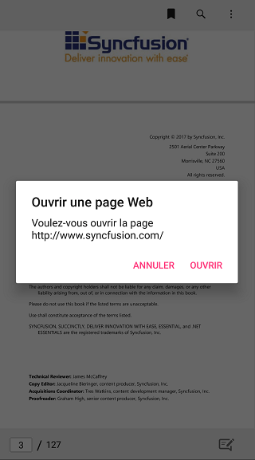

# Localization 

Localization is the process of configuring the application to a specific language. PdfViewerControl supports to localize its static text. SfPdfViewer uses the following static text that can be localized in application level:

<table>

<tr>
<th>Keyword</th>
<th>Text(English)</th>
</tr>

<tr>
<td>SfPdfViewerCancel</td>
<td>Cancel</td>
</tr>

<tr>
<td>SfPdfViewerCopy</td>
<td>Copy</td>
</tr>

<tr>
<td>SfPdfViewerHighlight</td>
<td>Highlight</td>
</tr>

<tr>
<td>SfPdfViewerHyperlinkCancel</td>
<td>Cancel</td>
</tr>

<tr>
<td>SfPdfViewerHyperlinkMessage</td>
<td>Do you want to open the webpage</td>
</tr>

<tr>
<td>SfPdfViewerHyperlinkMessageTitle</td>
<td>Open web page</td>
</tr>

<tr>
<td>SfPdfViewerHyperlinkOpen</td>
<td>Open</td>
</tr>

<tr>
<td>SfPdfViewerInvalidPageMessage</td>
<td>Invalid Page Number</td>
</tr>

<tr>
<td>SfPdfViewerInvalidPageMessageTitle</td>
<td>Error</td>
</tr>

<tr>
<td>SfPdfViewerNoMatches</td>
<td>No matches were found</td>
</tr>

<tr>
<td>SfPdfViewerNoOccurrences</td>
<td>No more matches were found</td>
</tr>

<tr>
<td>SfPdfViewerOkMessage</td>
<td>Ok</td>
</tr>

<tr>
<td>SfPdfViewerPageEntryCancel</td>
<td>Cancel</td>
</tr>

<tr>
<td>SfPdfViewerPageEntryOkay</td>
<td>Ok</td>
</tr>

<tr>
<td>SfPdfViewerPageNumberEntryMessage</td>
<td>Enter Page Number</td>
</tr>

<tr>
<td>SfPdfViewerPageNumberEntryMessageTitle</td>
<td>Go To Page</td>
</tr>

<tr>
<td>SfPdfViewerPlaceHolderText</td>
<td>Type your text</td>
</tr>

<tr>
<td>SfPdfViewerRedo</td>
<td>Redo</td>
</tr>

<tr>
<td>SfPdfViewerSave</td>
<td>Save</td>
</tr>

<tr>
<td>SfPdfViewerSearchResult</td>
<td>Search Result</td>
</tr>

<tr>
<td>SfPdfViewerStrikethrough</td>
<td>Strikethrough</td>
</tr>

<tr>
<td>SfPdfViewerUnderline</td>
<td>Underline</td>
</tr>

<tr>
<td>SfPdfViewerUndo</td>
<td>Undo</td>
</tr>

<tr>
<td>SfPdfViewerSignaturePadTitle</td>
<td>Create Signature</td>
</tr>

<tr>
<td>SfPdfViewerDone</td>
<td>Done</td>
</tr>

<tr>
<td>SfPdfViewerClear</td>
<td>Clear</td>
</tr>

<tr>
<td>SfPdfViewerSignatureCancel</td>
<td>Cancel</td>
</tr>

<tr>
<td>SfPdfViewerSearchPlaceHolderText</td>
<td>Enter text to search</td>
</tr>

<tr>
<td>SfPdfViewerBookmarkToolbarTitle</td>
<td>Bookmarks</td>
</tr>

<tr>
<td>SfPdfViewerNoBookmarksText</td>
<td>No Bookmarks</td>
</tr>

<tr>
<td>SfPdfViewerPrint</td>
<td>Print</td>
</tr>

<tr>
<td>SfPdfViewerContinuousPage</td>
<td>Continuous Pages</td>
</tr>

<tr>
<td>SfPdfViewerPageByPage</td>
<td>Page By Page</td>
</tr>

<tr>
<td>SfPdfViewerOfMessage</td>
<td>Of</td>
</tr>

<tr>
<td>SfPdfViewerSubmit</td>
<td>Submit</td>
</tr>

</table>

To localize the SfPdfViewer, follow the steps in application level:

1. Add a .resx file.
2. Convert the platform specific language format to .NET format.
3. Apply the converted format.

## Add a .resx file

In the portable project of your application, add a `.resx` file inside the resources folder with **Build Action -> EmbeddedResource**. File name should be `Syncfusion control's Namespace + language code` format.

For example, to set the culture as French, the file should be named as **Syncfusion.SfPdfViewer.XForms.fr-FR.resx**.

Based on the language, set the appropriate equivalent text to the static text in the .resx file.

N> You should create and add separate .resx files for individual languages.

## Convert the platform specific language format to .NET format

To get the localized text from the added `.resx` file, declare an interface named ILocalize in your PCL project and implement the interface in each platform renderer. This will query the language set in the device using platform specific code and convert to .NET format.

Refer to the following code snippet to declare the interface in PCL project.




public interface ILocalize
{
	CultureInfo GetCurrentCultureInfo();
	void SetLocale(CultureInfo cultureInfo);
}
public class PlatformCulture
{
	public PlatformCulture(string platformCultureString)
	{
		if (!String.IsNullOrEmpty(platformCultureString))
		{

			PlatformString = platformCultureString.Replace("_", "-"); // .NET expects dash, not underscore
			var dashIndex = PlatformString.IndexOf("-", StringComparison.Ordinal);
			if (dashIndex > 0)
			{
				var parts = PlatformString.Split('-');
				LanguageCode = parts[0];
				LocaleCode = parts[1];
			}
			else
			{
				LanguageCode = PlatformString;
				LocaleCode = "";
			}
		}
	}

	public string PlatformString
	{
		get; private set;
	}

	public string LanguageCode
	{
		get; private set;
	}

	public string LocaleCode
	{
		get; private set;
	}

	public override string ToString()
	{
		return PlatformString; ;
	}
}




Refer to the following code to implement the interface in Android renderer project.




public class Localize : ILocalize

{

    public void SetLocale(CultureInfo cultureInfo)
    {
        Thread.CurrentThread.CurrentCulture = cultureInfo;
        Thread.CurrentThread.CurrentUICulture = cultureInfo;
    }

    public CultureInfo GetCurrentCultureInfo()
    {
        var netLanguage = "en";
        var androidLocale = Java.Util.Locale.Default;
        netLanguage = AndroidToDotnetLanguage(androidLocale.ToString().Replace("_", "-"));

        // this gets called a lot - try/catch can be expensive so consider caching or something
        CultureInfo cultureInfo = null;
        try
        {
            cultureInfo = new CultureInfo(netLanguage);
        }
        catch
        {
            // iOS locale not valid .NET culture (eg. "en-ES" : English in Spain)
            // fallback to first characters, in this case "en"
            try
            {
                var fallback = ToDotnetFallbackLanguage(new PlatformCulture(netLanguage));
                cultureInfo = new CultureInfo(fallback);
            }
            catch
            {
                // iOS language not valid .NET culture, falling back to English
                cultureInfo = new CultureInfo("en");
            }
        }

        return cultureInfo;
    }

    private string AndroidToDotnetLanguage(string androidLanguage)
    {
        var netLanguage = androidLanguage;

        //certain languages need to be converted to CultureInfo equivalent
        switch (androidLanguage)
        {
            case "ms-BN":   // "Malaysian (Brunei)" not supported .NET culture
            case "ms-MY":   // "Malaysian (Malaysia)" not supported .NET culture
            case "ms-SG":   // "Malaysian (Singapore)" not supported .NET culture
                netLanguage = "ms"; // closest supported
                break;
            case "in-ID":  // "Indonesian (Indonesia)" has different code in  .NET 
                netLanguage = "id-ID"; // correct code for .NET
                break;
            case "gsw-CH":  // "Schwiizertüütsch (Swiss German)" not supported .NET culture
                netLanguage = "de-CH"; // closest supported
                break;
                // add more application-specific cases here (if required)
                // ONLY use cultures that have been tested and known to work
        }

        return netLanguage;
    }

    private string ToDotnetFallbackLanguage(PlatformCulture platformCulture)
    {
        var netLanguage = platformCulture.LanguageCode; // use the first part of the identifier (two chars, usually);

        switch (platformCulture.LanguageCode)
        {
            case "gsw":
                netLanguage = "de-CH"; // equivalent to German (Switzerland) for this app
                break;
                // add more application-specific cases here (if required)
                // ONLY use cultures that have been tested and known to work
        }

        return netLanguage;
    }

}



Refer to the following code to implement the interface in iOS renderer project.




public class Localize : ILocalize
{
    public void SetLocale(CultureInfo cultureInfo)
    {
        Thread.CurrentThread.CurrentCulture = cultureInfo;
        Thread.CurrentThread.CurrentUICulture = cultureInfo;
    }

    public CultureInfo GetCurrentCultureInfo()
    {
        var netLanguage = "en";
        if (NSLocale.PreferredLanguages.Length > 0)
        {
            var pref = NSLocale.PreferredLanguages[0];

            netLanguage = iOSToDotnetLanguage(pref);
        }

        // this gets called a lot - try/catch can be expensive so consider caching or something
        CultureInfo cultureInfo = null;
        try
        {
            cultureInfo = new CultureInfo(netLanguage);
        }
        catch
        {
            // iOS locale not valid .NET culture (eg. "en-ES" : English in Spain)
            // fallback to first characters, in this case "en"
            try
            {
                var fallback = ToDotnetFallbackLanguage(new PlatformCulture(netLanguage));
                cultureInfo = new CultureInfo(fallback);
            }
            catch
            {
                // iOS language not valid .NET culture, falling back to English
                cultureInfo = new CultureInfo("en");
            }
        }

        return cultureInfo;
    }
    private string iOSToDotnetLanguage(string iOSLanguage)
    {
        var netLanguage = iOSLanguage;

        //certain languages need to be converted to CultureInfo equivalent
        switch (iOSLanguage)
        {
            case "ms-MY":   // "Malaysian (Malaysia)" not supported .NET culture
            case "ms-SG":   // "Malaysian (Singapore)" not supported .NET culture
                netLanguage = "ms"; // closest supported
                break;
            case "gsw-CH":  // "Schwiizertüütsch (Swiss German)" not supported .NET culture
                netLanguage = "de-CH"; // closest supported
                break;
                // add more application-specific cases here (if required)
                // ONLY use cultures that have been tested and known to work
        }

        return netLanguage;
    }

    private string ToDotnetFallbackLanguage(PlatformCulture platCulture)
    {
        var netLanguage = platCulture.LanguageCode; // use the first part of the identifier (two chars, usually);

        switch (platCulture.LanguageCode)
        {
            // 
            case "pt":
                netLanguage = "pt-PT"; // fallback to Portuguese (Portugal)
                break;
            case "gsw":
                netLanguage = "de-CH"; // equivalent to German (Switzerland) for this app
                break;
                // add more application-specific cases here (if required)
                // ONLY use cultures that have been tested and known to work
        }

        return netLanguage;
    }
}




Implementation of the interface is not required for UWP project, since the resources automatically recognizes the selected language.

## Apply the converted format 

After setting the root/main page of the application in your MainPage.Xaml.cs file of the PCL project, initialize a new instance of the `ResourceManager` class and set it to the `PdfViewerResourceManager.Manager` property to look up into the resources with specified root name in the given assembly. Using `DependencyService`, call `SetLocale()` of the implemented interface with necessary language code as parameter.




public partial class MainPage : ContentPage
{
	public MainPage()
	{
		InitializeComponent();

		//The PDF is in the Assets folder of this project. Read it into a stream
		Stream stream = typeof(App).GetTypeInfo().Assembly.GetManifestResourceStream("GettingStarted.Assets.Xamarin_Forms_Succinctly.pdf");
		//Load the stream to PdfViewer
		pdfViewerControl.LoadDocument(stream);
		//Assign the localized string to the specific culture
		PdfViewerResourceManager.Manager=new ResourceManager("GettingStarted.Resources.Syncfusion.SfPdfViewer.XForms", GetType().GetTypeInfo().Assembly);
	}
}




For Android and iOS, it is mandatory to implement the previous steps. However, to set the specific language to the application irrespective of the selected language in the device, use `CultureInfo.CurrentUICulture` in a specific project of UWP platform.

Refer to the following code example to localize the text in UWP platform.

MainPage.Xaml.cs



public MainPage()
{
    this.InitializeComponent();
    SfPdfViewerRenderer.Init();
    // Applying localization for UWP
    CultureInfo.CurrentUICulture = new CultureInfo("fr");
    LoadApplication(new GettingStarted.App());
}




