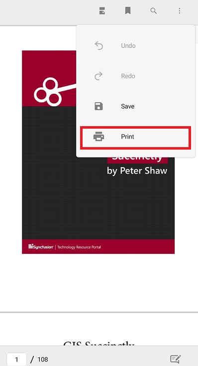

# Printing PDF files

[Xamarin PDF Viewer](https://www.syncfusion.com/xamarin-ui-controls/xamarin-pdf-viewer) allows printing the loaded PDF documents using the Print button in the built-in toolbar. 

The Print operation could be performed using the following APIs programmatically.




//Print the PDF
pdfViewerControl.Print();

//Print the PDF with given file name
pdfViewerControl.Print(string filename);




The following example demonstrates the usage of print operation within a button click event.




private void Button_Clicked(object sender, EventArgs e)
{
	//Print the PDF
    pdfViewerControl.Print("PdfFileName.pdf");
}




N>The default file name of the printed document will be “SavedDocument.pdf”.

N>You can also explore our [Xamarin.Forms PDF Viewer example](https://github.com/syncfusion/xamarin-demos/tree/master/Forms/PdfViewer) to knows the functionalities of each feature.