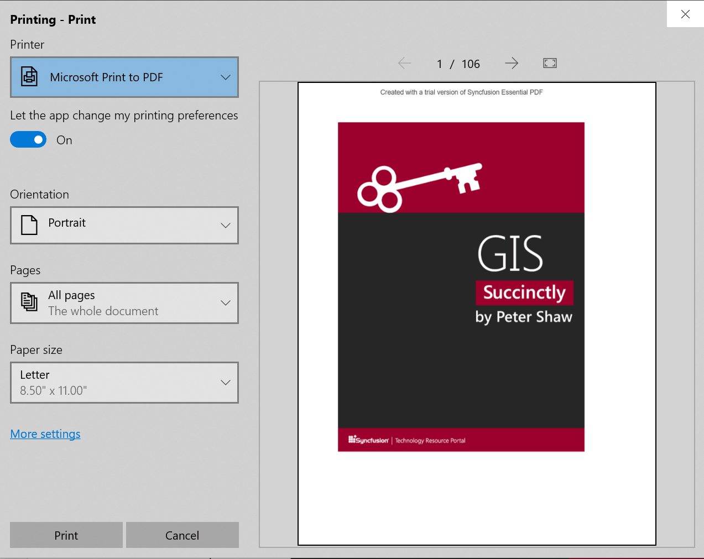
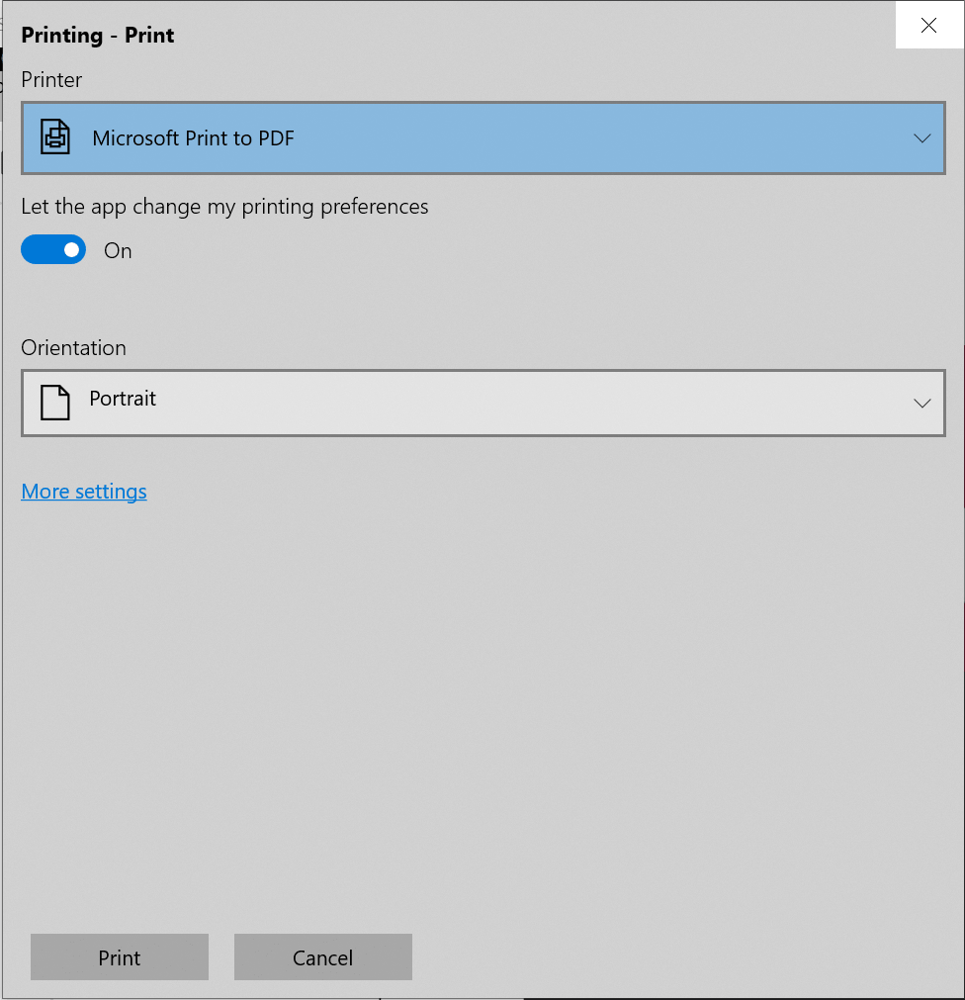

# Printing PDF files in Xamarin Pdf Viewer (SfPdfViewer)

[Xamarin PDF Viewer](https://www.syncfusion.com/xamarin-ui-controls/xamarin-pdf-viewer) allows printing the loaded PDF documents using the Print button in the built-in toolbar. 

The Print operation could be performed using the following APIs programmatically.




//Print the PDF
pdfViewerControl.Print();

//Print the PDF with given file name
pdfViewerControl.Print(string filename);




The following example demonstrates the usage of print operation within a button click event.




private void Button_Clicked(object sender, EventArgs e)
{
	//Print the PDF
    pdfViewerControl.Print("PdfFileName.pdf");
}




N>The default file name of the printed document will be “SavedDocument.pdf”.

N>You can also explore our [Xamarin.Forms PDF Viewer example](https://github.com/syncfusion/xamarin-demos/tree/master/Forms/PdfViewer) to knows the functionalities of each feature.

## How to get and set the quality factor for print

The PDF Viewer allows the user to set and retrieve the quality factor for print by using the `QualityFactor` API. The default value of this API is set to 1, and the values are restricted between 1 and 5. The values falling below the range are taken as 1, which represents the lowest page quality, and those above the range are taken as 5, which represents the highest page quality.

Refer to the following code sample to set the quality factor for print.




//Sets the quality factor for print.
pdfViewerControl.PrinterSettings.QualityFactor = 2;




N>At present this feature is only available on the UWP platform. Printing with quality factors higher than 2 will work as expected in the x64 configuration but may cause System.OutOfMemoryException in the x86 configuration due to the limited memory capacity of this architecture. 

## How to customize the print previewer in the UWP platform 

The PDF Viewer allows the user to customize the print options displayed in the print previewer while performing a print operation. The `PrintTaskRequested` event will be raised when you call the [Print](https://help.syncfusion.com/cr/xamarin/Syncfusion.SfPdfViewer.XForms.SfPdfViewer.html#Syncfusion_SfPdfViewer_XForms_SfPdfViewer_Print) method to print a PDF document.




//Wire up the PrintTaskRequested event with the PdfViewer_PrintTaskRequested method.
pdfViewer.PrintTaskRequested += PdfViewer_PrintTaskRequested;




The print previewer can be customized on desktop using the native UWP APIs such as `PrintTask`, `PrintDocumentSource`, and `Request`. So, the `PrintTaskRequested` event in the Forms.UWP project must be handled using the dependency service.




private void PdfViewer_PrintTaskRequested(object sender, SfPdfViewerPrintTaskRequestedEventArgs e) 
{
     DependencyService.Get<IPrintRequestHandler>().PrintTaskRequested(sender, e)
}




In the `PrintTaskRequested` event handler, you can include the required print options such as the number of copies, collation, duplex, and more by creating a `PrintTask` using the properties `Request` and `PrintDocumentSource`. 

Refer to the following code example.




void PrintTaskRequested (object sender, SfPdfViewerPrintTaskRequestedEventArgs e)
{

PrintTask printTask = null;
printTask = (e.Request as PrintTaskRequest).CreatePrintTask("Printing", sourceRequested =>
{

PrintTaskOptionDetails printDetailedOptions = PrintTaskOptionDetails.GetFromPrintTaskOptions(printTask.Options);
                IList<string> displayedOptions = printDetailedOptions.DisplayedOptions;
displayedOptions.Add(Windows.Graphics.Printing.StandardPrintTaskOptions.CustomPageRanges);
printTask.Options.PageRangeOptions.AllowCurrentPage = true;
                printTask.Options.PageRangeOptions.AllowAllPages = true;
                printTask.Options.PageRangeOptions.AllowCustomSetOfPages = true;

// Set the pdfViewerControl’s print document source.
sourceRequestedArgs.SetSource(e.PrintDocumentSource as IPrintDocumentSource);
e.PrintTask = printTask;

});
}




The PDF Viewer allows the users to hide the PDF pages and enable only the print options. This can be done by disabling the print preview.

Refer to the following code example.




void PrintTaskRequested (object sender, SfPdfViewerPrintTaskRequestedEventArgs e)
{
   PrintTask printTask = null;
printTask = (e.Request as PrintTaskRequest).CreatePrintTask("Printing", sourceRequested =>
 {
 
// Set the SfPdfViewerControl’s print document source.
sourceRequestedArgs.SetSource(e.PrintDocumentSource as IPrintDocumentSource);
e.PrintTask = printTask;

});
printTask.IsPreviewEnabled = false;
}




