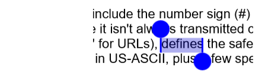

# Select and copy text

The PDF viewer supports text selection and copy feature, which allows user to select the text in the PDF document and copy it to the clipboard. This section illustrates about how to use this feature.

<table>

<tr>
<th>Property</th>
<th>Action</th>
</tr>

<tr>
<td>IsTextSelectionEnabled</td>
<td>Gets or sets the value that enables or disables the text selection feature in the PDF viewer. This property when set to true enables text selection and vice versa. By default, this property is set to true.</td>
</tr>

</table>




<syncfusion:SfPdfViewer x:Name="pdfViewerControl" IsTextSelectionEnabled="False"/>







//Text selection feature in the PDF viewer is disabled.
pdfViewerControl.IsTextSelectionEnabled = false;




## How to select text?

To select a text in the PDF page, press and hold any word of the text until selection bubbles appear at the top-left and bottom-right corners of its bounds. Then, use the left bubble to select the text at the left and top, and the right bubble to select the text at the right and bottom directions. 

## How to enable or disable the context menu?

By default, PDF viewer comes with a context menu that will be displayed above the selected text in the PDF document, which has a button (option) to copy the selected text. The display of the context menu can be disabled by setting ShowContextMenu property of the TextSelectionSettings class to false. The below code illustrates the same. By default, context menu will be enabled in the PDF viewer. 




//The display of the default context menu for the text selection is disabled.
pdfViewerControl.TextSelectionSettings.ShowContextMenu = false;




## How to modify the selection and its handle color?

The color used for text selection and the color of the handle can be customized based on the developer’s requirements. The properties TextSelectionColor and TextSelectionHandleColor of the TextSelectionSettings class can be used to customize them. The below code snippet illustrates the same.




//Customizing the color being displayed while selecting the text from PDF document.
pdfViewerControl.TextSelectionSettings.TextSelectionColor = Color.FromRgba(0, 0, 205, 80);

//Customizing the color of text selection handler displayed while selecting the text from PDF document.
pdfViewerControl.TextSelectionSettings.TextSelectionHandleColor = Color.FromRgb(0, 0, 255);




## How to acquire selected text?

The completion of the text selection action would trigger TextSelectionCompleted event.  The event argument of this event will contain a copy of the selected text in the String format. 




<syncfusion:SfPdfViewer x:Name="pdfViewerControl" InputFileStream="{Binding PdfDocumentStream}" TextSelectionCompleted="PdfViewerControl_TextSelectionCompleted"/>







        private void PdfViewerControl_TextSelectionCompleted(object sender, TextSelectionCompletedEventArgs args)
        {
			//The selected text is acquired and stored in the variable selectedText.
            string selectedText = args.SelectedText;
        }




## How to acquire page number, page bounds and selected region?

The completion of the text selection action would trigger TextSelectionCompleted event.  The event argument would contain details about the page number in which the selection operation is performed, bounds of the page and the selection region. 




<syncfusion:SfPdfViewer x:Name="pdfViewerControl" InputFileStream="{Binding PdfDocumentStream}" TextSelectionCompleted="PdfViewerControl_TextSelectionCompleted"/>







        private void PdfViewerControl_TextSelectionCompleted(object sender, TextSelectionCompletedEventArgs args)
        {
			//The number of the page in which the selection is performed is acquired.
            int pageNumber = args.PageNumber;
			
			//The bounds of the page in which the selection is performed is acquired.
            Rectangle pageBounds= args.PageBounds;
			
			//The region of the text being selected is acquired.
            Rectangle selectedRegion= args.SelectedRegion;
        }


