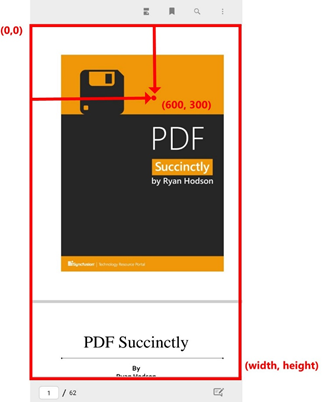
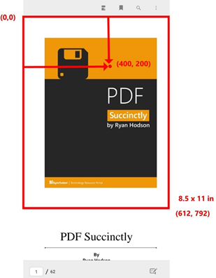

# Working with PDF coordinates in Xamarin Pdf Viewer(SfPdfViewer)

PDF Viewer allows users to obtain the PDF page coordinates relative to the PDF Viewer's client coordinates and vice versa. It also allows you to obtain the scroll point relative to the PDF page coordinates and bring the given region into view.
 
## Get and set scroll coordinates
 
Navigate to the specified vertical and horizontal scroll offset coordinates in PDF Viewer using the `ScrollToOffset (HorizontalOffset, VerticalOffset)` method. You can also retrieve the current horizontal and vertical offset position by using the `HorizontalOffset` and `VerticalOffset` properties respectively in the SfPdfViewer class.
 



//Retrieve the current horizontal offset of the PdfViewerControl.
m_currentHorizontalOffset = pdfViewerControl.HorizontalOffset;
 
//Retrieve the current vertical offset of the PdfViewerControl.
m_currentVerticalOffset = pdfViewerControl.VerticalOffset;
 
//Scroll the content to the specified vertical offset position in the PdfViewerControl.
pdfViewerControl.ScrollToOffset(m_currentHorizontalOffset+10, m_currentVerticalOffset+10);



 
## PDF Viewer's coordinates or client coordinates

 
You can obtain the PDF Viewer's client area (viewport) coordinates using the `ClientRectangle` property and the following code sample explains the same. This property will return the coordinate value without the consideration of non-client elements like toolbars and scroll bars. 




//Retrieve the coordinates of the PDF Viewer's client area (viewport)
Rectangle clientRectangle = pdfViewerControl.ClientRectangle;



 
## PDF page coordinates

 
PDF page coordinates are represented in terms of device-independent coordinate system called user space, which is independent of the output device that will be used for printing or display. The user space coordinate system is initialized to a default state for each page of a PDF document. The length of a unit is **1/72 inch**, which is approximately the same as a unit of **point(pt)**. As an example, the dimensions of a letter-sized paper in PDF page coordinates are shown in the diagram below. 
 
## Convert PDF Viewer's coordinates to PDF page coordinates
 
You can obtain the PDF page coordinates using the `ConvertClientPointToPagePoint(clientPoint, pageNumber)` method by passing the client rectangle point and page number as input parameters. The following code sample explains how to convert a tapped client area position to a page point.  
 



pdfViewerControl.Tapped += PdfViewerControl_Tapped; 
 
// Handle the tapped event.
private void PdfViewerControl_Tapped(object sender, TouchInteractionEventArgs e)
{
    //Retrieve the tapped client area position.
    Point clientPoint = e.Position;
 
    //Retrieve the page number that corresponds to the client point.
    int pageNumber = pdfViewerControl.GetPageNumberFromClientPoint(clientPoint)
 
    //Retrieve the page point.
    Point pagePoint = pdfViewerControl.ConvertClientPointToPagePoint(clientPoint, pageNumber);
} 
		


 
## Convert PDF page coordinates to PDF Viewer's coordinates
 
You can obtain the PDF page coordinates using the `ConvertPagePointToClientPoint(pagePoint, pageNumber)` method by passing the page point and page number as input parameters. The following code sample explains how to convert a shape annotation's position in the page coordinates to a client point. 




//Get a shape annotation from the Annotations collection.
ShapeAnnotation shapeAnnotation = pdfViewerControl.Annotations[0] as ShapeAnnotation;
 
//Get the annotation’s page number.
int pageNumber = shapeAnnotation.PageNumber;
 
//Get the annotation bounds.
Rectangle annotationBounds = shapeAnnotation.Bounds;
 
//Find the position of the annotation in page coordinates.
Point pagePoint = new Point(annotationBounds.X, annotationBounds.Y);
 
//Convert the page point to client point.
Point clientPoint = pdfViewerControl.ConvertPagePointToClientPoint(pagePoint, pageNumber)
 

 

## Convert PDF page coordinates to scroll coordinates
 
You can obtain the PDF Viewer's scroll coordinates using the `ConvertPagePointToScrollPoint(pagePoint, pageNumber)` method by passing the page point and page number as input parameters. The following code example explains how to convert a shape annotation’s position in the page coordinates to a scroll point and then scrolling to that annotation's position in the PDF Viewer.




//Get a shape annotation from the Annotations collection.
ShapeAnnotation shapeAnnotation = pdfViewerControl.Annotations[0] as ShapeAnnotation;
 
//Get the annotation bounds.
Rectangle annotationBounds = shapeAnnotation.Bounds;
 
//Get the annotation’s page number.
int pageNumber = shapeAnnotation.PageNumber;
 
//Find the position of the annotation in page coordinates.
Point pagePoint = new Point(annotationBounds.X, annotationBounds.Y);
 
//Convert the page point to scroll point.
Point scrollPoint = pdfViewerControl.ConvertPagePointToScrollPoint(pagePoint, pageNumber)
 
//Scrolling to the annotation’s position using the ScrollToOffset API.
pdfViewerControl.ScrollToOffset((float)scrollPoint.X, (float)scrollPoint.Y);
 



## Bring a particular region to the view
 
You can bring the given rectangular region to view and zoom in the document to fit the region in the PDF Viewer's client area (viewport) using the `ZoomToRect(rectangle)` method by passing the rectangular region as input parameter. The following code sample explains how to bring a particular into view.




//Get a shape annotation from the Annotations collection.
ShapeAnnotation shapeAnnotation = pdfViewerControl.Annotations[0] as ShapeAnnotation;
 
//Get the annotation bounds.
Rectangle annotationBounds = shapeAnnotation.Bounds;
 
//Convert the annotation bounds from the page coordinates to a rectangle in client coordinates. 
Point topLeft = new Point(annotationBounds.Left, annotationBounds.Top);
            
Point rightBottom = new Point(annotationBounds.Right, annotationBounds.Bottom);
            
Point clientTopLeft = pdfViewerControl.ConvertPagePointToClientPoint(topLeft, pageNumber);
            
Point clientRightBottom = pdfViewerControl.ConvertPagePointToClientPoint(rightBottom, pageNumber);
            
double width = clientRightBottom.X - clientTopLeft.X;
            
double height = clientRightBottom.Y - clientTopLeft.Y;
            
Rectangle rectangleBounds = new Rectangle(clientTopLeft.X, clientTopLeft.Y, width, height);
 
//Pass the converted rectangle in client coordinates to the ZoomToRect method. 
pdfViewerControl.ZoomToRect(rectangleBounds);
 


