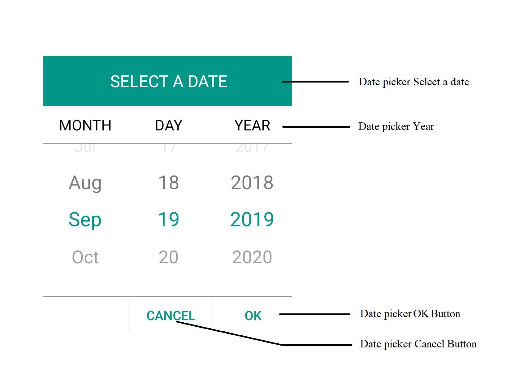

# AutomationId support for Picker Control in Xamarin.Forms

The SfPicker control has built-in `AutomationId` for inner elements. The `AutomationId` API allows the automation framework to find and interact with the inner elements of the `SfPicker` control. To keep unique AutomationId, these inner elements' AutomationIds are updated based on the control's `AutomationId`. 

For example, if you set SfPicker's `AutomationId` as "Date picker", then the automation framework will interact with the OK button as "Date picker OK Button". The following screenshot illustrates the AutomationIds of inner elements. 

You can only interact with the header, column header, OK, and Cancel buttons.

