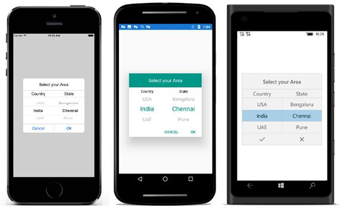

# Cascading

This section explains the steps required to create custom cascading sample by using picker control.

The cascading sample has been created for updating the state collection based on selected item picker.

Please refer the  following steps to create the cascading sample 

**Step** **1** **:** Create three ObservableCollection with object type in PickerCascading class. 

**Collection** **details** **:** 

Area collection, Country collection, and State collection.

Country collection -Add country names.

State collection -Add state names.

Area collection -Add above  2 collections.

Area collection is the main collection, and this collection has been assigned to ItemsSource of picker Control.

The following code demonstrates Area collection creation.



public class PickerCascading:INotifyPropertyChanged

{

#region Public Properties

/// 

/// Area is the actual DataSource for SfPicker control which will holds the collection of Country and State

/// 

/// <value>The area.</value>

public ObservableCollection<object> Area { get; set; }

//Country is the collection of country names

private ObservableCollection<object> Country { get; set; }

//State is the collection of state names

private ObservableCollection<object> State { get; set; }

/// 

/// Headers API is holds the column name for every column in cascading picker

/// 

/// <value>The Headers.</value>

public ObservableCollection<string> Header { get; set; }

private object _selectedArea;

public event PropertyChangedEventHandler PropertyChanged;

#endregion

//Identify the selected area using property changed method

public object SelectedArea

{

get { return _selectedArea; }

set { _selectedArea = value; RaisePropertyChanged("SelectedArea"); }

}

public PickerCascading()

{

Area = new ObservableCollection<object>();

Header = new ObservableCollection<string>();

Country = new ObservableCollection<object>();

State = new ObservableCollection<object>();

//populate Countries

Country.Add("UK");

Country.Add("USA");

Country.Add("India");

Country.Add("UAE");

Country.Add("Germany");

//populate states

State.Add("London");

State.Add("Manchester");

State.Add("Cambridge");

State.Add("Edinburgh");

State.Add("Glasgow");

State.Add("Birmingham");

Area.Add(Country);

Area.Add(State);

SelectedArea = new ObservableCollection<object>() { "UK", "London" };

}

//Hooked when changes occurred 

public void RaisePropertyChanged(string name)

{

if (PropertyChanged != null)

PropertyChanged(this, new PropertyChangedEventArgs(name));

}

}



**Step** **2** **:** Update the state collection  based on selected item of country name by using the Selection changed event of picker control.



private void picker_SelectionChanged(object sender, Syncfusion.SfPicker.XForms.SelectionChangedEventArgs e)

{

if (picker.ItemsSource != null && e.NewValue is IList && (picker.ItemsSource as IList).Count > 1 && CurrentItem != (e.NewValue as IList)[0].ToString())
            {
                //Updated the second column collection based on first column selected value.
                (picker.ItemsSource as ObservableCollection<object>).RemoveAt(1);
                (picker.ItemsSource as ObservableCollection<object>).Add(GetCountry((e.NewValue as IList)[0].ToString()));
            }

}



**Step** **3** **:** Define column headers as  “Country” and  “State” by using ColumnHeaderText property of picker control. The following code demonstrates how to define header for each column of picker control.



public class PickerCascading:INotifyPropertyChanged

{           

/// 

/// Headers API is holds the column name for every column in cascading picker

/// 

/// <value>The Headers.</value>

public ObservableCollection<string> Header { get; set; }

public PickerCascading()

{

Header = new ObservableCollection<string>();

Header.Add("Country");

Header.Add("State");

}

}



**Step** **4** **:** Add the cascading picker control in main page of XAML. Please refer the following code snippets.



<ContentPage

x:Class="CascadingPicker.MainPage"

xmlns="http://xamarin.com/schemas/2014/forms"

xmlns:x="http://schemas.microsoft.com/winfx/2009/xaml"

xmlns:local="clr-namespace:CascadingPicker"

xmlns:syncfusion="clr-namespace:Syncfusion.SfPicker.XForms;assembly=Syncfusion.SfPicker.XForms">

<ContentPage.BindingContext>

<local:PickerCascading />

</ContentPage.BindingContext>

<ContentPage.Content>

<Grid HorizontalOptions="Center" VerticalOptions="Center">

<StackLayout>

<Button

Clicked="Button_Clicked"

HeightRequest="40"

Text="Open Picker"

WidthRequest="200" />

</StackLayout>

<syncfusion:SfPicker

x:Name="picker"

ColumnHeaderText="{Binding Header}"

HeaderText="Select your Area"

HeightRequest="350"

ItemsSource="{Binding Area}"

PickerHeight="250"

PickerMode="Dialog"

PickerWidth="280"

SelectedItem="{Binding SelectedArea}"

SelectionChanged="picker_SelectionChanged"

ShowColumnHeader="True"

WidthRequest="300" />

</Grid>

</ContentPage.Content>

</ContentPage>





Grid mainGrid = new Grid();
            mainGrid.HorizontalOptions = LayoutOptions.Center;
            mainGrid.VerticalOptions = LayoutOptions.Center;
            StackLayout mainStack = new StackLayout();
            mainStack.VerticalOptions = LayoutOptions.Center;
            mainStack.HorizontalOptions = LayoutOptions.Center;
            Button button = new Button();
            button.HeightRequest = 40;
            button.Text = "Open Picker";
            button.WidthRequest = 200;
            mainStack.Children.Add(button);
            SfPicker picker = new SfPicker();
            picker.HeaderText = "Select your Area";
            picker.HeightRequest = 350;
            picker.PickerHeight = 250;
            picker.PickerMode = PickerMode.Dialog;
            picker.PickerWidth = 280;
            picker.SelectionChanged += Picker_SelectionChanged;
            picker.ShowColumnHeader = true;
            picker.SetBinding(Picker.SelectedItemProperty, "SelectedArea");
            picker.SetBinding(Picker.ItemsSourceProperty, "Area");
            picker.SetBinding(Picker.ColumnHeaderText, "Header");
            picker.ShowFooter = true;
            picker.WidthRequest = 300;
            mainGrid.Children.Add(mainStack);
            mainGrid.Children.Add(picker);
            this.Content = mainGrid;




The code in the code behind is as follows.



public partial class MainPage : ContentPage

{

string CurrentItem;

public MainPage()

{

InitializeComponent();

}

private void Button_Clicked(object sender, EventArgs e)

{

picker.IsOpen = true;

}

}



The following screenshot illustrates the output of above code snippets.

You can download the sample for reference from the following link.

Sample link: [CascadingSample](http://www.syncfusion.com/downloads/support/directtrac/general/ze/CascadingPicker773245392)