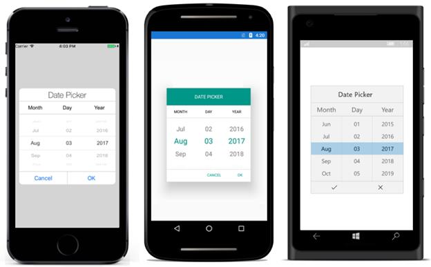

# Date Picker

We recommend to use our standalone Date Picker component which is available from our Volume 4 2019 release and please have the documentation [`link`](https://help.syncfusion.com/xamarin/datepicker/overview). If you need further customizations, below steps explains how to create a custom DatePicker by using the Picker control.

**Step** **1** **:** Create a custom class, and named it as “CustomDatePicker”. This class should be inherited from picker control.



public class CustomDatePicker : SfPicker

{

}



**Step** **2** **:** Create four ObservableCollection with object type in CustomDatePicker class. 

**Collection** **details** **:** 

Date collection, Day collection, Month collection, and Year collection.

Day collection -Add current month's days by using DateTime.DaysInMonth.

Month collection -Add months from January to December.

Year collection -Add years from  1990 to 2050.

Date collection -Add all the three collections.

Date Collection is the main collection, and this collection has been assigned to ItemsSource of picker control.

The following code demonstrates Date collection creation.


public class CustomDatePicker : SfPicker

{

#region Public Properties

// Months API is used to modify the Day collection as per change in Month

internal Dictionary<string, string> Months { get; set; }

/// 

/// Date is the actual DataSource for SfPicker control which will holds the collection of Day ,Month and Year

/// 

/// <value>The date.</value>

public ObservableCollection<object> Date { get; set; }

//Day is the collection of day numbers

internal ObservableCollection<object> Day { get; set; }

//Month is the collection of Month Names

internal ObservableCollection<object> Month{ get; set; }

//Year is the collection of Years from 1990 to 2042

internal ObservableCollection<object> Year{ get; set; }

#endregion

public CustomDatePicker()

{

Months = new Dictionary<string, string>();

Date = new ObservableCollection<object>();

Day = new ObservableCollection<object>();

Month = new ObservableCollection<object>();

Year = new ObservableCollection<object>();

PopulateDateCollection();

this.ItemsSource = Date;

}

private void PopulateDateCollection()

{

//populate months

for (int i = 1; i < 13; i++)

{

if (!Months.ContainsKey(CultureInfo.CurrentCulture.DateTimeFormat.GetMonthName(i).Substring(0, 3)))

Months.Add(CultureInfo.CurrentCulture.DateTimeFormat.GetMonthName(i).Substring(0, 3), CultureInfo.CurrentCulture.DateTimeFormat.GetMonthName(i));

Month.Add(CultureInfo.CurrentCulture.DateTimeFormat.GetMonthName(i).Substring(0, 3));

}

//populate year

for (int i = 1990; i < 2050; i++)

{

Year.Add(i.ToString());

}

//populate Days

for (int i = 1; i <= DateTime.DaysInMonth(DateTime.Now.Year, DateTime.Now.Month); i++)

{

if (i < 10)

{

Day.Add("0" + i);

}

else

Day.Add(i.ToString());

}

Date.Add(Month);

Date.Add(Day);

Date.Add(Year);

}

}



**Step** **3** **:** Update the day value based on month and year values by using Selection changed event of picker control. Since the days of each month differs, you should handle this collection.


public CustomDatePicker()

{

//hook selection changed event

this.SelectionChanged += CustomDatePicker_SelectionChanged;

}

private void CustomDatePicker_SelectionChanged(object sender, SelectionChangedEventArgs e)

{

UpdateDays(Date, e);

}

//Update days method is used to alter the Date collection as per selection change in Month column(if Feb is Selected day collection has value from 1 to 28)

public void UpdateDays(ObservableCollection<object> Date, SelectionChangedEventArgs e)

{

Device.BeginInvokeOnMainThread(() =>

{

        if (Date.Count == 3)
        {
            bool flag = false;
            if (e.OldValue != null && e.NewValue != null && (e.OldValue as ObservableCollection<object>).Count == 3 && (e.NewValue as ObservableCollection<object>).Count== 3 )
            {
                if (!object.Equals((e.OldValue as IList)[0], (e.NewValue as IList)[0]))
                {
                    flag = true;
                }
                if (!object.Equals((e.OldValue as IList)[2], (e.NewValue as IList)[2]))
                {
                    flag = true;
                }
            }

            if (flag)
            {

                ObservableCollection<object> days = new ObservableCollection<object>();
                int month = DateTime.ParseExact(Months[(e.NewValue as IList)[0].ToString()], "MMMM", CultureInfo.InvariantCulture).Month;
                int year = int.Parse((e.NewValue as IList)[2].ToString());
                for (int j = 1; j <= DateTime.DaysInMonth(year, month); j++)
                {
                    if (j < 10)
                    {
                        days.Add("0" + j);
                    }
                    else
                        days.Add(j.ToString());
                }
                ObservableCollection<object> PreviousValue = new ObservableCollection<object>();

                foreach (var item in e.NewValue as IList)
                {
                    PreviousValue.Add(item);
                }
                if (days.Count > 0)
                {
                    Date.RemoveAt(1);
                    Date.Insert(1, days);
                }

                if ((Date[1] as IList).Contains(PreviousValue[1]))
                {
                    this.SelectedItem = PreviousValue;
                }
                else
                {
                    PreviousValue[1] = (Date[1] as IList)[(Date[1] as IList).Count - 1];
                    this.SelectedItem = PreviousValue;
                }
            }
        }
});

}



**Step** **4** **:** Define each column headers “Day”, “Month”, and “Year” by using ColumnHeaderText property of picker control. The following code demonstrates how to define header for each column of picker control.


public class CustomDatePicker : SfPicker

{

/// 

/// Headers API is holds the column name for every column in date picker

/// 

/// <value>The Headers.</value>

public ObservableCollection<string> Headers { get; set; }

public CustomDatePicker()

{

Headers = new ObservableCollection<string>();

Headers.Add("Month");

Headers.Add("Day");

Headers.Add("Year");

//SfPicker header text

HeaderText = "Date Picker";

// Column header text collection

this.ColumnHeaderText = Headers;

}

}



**Step** **5** **:** Finally, enable the picker header, Column header, and footer by using ShowHeader,ShowFooter and ShowColumnHeader properties.


public CustomDatePicker()

{

//Enable Footer

ShowFooter = true;

//Enable SfPicker Header

ShowHeader = true;

//Enable Column Header of SfPicker

ShowColumnHeader = true;

}



**Step** **6** **:** Add the CustomDatePicker control in main XAML page. Please refer the following code snippets.



<ContentPage

x:Class="DatePicker.DatePickerPage"

xmlns="http://xamarin.com/schemas/2014/forms"

xmlns:x="http://schemas.microsoft.com/winfx/2009/xaml"

xmlns:local="clr-namespace:DatePicker"

xmlns:picker="clr-namespace:Syncfusion.SfPicker.XForms;assembly=Syncfusion.SfPicker.XForms">

<ContentPage.BindingContext>

<local:DatePickerViewModel />

</ContentPage.BindingContext>

<Grid>

<Button

Clicked="Button_Clicked"

HeightRequest="30"

HorizontalOptions="Center"

Text="Show Picker"

VerticalOptions="Center"

WidthRequest="200" />

<local:CustomDatePicker

x:Name="date"

ColumnHeaderHeight="40"

HorizontalOptions="Center"

PickerHeight="400"

PickerMode="Dialog"

PickerWidth="300"

SelectedItem="{Binding StartDate}"

VerticalOptions="Center" />

</Grid>

</ContentPage>




public partial class DatePickerPage : ContentPage

{

public DatePickerPage()

{

InitializeComponent();

}

private void Button_Clicked(object sender, EventArgs e)

{

date.IsOpen = !date.IsOpen;

}

}




The following screenshot illustrates the output of above code snippets.

You can download the DatePicker sample for reference from the following link.

Sample link: [DatePicker](http://www.syncfusion.com/downloads/support/directtrac/general/ze/DatePicker1101853647)

