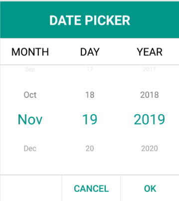

# Dealing with Header and Footer

This section explains about the header and footer customization of picker control.

## Enable or disable header 

SfPicker allows enabling or disabling the header section by setting `SfPicker.ShowHeader` property to True or False. Default value of `SfPicker.ShowHeader` property is True.




<syncfusion:SfPicker

x:Name="picker" ShowColumnHeader="False"

HeaderText="Select a Date" />





picker.ShowHeader = false;




## Set custom header 

SfPicker allows providing custom text to its header by setting `SfPicker.HeaderText` property. Default value of `SfPicker.HeaderText` property is Null.




<syncfusion:SfPicker

x:Name="picker">

  <syncfusion:SfPicker.HeaderView>

<Grid>

<Button Text="Select a Color" TextColor="Red" />

</Grid>

</syncfusion:SfPicker.HeaderView>

  </syncfusion:SfPicker>
 




picker.HeaderText = "Select a Date";




## Header customization

SfPicker allows customizing background, text color, and fonts.

### Background

Header's background color can be customized  by setting `SfPicker.HeaderBackgroundColor` property.




<syncfusion:SfPicker

x:Name="picker"

HeaderBackgroundColor="SkyBlue"

HeaderText="Select a Date" />





picker.HeaderBackgroundColor = Color.SkyBlue;




## Customization for custom Header

For custom header, you need to provide the BackgroundColor for the layout instead of Picker HeaderBackgroundColor.




<syncfusion:SfPicker x:Name="picker" ShowHeader="True">

<syncfusion:SfPicker.HeaderView>

<Grid BackgroundColor="Purple">

<Label Text="Cancel" TextColor="Red" />

</Grid>

</syncfusion:SfPicker.HeaderView>

</syncfusion:SfPicker>





picker.ShowHeader = true;

picker.HeaderText = "Select a Date";

Grid layout = new Grid();

layout.BackgroundColor = Color.Red;

picker.HeaderView = layout;




### Text-Color 

Header text's color can be customized by setting `SfPicker.HeaderTextColor` property.




<syncfusion:SfPicker

x:Name="picker"

HeaderTextColor="Red"

HeaderText="Select a Date" />





picker.HeaderTextColor = Color.Red; 




### Font 

This section explains about the customization of header text's of Font.

#### 	FontFamily

Header text's FontFamily can be customized by setting `SfPicker.HeaderFontFamily` property.




<syncfusion:SfPicker

x:Name="picker"

HeaderFontFamily="Arial"

HeaderText="Select a Date" />





picker.HeaderFontFamily = "Arial";




#### 	FontSize

Header text's FontSize can be customized by setting `SfPicker.HeaderFontSize` property.




<syncfusion:SfPicker

x:Name="picker"

HeaderFontSize="18"

HeaderText="Select a Date" /> 





picker.HeaderFontSize = 18;


   

#### 	FontAttribute

Header text's FontAttribute can be customized by setting `SfPicker.HeaderFontAttribute` property.




<syncfusion:SfPicker

x:Name="picker"

HeaderFontAttribute="Italic"

HeaderText="Select a Date" />





picker.HeaderFontAttribute = FontAttributes.Italic;




## Set custom footer

picker allows providing custom view to its footer by setting `SfPicker.FooterView` property. Default value of `SfPicker.FooterView` property is Null.




<syncfusion:SfPicker x:Name="picker" ShowFooter="True">

<syncfusion:SfPicker.FooterView>

<Grid>

<Label Text="Cancel" TextColor="Red" />

</Grid>

</syncfusion:SfPicker.FooterView>

</syncfusion:SfPicker>





picker.ShowFooter = true;

Grid layout = new Grid();

layout.Children.Add(new Button() { Text = "Ok", TextColor = Color.Red });

picker.FooterView = layout;




## Enable or disable footer 

Picker allows enabling or disabling the footer section by setting `SfPicker.ShowFooter` property to True or False. Default value of `SfPicker.ShowFooter` property is False.




<syncfusion:SfPicker

x:Name="picker" ShowFooter="True"

/>





picker.ShowFooter = true;




## Perform validation with default validation button

Picker allows performing validation based on OK or Cancel button by hooking `SfPicker.OkButtonClicked` and `SfPicker.CancelButtonClicked`. In this event, from the `SelectionChangedEvent` argument, current selected items can be obtained.




<syncfusion:SfPicker

x:Name="picker"

CancelButtonClicked="picker_CancelButtonClicked"

OkButtonClicked="picker_OkButtonClicked"

ItemsSource="{Binding Colors}"

ShowFooter="True" />





picker.OkButtonClicked += picker_OkButtonClicked;

picker.CancelButtonClicked += picker_CancelButtonClicked;

private void picker_OkButtonClicked(object sender, Syncfusion.SfPicker.XForms.SelectionChangedEventArgs e)
{
    //// Perform any operation.
}

private void picker_CancelButtonClicked(object sender, Syncfusion.SfPicker.XForms.SelectionChangedEventArgs e)
{
    //// Perform any operation.
}


