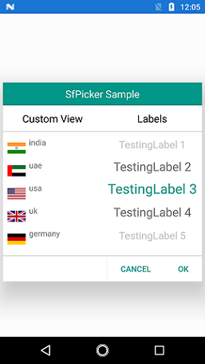
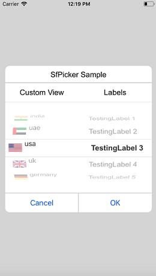

# Populating Items

This section explains the ways of populating items for picker control.

## Binding data source

picker control is bound to the external data source to display the data. It supports any collections that implements the `IEnumerable` interface.

To bind the data source in picker, set the `SfPicker.ItemsSource` property as shown in the following code.




<?xml version="1.0" encoding="utf-8" ?>

<ContentPage

x:Class="GettingStarted.PickerSample"

xmlns="http://xamarin.com/schemas/2014/forms"

xmlns:x="http://schemas.microsoft.com/winfx/2009/xaml"

xmlns:local="clr-namespace:GettingStarted"

xmlns:syncfusion="clr-namespace:Syncfusion.SfPicker.XForms;assembly=Syncfusion.SfPicker.XForms">

<ContentPage.BindingContext>

<local:ColorInfo />

</ContentPage.BindingContext>

<ContentPage.Content>

<syncfusion:SfPicker

x:Name="picker"

HeaderText="Select a Color"

ItemsSource="{Binding Colors}" />

</ContentPage.Content>

</ContentPage>





ColorInfo info = new ColorInfo();

picker.ItemsSource = info.Colors;




## Multi-column items

The picker automatically populates the items as Multi-column based on the data source.

Collection of items can be created and assigned to a Collection, and each item Collection is a column of picker. 

The following code example illustrates how to populate Month, Day, and Year values in each column of picker.




    public class DateTimePicker : SfPicker
    {
        #region Public Properties

        // Months api is used to modify the Day collection as per change in Month

        internal Dictionary<string, string> Months { get; set; }

        /// 

        /// Date is the actual DataSource for SfPicker control which will holds the collection of Day ,Month and Year
        /// 

        /// <value>The date.</value>
        public ObservableCollection<object> Dates { get; set; }

        //Day is the collection of day numbers
        internal ObservableCollection<object> Day { get; set; }

        //Month is the collection of Month Names
        internal ObservableCollection<object> Month { get; set; }

        //Year is the collection of Years from 1990 to 2042
        internal ObservableCollection<object> Year { get; set; }

        /// 

        /// Headers api is holds the column name for every column in date picker
        /// 

        /// <value>The Headers.</value>
        public ObservableCollection<string> Headers { get; set; }

        #endregion

        public DateTimePicker()
        {
            Months = new Dictionary<string, string>();

            Dates = new ObservableCollection<object>();
            Day = new ObservableCollection<object>();
            Month = new ObservableCollection<object>();
            Year = new ObservableCollection<object>();
            Headers = new ObservableCollection<string>();

            //First column of picker
            Headers.Add("Month");

            //Second column of picker
            Headers.Add("Day");

            //Third column of picker
            Headers.Add("Year");

            HeaderText = "Date Time Picker";
            PopulateDateCollection();
            this.ItemsSource = Dates;
            this.ColumnHeaderText = Headers;
            ShowFooter = true;
            ShowHeader = true;
            ShowColumnHeader = true;
        }

        private void PopulateDateCollection()
        {

            //populate months
            for (int i = 1; i < 13; i++)
            {
                if (!Months.ContainsKey(CultureInfo.CurrentCulture.DateTimeFormat.GetMonthName(i).Substring(0, 3)))
                    Months.Add(CultureInfo.CurrentCulture.DateTimeFormat.GetMonthName(i).Substring(0, 3), CultureInfo.CurrentCulture.DateTimeFormat.GetMonthName(i));

                Month.Add(CultureInfo.CurrentCulture.DateTimeFormat.GetMonthName(i).Substring(0, 3));
            }

            //populate year
            for (int i = 1990; i < 2050; i++)
            {
                Year.Add(i.ToString());
            }

            //populate Days
            for (int i = 1; i <= DateTime.DaysInMonth(DateTime.Now.Year, DateTime.Now.Month); i++)
            {
                if (i < 10)
                {
                    Day.Add("0" + i);
                }
                else
                    Day.Add(i.ToString());
            }

            Dates.Add(Month);
            Dates.Add(Day);
            Dates.Add(Year);
        }

    }
	



  <ContentPage.BindingContext>
        <local:DateTimeViewModel/>
    </ContentPage.BindingContext>

    <ContentPage.Content>

        <local:DateTimePicker x:Name="picker" 
                                  PickerHeight="400" 
                                  PickerWidth="300"
                                  HeaderText="Date Picker"
                                  SelectedItem="{Binding StartDate}"
                                  ColumnHeaderHeight="50">
        </local:DateTimePicker>

    </ContentPage.Content>
	



You can download the multi column sample from the following link.

Sample link: [MultiColumn](http://www.syncfusion.com/downloads/support/directtrac/general/ze/MultiColumnSample-223331644.zip)

The following screenshot illustrates the output of the above code.

## Set items colors and font attributes customization

picker control, both items text color and font can be selected and unselected by customizing as shown in the following code.  

### Selected item customization

##### Text Color 

Selected item's text color can be customized by setting `SfPicker.SelectedItemTextColor` property.



<syncfusion:SfPicker

x:Name="picker"

ItemsSource="{Binding Colors}"

SelectedItemTextColor="Red" />





picker.SelectedItemTextColor = Color.Red;




##### Font 

This section explains about the customization of selected item's font.

###### 	FontFamily

Selected item's text FontFamily can be customized by setting `SfPicker.SelectedItemFontFamily` property.




<syncfusion:SfPicker

x:Name="picker"

ItemsSource="{Binding Colors}"

SelectedItemFontFamily="Arial" />





picker.SelectedItemFontFamily = "Arial";




###### 	FontSize

Selected item's text FontSize can be customized by setting `SfPicker.SelectedItemFontSize` property.




<syncfusion:SfPicker

x:Name="picker"

ItemsSource="{Binding Colors}"

SelectedItemFontSize="12" />





picker.SelectedItemFontSize = 12;




###### 	FontAttribute

Selected item's text FontAttribute can be customized by setting `SfPicker.SelectedItemFontAttribute` property.




<syncfusion:SfPicker

x:Name="picker"

ItemsSource="{Binding Colors}"

SelectedItemFontAttribute="Bold" />





picker.SelectedItemFontAttribute = FontAttributes.Bold;




### Unselected item customization

##### Text Color

Unselected item's text color can be customized by setting `SfPicker.UnSelectedItemTextColor` property.




<syncfusion:SfPicker

x:Name="picker"

ItemsSource="{Binding Colors}"

UnSelectedItemTextColor="Gray" />





picker.UnSelectedItemTextColor = Color.Gray;




##### Font

This section explains about the customization of unselected item's font.

###### 	FontFamily

Unselected item's text FontFamily can be customized by setting `SfPicker.UnSelectedItemFontFamily` property.




<syncfusion:SfPicker

x:Name="picker"

ItemsSource="{Binding Colors}"

UnSelectedItemFontFamily="Calibri" />



  

picker.UnSelectedItemFontFamily = "Calibri";




###### 	FontSize

Unselected item's text FontSize can be customized by setting `SfPicker.UnSelectedItemFontSize` property.




<syncfusion:SfPicker

x:Name="picker"

ItemsSource="{Binding Colors}"

UnSelectedItemFontSize="11" />





picker.UnSelectedItemFontSize = 11;




###### 	FontAttribute

Unselected item's text FontAttribute can be customized by setting `SfPicker.UnSelectedItemFontAttribute` property.




<syncfusion:SfPicker

x:Name="picker"

ItemsSource="{Binding Colors}"

UnSelectedItemFontAttribute="Italic" />





picker.UnSelectedItemFontAttribute = FontAttributes.Italic;




## Adding custom view to items

In picker control, the items can be customized with custom view of each item by hooking `SfPicker.OnPickerItemLoaded` event, and assign custom view in `PickerViewEventArgs.View` property to add the all the item with custom view.





    <Grid x:Name="main">

<Button 

x:Name="button" 

Text="Open Picker" 

Clicked="Handle_Clicked" 

HeightRequest="100" 

WidthRequest="200" 

VerticalOptions="Center" 

HorizontalOptions="Center" />

<picker:SfPicker 

x:Name="picker"
                    
HeaderHeight="40"
                    
ShowHeader="true"
                    
HeaderText="SfPicker Sample"
                    
ShowColumnHeader="True"
                    
ColumnHeaderHeight="46"
                    
PickerMode="Dialog"
                    
ItemsHeight="40"
                    
PickerHeight="350"
                    
PickerWidth="350"
                    
ShowFooter="True" 
                    
FooterHeight="46"/>

    </Grid>





public partial class MainPage : ContentPage
    
{

public MainPage()

{

InitializeComponent();

ObservableCollection<object> mainCollection = new ObservableCollection<object>();

ObservableCollection<object> column0 = new ObservableCollection<object>();
            
ObservableCollection<object> column1 = new ObservableCollection<object>();
            
ObservableCollection<string> columnHeader = new ObservableCollection<string>();
            
columnHeader.Add("Custom View");
            
columnHeader.Add("Labels");
            
picker.ColumnHeaderText = columnHeader;
            
picker.OnPickerItemLoaded+=HandlePickerViewEvent;
            
column0.Add("India.png");
            
column0.Add("UAE.png");
            
column0.Add("USA.png");
            
column0.Add("UK.png");
            
column0.Add("Germany.png");
            
column1.Add("TestingLabel 1");
            
column1.Add("TestingLabel 2"); 
            
column1.Add("TestingLabel 3");
            
column1.Add("TestingLabel 4");
            
column1.Add("TestingLabel 5");
            
mainCollection.Add(column0);
            
mainCollection.Add(column1);
            
picker.ItemsSource = mainCollection;
            
picker.Parent = main;

}

void HandlePickerViewEvent(object sender, Syncfusion.SfPicker.XForms.PickerViewEventArgs e)
       
{
           
if (e.Column == 0)
           
{

Country country = new Country() { Name = e.Item.ToString() };
                
e.View = new ItemView(country);
            
}

}

void Handle_Clicked(object sender, System.EventArgs e)
        
{

picker.IsOpen = true;
        
}
    
}




### CustomView Xaml





     <Grid>
         
<Grid.ColumnDefinitions>
        
        <ColumnDefinition Width="40" />
        <ColumnDefinition Width="*" />
    
</Grid.ColumnDefinitions>
    
<Image 

Source="{Binding Name}" 

Margin="8,0,0,0"  

VerticalOptions="Center"  />
    
<Label 

Text="{Binding Text}" 

Grid.Column="1" />

    </Grid>





public partial class ItemView : ContentView
    
{
       
Country countryName;
       
int i;
       
public ItemView(Country country)
        
{
           
i = 0;
           
countryName = country;
           
InitializeComponent();

foreach(char count in country.Name)
            
{
               
i++;   

}
          
countryName.Text = country.Name.Remove(i - 4);
           
this.BindingContext = countryName;
       
}
   
}

public class Country

{
        
public string Name { get; set; }
        
public string Text { get; set; }

}




Screen shot for the above code.

    

