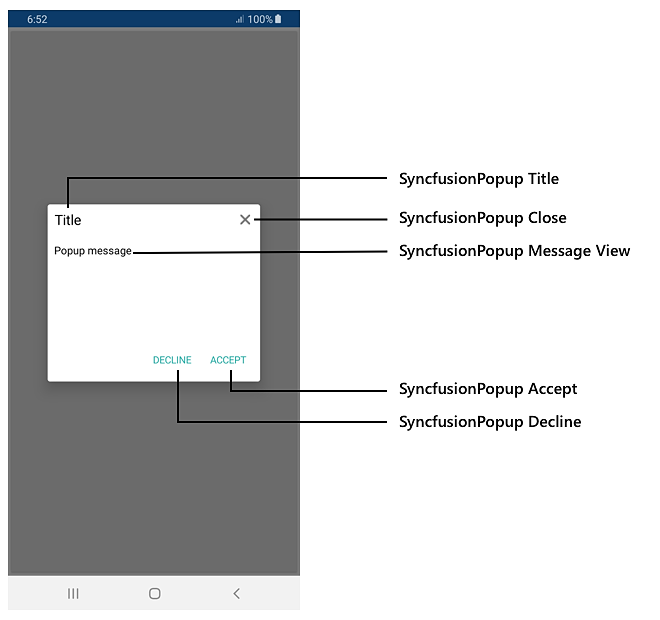

# AutomationId

SfPopupLayout supports built-in [AutomationId](https://docs.microsoft.com/en-gb/dotnet/api/xamarin.forms.element.automationid?view=xamarin-forms#Xamarin_Forms_Element_AutomationId) for all its inner elements. These `AutomationId` values allow the automation framework to find and interact with the inner elements when the test scripts are run. A unique `AutomationId` is maintained for each inner element by prefixing the control's `AutomationId` with the inner element's Id.

## AutomationId for popup view inner elements

The below table illustrates the predefined automation values set internally which can be used to identify the PopupView's elements.

<table>
<tr>
<th>Element</th>
<th>Value</th>
</tr>
<tr>
<td>Header title</td>
<td>"Title"</td>
</tr>
<tr>
<td>Header close button</td>
<td>"Close"</td>
</tr>
<tr>
<td>PopupView content</td>
<td>"MessageView"</td>
</tr>
<tr>
<td>Accept button</td>
<td>"Accept"</td>
</tr>
<tr>
<td>Decline button</td>
<td>"Decline"</td>
</tr>
</table>

The following screenshot illustrates the `AutomationId` values of the inner elements of SfPopupView.

The following code snippet demonstrates how to set `AutomationId` to the SfPopupLayout.



<ContentPage xmlns="http://xamarin.com/schemas/2014/forms"
             xmlns:x="http://schemas.microsoft.com/winfx/2009/xaml"
             xmlns:local="clr-namespace:GettingStarted"
             x:Class="GettingStarted.MainPage" 
             Padding="0,40,0,0"
             xmlns:sfPopup="clr-namespace:Syncfusion.XForms.PopupLayout;assembly=Syncfusion.SfPopupLayout.XForms">
<sfPopup:SfPopupLayout x:Name="popupLayout"
<sfPopup:SfPopupLayout.PopupView>
                    <sfPopup:PopupView AutomationId="SyncfusionPopup" AppearanceMode="TwoButton">
                    </sfPopup:PopupView>
</sfPopup:SfPopupLayout.PopupView>
   <sfPopup:SfPopupLayout.Content>
     <StackLayout x:Name="mainLayout">
       <Button x:Name="clickToShowPopup" Text="Click To Show Popup" 
               VerticalOptions="Start" HorizontalOptions="FillAndExpand"
                Clicked="ClickToShowPopup_Clicked"/>
     </StackLayout>
    </sfPopup:SfPopupLayout.Content>
  </sfPopup:SfPopupLayout>
  </ContentPage>





using Syncfusion.XForms.PopupLayout;

namespace GettingStarted
{
    public partial class MainPage : ContentPage
    {
        public MainPage()
        {
            InitializeComponent();
        }

        private void ClickToShowPopup_Clicked(object sender, EventArgs e)
        {
            popupLayout.Show();
        }
    }
}



The following code snippet demonstrates how to access the inner elements of SfPopupView from the automation script.




[Test]
[Description("SfPopupLayout Automation Id")]
public void SfPopupLayout_AutomationId()
{
   // To tap the Accept button
   App.Tap("SyncfusionPopup Accept");

   // To tap the Decline button
   App.Tap("SyncfusionPopup Decline");

   // To tap the Close button
   App.Tap("SyncfusionPopup Close");

   // To tap the Header Title label
   App.Tap("SyncfusionPopup Title");

   // To tap the MessageView
   App.Tap("SyncfusionPopup MessageView");
}




## AutomationId for template content 

To access the template elements from script, set the `AutomationId` directly to the template view from the sample level.

The following code snippet explains how to set `AutomationId` for the template content.




<ContentPage xmlns="http://xamarin.com/schemas/2014/forms"
             xmlns:x="http://schemas.microsoft.com/winfx/2009/xaml"
             xmlns:local="clr-namespace:GettingStarted"
             x:Class="GettingStarted.MainPage" 
             Padding="0,40,0,0"
             xmlns:sfPopup="clr-namespace:Syncfusion.XForms.PopupLayout;assembly=Syncfusion.SfPopupLayout.XForms">
<sfPopup:SfPopupLayout x:Name="popupLayout">
<sfPopup:PopupView>
            <sfPopup:PopupView.ContentTemplate>
                <DataTemplate>
                    <Button Text="This is SfPopupLayout" BackgroundColor="SkyBlue"
                           AutomationId="TemplateButton"/>
                </DataTemplate>
            </sfPopup:PopupView.ContentTemplate>
        </sfPopup:PopupView>
    </sfPopup:SfPopupLayout.PopupView>
   <sfPopup:SfPopupLayout.Content>
     <StackLayout x:Name="mainLayout">
       <Button x:Name="clickToShowPopup" Text="Click To Show Popup" 
               VerticalOptions="Start" HorizontalOptions="FillAndExpand"
                Clicked="ClickToShowPopup_Clicked"/>
     </StackLayout>
    </sfPopup:SfPopupLayout.Content>
  </sfPopup:SfPopupLayout>
  </ContentPage>





using Syncfusion.XForms.PopupLayout;

namespace GettingStarted
{
    public partial class MainPage : ContentPage
    {
        public MainPage()
        {
            InitializeComponent();
        }

        private void ClickToShowPopup_Clicked(object sender, EventArgs e)
        {
            popupLayout.Show();
        }
    }
}



Refer to the following code snippet to access the template content of SfPopupView from the automation script.




[Test]
[Description("SfPopupLayout Template Automation Id")]
public void Template_AutomationId()
{
   // To tap the Content template button
   App.Tap("TemplateButton");
}



