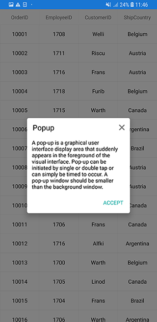
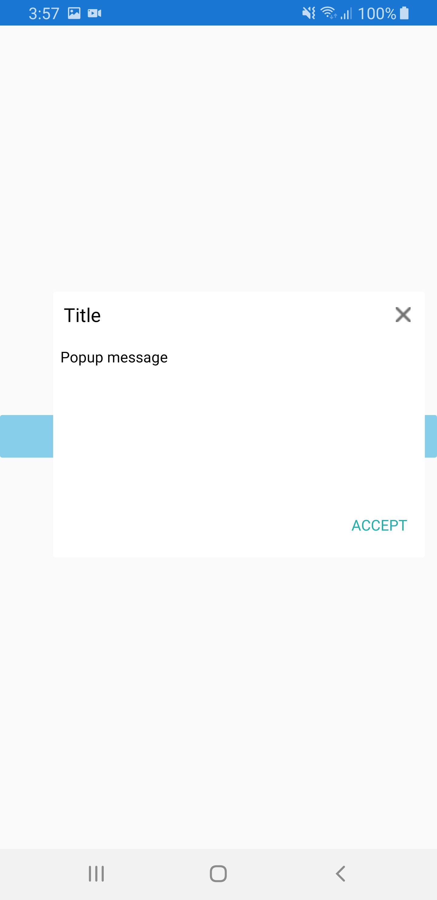

---
layout: post
title: FAQ | SfPopupLayout |Xamarin | Syncfusion
description: Explains how to achieve various requirements of user scenarios and customizations possible with the Xamarin.Forms PopupLayout.
platform: Xamarin
control: SfPopupLayout
documentation: ug
--- 
# FAQ in Xamarin.Forms Popup (SfPopupLayout)

## Load the SfPopupLayout in GridTappedEvent of the SfDataGrid

The SfPopupLayout allows opening it in the GridTapped event of the SfDataGrid





<?xml version="1.0" encoding="utf-8" ?>
<ContentPage xmlns="http://xamarin.com/schemas/2014/forms"
             xmlns:x="http://schemas.microsoft.com/winfx/2009/xaml"
             xmlns:local="clr-namespace:PopupDemo"
             xmlns:sfPopup="clr-namespace:Syncfusion.XForms.PopupLayout;assembly=Syncfusion.SfPopupLayout.XForms"
             xmlns:sfDataGrid="clr-namespace:Syncfusion.SfDataGrid.XForms;assembly=Syncfusion.SfDataGrid.XForms"              x:Class="PopupDemo.MainPage">

    <ContentPage.BindingContext>
        <local:ViewModel x:Name="viewModel" />
    </ContentPage.BindingContext>

    <sfPopup:SfPopupLayout x:Name="popupLayout">
        <sfPopup:SfPopupLayout.PopupView>
            <sfPopup:PopupView HeaderTitle="Popup">
                <sfPopup:PopupView.ContentTemplate>
                    <DataTemplate>
                        <Label Text="A pop-up is a graphical user interface display area that suddenly appears in the foreground of the visual interface. Pop-up can be initiated by single or double tap or can simply be timed to occur. A pop-up window should be smaller than the background window or interface; otherwise, its a replacement interface."
                               BackgroundColor="White"
                               TextColor="Black"                              
                               />
                    </DataTemplate>
                </sfPopup:PopupView.ContentTemplate>
            </sfPopup:PopupView>
        </sfPopup:SfPopupLayout.PopupView>
        <sfPopup:SfPopupLayout.Content>
            <sfDataGrid:SfDataGrid x:Name="dataGrid"
                                   ItemsSource="{Binding OrdersInfo}"
                                   GridTapped="DataGrid_GridTapped"    
                                   ColumnSizer="Star"
                                   >
            </sfDataGrid:SfDataGrid>
        </sfPopup:SfPopupLayout.Content>
    </sfPopup:SfPopupLayout>
</ContentPage>





using Syncfusion.XForms.PopupLayout;
using Syncfusion.SfDataGrid.XForms;

namespace GettingStarted
{
    public partial class MainPage : ContentPage
    {        
        SfDataGrid dataGrid;
        ViewModel viewModel;
        SfPopupLayout popupLayout;

        public MainPage()
        {
            InitializeComponent();
            dataGrid = new SfDataGrid();
            viewModel = new ViewModel();
            dataGrid.ItemsSource = viewModel.OrdersInfo;
            dataGrid.GridTapped += DataGrid_GridTapped;
            dataGrid.ColumnSizer = ColumnSizer.Star;
            popupLayout = new SfPopupLayout();
            popupLayout.PopupView.HeaderTitle = "Popup";
            popupLayout.PopupView.ContentTemplate = new DataTemplate(() =>
            {
                return new Label()
                {
                    Text = "A pop-up is a graphical user interface display area that suddenly appears in the foreground of the visual interface. Pop-up can be initiated by single or double tap or can simply be timed to occur. A pop-up window should be smaller than the background window or interface; otherwise, its a replacement interface.",
                    BackgroundColor = Color.White,
                    TextColor = Color.Black
                };
            });
            popupLayout.Content = dataGrid;
            this.Content = popupLayout;
        }

        private void DataGrid_GridTapped(object sender, Syncfusion.SfDataGrid.XForms.GridTappedEventArgs e)
        {
            // Popup is opened at the Grid tapped event
            popupLayout.Show();
        }
    }   
}





Sample Link: You can download the above sample code by clicking [here](https://github.com/SyncfusionExamples/SfPopupLayout_XForms_GettingStarted/tree/master/FAQ_UGSamples/PopupInGrid).

## Open SfPopupLayout in ItemTapped event of SfListView

The SfPopupLayout allows opening it in the ItemTapped event of the SfListView.





<?xml version="1.0" encoding="utf-8" ?>
<ContentPage xmlns="http://xamarin.com/schemas/2014/forms"
             xmlns:x="http://schemas.microsoft.com/winfx/2009/xaml"
             xmlns:local="clr-namespace:PopupDemo"
             xmlns:sfPopup="clr-namespace:Syncfusion.XForms.PopupLayout;assembly=Syncfusion.SfPopupLayout.XForms"
             xmlns:sfListView="clr-namespace:Syncfusion.ListView.XForms;assembly=Syncfusion.SfListView.XForms"
             x:Class="PopupDemo.MainPage">

    <ContentPage.BindingContext>
        <local:ContactsViewModel x:Name="viewModel"/>
    </ContentPage.BindingContext>

    <sfPopup:SfPopupLayout x:Name="popupLayout">
        <sfPopup:SfPopupLayout.PopupView>
            <sfPopup:PopupView WidthRequest="220" HeightRequest="120" ShowFooter="False">
                <sfPopup:PopupView.ContentTemplate>
                    <DataTemplate>
                        <Label Text="ListView item is tapped"
                               BackgroundColor="White"
                               TextColor="Black"
                               HorizontalTextAlignment="Center"
                               />
                    </DataTemplate>
                </sfPopup:PopupView.ContentTemplate>
            </sfPopup:PopupView>
        </sfPopup:SfPopupLayout.PopupView>
        <sfPopup:SfPopupLayout.Content>
            <sfListView:SfListView  x:Name="listView"  ItemSpacing="5" 
                          ItemsSource="{Binding Items}" 
                          SelectionMode="None"
                          ItemTapped="ListView_ItemTapped">
                <sfListView:SfListView.ItemTemplate>
                    <DataTemplate>
                        <ViewCell>
                            <ViewCell.View>
                                <Grid x:Name="grid" RowSpacing="1">
                                    <Grid.RowDefinitions>
                                        <RowDefinition Height="*" />
                                    </Grid.RowDefinitions>
                                    <Grid.ColumnDefinitions>
                                        <ColumnDefinition Width="50" />
                                        <ColumnDefinition Width="200" />
                                        <ColumnDefinition Width="50" />
                                    </Grid.ColumnDefinitions>

                                    <Image Source="{Binding ContactImage}"
                                       VerticalOptions="Center"
                                       HorizontalOptions="Center"
                                       HeightRequest="50"/>

                                    <Label Grid.Column="1"
                                        HorizontalTextAlignment="Center"
                                        LineBreakMode="NoWrap"
                                        Text="{Binding ContactName}" 
                                        FontSize="Medium" />

                                    <Image Grid.Column="2" 
                                       Source="{Binding ContactType}"
                                       VerticalOptions="End"
                                       HorizontalOptions="End"
                                       HeightRequest="50"/>

                                </Grid>
                            </ViewCell.View>
                        </ViewCell>
                    </DataTemplate>
                </sfListView:SfListView.ItemTemplate>
            </sfListView:SfListView>
        </sfPopup:SfPopupLayout.Content>
    </sfPopup:SfPopupLayout>
</ContentPage>





using Syncfusion.ListView.XForms;
using Syncfusion.XForms.PopupLayout;

namespace PopupDemo
{
    public partial class MainPage : ContentPage
    {
        SfListView listView;
        ContactsViewModel viewModel;
        SfPopupLayout popupLayout;

        public MainPage()
        {
            InitializeComponent();
            listView = new SfListView() { ItemSpacing = 5 };
            listView.ItemTemplate = new DataTemplate(() =>
            {
                ViewCell viewCell = new ViewCell();
                var grid = new Grid() { RowSpacing = 1 };
                grid.ColumnDefinitions.Add(new ColumnDefinition() { Width = 50 });
                grid.ColumnDefinitions.Add(new ColumnDefinition() { Width = 200 });
                grid.ColumnDefinitions.Add(new ColumnDefinition() { Width = 50 });
                var contactImage = new Image()
                {
                    VerticalOptions = LayoutOptions.Center,
                    HorizontalOptions = LayoutOptions.Center,
                    HeightRequest = 50
                };
                contactImage.SetBinding(Image.SourceProperty, new Binding("ContactImage"));
                var contactName = new Label()
                {
                    HorizontalTextAlignment = TextAlignment.Center,
                    LineBreakMode = LineBreakMode.NoWrap,
                    FontSize = Font.SystemFontOfSize(NamedSize.Medium).FontSize,
                };
                contactName.SetBinding(Label.TextProperty, new Binding("ContactName"));
                var contactType = new Image()
                {
                    VerticalOptions = LayoutOptions.End,
                    HorizontalOptions = LayoutOptions.End,
                    HeightRequest = 50,
                };
                contactType.SetBinding(Image.SourceProperty, new Binding("ContactType"));
                grid.Children.Add(contactImage,0,0);
                grid.Children.Add(contactName,1,0);
                grid.Children.Add(contactType,2,0);
                viewCell.View = grid;
                return viewCell;
            });
            viewModel = new ContactsViewModel();
            listView.ItemsSource = viewModel.Items;
            listView.SelectionMode = SelectionMode.None;
            listView.ItemTapped += ListView_ItemTapped;
            popupLayout = new SfPopupLayout();
            popupLayout.PopupView.HeightRequest = 120;
            popupLayout.PopupView.WidthRequest = 220;
            popupLayout.PopupView.ShowFooter = false;
            popupLayout.PopupView.ContentTemplate = new DataTemplate(() =>
            {
                return new Label()
                {
                    Text = "ListView item is tapped",
                    BackgroundColor = Color.White,
                    TextColor = Color.Black,
                    HorizontalTextAlignment = TextAlignment.Center
                };
            });
            popupLayout.Content = listView;
            this.Content = popupLayout;
        }

        private void ListView_ItemTapped(object sender, Syncfusion.ListView.XForms.ItemTappedEventArgs e)
        {
            popupLayout.Show();
        }
    }
}





Sample Link: You can download the above sample code by clicking [here](https://github.com/SyncfusionExamples/SfPopupLayout_XForms_GettingStarted/tree/master/FAQ_UGSamples/PopupInListView).

## Show ListView as a popup

The SfPopupLayout allows loading the SfListView as a content of the popup. You have to set `WidthRequest` and `HeightRequest` properties for loading SfListView in the SfPopupLayout. 



<?xml version="1.0" encoding="utf-8" ?>
<ContentPage xmlns="http://xamarin.com/schemas/2014/forms"
             xmlns:x="http://schemas.microsoft.com/winfx/2009/xaml"
             xmlns:local="clr-namespace:PopupDemo"
             xmlns:sfPopup="clr-namespace:Syncfusion.XForms.PopupLayout;assembly=Syncfusion.SfPopupLayout.XForms"
             xmlns:sfListView="clr-namespace:Syncfusion.ListView.XForms;assembly=Syncfusion.SfListView.XForms"
             x:Class="PopupDemo.MainPage">

    <ContentPage.BindingContext>
        <local:ContactsViewModel x:Name="viewModel"/>
    </ContentPage.BindingContext>

    <sfPopup:SfPopupLayout x:Name="popupLayout">
        <sfPopup:SfPopupLayout.PopupView>
            <sfPopup:PopupView HeaderTitle="ListView">
                <sfPopup:PopupView.ContentTemplate>
                    <DataTemplate>
                        <sfListView:SfListView  x:Name="listView"  ItemSpacing="5" WidthRequest="350" 
                          ItemsSource="{Binding Items}" 
                          >
                            <sfListView:SfListView.ItemTemplate>
                                <DataTemplate>
                                    <ViewCell>
                                        <ViewCell.View>
                                            <Grid x:Name="grid" RowSpacing="1">
                                                <Grid.RowDefinitions>
                                                    <RowDefinition Height="*" />
                                                </Grid.RowDefinitions>
                                                <Grid.ColumnDefinitions>
                                                    <ColumnDefinition Width="50" />
                                                    <ColumnDefinition Width="200" />
                                                    <ColumnDefinition Width="50" />
                                                </Grid.ColumnDefinitions>

                                                <Image Source="{Binding ContactImage}"
                                       VerticalOptions="Center"
                                       HorizontalOptions="Center"
                                       HeightRequest="50"/>

                                                <Label Grid.Column="1"
                                        HorizontalTextAlignment="Center"
                                        LineBreakMode="NoWrap"
                                        Text="{Binding ContactName}" 
                                        FontSize="Medium" />

                                                <Image Grid.Column="2" 
                                       Source="{Binding ContactType}"
                                       VerticalOptions="End"
                                       HorizontalOptions="End"
                                       HeightRequest="50"/>

                                            </Grid>
                                        </ViewCell.View>
                                    </ViewCell>
                                </DataTemplate>
                            </sfListView:SfListView.ItemTemplate>
                        </sfListView:SfListView>
                    </DataTemplate>
                </sfPopup:PopupView.ContentTemplate>
            </sfPopup:PopupView>
        </sfPopup:SfPopupLayout.PopupView>
        <sfPopup:SfPopupLayout.Content>
            <StackLayout>
                <Button Text="Click to show popup" Clicked="isOpenButton_Clicked"/>
            </StackLayout>
        </sfPopup:SfPopupLayout.Content>
    </sfPopup:SfPopupLayout>
</ContentPage>





using Syncfusion.ListView.XForms;
using Syncfusion.XForms.PopupLayout;

namespace PopupDemo
{
    public partial class MainPage : ContentPage
    {
        SfListView listView;
        ContactsViewModel viewModel;
        SfPopupLayout popupLayout;

        public MainPage()
        {
            InitializeComponent();
            listView = new SfListView() { ItemSpacing = 5 };
            listView.WidthRequest = 350;
            listView.ItemTemplate = new DataTemplate(() =>
            {
                ViewCell viewCell = new ViewCell();
                var grid = new Grid() { RowSpacing = 1 };
                grid.ColumnDefinitions.Add(new ColumnDefinition() { Width = 50 });
                grid.ColumnDefinitions.Add(new ColumnDefinition() { Width = 200 });
                grid.ColumnDefinitions.Add(new ColumnDefinition() { Width = 50 });
                var contactImage = new Image()
                {
                    VerticalOptions = LayoutOptions.Center,
                    HorizontalOptions = LayoutOptions.Center,
                    HeightRequest = 50
                };
                contactImage.SetBinding(Image.SourceProperty, new Binding("ContactImage"));
                var contactName = new Label()
                {
                    HorizontalTextAlignment = TextAlignment.Center,
                    LineBreakMode = LineBreakMode.NoWrap,
                    FontSize = Font.SystemFontOfSize(NamedSize.Medium).FontSize,
                };
                contactName.SetBinding(Label.TextProperty, new Binding("ContactName"));
                var contactType = new Image()
                {
                    VerticalOptions = LayoutOptions.End,
                    HorizontalOptions = LayoutOptions.End,
                    HeightRequest = 50,
                };
                contactType.SetBinding(Image.SourceProperty, new Binding("ContactType"));
                grid.Children.Add(contactImage, 0, 0);
                grid.Children.Add(contactName, 1, 0);
                grid.Children.Add(contactType, 2, 0);
                viewCell.View = grid;
                return viewCell;
            });
            viewModel = new ContactsViewModel();
            listView.ItemsSource = viewModel.Items;
            popupLayout = new SfPopupLayout();
            popupLayout.PopupView.HeaderTitle = "ListView";
            popupLayout.PopupView.ContentTemplate = new DataTemplate(() =>
            {
                return listView;
            });
            StackLayout stackLayout = new StackLayout();
            Button isOpenButton = new Button();
            isOpenButton.Clicked += isOpenButton_Clicked;
            isOpenButton.Text = "Click to show popup";
            stackLayout.Children.Add(isOpenButton);
            popupLayout.Content = stackLayout;
            this.Content = popupLayout;
        }

        private void isOpenButton_Clicked(object sender, EventArgs e)
        {
            popupLayout.Show();
        }
    }
}




Sample Link: You can download the above sample code by clicking [here](https://github.com/SyncfusionExamples/SfPopupLayout_XForms_GettingStarted/tree/master/FAQ_UGSamples/ListViewInPopup).

## Display popup when interacting with a switch

[SfPopupLayout.IsOpen](https://help.syncfusion.com/cr/xamarin/Syncfusion.XForms.PopupLayout.SfPopupLayout.html#Syncfusion_XForms_PopupLayout_SfPopupLayout_IsOpen) is a bindable property and hence can be binded to any property and based on its value the popup will open or close. In the below code example, we have binded the `IsOpen` property with the `IsToggled` property of the the switch and the popup will be opened or closed as the switch toggles.





<ContentPage xmlns="http://xamarin.com/schemas/2014/forms"
             xmlns:x="http://schemas.microsoft.com/winfx/2009/xaml"
             xmlns:local="clr-namespace:SamplePopup"
             xmlns:sfpopup="clr-namespace:Syncfusion.XForms.PopupLayout;assembly=Syncfusion.SfPopupLayout.XForms"
             x:Class="SamplePopup.MainPage"
             Padding="0,20,0,0">

    <sfpopup:SfPopupLayout IsOpen="{Binding Source={x:Reference popupSwitch}, Path=IsToggled}">
        <sfpopup:SfPopupLayout.Content>
            <StackLayout Orientation="Horizontal">
                <Label Text="On the switch to show popup" />
                <Switch x:Name="popupSwitch" IsToggled="False" VerticalOptions="Start" />
            </StackLayout>
        </sfpopup:SfPopupLayout.Content>
    </sfpopup:SfPopupLayout>
</ContentPage>





## Display popup in MVVM

SfPopup can be used in MVVM architecture applications easily. In the below example [SfPopupLayout.IsOpen](https://help.syncfusion.com/cr/xamarin/Syncfusion.XForms.PopupLayout.SfPopupLayout.html#Syncfusion_XForms_PopupLayout_SfPopupLayout_IsOpen) property is binded to a property in the ViewModel based on which the popup is opened or closed. Refer the below code example to display popup in MVVM.

In the below code snippet, note that the Binding context is set for the page and the property (DisplayPopup) of the ViewModel is binded to the [SfPopupLayout.IsOpen](https://help.syncfusion.com/cr/xamarin/Syncfusion.XForms.PopupLayout.SfPopupLayout.html#Syncfusion_XForms_PopupLayout_SfPopupLayout_IsOpen).





<ContentPage.BindingContext>
    <local:ViewModel />
</ContentPage.BindingContext>

<sfpopup:SfPopupLayout x:Name="popup" IsOpen="{Binding DisplayPopup}">
    <sfpopup:SfPopupLayout.Content>
        <StackLayout x:Name="rootView">
            <Button x:Name="isOpenButton" Text="Click to open popup" Command="{Binding OpenPopupCommand}"/>
        </StackLayout>
    </sfpopup:SfPopupLayout.Content>
</sfpopup:SfPopupLayout>





// ViewModel.cs

public class ViewModel : INotifyPropertyChanged
{
    private bool displayPopup;

    public ICommand OpenPopupCommand { get; set; }

    public bool DisplayPopup
    {
        get
        {
            return displayPopup;
        }
        set
        {
            displayPopup = value;
            RaisePropertyChanged("DisplayPopup");
        }
    }

    public ViewModel()
    {
        OpenPopupCommand = new Command(OpenPopup);
    }

    private void OpenPopup()
    {
        DisplayPopup = true;
    }

    #region INotifyPropertyChanged

    public event PropertyChangedEventHandler PropertyChanged;

    private void RaisePropertyChanged(string propertyName)
    {
        if(this.PropertyChanged != null)
        {
            this.PropertyChanged(this, new PropertyChangedEventArgs(propertyName));
        }
    }

    #endregion

}





## Load SfPopupLayout in Prism

Refer to the following code in which the SfPopupLayout is shown, when navigated to the next and previous pages via button click.




// App.xaml

<prism:PrismApplication xmlns="http://xamarin.com/schemas/2014/forms"
                        xmlns:x="http://schemas.microsoft.com/winfx/2009/xaml"
                        xmlns:prism="clr-namespace:Prism.Unity;assembly=Prism.Unity.Forms"
                        x:Class="PopupDemo.App">

</prism:PrismApplication>

//MainPage.xaml

<?xml version="1.0" encoding="utf-8" ?>
<ContentPage xmlns="http://xamarin.com/schemas/2014/forms"
             xmlns:x="http://schemas.microsoft.com/winfx/2009/xaml"
             xmlns:local="clr-namespace:PopupDemo"
             xmlns:sfPopup="clr-namespace:Syncfusion.XForms.PopupLayout;assembly=Syncfusion.SfPopupLayout.XForms"
             x:Class="PopupDemo.MainPage">

    <ContentPage.Content>
        <StackLayout>
            <Button Text="GO TO NEXT PAGE" VerticalOptions="Center" HorizontalOptions="Center" Command="{Binding NavigateCommand}"/>
        </StackLayout>
    </ContentPage.Content>
</ContentPage>

// SecondPage.xaml

<?xml version="1.0" encoding="utf-8" ?>
<ContentPage xmlns="http://xamarin.com/schemas/2014/forms"
             xmlns:x="http://schemas.microsoft.com/winfx/2009/xaml"
             x:Class="PopupDemo.SecondPage">
    <ContentPage.Content>
        <StackLayout>
            <Button Text="GO TO PREVIOUS PAGE" VerticalOptions="Center" HorizontalOptions="Center" Command="{Binding NavigateCommand}"/>
        </StackLayout>
    </ContentPage.Content>
</ContentPage>





// App.xaml.cs

using Prism.Unity;

namespace PopupDemo
{
    public partial class App : PrismApplication
    {
        public App(IPlatformInitializer initializer = null) : base(initializer) { }

        protected override void OnInitialized()
        {
            InitializeComponent();
            NavigationService.NavigateAsync("NavigationPage/MainPage");
        }

        protected override void RegisterTypes()
        {
            Container.RegisterTypeForNavigation<NavigationPage>();
            Container.RegisterTypeForNavigation<MainPage>();
            Container.RegisterTypeForNavigation<SecondPage>();
        }
    }
}

// MainPageViewModel.cs

using Prism.Navigation;
using Syncfusion.XForms.PopupLayout;
using System.Windows.Input;

namespace PopupDemo
{
    public class MainPageViewModel : INavigationAware
    {
        public INavigationService navigation_service;
        public ICommand NavigateCommand { get; set; }

        public MainPageViewModel(INavigationService navigationService)
        {
            navigation_service = navigationService;
            NavigateCommand = new Command(Navigate);
        }

        private void Navigate()
        {
            navigation_service.NavigateAsync("SecondPage");
        }

        public void OnNavigatedFrom(NavigationParameters parameters)
        {

        }

        public void OnNavigatedTo(NavigationParameters parameters)
        {
            if (App.Current.MainPage != null)
            {
                SfPopupLayout popup = new SfPopupLayout();
                popup.Show();
            }
        }

        public void OnNavigatingTo(NavigationParameters parameters)
        {

        }
    }
}

// SecondPageViewModel.cs

using Prism.Navigation;
using Syncfusion.XForms.PopupLayout;
using System.Windows.Input;

namespace PopupDemo
{
    public class SecondPageViewModel : INavigationAware
    {
        public INavigationService navigation_service;
        public ICommand NavigateCommand { get; set; }

        public SecondPageViewModel(INavigationService navigationService)
        {
            navigation_service = navigationService;
            NavigateCommand = new Command(Navigate);
        }

        private void Navigate()
        {
            navigation_service.NavigateAsync("MainPage");
        }

        public void OnNavigatedFrom(NavigationParameters parameters)
        {

        }

        public void OnNavigatedTo(NavigationParameters parameters)
        {
            if (App.Current.MainPage != null)
            {
                SfPopupLayout popup = new SfPopupLayout();
                popup.Show();
            }
        }

        public void OnNavigatingTo(NavigationParameters parameters)
        {

        }

    }

}





Sample Link: You can download the above sample code by clicking [here](https://github.com/SyncfusionExamples/SfPopupLayout_XForms_GettingStarted/tree/master/FAQ_UGSamples/PopupWithPrism).

## Change the close button icon

You can change the close button icon of the SfPopupLayout, please find the code example of the same below.





<?xml version="1.0" encoding="utf-8" ?>
<ContentPage xmlns="http://xamarin.com/schemas/2014/forms"
             xmlns:x="http://schemas.microsoft.com/winfx/2009/xaml"
             xmlns:local="clr-namespace:PopupDemo"
             xmlns:sfPopup="clr-namespace:Syncfusion.XForms.PopupLayout;assembly=Syncfusion.SfPopupLayout.XForms"
             x:Class="PopupDemo.MainPage">

    <ContentPage.Resources>
        <ResourceDictionary>
            <local:CustomStyle x:Key="customStyle" />
        </ResourceDictionary>
    </ContentPage.Resources>

    <sfPopup:SfPopupLayout x:Name="popupLayout">
        <sfPopup:SfPopupLayout.PopupView>
            <sfPopup:PopupView PopupStyle="{StaticResource customStyle}"/>
        </sfPopup:SfPopupLayout.PopupView>
        <sfPopup:SfPopupLayout.Content>
            <StackLayout>
                <Button x:Name="isOpenButton" Text="Click to open popup" Clicked="isOpenButton_Clicked"/>
            </StackLayout>
        </sfPopup:SfPopupLayout.Content>
    </sfPopup:SfPopupLayout>
</ContentPage>





namespace PopupDemo
{
    public partial class MainPage : ContentPage
    {
        public MainPage()
        {
            InitializeComponent();            
        }

        private void isOpenButton_Clicked(object sender, EventArgs e)
        {
            popupLayout.Show();
        }
    }

    public class CustomStyle : PopupStyle
    {
        public CustomStyle()
        {
            this.CloseButtonIcon = ImageSource.FromResource("PopupDemo.Images.RedDown.png");
        }
    }
}





Sample Link: You can download the above sample code by clicking [here](https://github.com/SyncfusionExamples/SfPopupLayout_XForms_GettingStarted/tree/master/FAQ_UGSamples/PopupCloseIcon).

## How to close popup view

The [SfPopupLayout.IsOpen](https://help.syncfusion.com/cr/xamarin/Syncfusion.XForms.PopupLayout.SfPopupLayout.html#Syncfusion_XForms_PopupLayout_SfPopupLayout_IsOpen) or [SfPopupLayout.IsVisible](https://help.syncfusion.com/cr/xamarin/Syncfusion.XForms.PopupLayout.SfPopupLayout.html) property is used to close the [SfPopupLayout](https://help.syncfusion.com/cr/xamarin/Syncfusion.XForms.PopupLayout.SfPopupLayout.html)





<?xml version="1.0" encoding="utf-8" ?>
<ContentPage xmlns="http://xamarin.com/schemas/2014/forms"
             xmlns:x="http://schemas.microsoft.com/winfx/2009/xaml"
             xmlns:local="clr-namespace:Popup_Demo"
             x:Class="Popup_Demo.MainPage"    
             xmlns:sfPopup="clr-namespace:Syncfusion.XForms.PopupLayout;assembly=Syncfusion.SfPopupLayout.XForms">             
    <ContentPage.Content>
        <StackLayout x:Name="mainLayout">
            <Button x:Name="clickToShowPopup" Text="click to show popup"/>
            <Button x:Name="clickToClosePopup" Text="click to close popup"/>
        </StackLayout>
    </ContentPage.Content>    
</ContentPage>





using Syncfusion.XForms.PopupLayout;
using System;
using Xamarin.Forms;

namespace Popup_Demo
{
    public partial class MainPage : ContentPage
    {
        SfPopupLayout popupLayout;
        public MainPage()
        {
            InitializeComponent();
            this.popupLayout = new SfPopupLayout();
            this.popupLayout.StaysOpen = true;
            this.popupLayout.PopupView.HeightRequest = 200;
            this.popupLayout.PopupView.WidthRequest = 200;
            this.clickToShowPopup.Clicked += ClickToShowPopup_Clicked;
            this.clickToClosePopup.Clicked += ClickToClosePopup_Clicked;
        }

        private void ClickToShowPopup_Clicked(object sender, EventArgs e)
        {
            //// Opens SfPopupLayout.
            this.popupLayout.Show(0, 0);
        }

        private void ClickToClosePopup_Clicked(object sender, EventArgs e)
        {
            //// Set IsOpen or IsVisible property as false to close the popup view programmatically.
            this.popupLayout.IsOpen = false;
            this.popupLayout.IsVisible = false;
        }
    }
}





## How to change popup view background color 

The background color of popup view can be customized by setting the [SfPopupLayout.PopupView.BackGroundColor](https://help.syncfusion.com/cr/xamarin/Syncfusion.XForms.PopupLayout.PopupView.html)
property.





<?xml version="1.0" encoding="utf-8" ?>
<ContentPage xmlns="http://xamarin.com/schemas/2014/forms"
             xmlns:x="http://schemas.microsoft.com/winfx/2009/xaml"
             xmlns:local="clr-namespace:Popup_Demo"
             x:Class="Popup_Demo.MainPage"    
             xmlns:sfPopup="clr-namespace:Syncfusion.XForms.PopupLayout;assembly=Syncfusion.SfPopupLayout.XForms">

    <ContentPage.Content>
        <StackLayout x:Name="mainLayout">
            <Button x:Name="clickToShowPopup" Text="click to show popup"/>
        </StackLayout>
    </ContentPage.Content>
</ContentPage>





using Syncfusion.XForms.PopupLayout;
using System;
using Xamarin.Forms;

namespace Popup_Demo
{
    public partial class MainPage : ContentPage
    {
        SfPopupLayout popupLayout;
        DataTemplate dataTemplate;
        public MainPage()
        {
            InitializeComponent();
            this.popupLayout = new SfPopupLayout();
            this.dataTemplate = new DataTemplate(() =>
            {
                Label label = new Label();
                label.Text = "Syncfusion";
                label.BackgroundColor = Color.Transparent;
                return label;
            });

            this.popupLayout.PopupView.HeaderTitle = "Company name";
            this.popupLayout.PopupView.ContentTemplate = dataTemplate;

            //// You can customize your color based on the requirement.
            this.popupLayout.PopupView.BackgroundColor = Color.LightBlue;
            this.clickToShowPopup.Clicked += ClickToShowPopup_Clicked;
        }

        private void ClickToShowPopup_Clicked(object sender, EventArgs e)
        {
            //// Opens SfPopupLayout.
            this.popupLayout.Show();
        }
    }
}





Sample Link: You can download the above sample code by clicking [here](https://github.com/SyncfusionExamples/how-to-set-background-color-for-popupview-in-xamarin-popup).

## How to prevent the Popup from being closed when pressing the back navigation button

By default, the Popup will be closed whenever the back navigation button is pressed in Android devices. To prevent the Popup from being closed when the back navigation button is pressed, set `False` to the `SfPopupLayout.ClosePopupOnBackButtonPressed` property.



        <sfPopup:SfPopupLayout x:Name="popUpLayout" ClosePopupOnBackButtonPressed="False">
        </sfPopup:SfPopupLayout>


  popUpLayout.ClosePopupOnBackButtonPressed = false;



## How to show overlay background always in Xamarin.Forms Popup?

By default, the overlay background will not be shown around the Popup if all the `WidthRequest`, `HeightRequest`, `StartX`, and `StartY` properties are set to `SfPopupLayout.PopupView`. For cases where the overlay background should always be shown around the Popup, set `True` to the `SfPopupLayout.ShowOverlayAlways` property.



        <sfPopup:SfPopupLayout x:Name="popUpLayout" ShowOverlayAlways="True">
        </sfPopup:SfPopupLayout>


  popUpLayout.ShowOverlayAlways = true;



## How to disable the shadow around the Xamarin.Forms popup view?

By default, a shadow will be shown around the popup view. To disable this shadow around the popup, set the [SfPopupLayout.PopupView.PopupStyle.HasShadow](https://help.syncfusion.com/cr/xamarin/Syncfusion.XForms.PopupLayout.PopupStyle.html#Syncfusion_XForms_PopupLayout_PopupStyle_HasShadow) to false.





<sfPopup:SfPopupLayout x:Name="popUpLayout" ShowOverlayAlways="False">
    <sfPopup:SfPopupLayout.PopupView>
        <sfPopup:PopupView>
            <sfPopup:PopupView.PopupStyle>
                <sfPopup:PopupStyle HasShadow="False"
            </sfPopup:PopupView.PopupStyle>
        </sfPopup:PopupView>
    </sfPopup:SfPopupLayout.PopupView>
</sfPopup:SfPopupLayout>





//MainPage.cs

public MainPage()
{
    ....
    InitializeComponent();
    popupLayout.PopupView.PopupStyle.HasShadow = false;
    popUpLayout.ShowOverlayAlways = false;
    ....
}





