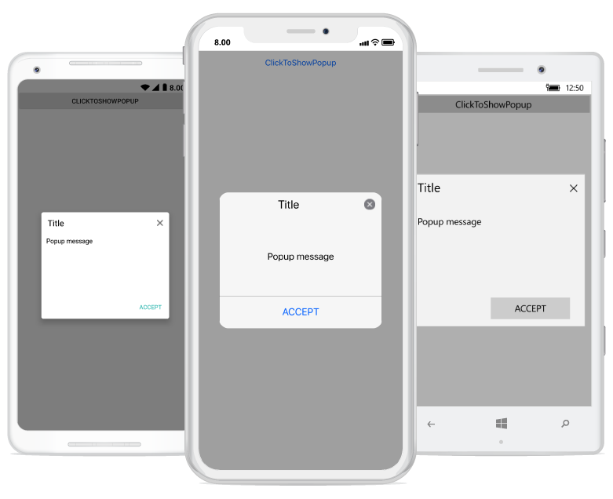
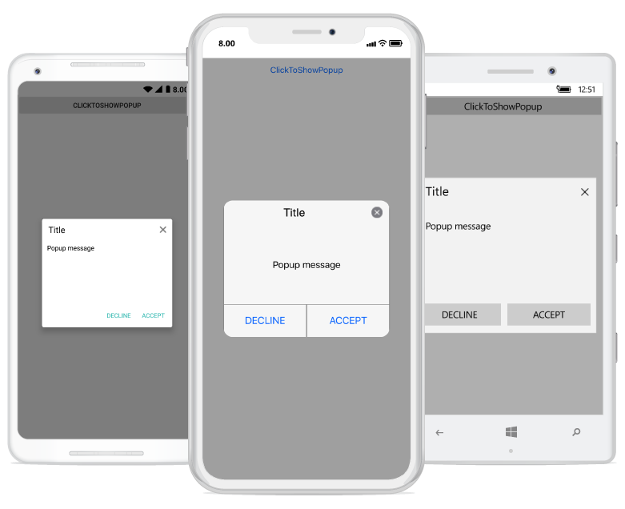
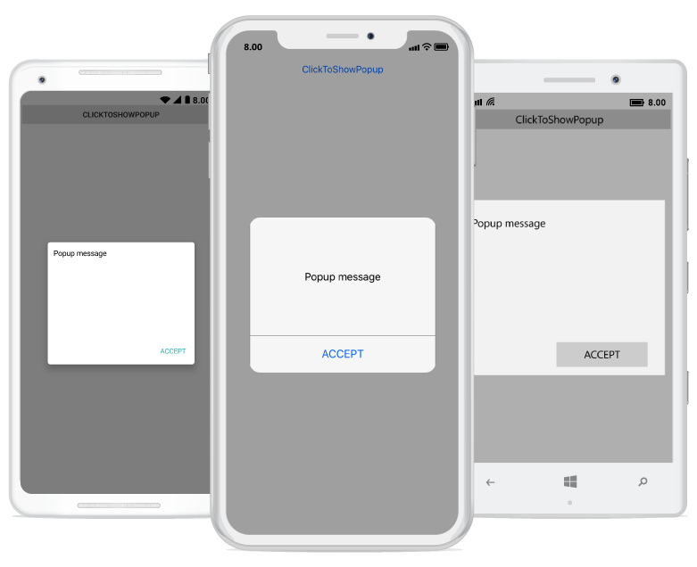

---
layout: post
title: Popup Layouts | SfPopupLayout |Xamarin | Syncfusion
description: Built-in layouts and border customization options available in Xamarin.Forms PopupLayout.
platform: Xamarin
control: SfPopupLayout
documentation: ug
--- 

# Layout Customizations

The SfPopupLayout supports two types of [SfPopupLayout.PopupView.AppearanceMode](https://help.syncfusion.com/cr/xamarin/Syncfusion.XForms.PopupLayout.AppearanceMode.html). By default, the `AppearanceMode.OneButton` is set. You can change the appearance by using the `SfPopupLayout.PopupView.AppearanceMode` property.

The two different appearance modes in the SfPopupLayout are as follows:

<table>
<tr>
<th> Modes </th>
<th> Description </th>
</tr>
<tr>
<td> {{'[OneButton](https://help.syncfusion.com/cr/xamarin/Syncfusion.XForms.PopupLayout.AppearanceMode.html)'| markdownify }} </td>
<td> Shows the SfPopupLayout with one button in the footer view. This is the default value.</td>
</tr>
<tr>
<td> {{'[TwoButton](https://help.syncfusion.com/cr/xamarin/Syncfusion.XForms.PopupLayout.AppearanceMode.html)'| markdownify }} </td>
<td> Shows the SfPopupLayout with two buttons in the footer view.</td>
</tr>
</table>

## Popup with one button in the footer

In the following code example, set the `SfPopupLayout.PopupView.AppearanceMode` property as `OneButton` which displays only the Accept button in the footer view.


<?xml version="1.0" encoding="utf-8" ?>
<ContentPage xmlns="http://xamarin.com/schemas/2014/forms"
             xmlns:x="http://schemas.microsoft.com/winfx/2009/xaml"
             xmlns:local="clr-namespace:GettingStarted"
             x:Class="GettingStarted.MainPage" 
             Padding="0,40,0,0"
             xmlns:sfPopup="clr-namespace:Syncfusion.XForms.PopupLayout;assembly=Syncfusion.SfPopupLayout.XForms">
<sfPopup:SfPopupLayout x:Name="popupLayout">
   <sfPopup:SfPopupLayout.PopupView>
            <sfPopup:PopupView AppearanceMode="OneButton" />
   </sfPopup:SfPopupLayout.PopupView>
   <sfPopup:SfPopupLayout.Content>
     <StackLayout x:Name="layout">
       <Button x:Name="clickToShowPopup" Text="ClickToShowPopup" VerticalOptions="Start" HorizontalOptions="FillAndExpand" Clicked += ClickToShowPopup_Clicked/>
     </StackLayout>
    </sfPopup:SfPopupLayout.Content>
  </sfPopup:SfPopupLayout>
</ContentPage>




using Syncfusion.XForms.PopupLayout;

namespace GettingStarted
{
    public partial class MainPage : ContentPage
    {
        public MainPage()
        {
            InitializeComponent();           
            // Setting the AppearanceMode as OneButton
            popupLayout.PopupView.AppearanceMode = AppearanceMode.OneButton;
        }

        private void ClickToShowPopup_Clicked(object sender, EventArgs e)
        {
             popupLayout.Show();
        }
    }
}


Executing the above codes renders the following output in iOS, Android and Windows Phone devices respectively.

## Popup with two buttons in the footer

In the following code example, set the `SfPopupLayout.PopupView.AppearanceMode` property as `TwoButton` which displays both Accept button and Decline button in the footer view.


<?xml version="1.0" encoding="utf-8" ?>
<ContentPage xmlns="http://xamarin.com/schemas/2014/forms"
             xmlns:x="http://schemas.microsoft.com/winfx/2009/xaml"
             xmlns:local="clr-namespace:GettingStarted"
             x:Class="GettingStarted.MainPage" 
             Padding="0,40,0,0"
             xmlns:sfPopup="clr-namespace:Syncfusion.XForms.PopupLayout;assembly=Syncfusion.SfPopupLayout.XForms">
<sfPopup:SfPopupLayout x:Name="popupLayout">
    <sfPopup:SfPopupLayout.PopupView>
            <sfPopup:PopupView AppearanceMode="TwoButton" />
    </sfPopup:SfPopupLayout.PopupView>
   <sfPopup:SfPopupLayout.Content>
     <StackLayout x:Name="layout">
       <Button x:Name="clickToShowPopup" Text="ClickToShowPopup" VerticalOptions="Start" HorizontalOptions="FillAndExpand" Clicked="ClickToShowPopup_Clicked" />
     </StackLayout>
    </sfPopup:SfPopupLayout.Content>
  </sfPopup:SfPopupLayout>
</ContentPage>




using Syncfusion.XForms.PopupLayout;

namespace GettingStarted
{
    public partial class MainPage : ContentPage
    {
        public MainPage()
        {
            InitializeComponent();
          
            // Setting the AppearanceMode as TwoButton
            popupLayout.PopupView.AppearanceMode = AppearanceMode.TwoButton;        
        }

        private void ClickToShowPopup_Clicked(object sender, EventArgs e)
        {
             popupLayout.Show();
        }
    }
}



Executing the above codes renders the following output in iOS, Android and Windows Phone devices respectively.

## Popup without header

You can display the Popup without header by using the property, [SfPopupLayout.PopupView.ShowHeader](https://help.syncfusion.com/cr/xamarin/Syncfusion.XForms.PopupLayout.PopupView.html#Syncfusion_XForms_PopupLayout_PopupView_ShowHeader), find the code example of the same below.


<?xml version="1.0" encoding="utf-8" ?>
<ContentPage xmlns="http://xamarin.com/schemas/2014/forms"
             xmlns:x="http://schemas.microsoft.com/winfx/2009/xaml"
             xmlns:local="clr-namespace:GettingStarted"
             x:Class="GettingStarted.MainPage" 
             Padding="0,40,0,0"
             xmlns:sfPopup="clr-namespace:Syncfusion.XForms.PopupLayout;assembly=Syncfusion.SfPopupLayout.XForms">
<sfPopup:SfPopupLayout x:Name="popupLayout">
   <sfPopup:SfPopupLayout.PopupView>
            <sfPopup:PopupView ShowHeader="False"/>
   </sfPopup:SfPopupLayout.PopupView>
   <sfPopup:SfPopupLayout.Content>
     <StackLayout x:Name="layout">
       <Button x:Name="clickToShowPopup" Text="ClickToShowPopup" VerticalOptions="Start" HorizontalOptions="FillAndExpand" Clicked += ClickToShowPopup_Clicked/>
     </StackLayout>
    </sfPopup:SfPopupLayout.Content>
  </sfPopup:SfPopupLayout>
</ContentPage>




using Syncfusion.XForms.PopupLayout;

namespace GettingStarted
{
    public partial class MainPage : ContentPage
    {
        public MainPage()
        {
            InitializeComponent();                       
            popupLayout.PopupView.ShowHeader = false;
        }

        private void ClickToShowPopup_Clicked(object sender, EventArgs e)
        {
             popupLayout.Show();
        }
    }
}



## Popup without Footer

You can display the Popup without footer by using the property, [SfPopupLayout.PopupView.ShowFooter](https://help.syncfusion.com/cr/xamarin/Syncfusion.XForms.PopupLayout.PopupView.html#Syncfusion_XForms_PopupLayout_PopupView_ShowFooter), find the code example of the same below.


<?xml version="1.0" encoding="utf-8" ?>
<ContentPage xmlns="http://xamarin.com/schemas/2014/forms"
             xmlns:x="http://schemas.microsoft.com/winfx/2009/xaml"
             xmlns:local="clr-namespace:GettingStarted"
             x:Class="GettingStarted.MainPage" 
             Padding="0,40,0,0"
             xmlns:sfPopup="clr-namespace:Syncfusion.XForms.PopupLayout;assembly=Syncfusion.SfPopupLayout.XForms">
<sfPopup:SfPopupLayout x:Name="popupLayout">
   <sfPopup:SfPopupLayout.PopupView>
            <sfPopup:PopupView ShowFooter="False"/>
   </sfPopup:SfPopupLayout.PopupView>
   <sfPopup:SfPopupLayout.Content>
     <StackLayout x:Name="layout">
       <Button x:Name="clickToShowPopup" Text="ClickToShowPopup" VerticalOptions="Start" HorizontalOptions="FillAndExpand" Clicked += ClickToShowPopup_Clicked/>
     </StackLayout>
    </sfPopup:SfPopupLayout.Content>
  </sfPopup:SfPopupLayout>
</ContentPage>




using Syncfusion.XForms.PopupLayout;

namespace GettingStarted
{
    public partial class MainPage : ContentPage
    {
        public MainPage()
        {
            InitializeComponent();                       
            popupLayout.PopupView.ShowFooter = false;
        }

        private void ClickToShowPopup_Clicked(object sender, EventArgs e)
        {
             popupLayout.Show();
        }
    }
}


## Popup without header and footer

You can display only the content of the SfPopupLayout, by removing the header and footer by using [SfPopupLayout.PopupView.ShowHeader](https://help.syncfusion.com/cr/xamarin/Syncfusion.XForms.PopupLayout.PopupView.html#Syncfusion_XForms_PopupLayout_PopupView_ShowHeader) and [SfPopupLayout.PopupView.ShowFooter](https://help.syncfusion.com/cr/xamarin/Syncfusion.XForms.PopupLayout.PopupView.html#Syncfusion_XForms_PopupLayout_PopupView_ShowFooter), code example of the same below.


<?xml version="1.0" encoding="utf-8" ?>
<ContentPage xmlns="http://xamarin.com/schemas/2014/forms"
             xmlns:x="http://schemas.microsoft.com/winfx/2009/xaml"
             xmlns:local="clr-namespace:GettingStarted"
             x:Class="GettingStarted.MainPage" 
             Padding="0,40,0,0"
             xmlns:sfPopup="clr-namespace:Syncfusion.XForms.PopupLayout;assembly=Syncfusion.SfPopupLayout.XForms">
<sfPopup:SfPopupLayout x:Name="popupLayout">
   <sfPopup:SfPopupLayout.PopupView>
            <sfPopup:PopupView ShowFooter="False" ShowHeader="False"/>
   </sfPopup:SfPopupLayout.PopupView>
   <sfPopup:SfPopupLayout.Content>
     <StackLayout x:Name="layout">
       <Button x:Name="clickToShowPopup" Text="ClickToShowPopup" VerticalOptions="Start" HorizontalOptions="FillAndExpand" Clicked += ClickToShowPopup_Clicked/>
     </StackLayout>
    </sfPopup:SfPopupLayout.Content>
  </sfPopup:SfPopupLayout>
</ContentPage>




using Syncfusion.XForms.PopupLayout;

namespace GettingStarted
{
    public partial class MainPage : ContentPage
    {
        public MainPage()
        {
            InitializeComponent();                       
            popupLayout.PopupView.ShowFooter = false;
            popupLayout.PopupView.ShowHeader = false;
        }

        private void ClickToShowPopup_Clicked(object sender, EventArgs e)
        {
             popupLayout.Show();
        }
    }
}


## Customizing popup header

Any view can be added as the header content using the [SfPopupLayout.PopupView.HeaderTemplate](https://help.syncfusion.com/cr/xamarin/Syncfusion.XForms.PopupLayout.PopupView.html#Syncfusion_XForms_PopupLayout_PopupView_HeaderTemplate) property. Refer to the following code example in which a label is added as a header content.





<?xml version="1.0" encoding="utf-8" ?>
<ContentPage xmlns="http://xamarin.com/schemas/2014/forms"
             xmlns:x="http://schemas.microsoft.com/winfx/2009/xaml"
             xmlns:local="clr-namespace:GettingStarted"
             x:Class="GettingStarted.MainPage" 
             Padding="0,40,0,0"
             xmlns:sfPopup="clr-namespace:Syncfusion.XForms.PopupLayout;assembly=Syncfusion.SfPopupLayout.XForms">
 <sfPopup:SfPopupLayout x:Name="popupLayout">
  <sfPopup:SfPopupLayout.PopupView>
        <sfPopup:PopupView ShowCloseButton="False">
            <sfPopup:PopupView.HeaderTemplate>
                <DataTemplate>
                    <Label Text="Customized Header" 
                               FontAttributes="Bold"
                               BackgroundColor="Blue"
                               FontSize="16"
                               HorizontalTextAlignment="Center"
                               VerticalTextAlignment="Center"
                               />
                </DataTemplate>
            </sfPopup:PopupView.HeaderTemplate>
        </sfPopup:PopupView>
    </sfPopup:SfPopupLayout.PopupView>
   <sfPopup:SfPopupLayout.Content>
     <StackLayout x:Name="layout">
       <Button x:Name="clickToShowPopup" Text="ClickToShowPopup" VerticalOptions="Start" HorizontalOptions="FillAndExpand" />
     </StackLayout>
    </sfPopup:SfPopupLayout.Content>
  </sfPopup:SfPopupLayout>
</ContentPage>





using Syncfusion.XForms.PopupLayout;

namespace GettingStarted
{
    public partial class MainPage : ContentPage
    {
        DataTemplate headerTemplateView;
        Label headerContent;

        public MainPage()
        {
            InitializeComponent();
            clickToShowPopup.Clicked += ClickToShowPopup_Clicked;
            headerTemplateView = new DataTemplate(() =>
            {
                headerContent = new Label();
                headerContent.Text = "Customized Header";
                headerContent.FontAttributes = FontAttributes.Bold;
                headerContent.BackgroundColor = Color.FromRgb(0, 0, 225);
                headerContent.FontSize = 16;
                headerContent.HorizontalTextAlignment = TextAlignment.Center;
                headerContent.VerticalTextAlignment = TextAlignment.Center;
                return headerContent;
            });

            popupLayout.PopupView.ShowCloseButton = false;
            // Adding HeaderTemplate of the SfPopupLayout
            popupLayout.PopupView.HeaderTemplate = headerTemplateView;
        }

        private void ClickToShowPopup_Clicked(object sender, EventArgs e)
        {
            popupLayout.Show();
        }
    }
}





Executing the above codes renders the following output in iOS, Android and Windows Phone devices respectively.

## Customizing popup footer

Any view can be added as the footer content using the [SfPopupLayout.PopupView.FooterTemplate](https://help.syncfusion.com/cr/xamarin/Syncfusion.XForms.PopupLayout.PopupView.html#Syncfusion_XForms_PopupLayout_PopupView_ContentTemplate) property. Refer to the following code example in which a label is added as a footer content.





<?xml version="1.0" encoding="utf-8" ?>
<ContentPage xmlns="http://xamarin.com/schemas/2014/forms"
             xmlns:x="http://schemas.microsoft.com/winfx/2009/xaml"
             xmlns:local="clr-namespace:GettingStarted"
             x:Class="GettingStarted.MainPage" 
             Padding="0,40,0,0"
             xmlns:sfPopup="clr-namespace:Syncfusion.XForms.PopupLayout;assembly=Syncfusion.SfPopupLayout.XForms">
 <sfPopup:SfPopupLayout x:Name="popupLayout">
    <sfPopup:SfPopupLayout.PopupView>
        <sfPopup:PopupView>
            <sfPopup:PopupView.FooterTemplate>
                <DataTemplate>
                    <Label Text="Customized Footer" 
                               FontAttributes="Bold"
                               BackgroundColor="Blue"
                               FontSize="16"
                               HorizontalTextAlignment="Center"
                               VerticalTextAlignment="Center"
                               />
                </DataTemplate>
            </sfPopup:PopupView.FooterTemplate>
        </sfPopup:PopupView>
    </sfPopup:SfPopupLayout.PopupView>
   <sfPopup:SfPopupLayout.Content>
     <StackLayout x:Name="layout">
       <Button x:Name="clickToShowPopup" Text="ClickToShowPopup" VerticalOptions="Start" HorizontalOptions="FillAndExpand" />
     </StackLayout>
    </sfPopup:SfPopupLayout.Content>
  </sfPopup:SfPopupLayout>
</ContentPage>





using Syncfusion.XForms.PopupLayout;

namespace GettingStarted
{
    public partial class MainPage : ContentPage
    {
        DataTemplate footerTemplateView;
        Label footerContent;

        public MainPage()
        {
            InitializeComponent();
            clickToShowPopup.Clicked += ClickToShowPopup_Clicked;
            footerTemplateView = new DataTemplate(() =>
            {
                footerContent = new Label();
                footerContent.Text = "Customized Footer";
                footerContent.FontAttributes = FontAttributes.Bold;
                footerContent.BackgroundColor = Color.FromRgb(0, 0, 225);
                footerContent.FontSize = 16;
                footerContent.HorizontalTextAlignment = TextAlignment.Center;
                footerContent.VerticalTextAlignment = TextAlignment.Center;
                return footerContent;
            });

            // Adding FooterTemplate of the SfPopupLayout
            popupLayout.PopupView.FooterTemplate = footerTemplateView;
        }

        private void ClickToShowPopup_Clicked(object sender, EventArgs e)
        {
            popupLayout.Show();
        }
    }
}





Executing the above codes renders the following output in iOS, Android and Windows Phone devices respectively.

## Customizing popup content

Any view can be added as popup content by using the [SfPopupLayout.PopupView.ContentTemplate](https://help.syncfusion.com/cr/xamarin/Syncfusion.XForms.PopupLayout.PopupView.html#Syncfusion_XForms_PopupLayout_PopupView_ContentTemplate) property. Refer to the following code example in which a label is added as a popup content.





<?xml version="1.0" encoding="utf-8" ?>
<ContentPage xmlns="http://xamarin.com/schemas/2014/forms"
             xmlns:x="http://schemas.microsoft.com/winfx/2009/xaml"
             xmlns:local="clr-namespace:GettingStarted"
             x:Class="GettingStarted.MainPage" 
             Padding="0,40,0,0"
             xmlns:sfPopup="clr-namespace:Syncfusion.XForms.PopupLayout;assembly=Syncfusion.SfPopupLayout.XForms">
 <sfPopup:SfPopupLayout x:Name="popupLayout">
    <sfPopup:SfPopupLayout.PopupView>
        <sfPopup:PopupView>
            <sfPopup:PopupView.ContentTemplate>
                <DataTemplate>
                    <Label Text="This is SfPopupLayout" BackgroundColor="SkyBlue"
                           HorizontalTextAlignment="Center"/>
                </DataTemplate>
            </sfPopup:PopupView.ContentTemplate>
        </sfPopup:PopupView>
    </sfPopup:SfPopupLayout.PopupView>
   <sfPopup:SfPopupLayout.Content>
     <StackLayout x:Name="layout">
       <Button x:Name="clickToShowPopup" Text="ClickToShowPopup" VerticalOptions="Start" 
               HorizontalOptions="FillAndExpand"  Clicked="ClickToShowPopup_Clicked" />
     </StackLayout>
    </sfPopup:SfPopupLayout.Content>
  </sfPopup:SfPopupLayout>
</ContentPage>





using Syncfusion.XForms.PopupLayout;

namespace GettingStarted
{
    public partial class MainPage : ContentPage
    {
        DataTemplate templateView;
        Label popupContent;

        public MainPage()
        {
            InitializeComponent();            
            templateView = new DataTemplate(() =>
            {
                popupContent = new Label();
                popupContent.Text = "This is the SfPopupLayout";
                popupContent.BackgroundColor = Color.LightSkyBlue;
                popupContent.HorizontalTextAlignment = TextAlignment.Center;
                return popupContent;
            });

            // Adding ContentTemplate of the SfPopupLayout
            popupLayout.PopupView.ContentTemplate = templateView;
        }

        private void ClickToShowPopup_Clicked(object sender, EventArgs e)
        {
            popupLayout.Show();
        }
    }
}





To display ListView as content of the Popup, refer to this [documentation](https://help.syncfusion.com/xamarin/sfpopuplayout/faq#show-listview-as-a-popup).